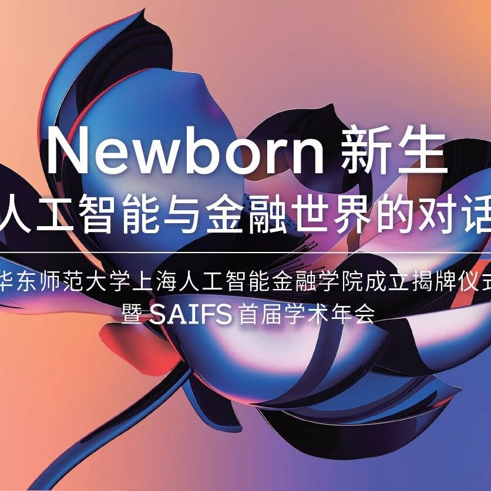

# 新生与对话｜SAIFS首届学术年会，4大洲18位顶尖专家学者共探AI-Fin新机遇

> **作者**: SAIFS
> **发布日期**: 2024年6月3日 17:25
> **来源**: [原文链接](images/image2.jpg)

---

  

  

已关注

关注

重播 分享 赞

关闭

**观看更多**

更多

*退出全屏*

*切换到竖屏全屏**退出全屏*

上海人工智能金融学院SAIFS已关注

分享视频

，时长00:34

0/0

00:00/00:34

切换到横屏模式

继续播放

进度条，百分之0

[播放](javascript:;)

00:00

/

00:34

00:34

[倍速](javascript:;)

*全屏*

倍速播放中

[0.5倍](javascript:;) [0.75倍](javascript:;) [1.0倍](javascript:;) [1.5倍](javascript:;) [2.0倍](javascript:;)

[超清](javascript:;) [流畅](javascript:;)

您的浏览器不支持 video 标签

继续观看

新生与对话｜SAIFS首届学术年会，4大洲18位顶尖专家学者共探AI-Fin新机遇

观看更多

转载

,

新生与对话｜SAIFS首届学术年会，4大洲18位顶尖专家学者共探AI-Fin新机遇

上海人工智能金融学院SAIFS已关注

分享点赞在看

已同步到看一看[写下你的评论](javascript:;)

[视频详情](javascript:;)

智金院SAIFS举办首届学术年会

  

2024年5月31日至6月1日，华东师范大学上海人工智能金融学院首届学术年会在华东师范大学普陀校区科学会堂举行。来自4大洲18位人工智能、金融领域以及跨学科领域的顶尖学者和产业领军者齐聚华东师大。与会嘉宾围绕“人工智能与金融世界的对话”这一主题，重点聚焦“人工智能与金融科技的融合”、“大模型与金融”、“AI伦理与治理的国际视野”等三大核心议题，展开15场主题演讲和3场圆桌论坛，碰撞思想智慧、分享行业前沿动态、探讨创新发展趋势，为与会人员呈现了一场精彩纷呈、富有深度的学术盛宴。  

  

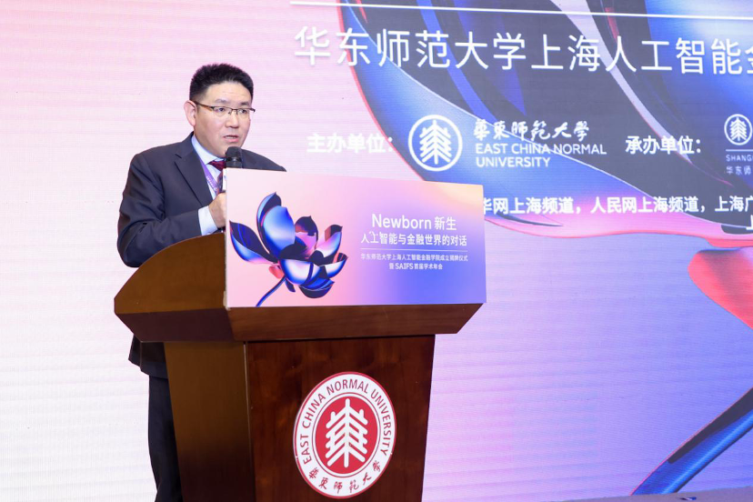

殷德生主持“人工智能与金融科技的融合”主题会议

  

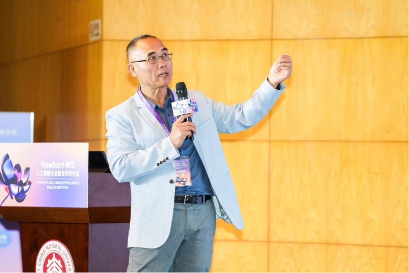

杨强作主题报告

  

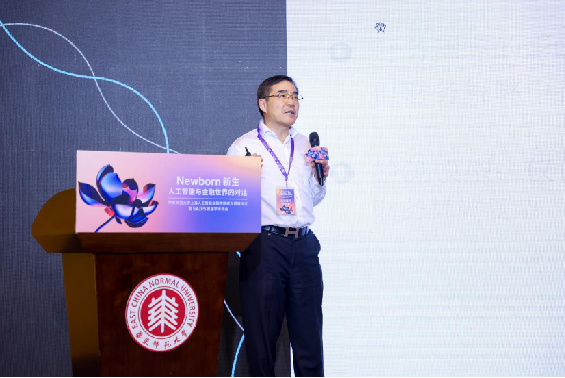

范剑青作主题报告

  

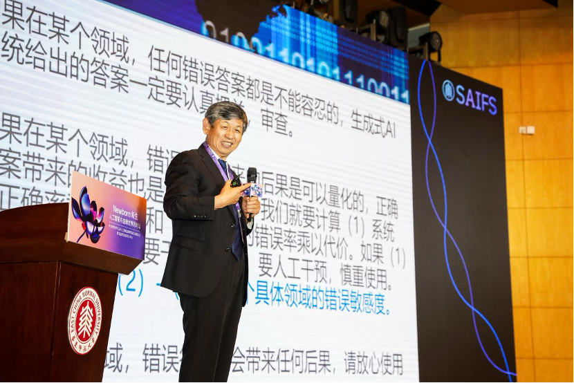

张成奇作主题报告

  

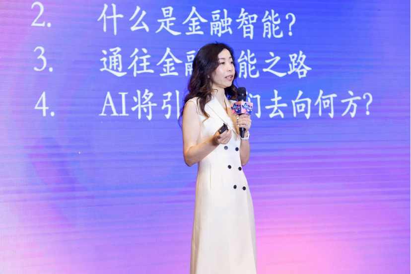

邵怡蕾作主题报告  

  

“人工智能与金融科技的融合”主题会议由华东师范大学经济与管理学院院长、国家级领军人才计划入选者殷德生教授主持。香港科技大学荣休教授、加拿大工程院及加拿大皇家学院院士、深圳前海微众银行股份有限公司首席人工智能官杨强，普林斯顿大学教授、中国台湾“中央研究院”院士、比利时皇家科学院外籍院士范剑青，悉尼科技大学副校长、澳大利亚人工智能理事会理事长张成奇，华东师范大学上海人工智能金融学院院长邵怡蕾，分别做题为《AI、大模型及联邦学习技术在金融场景的应用》、《揭露财务报表舞弊:来自新闻报道分析的见解》、《生成式人工智能：对AI研究和金融行业的深远影响》以及《通往金融智能之路》的主题演讲，并围绕“人工智能与金融系统性风险控制”这一主题展开圆桌论坛。中国农业银行上海市分行党委书记、行长韩国强及主题演讲嘉宾就人工智能技术在金融领域的应用、人工智能和金融的系统性风险及监管、创新型金融实验室建设、产学研合作等方面内容进行交流对话，论坛由邵怡蕾主持。

  

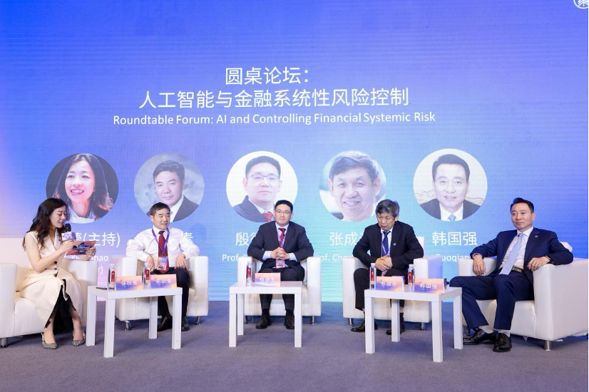

“人工智能与金融系统性风险控制”圆桌论坛

  

与会者认为，生成式人工智能是一项颠覆性技术突破，人工智能技术的快速演进为金融行业带来了前所未有的机遇和挑战。人工智能和金融的深度融合，能够帮助金融机构提高金融服务的效率和质量。金融场景中，需要将通用大模型融入专业知识进行微调，借助联邦学习技术建立本地模型。金融领域是风险容忍度低的行业，要加强智能金融领域的风险管控，实现人工智能和金融之间的双向监管，更好地推动智能金融的创新与发展。人工智能金融学院生逢其时并肩负重大使命，要通过深化校企协同、产学研合作推动科研成果转化应用，服务上海“五个中心”建设。

  

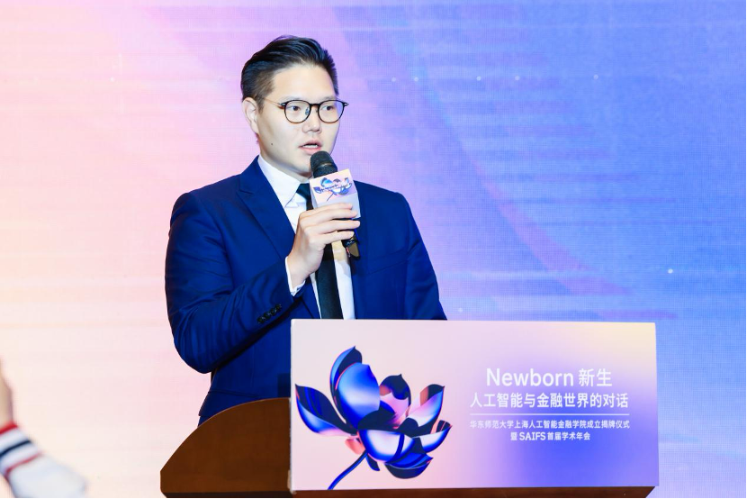

汤傲成主持“大模型与金融”主题会议

  

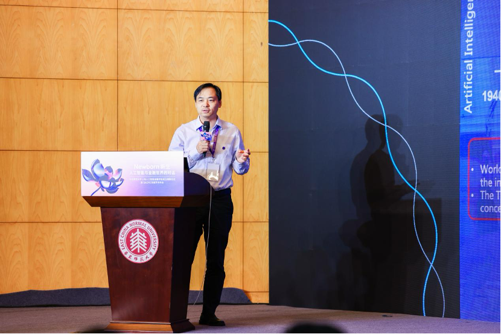

陶大程作主题报告  

  

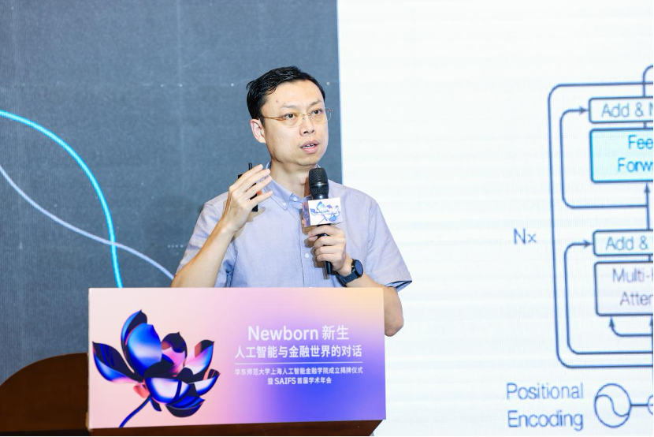

张鹏作主题报告  

  

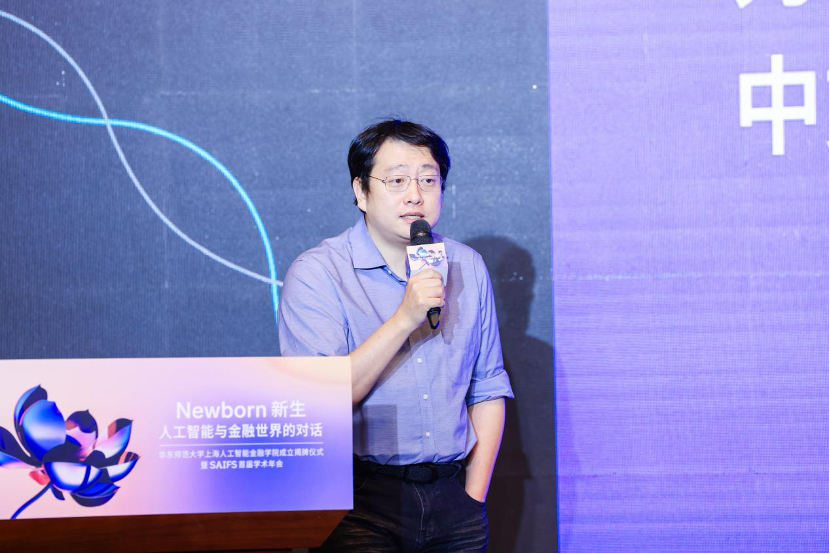

王臣汉作主题报告

  

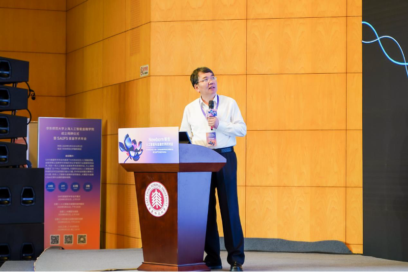

丁汉作主题报告

  

“大模型与金融”主题会议由华东师范大学经济与管理学院助理教授汤傲成主持。南洋理工大学教授、澳大利亚科学院院士、欧洲科学院外籍院士陶大程，智谱AI CEO张鹏，贝式计算创始人兼CEO、CLUE基金会秘书长王臣汉，华中科技大学教授、中国科学院院士丁汉，先后发表题为《繁而不同，大道至简》、《大模型和通用人工智能之路》、《为什么我们需要中文领域的金融评测基准》以及《机器人未来技术研判》的主题演讲，就人工智能的发展历程、大模型在金融领域的应用、挑战和前景等方面进行了深入的探讨，并围绕“金融大模型的现在与未来”展开圆桌论坛，论坛由香港科技大学讲席教授谢源、华东师范大学上海人工智能金融学院助理研究员汪俊霖主持。

  

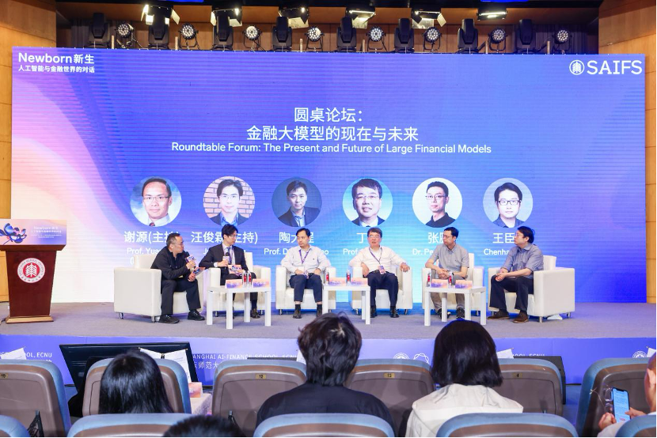

“金融大模型的现在与未来”展开圆桌论坛

  

与会者认为，人工智能发展目前急需的是高质量超大规模知识图谱以及对超大规模数据的深度理解能力。ChatGPT之后大模型发展迅猛，进入爆发增长的阶段，然而模型不是越大越好，而应根据具体的场景选择适合的模型。人工智能作为技术工具，需要与应用场景融合，与学界及全产业链协同，进而更好地赋能千行百业。金融领域因其经济价值，容错率较低、严谨性较高，是数据获取成本最高，数据壁垒最高、数据流动性成本最高的领域之一。金融大模型的发展需平衡规模、效率与可信度，未来尤其要关注风险管控，注重产学研用紧密结合，为金融行业提供更加精准、高效的服务，推动经济社会高质量发展。

  

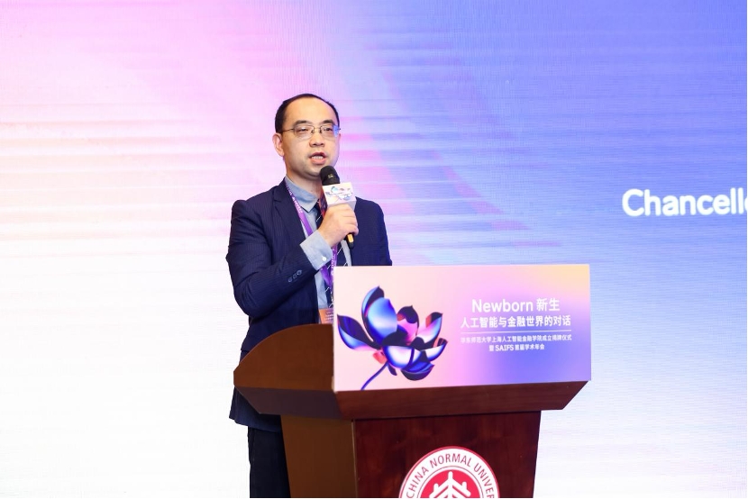

高奇琦主持“AI伦理与治理的国际视野”主题会议

  

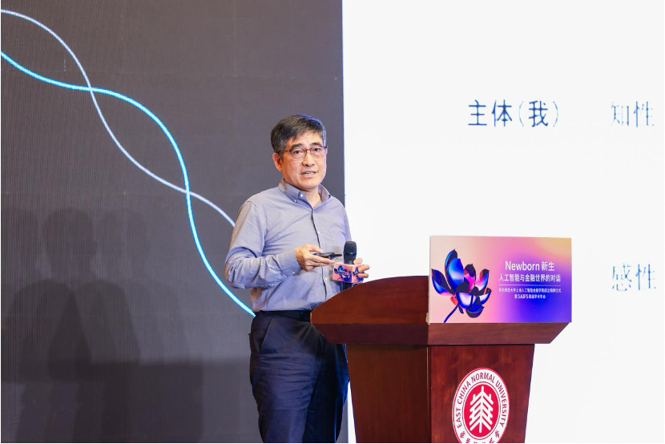

童世骏作主题报告

  

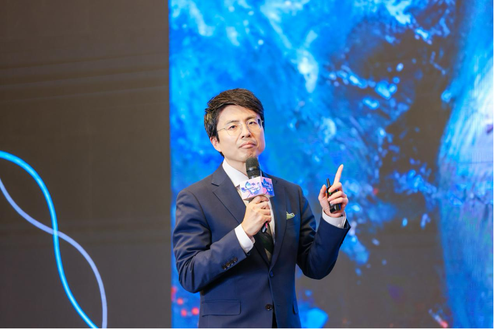

吴冠军作主题报告

  

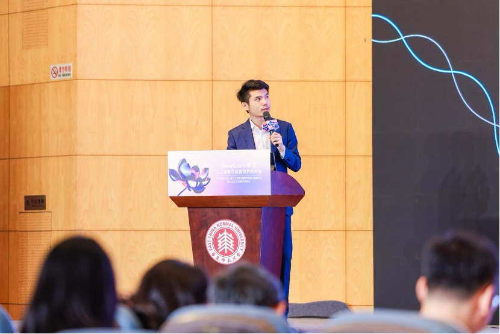

谢旻希作主题报告

  

“AI伦理与治理的国际视野”主题会议由华东政法大学政治学研究院院长、人工智能与大数据指数研究院院长高奇琦主持。华东师范大学哲学系教授、上海纽约大学校长、挪威科学与文学院外籍院士童世骏，华东师范大学政治与国际关系学院院长吴冠军，牛津大学人类未来研究所人工智能治理中心政策研究员、安远AI CEO谢旻希，先后做题为《AI时代的康德四问》、《从Sora到元宇宙：重思世界化成的进程》以及《前沿大模型的安全与治理》的主题演讲，并与麻省理工学院生命未来研究所所长迈克斯·泰格马克，围绕“AI伦理与治理的国际视野”这一主题展开圆桌论坛，就人工智能伦理与治理的必要性和重要性等方面进行了热烈的讨论。

  

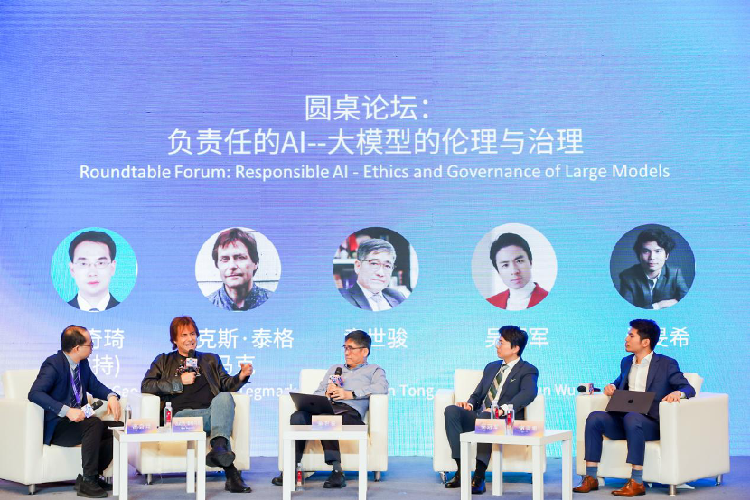

“AI伦理与治理的国际视野”圆桌论坛

  

与会者认为，人类不仅面临生态进化，还需应对数字化演进。当前，人工智能的未来发展轨迹充满不确定性，相关风险伴随着人工智能的普及而增加。我们所处的时代由我们当下的每一个行为所决定。人类应学会与人工智能协同工作、和谐共生，要有底线思维，呼吁国际社会共同定义人工智能“不可容忍”的风险并划定“安全红线”，建立更加公平的人工智能全球治理体系，确保人工智能更好服务于人类，引领人机关系走向安全、可信、可靠的未来。

  

本次年会由华东师范大学主办，上海人工智能金融学院、经济与管理学院承办，人文与社会科学研究院、上海新金融研究院协办，是学校文理跨学科系列论坛-学科交叉融合论坛第27场。本次活动得到独家会议合作单位中国农业银行上海市分行的大力支持。年会横向覆盖人工智能与金融领域，纵向贯穿学术与产业，充分展示了新成立的华东师范大学上海人工智能金融学院在人工智能金融领域的学术凝聚力和影响力，为国内外学者和行业代表提供了深度交流合作的平台，共探人工智能金融发展的新机遇，共促人工智能金融的美好未来。

  

  

图文来源丨华东师范大学上海人工智能金融学院

经济与管理学院

撰写 | 王莹

编辑丨肖启玉