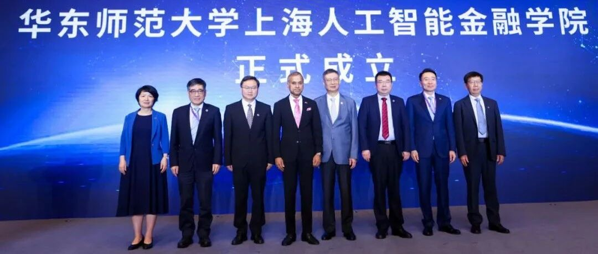

# 华东师大智金院SAIFS，正式成立！

> **作者**: SAIFS
> **发布日期**: 2024年6月3日 17:25
> **来源**: [原文链接](images/image1.jpg)

---

**华东师范大学**  

**上海人工智能金融学院**

（简称：SAIFS）

于5月31日上午揭牌成立！

海内外人工智能以及

金融等领域的顶尖学者

围绕**“人工智能与金融世界的对话”**

展开深入交流与思想碰撞

  

已关注

关注

重播 分享 赞

关闭

**观看更多**

更多

*退出全屏*

*切换到竖屏全屏**退出全屏*

上海人工智能金融学院SAIFS已关注

分享视频

，时长00:39

0/0

00:00/00:39

切换到横屏模式

继续播放

进度条，百分之0

[播放](javascript:;)

00:00

/

00:39

00:39

[倍速](javascript:;)

*全屏*

倍速播放中

[0.5倍](javascript:;) [0.75倍](javascript:;) [1.0倍](javascript:;) [1.5倍](javascript:;) [2.0倍](javascript:;)

[超清](javascript:;) [流畅](javascript:;)

您的浏览器不支持 video 标签

继续观看

华东师大智金院SAIFS，正式成立！

观看更多

转载

,

华东师大智金院SAIFS，正式成立！

上海人工智能金融学院SAIFS已关注

分享点赞在看

已同步到看一看[写下你的评论](javascript:;)

[视频详情](javascript:;)

**华东师范大学上海人工智能金融学院**是全球首家围绕人工智能与金融跨界交叉打造的教育和研究机构，**设两大研究中心——人工智能金融（AI-Fin）研究中心和人工智能伦理与治理（AI-PPE）研究中心**。

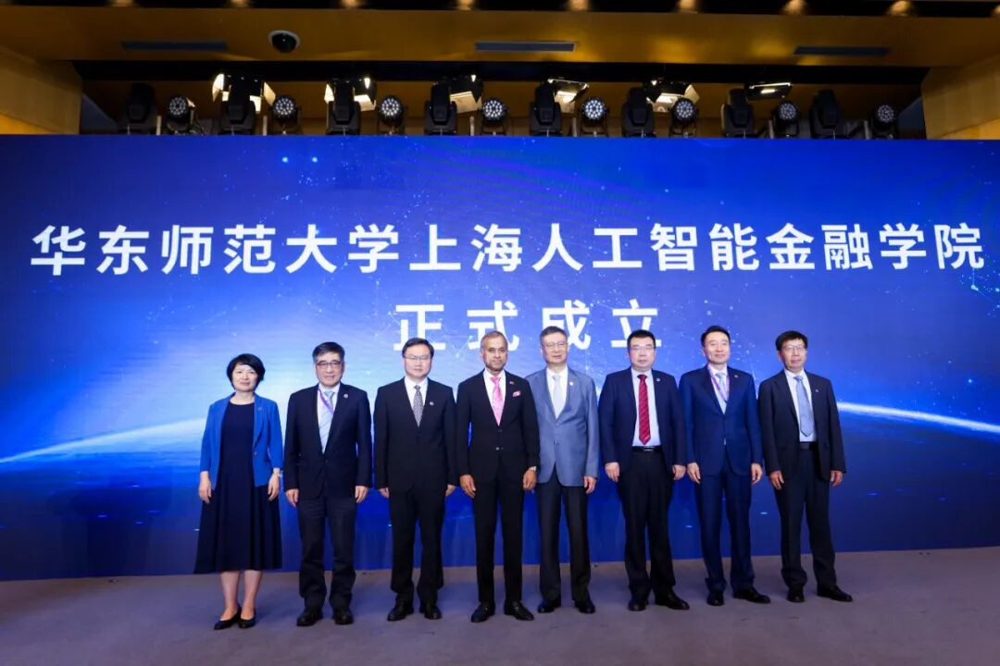

▲华东师范大学上海人工智能金融学院正式揭牌成立

  

联合国驻华协调员常启德（Siddharth Chatterjee），中国银行原行长李礼辉，上海市经济和信息化委员会副主任汤文侃，上海市教育委员会副主任孙真荣，中国农业银行上海市分行党委书记、行长韩国强，中冶赛迪集团有限公司董事长肖学文，上海纽约大学校长童世骏，悉尼科技大学副校长张成奇，中国台湾“中央研究院”院士、比利时皇家科学院外籍院士、普林斯顿大学教授范剑青，麻省理工学院教授、生命未来研究所所长迈克斯·泰格马克（Max Tegmark），清华大学计算机系WeBank讲席教授、人工智能研究院基础模型研究中心主任唐杰，牛津大学人工智能治理中心政策研究员谢旻希，华东师范大学党委书记梅兵，校长钱旭红出席会议。揭牌成立仪式由华东师范大学党委副书记孟钟捷主持。  

  

常启德、李礼辉、汤文侃、孙真荣、韩国强、童世骏、梅兵、钱旭红共同为华东师范大学上海人工智能金融学院揭牌，标志着学院正式成立，开启人工智能与金融融合发展的新篇章。

  

本次活动得到独家会议合作单位中国农业银行上海市分行大力支持。

  

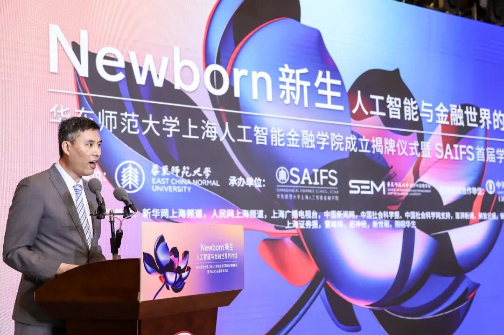

▲华东师范大学党委副书记孟钟捷主持开幕式

  

据华东师范大学上海人工智能金融学院院长邵怡蕾教授介绍，学院的发展目标不仅是培养具备金融知识、人工智能技术和实践经验的新一代人工智能金融（简称“AI-Fin”）领军人才，更着力推动AI在金融领域的创新应用，推动AI-Fin的发展，并通过广泛的合作网络改善金融服务的效率和质量，为社会创造更大的价值。

  

**AI-Fin研究中心**将开发识别、量化、预测和减轻先进人工智能技术应用系统性风险的先进模型，向政府部门和各大金融机构输出关于AI的内控合规理论与研究成果。**AI-PPE研究中心**致力于推进AI时代的全球哲学-政治学-经济学(PPE)思想前沿问题的研究，并打造一套全新的AI For Social Science教学体系，重新激活哲学-政治学-经济学服务现代社会的动能。

  

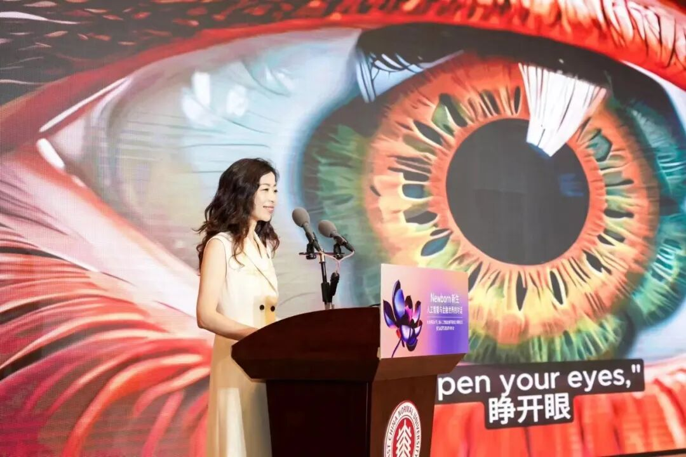

▲华东师范大学上海人工智能金融学院院长邵怡蕾汇报学院建设规划

**学院设置人工智能金融专业硕士项目、人工智能金融MBA项目和人工智能金融博士项目，项目将于2024年9月开启试点，2025年正式启动。**课程涵盖人工智能及大语言模型通识课、机器学习/神经网络基础、人工智能在金融中的应用、金融大语言模型（FinLLM）实验室工作坊、人工智能的社会经济与伦理影响、人工智能技术在金融中的合规管理、人工智能领导力与变革管理等内容，全面培养学生的综合能力。  

  

  

▲实验室空镜头（电脑屏保均由ai生成）

  

学院首部宣传片**《New Born》**在会上发布**。**这部影片是由中国50位杰出的AIGC艺术家共同创作的首个作品，它不仅展现了艺术与科技的完美融合，更彰显了人与AI在创作领域的深度合作。从精致细腻的图像到深邃独特的文字，再到令人陶醉的音乐，每一帧、每一字、每一音都是人类智慧与AI技术的共同结晶。

  

发布学院首部宣传片《New Born》

已关注

关注

重播 分享 赞

关闭

**观看更多**

更多

*退出全屏*

*切换到竖屏全屏**退出全屏*

上海人工智能金融学院SAIFS已关注

分享视频

，时长03:15

0/0

00:00/03:15

切换到横屏模式

继续播放

进度条，百分之0

[播放](javascript:;)

00:00

/

03:15

03:15

[倍速](javascript:;)

*全屏*

倍速播放中

[0.5倍](javascript:;) [0.75倍](javascript:;) [1.0倍](javascript:;) [1.5倍](javascript:;) [2.0倍](javascript:;)

[超清](javascript:;) [流畅](javascript:;)

您的浏览器不支持 video 标签

继续观看

华东师大智金院SAIFS，正式成立！

观看更多

转载

,

华东师大智金院SAIFS，正式成立！

上海人工智能金融学院SAIFS已关注

分享点赞在看

已同步到看一看[写下你的评论](javascript:;)

[视频详情](javascript:;)

  

华东师范大学上海人工智能金融学院助理研究员汪俊霖向观众介绍了**名为Jason的金融智能体分析师**。这是华东师范大学上海人工智能金融学院与AI4Finance开源社区联合研发的全球领先的金融垂类AI Agent，由团队核心成员命名。不同于通用大语言模型的概率推演，Jason被赋予了专业金融从业者的思维模式，来分析复杂的金融问题，在金融理解、洞见、表现力、逻辑和数据五个方面展现出显著优势。Jason目前具备金融投研、金融咨询、金融安全三大能力，能够在严谨的金融工作中发挥重要作用，并可被广泛应用于商业银行、投资银行、风险投资、私募股权、对冲基金、资产管理、金融服务商等一系列金融机构中。

  

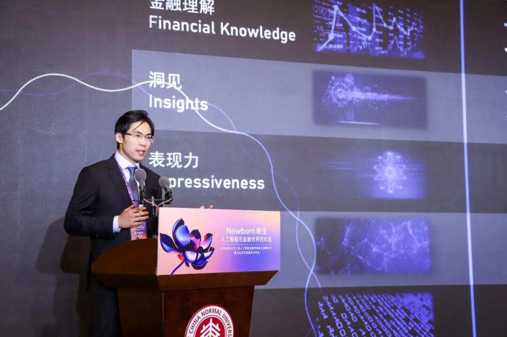

▲华东师范大学上海人工智能金融学院助理研究员汪俊霖介绍金融智能体分析师Jason

  

  

  

钱旭红指出，人工智能金融已成为增强金融服务实体经济能力的重要引擎。华东师范大学在经济金融学科领域有着深厚的底蕴和悠久的历史。新成立的学校上海人工智能金融学院，聚焦人工智能相关学科与经济、金融等传统优势学科融合发展，围绕金融如何更好地服务实体经济高质量发展，推进“人工智能+金融”系列创新研究，加快打造人工智能金融领域学科高地，服务国家金融高质量发展和上海国际金融中心建设。

  

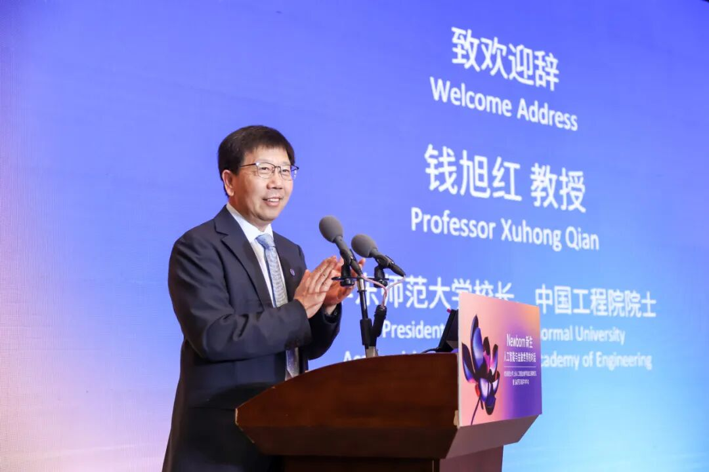

▲华东师范大学校长、中国工程院院士钱旭红致欢迎辞

  

汤文侃指出，上海将人工智能作为着力发展的三大先导产业之一，正在加快建设人工智能“上海高地”，推动人工智能赋能千行百业，加快打造人工智能世界级产业集群。目前，一大批聚焦金融、制造等领域的垂类大模型正在加快孕育，上海人工智能产业正进入集中爆发期。华东师范大学上海人工智能金融学院的成立，不仅是对接金融服务实体经济高质量发展的现实需求，同时也是在人工智能金融领域构筑“教育、科技、人才”三位一体支撑，推动人工智能和金融在上海“双向奔赴”的重要举措。

  

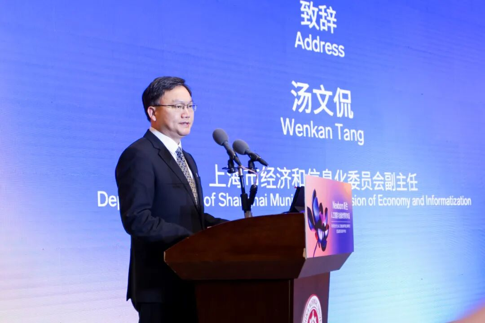

▲上海市经济和信息化委员会副主任汤文侃致辞

  

  

孙真荣指出，当前，新一轮科技革命和产业变革加速演进，人工智能前沿技术正在重塑学科专业、赋能千行百业，“智能+”的实现程度，一定意义上已成为衡量一个国家、一座城市综合实力和核心竞争力的重要指标。人工智能、集成电路、生物医药被列为上海市优先发展的三大先导产业。在此背景下，华东师大主动作为，充分发挥学校在人工智能和金融统计等领域的多学科综合优势，在“AI+金融”领域率先布局成立上海人工智能金融学院，这是学校推动人工智能与产业人才培养深度融合、造就交叉复合型创新人才的重要举措，也是主动对接上海国际金融中心建设、打造AI创新高地的重要探索，充分体现了华东师大作为上海高等教育“国家队”的使命担当。

  

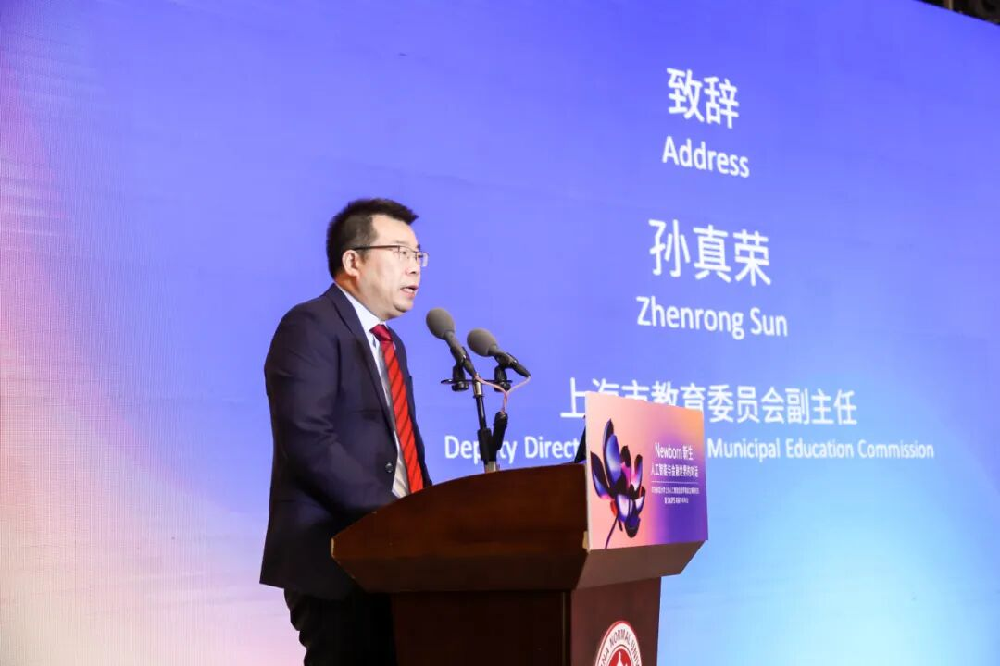

▲上海市教育委员会副主任孙真荣致辞

  

为进一步面向社会需求、汇聚产业资源，仪式现场，华东师范大学上海人工智能金融学院分别与**北京智谱华章科技有限公司、小船创意（上海）网络技术有限公司、贝式计算（天津）信息技术有限公司、中冶赛迪信息技术（重庆）有限公司**签署合作协议。以上海人工智能金融学院为依托，双方将在科研创新与技术开发、科技成果转移转化以及复合型高水平人才培养等方面开展合作，以校企合作协同推进人工智能与金融的交叉应用研究，共同改善金融服务的效率和质量。

  

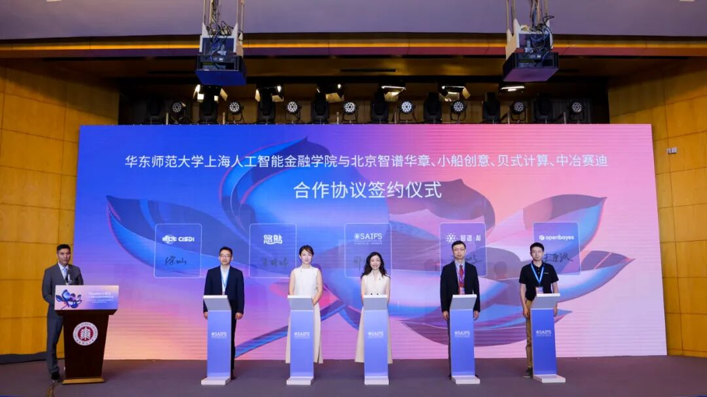

▲华东师范大学上海人工智能金融学院与北京智谱华章、小船创意、贝式计算、中冶赛迪签署合作协议

  

  

  

  

常启德（Siddharth Chatterjee）在题为**“我们的可持续发展未来”**的主旨报告中指出，尽管全球在达成2030年可持续发展目标方面已取得一定进展，但前方的道路依然漫长而充满挑战。人工智能作为强大的技术工具，已在教育、医疗、农业、环境保护等领域得到了卓有成效的应用，为加速实现联合国倡导的可持续发展目标带来新的机遇。他指出，中国已经发展了完整的人工智能生态体系，政府、学术界、产业界和民间组织之间应建立合作伙伴关系。他呼吁通过加强全球各国之间的对话与交流，建立起人工智能治理框架，共同拥抱人工智能技术，推动创建可持续发展的未来。

  

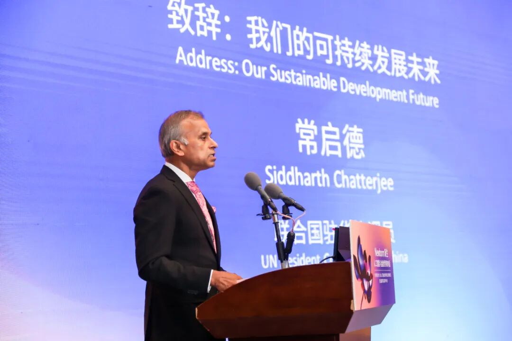

▲联合国驻华协调员常启德作主题演讲

  

  

李礼辉发表了题为**“AI迭代与算力竞争”**的主题演讲，从国家战略的高度分享了对人工智能技术创新趋势、算力竞争、智能金融等的见解。他认为，新一代人工智能一定会改变金融等诸多行业的产业模式，人工智能的基础研究与应用研究融合发展，已初步形成人工智能知行合一的复杂体系。他指出，算力竞争将是主要经济体之间的国家级竞争，也在很大程度上决定金融竞争力，而算力建设的关键是突破核心技术的瓶颈。智能金融目前还处在技术发展的早期阶段，未来要提供人机交互的高拟真的人性化金融服务，加强安全和效率并重的数字经济治理，促进智能金融领域的健康可持续发展。

  

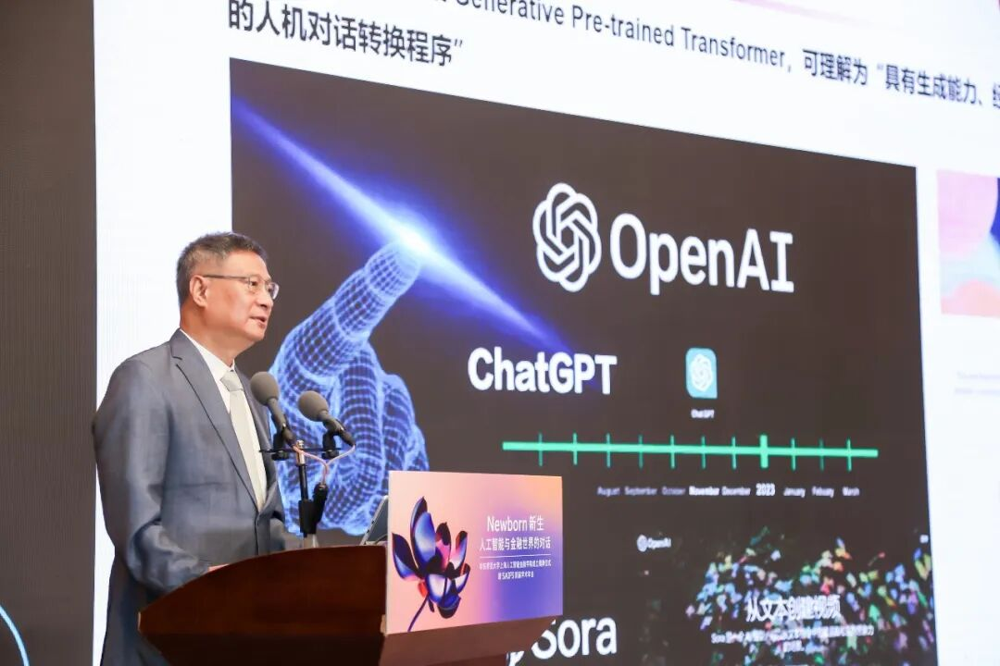

▲中国银行原行长李礼辉作主题演讲

  

  

麻省理工学院生命未来研究所所长迈克斯·泰格马克带来题为**“KAN and Keeping AI Under Control”**的主题演讲，他深入剖析了人工智能技术的飞速发展态势。他着重强调了人工智能系统安全性的核心地位，并指出随着技术进步的加速，对潜在风险的深入研究和量化分析变得至关重要。他认为，人工智能的安全性关乎全人类，中国作为在人工智能方面领先的科技大国，能够在全球人工智能治理方面做出更大贡献。他表示，未来，我们需要通过交流合作制定人工智能安全标准，推动可控、安全的人工智能发展，更能确保人工智能技术造福全人类，实现共赢的未来。

  

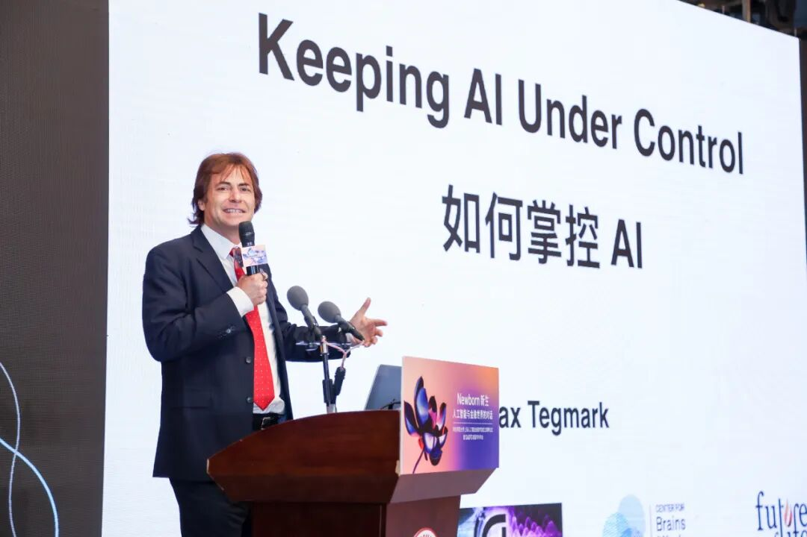

▲麻省理工学院生命未来研究所所长迈克斯·泰格马克作主题演讲

  

会前，与会人员参观了华东师范大学上海人工智能金融学院和经济与管理学院共同建设的金融大语言模型实验室。

  

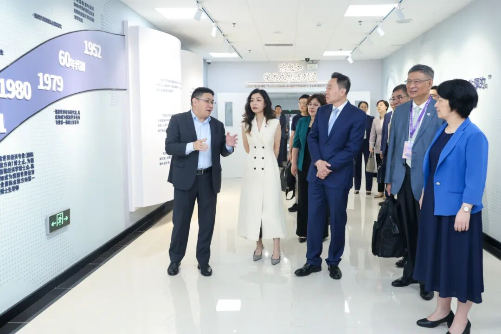

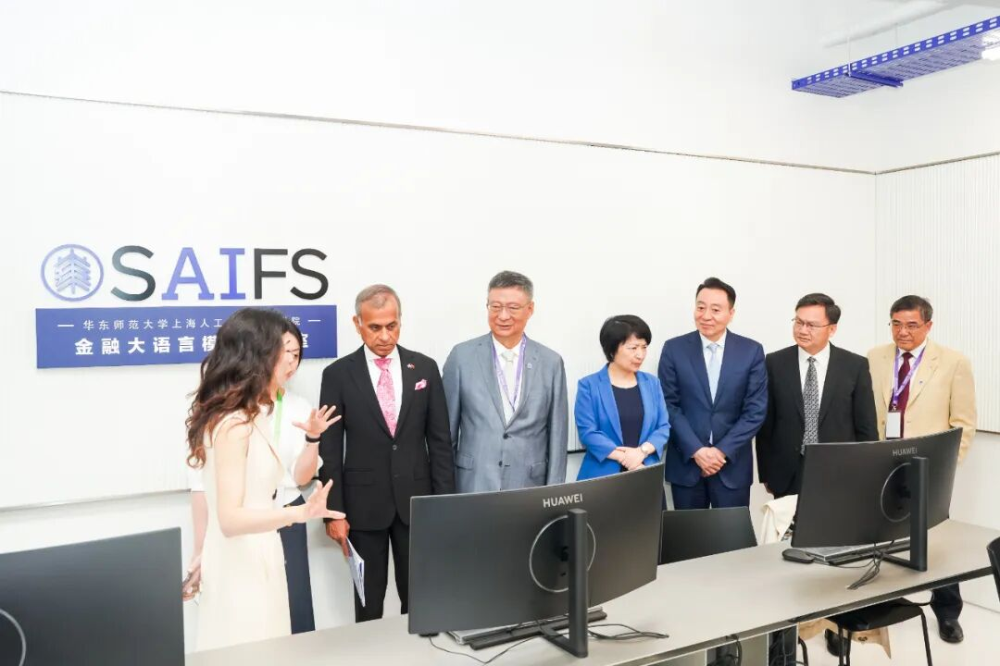

  

据悉，此次华东师范大学上海人工智能金融学院（SAIFS）成立揭牌仪式暨 SAIFS首届学术年会共为期两天，汇聚了来自**4大洲18位**AI领域、金融领域以及跨学科领域的顶尖学者和产业领军者。他们将围绕**人工智能与金融科技的融合、大模型与金融、AI伦理与治理的国际视野三大核心议题**，呈现15场精彩纷呈的主题演讲与3场富有深度的圆桌论坛。这场学术盛宴将深入探讨AI-Fin的发展趋势与行业创新，为与会者带来一场思维碰撞的盛宴。

  

**大会分论坛花絮**

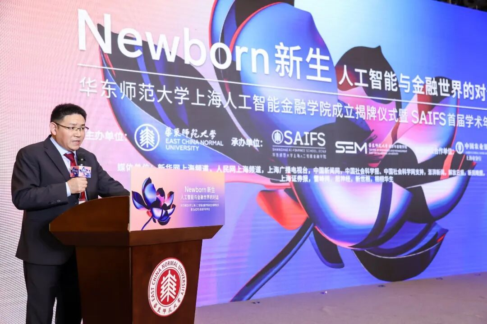

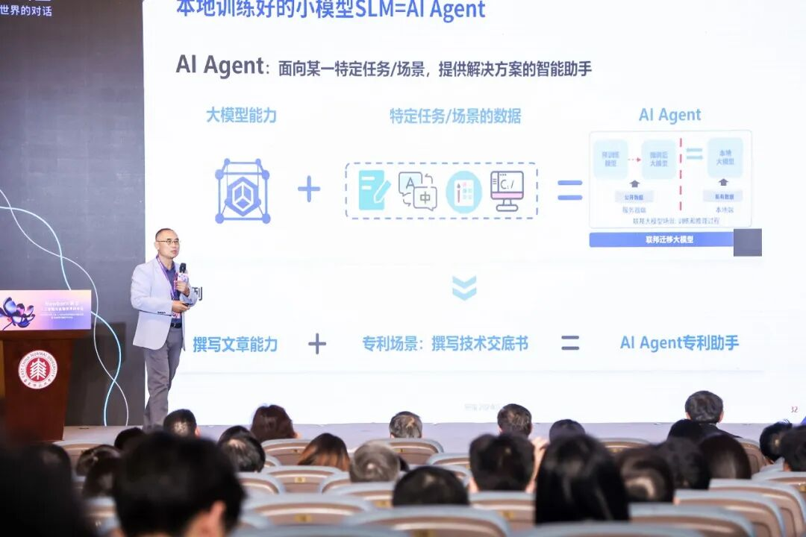

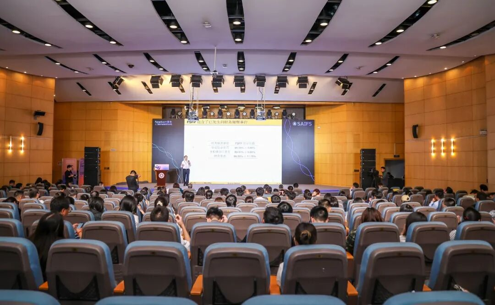

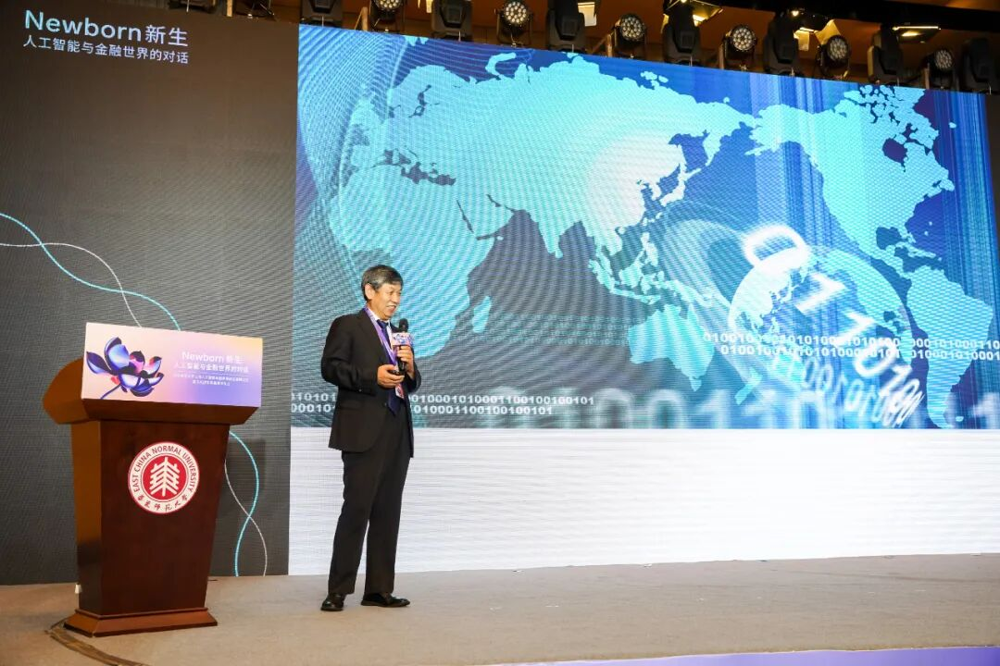

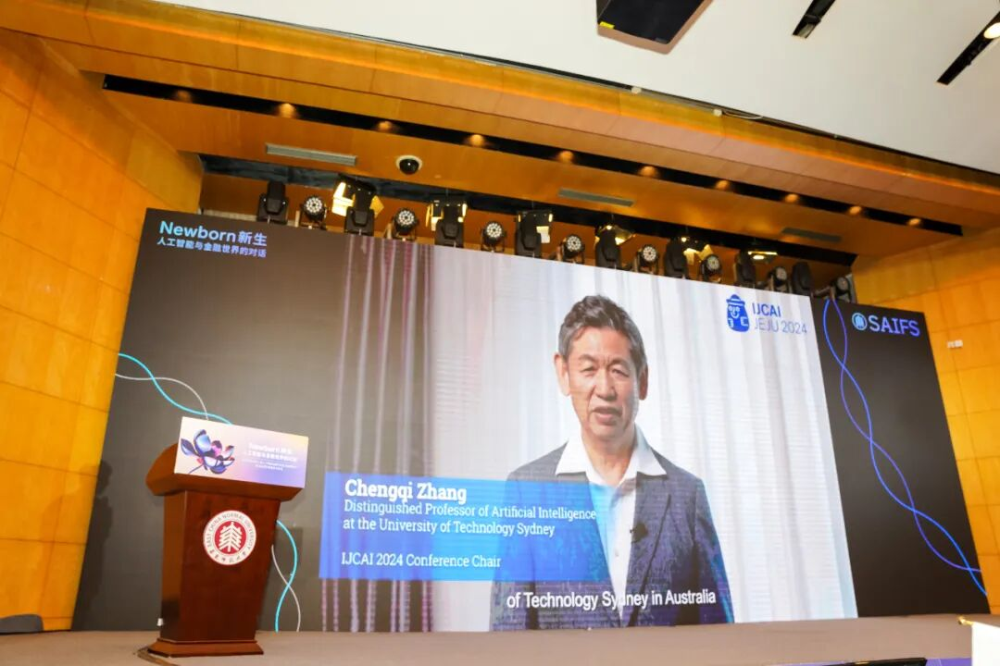

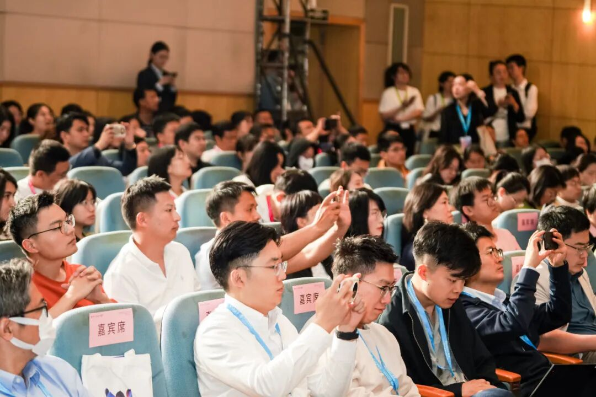

<<  滑动查看下一张图片  >>

  

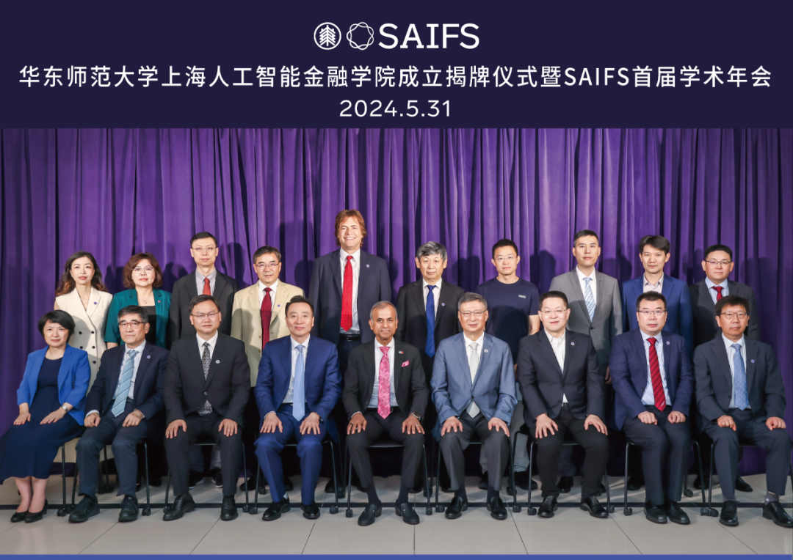

聚焦智能金融 引领创新发展

华东师范大学上海人工智能金融学院

秉承“跨界融合、创新领先”的理念

**致力于打造AI-Fin领域的“黄埔军校”**

****推动人工智能与金融科技的融合****

****走向更加广阔的未来****

Younger than AI, grow with AI!

**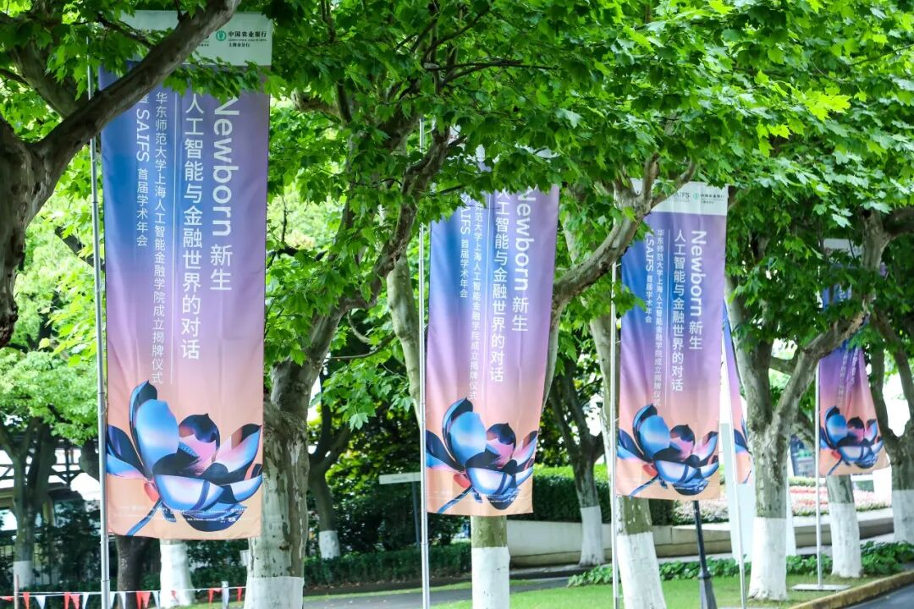  
**

**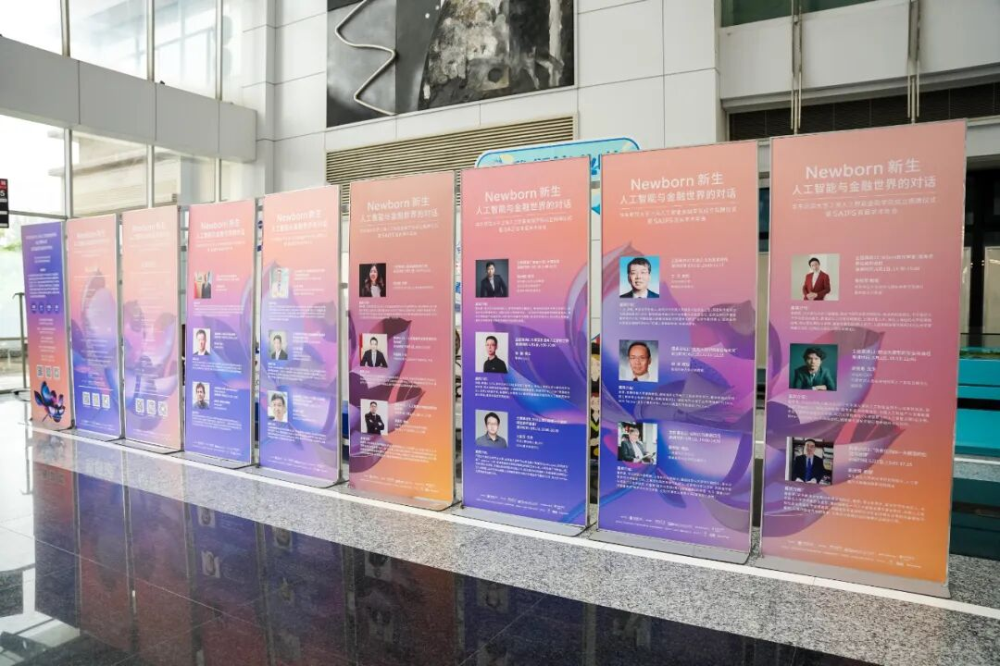**

  

    官方发布｜华东师范大学官方公众号

图文来源丨华东师范大学上海人工智能金融学院

经济与管理学院

通联 | 徐心成

编辑丨徐心成 王姝萱