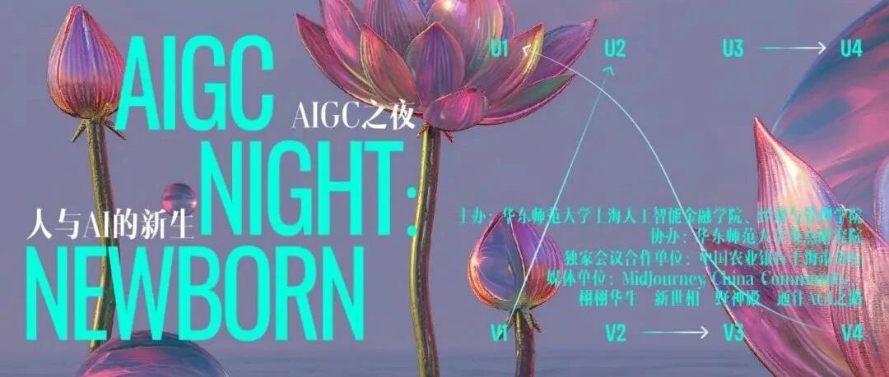

# 爱AI在华师大｜“AIGC之夜”：见证人与AI的新生

> **作者**: SAIFS
> **发布日期**: 2024年6月4日 17:45
> **来源**: [原文链接](https://mp.weixin.qq.com/s/5fCfgrT01gpcrpjV62uu4w)

---

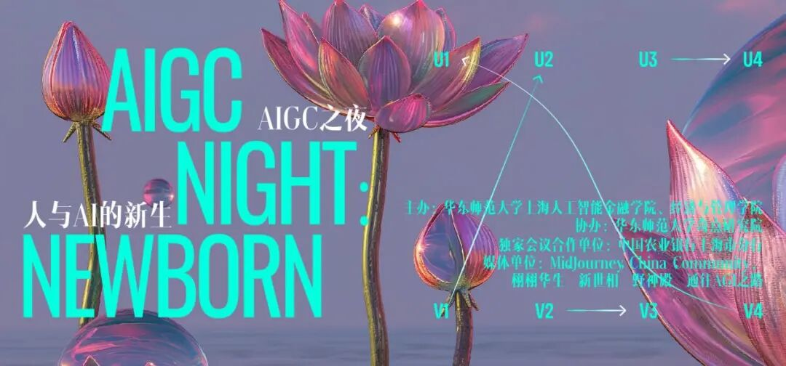

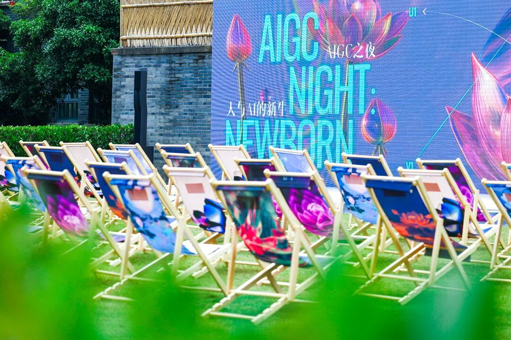

“AIGC之夜：人与AI的新生”活动

  

6月1日晚，由华东师大上海人工智能金融学院和经济与管理学院共同举办，华东师范大学奇点研究院协办的“AIGC之夜：人与AI的新生”活动在校友之家绿地草坪举行。华东师大校长、中国工程院院士钱旭红，中国农业银行上海市分行党委书记、行长韩国强，上海纽约大学校长童世骏，华东师大党委副书记孟钟捷，悉尼科技大学副校长张成奇，虹口区委常委、宣传部部长吴强，虹口区委宣传部副部长、区委网信办主任边频，麻省理工学院教授、生命未来研究所创始人迈克斯·泰格马克，牛津大学人类未来研究所人工智能治理中心研究员、安远AI创始人兼CEO谢旻希，华东师大党委宣传部常务副部长刘麒，产业技术研究院执行院长邢和祥，经济与管理学院院长殷德生，上海人工智能金融学院院长邵怡蕾，政治与国际关系学院院长吴冠军，当代中国著名电影研究者、华东师大国际汉语文化学院教授毛尖，复旦大学中文系教授、科学杂志《新发现》主编严锋，Midjourney中国区副总裁、小船创意（上海）网络技术有限公司CEO王玥婷，新世相创始人张伟，AIGC艺术家及师生代表出席活动。活动由上海人民广播电台主持人徐梓嘉主持。

  

  

  

  

  

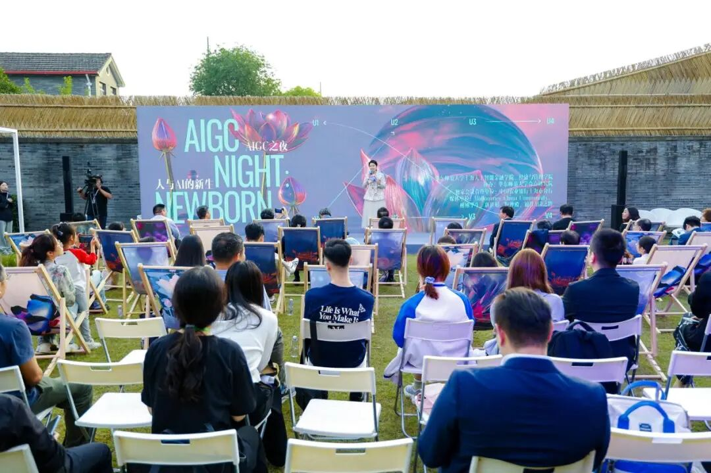

徐梓嘉主持活动

AIGC作为人工智能的主要分支，应用领域非常广泛，其逐步改变着传统的内容创作、生产和分发方式。AI艺术是AIGC应用的重要表现形式，艺术作为人类情感与智慧的结晶，与AI的结合，无疑将开启一个全新的创作时代。AI艺术不仅拓展了艺术的边界，也为我们提供了全新的视角和思考方式，在艺术创作、科学研究及经济发展等多领域展现出巨大潜力。作为华东师大上海人工智能金融学院首届学术年会的重要部分，“AIGC之夜”活动进一步深化人工智能创新应用的探索，延续科技与人文跨学科交叉思维的交流与碰撞。  

  

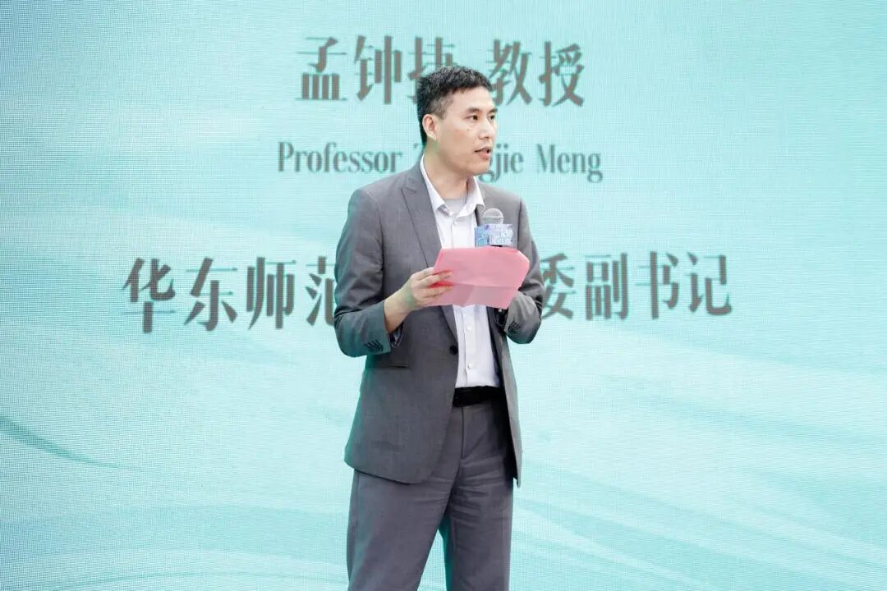

孟钟捷致辞

  

孟钟捷在致辞中表示，华东师大作为一所具有深厚文化底蕴和创新精神的高等学府，致力于培养具有创新能力、国际视野和社会责任感的新一代跨界人才，积极探索推动人工智能与金融、艺术、文学等领域的教育、研究和实践，深入对接国家和区域高质量发展需求。希望通过开展“AIGC之夜”等系列活动，搭建一个开放、多元、创新的平台，并逐步成为学校人工智能跨学科深度融合，探索科技新兴领域交叉创新的重要载体。

  

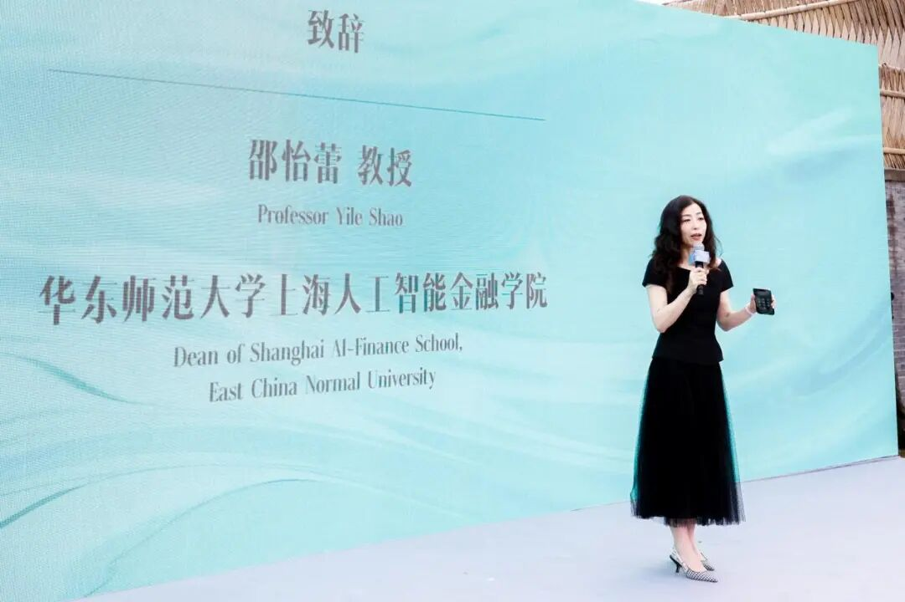

邵怡蕾致辞

  

邵怡蕾宣布“AIGC之夜：人与AI的新生”活动正式开启。

  

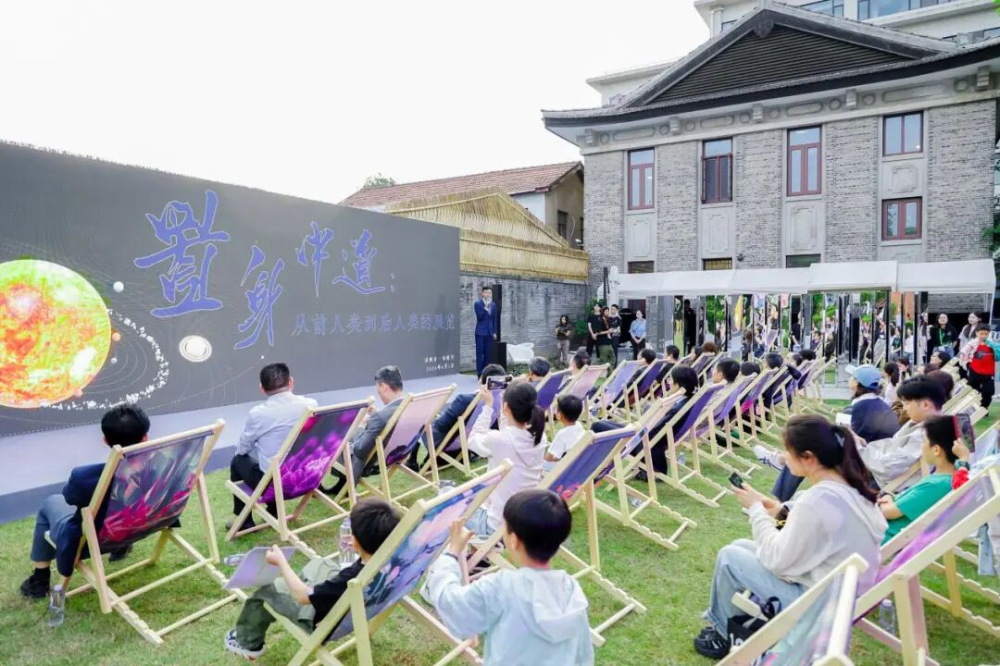

现场讲演、视频展示

  

学生代表及AIGC艺术家通过现场讲演、视频展示讲述了如何使用算法生成图案、色彩、旋律等元素，如何将AIGC技术融入到自身的艺术创作。一系列艺术作品展现了AI技术与传统艺术形式的创新融合，AI技术在艺术创作中发挥着愈发重要的作用。

  

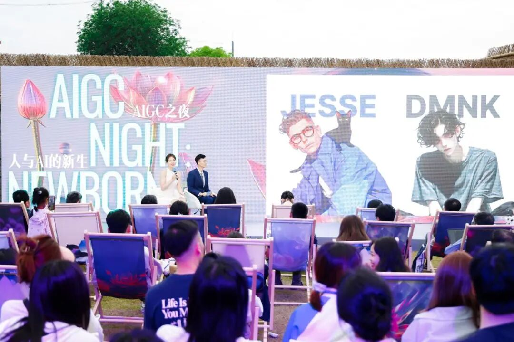

现场对谈

  

现场对谈环节，Midjourney中国区总裁王玥婷与华东师大本科生刘晴川、AIGC高水平创作者郑旭鑫（ID：二金）、李泽鸿（ID:八月初DMNK）从人工智能的艺术视角，围绕AI艺术的现状与未来进行交流对话。AI技术基于大语言模型，通过与人的对话，共同创作形成AIGC作品并传达艺术概念。无论是从创作者还是观者的角度，未来AI艺术的创作形式将得以不断丰富，通过创作与欣赏极大地满足精神世界需求。同时也启发大众通过AI工具激发创造力与想象力，并进行实践、对话与探索。

  

  

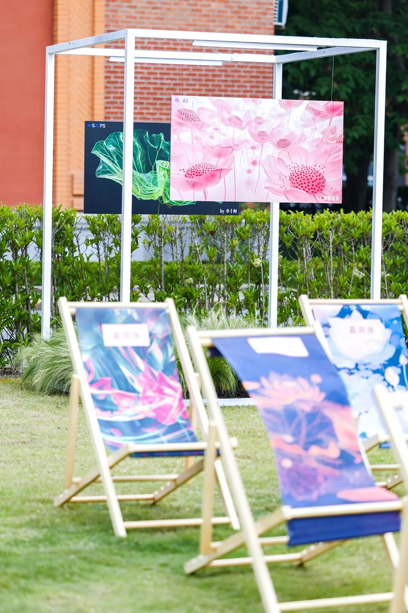

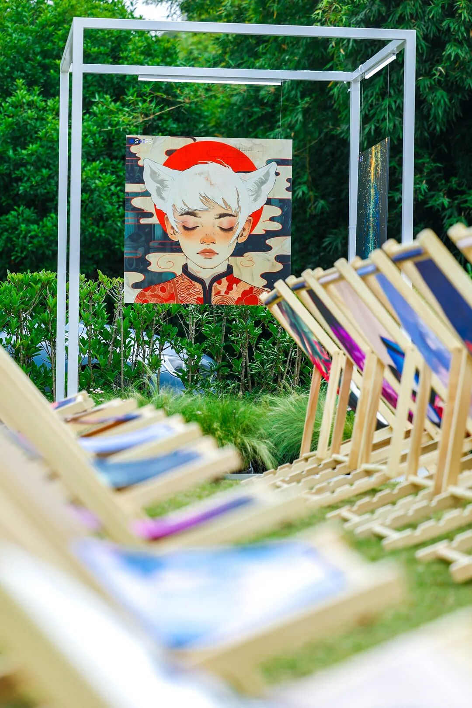

  

  

  

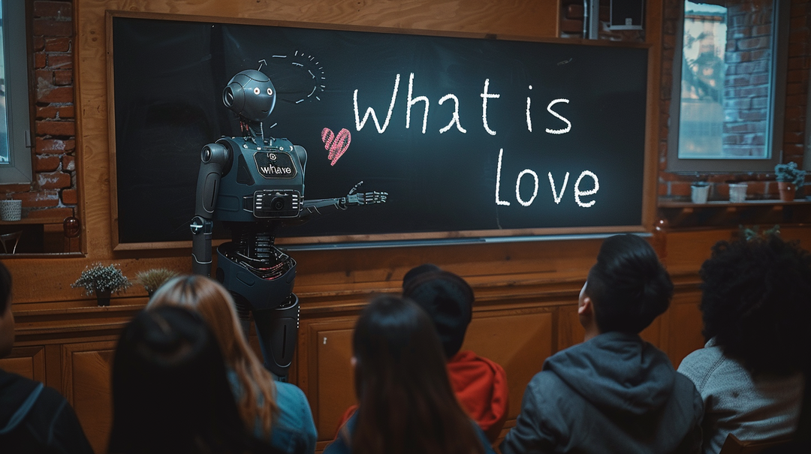

  

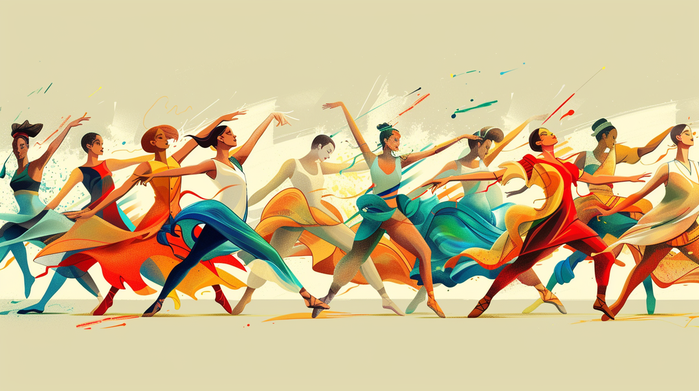

  

  

  

AI艺术家作品（创作主题:爱AI在华师大）

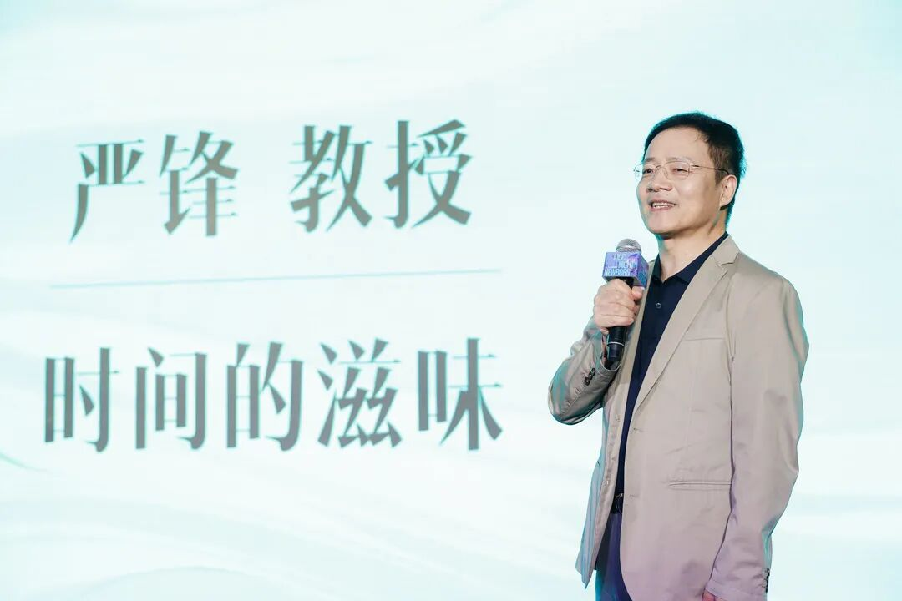

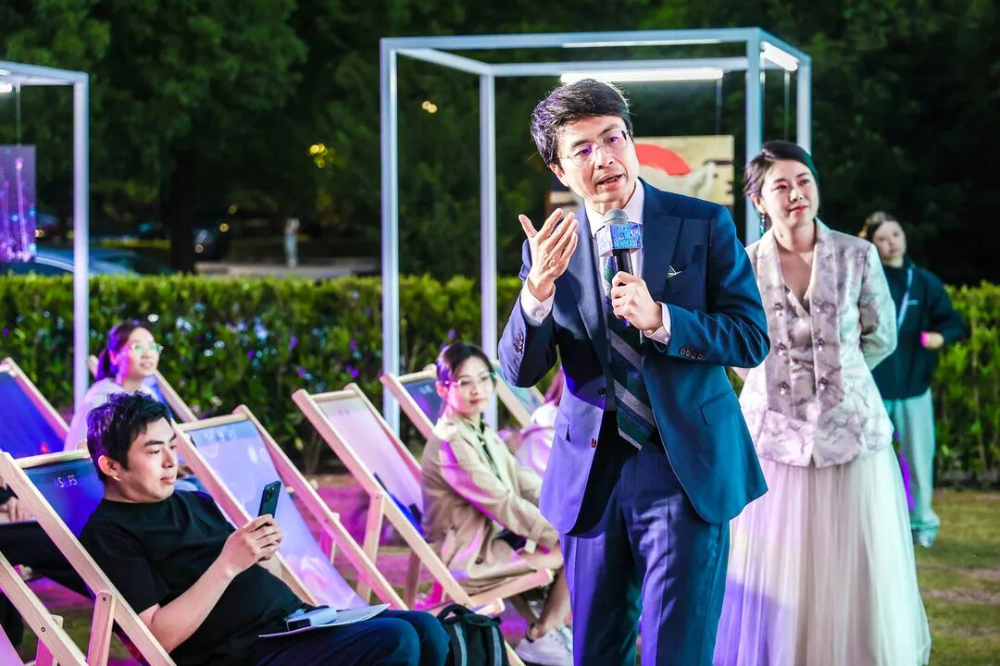

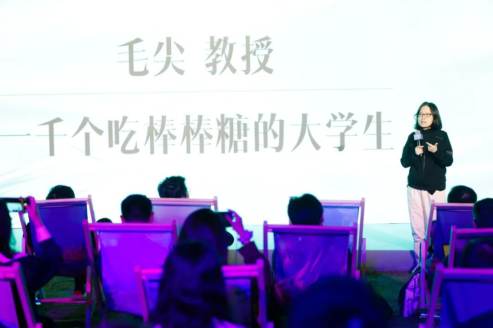

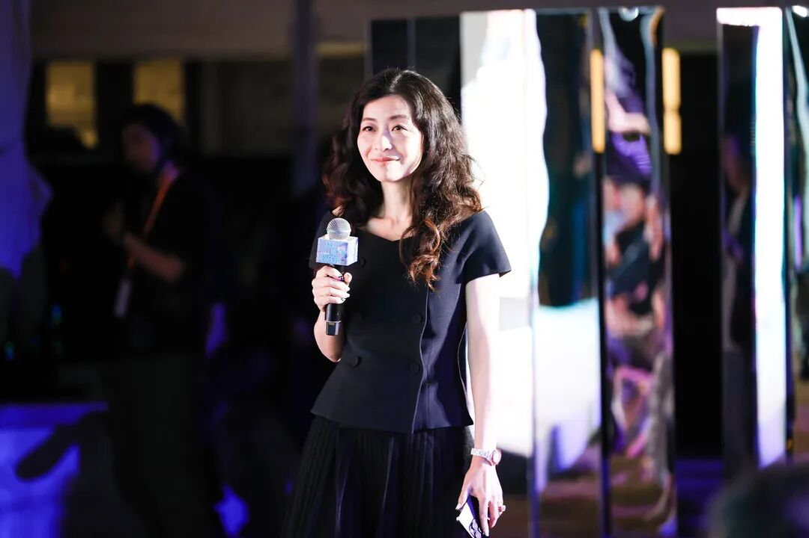

严锋、吴冠军、毛尖、邵怡蕾点评

  

AIGC现场实时创作比拼中，徐滋悦（ID：STEAMCHI蒸汽姬）、陈星任（ID:麦橘MERJIC）、魏申（ID:猫叔）、陈慧凌（ID：陈慧凌）、金宇（ID：酒鬼橋-BoozerBridge）、刘佳（ID：南墙\_Rylee）六位AIGC高水平创作者，根据“时间的滋味”“一千个吃棒棒糖的大学生”“再见智人”“爱AI在华师大”“01”等即兴命题进行提示词挑战与限时创作，创作过程和成果实时全方位展示给现场观众，人与技术的合作展现了AI技术在艺术创作中的即时性与互动性。竞赛中创作者逐一呈现了文生图创作作品，创作者的作品赋予自然语言全新的视角，通过AI技术传递出人对艺术的解读。严锋、吴冠军、毛尖、邵怡蕾对即兴命题进行概念解析，并逐一点评创作者作品。

  

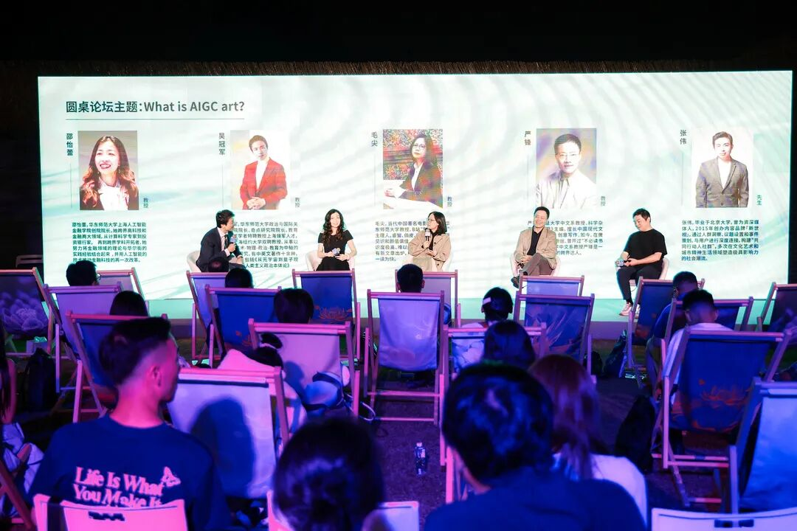

  

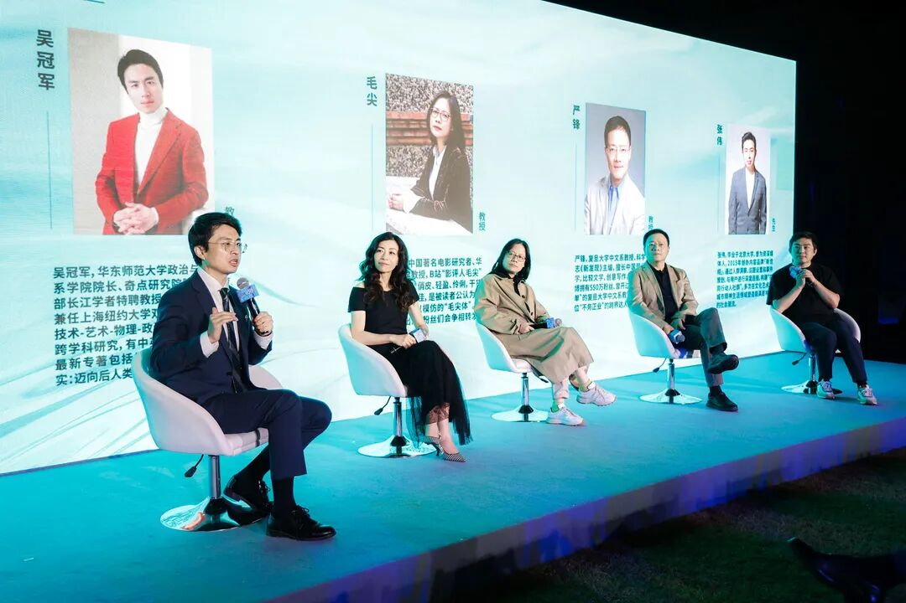

跨学科圆桌论坛

  

跨学科圆桌论坛围绕“什么是AIGC艺术？”展开，邵怡蕾、吴冠军、毛尖、严锋、张伟、王玥婷作为论坛嘉宾，就AI艺术的定义、价值和未来发展趋势进行了深入的探讨。邵怡蕾指出，艺术为科技注入了灵魂，让算法和数据变得有温度、有情感，AIGC给予了无限可能性。吴冠军阐释了AI如何帮助艺术家突破传统创作的局限，实现更加大胆和创新的艺术表达。严锋表示，AIGC具有作者性，不断改变人们对艺术创作认知的同时，也需要人类的共同合作。毛尖从电影艺术视角提出，AI的创作不受传统艺术规则的限制，可以创造出独特的艺术风格，具有很高的创新性。张伟提出，AIGC本质是人的作品，艺术是人的主动创作的结果，AI艺术的边界应以人的参与为评判标准。在AI涌现的时代，王玥婷表示艺术创作的过程尤为关键。

  

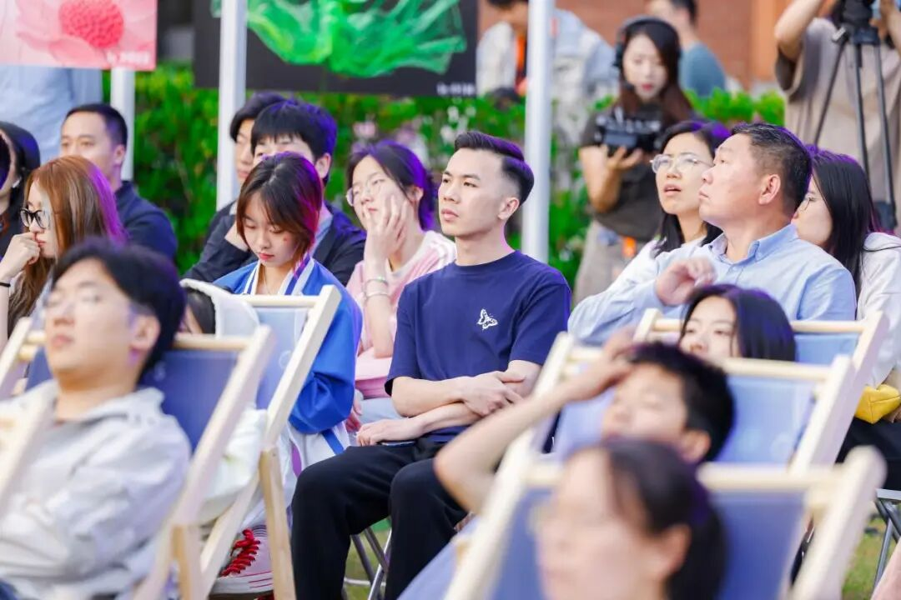  

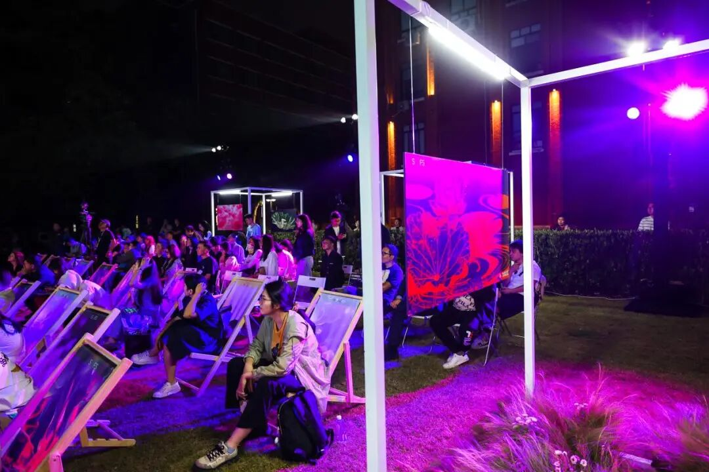

活动现场

  

2024年被标记为AI艺术的元年。站在人工智能与艺术融合发展的新起点上，见证科技与人文交融创新发展的同时，华东师范大学也将进一步整合多方资源，依托“卓越育人”“卓越学术”“卓越服务”三大工程，积极推动人工智能相关学科与艺术、文学、经济及金融等学科融合发展，为推动包括人工智能艺术、人工智能金融在内的国家“人工智能+”领域的创新发展贡献新的力量。本次活动也得到独家会议合作单位中国农业银行上海市分行的大力支持。

  

  **END**  

  

  

图文：华东师范大学上海人工智能金融学院

经济与管理学院  

撰写 | 王诗乐

编辑丨肖启玉