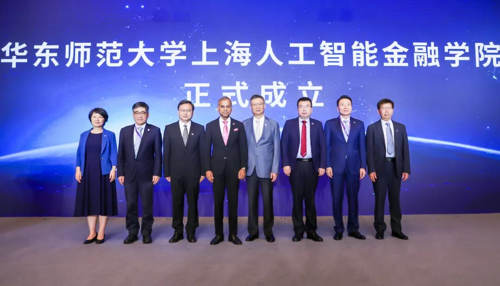
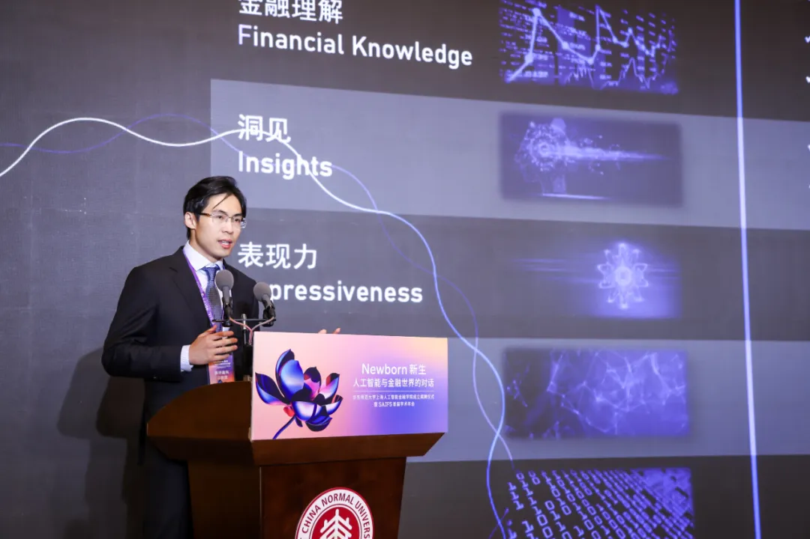
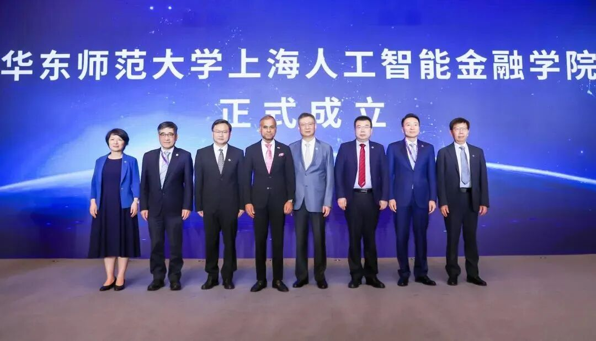
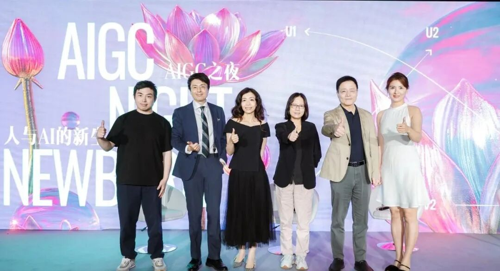

# 对话SAIFS创院院长邵怡蕾：AI时代，人文见长的学校会非常有优势

> **作者**: 李宝珠
> **发布日期**: 2024年6月18日 20:25
> **来源**: [原文链接](https://mp.weixin.qq.com/s/mY_oomD9JLN_uSUPHBtydA)

---

  

华东师大上海人工智能金融学院（SAIFS）创院院长邵怡蕾教授

  

金融，是关乎老百姓钱袋子的国民经济血脉，更是国家核心竞争力的重要组成部分。AI，是当之无愧最具「活力」的行业，也是千行百业革故鼎新的动力引擎。这两个对人类社会发展影响至深的行业，目前仍未展现出令人耳目一新的奇妙反应，**科技更多的还是作用于金融行业的数字化转型，还远没有渗透到核心业务中。**

  

究其原因，首先是金融行业在安全隐私、风险控制方面要求严苛，而目前 AI 在金融领域中的应用缺乏行之有效的监管方法与标准，致使核心业务依旧延用传统系统。其次是金融领域的决策「问责制」不容忽视，而 AI 能否为其决策负责任仍有待商榷。

  

那么，在全行业高举 AI 革新旗帜的今天，AI 如何落子金融核心领域呢？

  

出乎意料，以人文社科见长的华东师范大学率先开始了探索——5 月的最后一天，**全球首家围绕人工智能与金融跨界交叉打造的教育和研究机构正式揭牌成立。**

  

作为华东师范大学上海人工智能金融学院 (SAIFS) 的创院院长，邵怡蕾博士直言「AI 的冲击是对金融范式与传统业务模式的改造，**所以我们追求的不是从 1.0 到 2.0 的升级，而是 1.0 到 100.0 的跳跃」。**

  

华东师范大学上海人工智能金融学院正式成立

  

HyperAI超神经有幸在 SAIFS 的成立仪式结束后，与邵怡蕾院长进行了一次深度访谈，进一步了解到了新学院的愿景与发展规划，同时也看到了这位拥有出色行动力的创院院长对 AI+金融的独到见解。

  

  

**新一轮 AI 浪潮中，社会科学至关重要**

  

作为新中国组建的第一所社会主义师范大学，华东师范大学的教育学、地理学、社会科学在全国乃至全球范围内名列前茅。而在人们的固有印象中，这所以人文社科见长的老牌名校在 AI 的创新研究上似乎并不那么「激进」，但邵怡蕾博士却认为，**「在人工智能时代，人文见长的学校会非常有优势」。**

  

她提出，人工智能时代必须要两条腿走路，现在一条腿很长，另一条腿如果不跟进的话，也会是「瘸子」。

  

其中，**已经蓬勃发展的那条「腿」指的是 AI 技术。**目前，无论是热度高涨的大模型，亦或是其他 hard core 的 AI 研究，都习惯于将主要精力放在 AI 技术的不断创新上，从模型参数的增长到性能的飙升，从垂类数据的积累到 GPU 利用率的提升……技术细节的突破甚至能够以天为周期刷新人们的认知。

  

**另一条「腿」则是指人文社科对于 AI 社会的研究。**脱离应用的技术就像是精心雕琢的艺术品，引得世人惊叹，却终将被束之高阁。「最终对人类产生影响的技术或事物，一定是具有社会性的。」邵怡蕾博士还形象地比喻道，「AI 可能是一个超级牛的天才宝宝，但现在也就两三岁，我们应该教会他如何适应社会，从而打造一个 AI 与人类共存的社会。」

  

而之所以会选择开辟 AI+金融的求索创新，一方面与她的个人经历息息相关，另一方面是因为 AI 与金融在人类社会的发展中有着许多相似之处，相互印证、相互参考。

  

**把人生中的两个重要经历结合起来**

  

成绩优异的邵怡蕾本科就读于上海交大联读班，从高中直升入大学后，能够任意挑选专业，也正是这一特殊性所致，她在本科期间便接触到了诸多人文社科跨学科课程。彼时，计算机科学仍处于早期萌芽阶段，国内的相关研究更是相对闭塞落后，她选择这一专业的原因也非常简单，「18 岁时是不可能考虑清楚未来要干什么的，当时也不知道计算机科学是什么，但是觉得既然挺难的，那就学一个！」

  

**这一「学」，她从本科读到了博士，从上海交大走到了普林斯顿。**

  

在普林斯顿大学攻读计算机博士期间，她和普林斯顿的团队共同创建了 FirstRain.com，从事金融信息的深度挖掘。2005 年，拿到博士学位后，她进入美国高盛银行纽约总部信贷衍生品部门工作。正是这段经历，令她看到了「科技能够给金融带来非常多的动力和效能」。

  

直至 2010 年，邵怡蕾选择回国创业。时值国内电子商务迅猛发展阶段，她联合多年好友陈晓敏博士，共同创立了「立体时代」，推出了首个用于时尚电商方向的智能推荐引擎。随后，她又转变身份成为投资人，投资了许多「以计算改变未来」的高科技创新项目。

  

在她身上，我们既能够看到理工科缜密的逻辑思维与创造性，又能够感受到人文科学领域对于社会发展的深刻洞察与辩证观点。

  

「我觉得人这一辈子不可能只做一件事，我的兴趣比较广泛，也非常愿意尝试新的东西。」对于回到学术界从事教育事业这件事，她直言，**「这非常有挑战性，所以决定尝试一下。」**

  

华东师范大学上海人工智能金融学院创院院长邵怡蕾

  

此外，**邵怡蕾也希望能够将人生中的两个重要经历结合起来——深度计算机科学研究者，以及拥有丰富实践经验的金融从业者。**她认为，二者的结合将具有非常广阔的研究空间与潜力，并且将成为产学研转化的优质土壤。

  

于是，「人工智能金融学院」便有了雏形。

  

**AI 与金融都是「大制无割」的体现**

  

抛开邵怡蕾博士的个人经历不看，**AI 与金融的结合本身也是大势所趋，二者都在现代社会发展中扮演着重要角色，她称之为「大制无割」。**

  

「大制无割」出自于《道德经》的「朴散则为器，圣人用则为官长，夫大制无割」，原意为工匠将原木按规格大小进行分割，加工成零件，再一步一步有序连接组合为器件；圣人治理国家，按分工规则，任命官长各司其职，并将各职责连接组织起来，形成国家完整的治理体系，这就是大制无割，强调了系统的整体性。

  

**邵怡蕾认为「AI 和金融都是大制无割最生动的社会性表达」。**

  

她提出，金融塑造了二战之后的世界体系，是整个社会的血脉，为社会经济运行输送血液，即将钱通过毛细血管流向社会的各个行业，拥有巨大的广度与宽度。同样地，AI 也要渗透到人们生活的方方面面，塑造当下的世界格局以及人类和它种智能共存的未来。

  

她生动地比喻道，「过去的经济体社会血管中流动着钱，推动经济发展、GDP 增长。未来，这条血管中还会流动着 AI，也就是无处不在的智能」。AI 与金融有着非常多的相似之处，例如触及面非常广泛、具有流动的复杂性、是人类社会发展的重要动能。

  

总结来看，在理解 AI 与金融的关系时，不能单纯从技术角度出发，而不去思考当下社会金融体系的特点。反之，如何在庞杂的金融业务中为 AI 找到合适的落脚点同样重要。在这一过程中，**除了 AI 与金融学知识外，还应对快速变化的人文社会有着深刻理解，而这便需要借助哲学、社会科学的知识。**

  

简言之，AI+金融的复杂之处不仅仅是需要交叉学科的背景，同时还要兼顾二者的社会性，而这恰恰是华东师范大学的优势所在。

  

  

**搭建金融机构与科技公司的桥梁**

  

回顾华东师范大学上海人工智能金融学院的创立历程，也充分展现出了邵怡蕾理工科背景下的创新精神与行动力。

  

AI+金融的萌芽在心中破土后，她进行了广泛的调研，对比了国内院校经管/财经学院的特色与优势，但却并没有急于着手筹备，而是先对新学院的发展路线与方向进行了规划展望。

  

她认为，**「人工智能时代，不是学科+AI，是 AI +学科」，**也就是说 AI 对于学科的冲击，将会是一次更加彻底的改造。所以，「我想做的目标并不是在现有财经类学院的基础上，从 1.0 升级到 2.0 或是 3.0，而是需要实现从 1.0 的 100.0 的跳跃」。

  

从目标出发，邵怡蕾发现，这个发展路径更加适合作用于一个新生的学院，摆脱既有框架的束缚，才能进行更多尝试。她提出，**「AI 是贯穿在学院建设过程当中的，不是目的，而是这个学院的一部分」。**

  

提及与华东师范大学大学的相遇，她表示，是一个机缘巧合的过程，来到了「非常少有的、有趣的事情能够发生的地方」。

  

在华东师范大学政治与国际关系学院院长吴冠军的引荐下，邵怡蕾参加了很多「哲学家们的 party」，在交谈中，她逐渐发现，**「华东师大有非常多对人工智能以及先进的技术感兴趣的文科学者，这其实是非常少见的」。**这也令她对这个传统的师范类院校有了全新的认知。

  

2023 年 7月，她和华东师大党委副书记孟钟捷教授以及经济与管理学院院长殷德生教授「频繁碰头」，最终敲定了「上海人工智能金融学院」的名字，随后，她便将学院的发展战略进行了梳理，进一步确定了学院的定位。

  

至此，「人工智能学院」已经初步成型。

  

今年 5 月的最后一天，华东师范大学上海人工智能金融学院正式揭牌成立。当日，**邵怡蕾及其团队也交出了第一份答卷——金融智能体分析师 Jason。**这是华东师范大学上海人工智能金融学院研发的金融垂类 AI Agent，能够以专业金融从业者的思维模式，来分析复杂的金融问题，具备金融投研、金融咨询、金融安全三大能力，可被广泛应用于商业银行、投资银行、风险投资、私募股权、对冲基金、资产管理、金融服务商等一系列金融机构中。

  

华东师范大学上海人工智能金融学院助理研究员汪俊霖

介绍 Jason

  

邵怡蕾介绍道，Jason 是一个「to 产业」的产品。目前的大模型开发大多都是由技术人员主导，由科技牵引。毫无疑问，计算机科学家能够设计研发出性能一流的大模型，但由于缺乏金融垂类知识，往往会造成「大炮打蚊子」的现象，与金融机构的实际需求不符。

  

**「必须要架起桥梁」。**金融行业本身就有着极为复杂的体系流程与业务逻辑，所以，这个「桥梁」同时也是一个「翻译器」，一方面将金融的逻辑灌输到大模型中，另一方面也令金融从业者看到 AI 的能力，进而才能够在更多业务节点上进行创新改革。

  

此外，她认为，「当科技企业在门外敲门时，金融机构的从业者需要从里面把门打开」。这个看似简单的动作，既提升了模型研发效率，同时也令 AI 金融的风险控制问题得到了解决。显然，目前仍有很多扇门并没有打开，这也是上海人工智能金融学院未来的重点研究方向。

  

邵怡蕾介绍道，金融架构性的创新设计、AI 与金融的桥梁架构如何搭建、风控安全如何保障等等，都是非常好的研究课题。未来，学院的研究重点也不在于金融大模型的微调、训练等基础问题，而是需要探寻社会血管中的血液流动速度——当 AI 与金融融合共进，流速不能过快、不能迟缓，血量不能稀缺也不能过剩，找到其中的平衡非常重要，是一个需要深度研究的课题。

  

  

**结语**

  

普林斯顿大学计算机系博士、高盛银行投资银行家、创业者、投资人、IJCAI中国办公室秘书长……回望来时路，科技与金融已经紧密交织于邵怡蕾的经历中。此番再度出发，她选择投身于学术界，在更广阔、自由的空间中践行其对于 AI+金融的创新设想。可以预见，拓荒之路上势必荆棘丛生，让我们共同期待她所带领的上海人工智能金融学院带来更多前沿成果，打造我国 AI 研究的标杆性案例。

  

图文素材：华东师大上海人工智能金融学院，超神经

撰写和编辑：李宝珠，三羊

  

SAIFS最新动态：

[华东师大智金院SAIFS，正式成立！](http://mp.weixin.qq.com/s?__biz=MzkxMTY1ODk2Mw==&mid=2247484110&idx=1&sn=68a39cb3161b24a917f07cf05f927f6b&chksm=c1199872f66e11641dec4137f2823d27590690c33462b8b4fb40add896d45d8571858974713e&scene=21#wechat_redirect)  

[新生与对话｜SAIFS首届学术年会，4大洲18位顶尖专家学者共探AI-Fin新机遇](http://mp.weixin.qq.com/s?__biz=MzkxMTY1ODk2Mw==&mid=2247484110&idx=2&sn=8842b97267e75014945c7d559ceb5bae&chksm=c1199872f66e1164276d94e5e2914575a7843df733f86d7c3302b9959ef5c80de08fcce11e9e&scene=21#wechat_redirect)  

[爱AI在华师大｜“AIGC之夜”：见证人与AI的新生](http://mp.weixin.qq.com/s?__biz=MzkxMTY1ODk2Mw==&mid=2247484226&idx=1&sn=4893e9db75d6044309a278741a709a3a&chksm=c11999fef66e10e882a394e6f3260b41aa8eebb5ba9cf318b467b6abe8d6db5f6f00359da7ab&scene=21#wechat_redirect)

  

  

