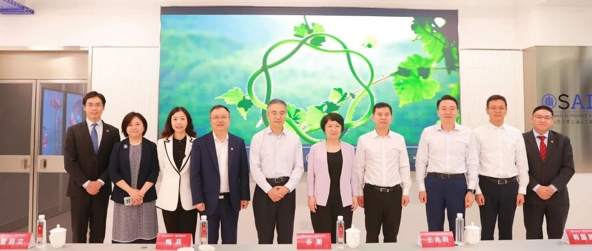
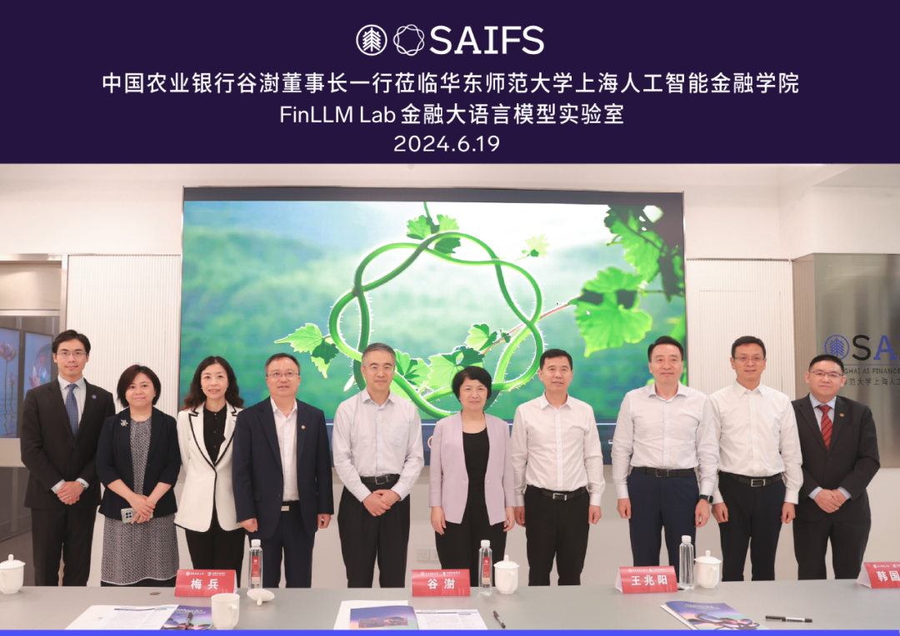
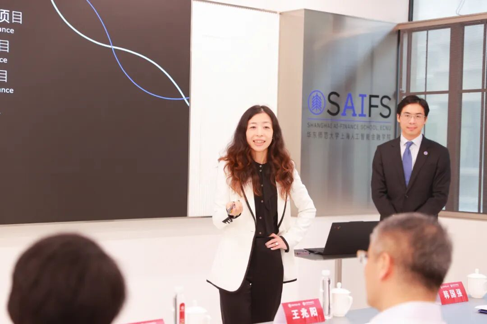
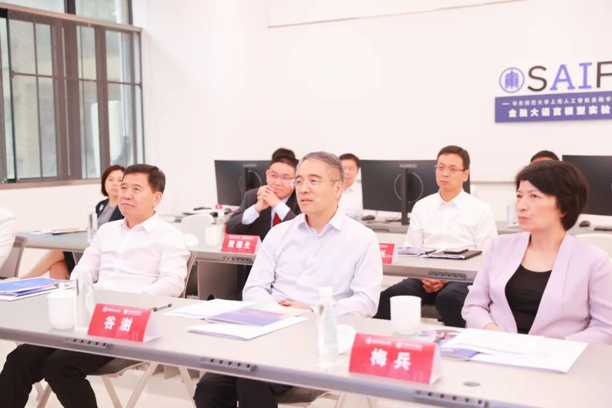
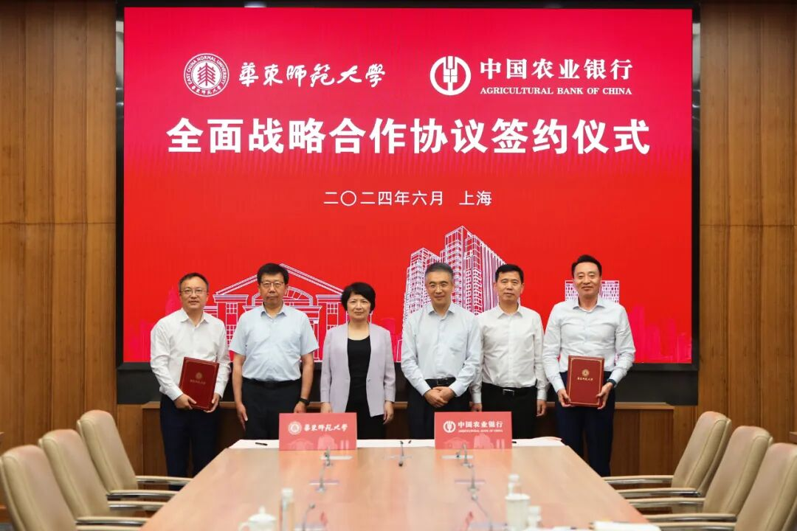

# 中国农业银行董事长谷澍一行调研智金院金融大语言模型实验室

> **作者**: SAIFS
> **发布日期**: 2024年6月24日 17:00
> **来源**: [原文链接](https://mp.weixin.qq.com/s/0_7enttynDiyDOmnlViMQg)

---

  

  

  

‍6月19日下午，中国农业银行董事长谷澍，三农业务总监兼办公室主任王兆阳，中国农业银行上海分行行长韩国强，中国农业银行上海分行副行长张国兴调研华东师大上海人工智能金融学院金融大语言模型实验室（FinLLM Lab）。华东师大党委书记梅兵，党委常委、副校长雷启立，党委常委、统战部部长兼学校办公室主任张惠虹，经济与管理学院党委书记岳华、院长殷德生，上海人工智能金融学院院长邵怡蕾出席并陪同谷澍董事长一行调研。

  

‍

邵怡蕾院长向谷澍董事长介绍实验室的建设

  

智金院金融大语言模型实验室（FinLLM Lab）作为一个在人工智能技术和金融领域深度融合的先锋研究平台，专注于开发和应用金融垂类大语言模型以及一系列基于生成式人工智能的开拓性研究，提升金融风险管理、投资决策、市场分析等方面的服务效率和精准度。

  

  

邵怡蕾院长介绍实验室建设的理念和建设目标

  

邵怡蕾院长介绍实验室拥有先进的计算设备和数据处理平台，在金融科技的创新与突破方面，实验室将致力于通过先进的人工智能和大语言模型技术，开发新型金融工具和解决方案，以提升金融行业的智能化水平。在提升风险管理方面，实验室将构建高效的风险预警和管理系统，通过分析海量金融数据，帮助金融机构更好地应对市场的波动和不确定性。此外，实验室会借助人工智能技术，提供精准的市场预测和投资建议，帮助投资者优化投资决策，实现更佳的投资组合和收益。

  

中国农业银行谷澍董事长一行调研实验室

  

实验室目前主要研究方向包括金融风险管理、AI金融智能体分析师Jason的研发以及打造金融市场的元宇宙拟像等。在介绍实验室科研发展的同时，邵怡蕾院长强调实验室未来将积极与国内外知名金融机构、大学和研究机构展开合作，培养具备人工智能和金融知识的复合型人才，推动金融科技教育的发展，为社会创造更大的价值。

  

  

  

‍

智金院助理研究员汪俊霖介绍名为Jason的AI智能体金融分析师

  

智金院助理研究员汪俊霖介绍了名为Jason的AI智能体金融分析师。不同于通用大语言模型的概率推演，Jason被赋予了专业金融从业者的思维模式，在分析复杂金融问题时在金融理解、洞见、表现力、逻辑和数据五个方面展现优势。汪俊霖解释了AI Jason在使用了智金院专有的金融可信人工智能算法后能够避免通用大语言模型常见的幻觉问题和逻辑漏洞，成为金融从业者的得力助手。AI Jason凭借其严谨和逻辑严密的工作能力，可被广泛应用于多种金融机构中，有效支持金融机构的决策和风险管理工作。

  

谷澍董事长讲话

  

在调研的尾声，谷澍董事长对实验室的建设及其发展方向给予了高度认可和评价。他特别赞赏实验室以信贷金融作为切入点，以AI Jason的研发作为关键牵引的智慧之举。他认为，未来这一系列的研发工作将对金融机构的创新发展起到至关重要的作用。同时，他还就实验室面临的机遇和挑战进行了深入的交流，并对数据安全、金融风险控制和行业分析等实验室相关领域工作提出了建设性的意见。

  

华东师范大学与中国农业银行上海分行签署全面战略合作协议  

  

调研结束后，华东师范大学与中国农业银行上海分行全面战略合作协议签约仪式在普陀校区举行。双方将发挥各自领域优势，创新合作模式，建立长期、紧密、稳定的校银战略合作关系，构建校银合作新格局，不断推动双方在教育金融、金融科技、人才培养、人工智能等领域的深入合作落实落地。

  

图文：华东师大学校办、上海人工智能金融学院、经济与管理学院

  

SAIFS最新动态：

[华东师大智金院SAIFS，正式成立！](http://mp.weixin.qq.com/s?__biz=MzkxMTY1ODk2Mw==&mid=2247484110&idx=1&sn=68a39cb3161b24a917f07cf05f927f6b&chksm=c1199872f66e11641dec4137f2823d27590690c33462b8b4fb40add896d45d8571858974713e&scene=21#wechat_redirect)

[对话SAIFS创院院长邵怡蕾：AI时代，人文见长的学校会非常有优势](http://mp.weixin.qq.com/s?__biz=MzkxMTY1ODk2Mw==&mid=2247484255&idx=1&sn=1b5a38a9d4e7c856f982f9bd72301fc1&chksm=c11999e3f66e10f5c580060cb16da2083a0808cfc42b3f899b2476c48d45685e527a00f7a6da&scene=21#wechat_redirect)

