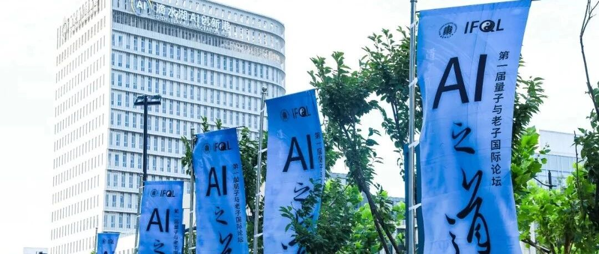

# 第一届量子与老子国际论坛“AI之道”：AI将带给你我什么样的未来？

> **作者**: ECNU
> **发布日期**: 2024年7月11日 16:50
> **来源**: [原文链接](https://mp.weixin.qq.com/s/Oq4QkHZ8qDwupWLXy_Kt8g)

---

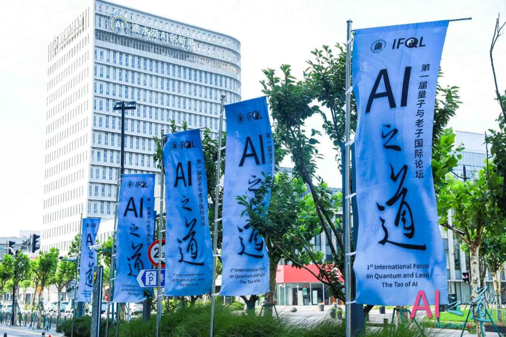

**当今世界，全球剧变，基于量子物理的新科技时代奔涌而来，人工智能给人类前景带来巨大的不确定性。AI未来将如何发展？人类如何才能驾驭AI？AI时代如何助力人类自身的发展？**  

  

  

  

7月7日，在上海临港滴水湖畔，华东师范大学联合港城集团举办第一届量子与老子国际论坛“AI之道”，聚焦于这些困扰知识界和公众的前沿问题，**思考如何才能更好地迎接挑战和摆脱困境，以创造人类文明新的未来。**华东师大校务委员会副主任孟钟捷主持开幕式。

  

**“AI将带给你我什么样的未来？”**中国工程院院士、华东师大校长钱旭红在开幕式上倡议，我们需要省思这些问题。他认为，AI的跃迁式发展会让人类在知识学习上滞后，我们必须在思维科学上争取领先，驾驭和发展AI。“因此，我们创办量子与老子国际论坛、创办《TAO》（《道》）国际开放学刊，一起来头脑风暴。”

  

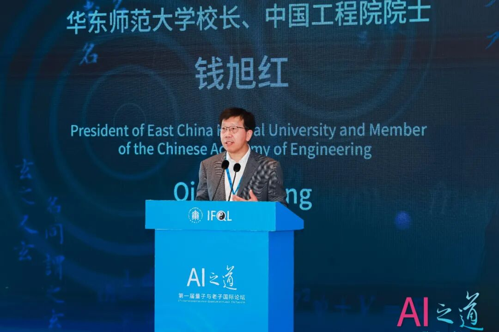

中国工程院院士、华东师大校长钱旭红在开幕式上致辞

  

**“AI只是聪明，但并不智慧。”** 钱旭红认为，人类要用全面而多元的思维能力超越知识无限的人工智能。他说，量子思维和老子思维是人类思维中能逼近大道真理的典型代表，能够作为AI时代人类思考的基石，让人举一反三、触类旁通，去应对AI时代的挑战。“量子、老子、AI等相互超学科的关联已经发生。”

  

论坛以“AI 之道”为主题，邀请来自AI、量子、老子及其相互渗透领域的中外专家学者齐聚一堂，从AI与未来思维教育、AI未来与量子科技、老子思维与AI伦理三个维度展开研讨，带来18场主题演讲，碰撞出交光互影的思想火花和学术灵感。

  

开幕式上举行了《TAO》（《道》）创刊发布仪式和“丽娃之AI”滴水湖论坛启动仪式。据了解，《TAO》（《道》）是连续开放出版的综合性和创新型国际学术期刊，将以量子思维和老子思维探索世界科学、技术与文明之“道”，侧重反映人工智能时代的思维革命、科技进步和社会创新。

  

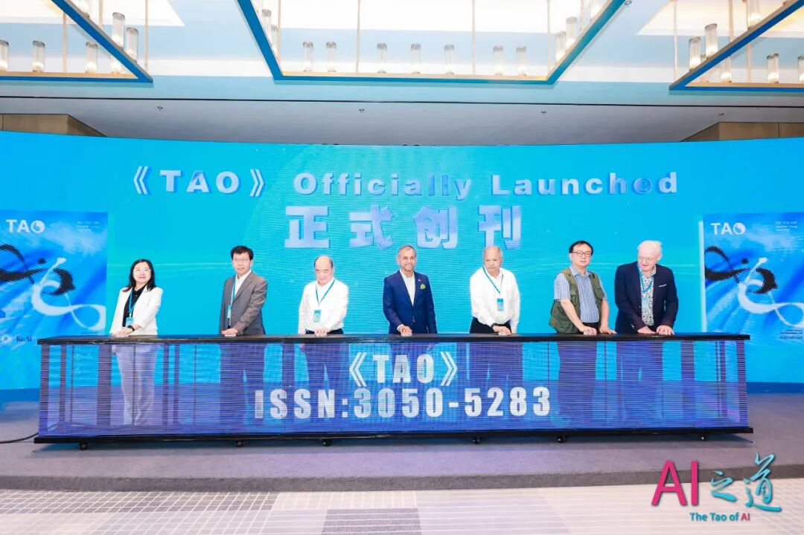

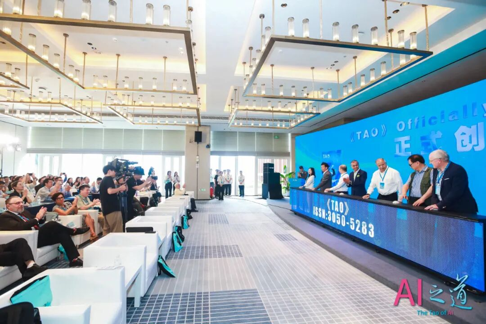

联合国驻华协调员常启德，图灵奖获得者、卡内基梅隆大学教授劳伊·雷迪，澳大利亚科学院院士、新南威尔士大学教授托比·沃尔什，中国科学院院士、国防科技大学教授王怀民，中国科学院院士，中国科学院理化技术研究所研究员江雷，中国工程院院士、华东师范大学校长钱旭红，科爱森蓝文化传播有限公司副总经理柴钊共同发布期刊《TAO》（《道》）

  

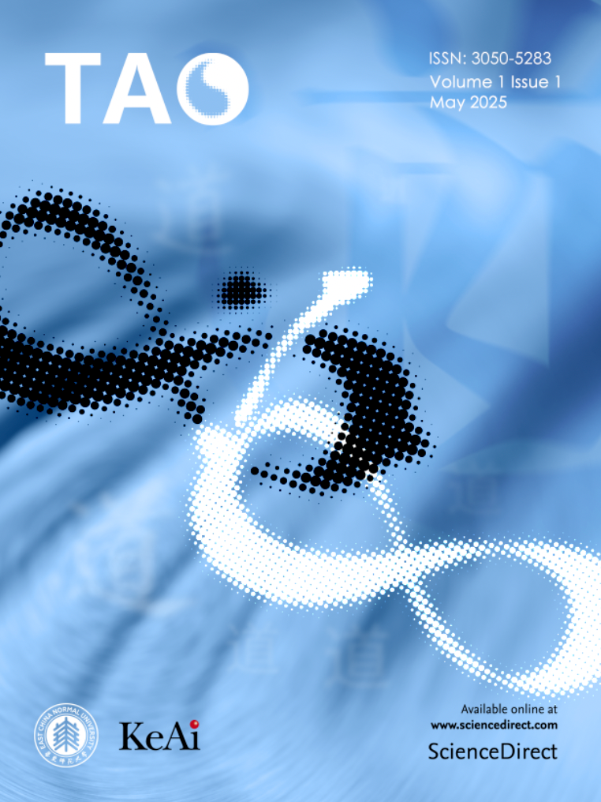

国际开放学刊《TAO》（《道》）

  

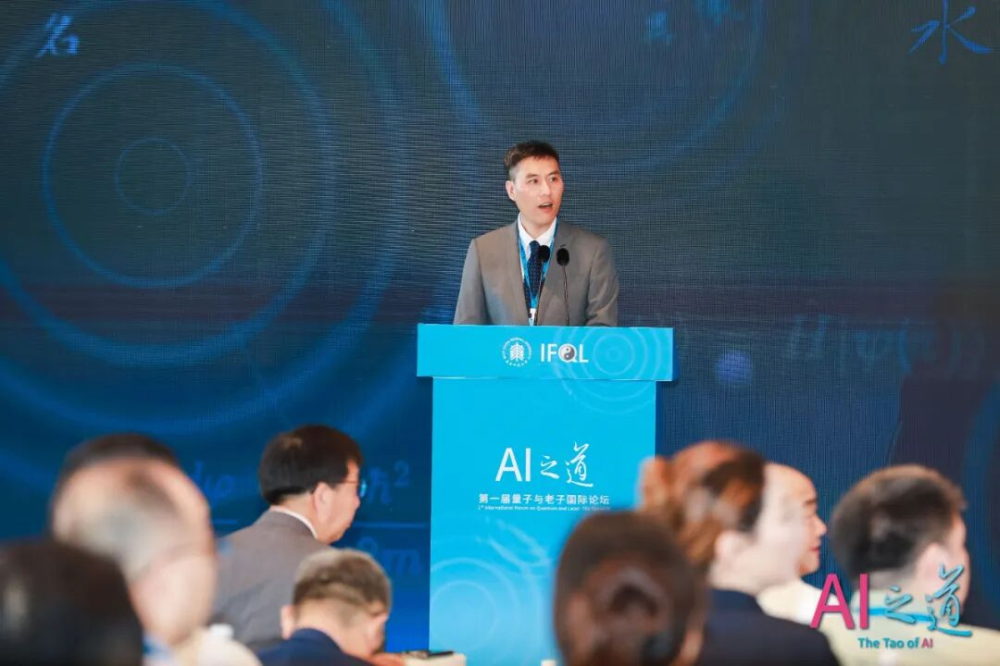

华东师大校务委员会副主任孟钟捷主持开幕式

  

期刊《TAO》(《道》)封面由两个中国传统文字甲骨文的玄8，通过卷曲扭结，构成写意的“道”字，黑白寓意阴阳、卷曲交互意味量子纠缠的设计理念，与论坛主题、期刊宗旨相呼应。刊名《TAO》中的O字既像水滴，又像滴水湖，也像阴阳鱼的小图形；中文“道”字的虚化，则进一步呼应了量子世界的不确定与测不准。

  

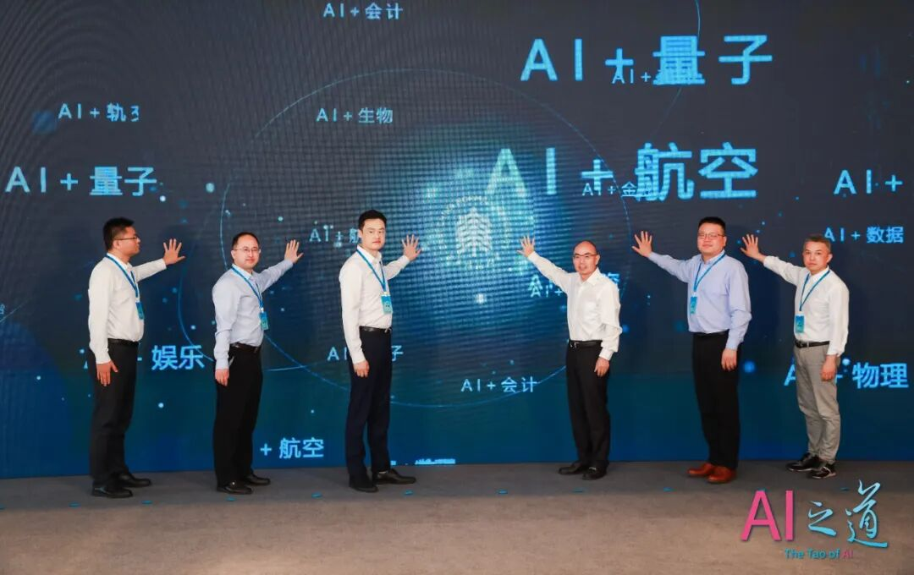

临港新片区管委会高科处处长陆瑜，港城集团党委书记、执行董事奚志忠，华东师大科技处处长杨海波，人文与社会科学研究院院长吕志峰，国际合作与交流处处长蒯曙光，滴水湖国际软件学院院长蒲戈光共同启动“丽娃之AI”滴水湖论坛

  

此次论坛也是“丽娃之AI”滴水湖论坛系列活动第一讲。

  

日前华东师大滴水湖国际软件学院揭牌成立，华东师大与临港新片区已开启从绿色生态到教育科技人才的全面合作。为全方位营造人工智能社会氛围，吸引更多人工智能人才汇聚临港，在临港新片区管委会的指导下，华东师大联合港城集团将定期举办“丽娃之AI”滴水湖论坛。

  

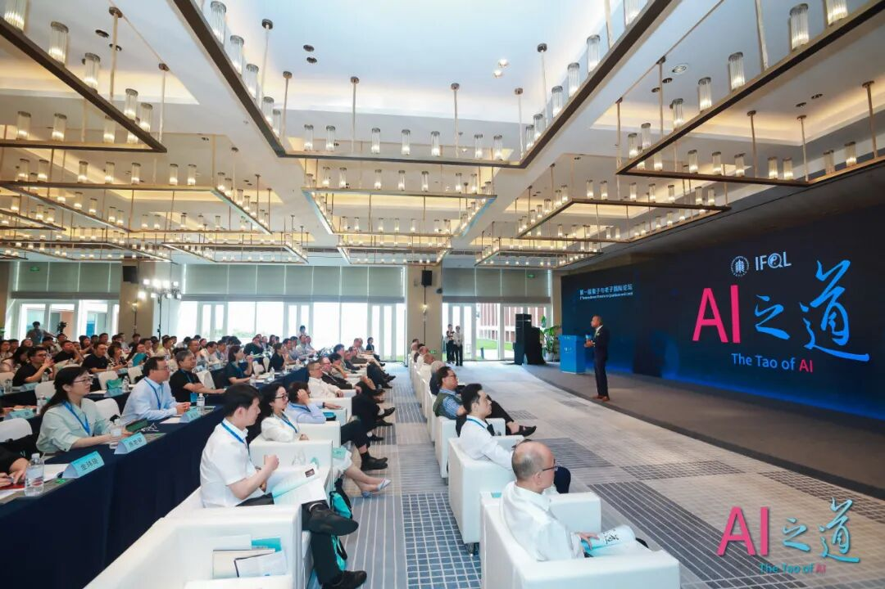

第一届量子与老子国际论坛“AI之道”

  

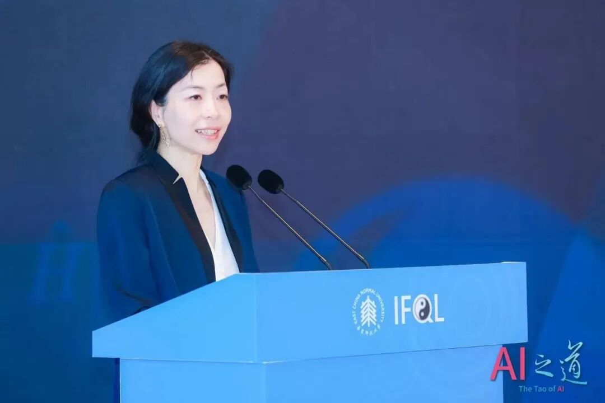

华东师大上海人工智能金融学院院长邵怡蕾主持第一部分主题演讲

  

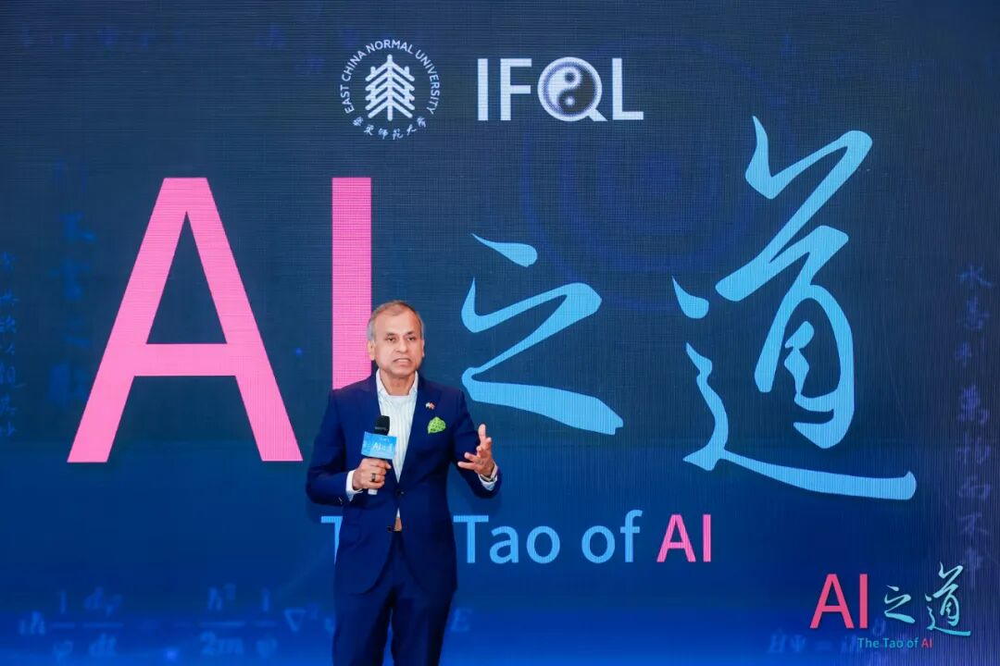

联合国驻华协调员常启德作主题演讲

  

**“保持呼吸，保持笑容。”** 联合国驻华协调员常启德在题为“呼吸之道——当代人面临的挑战”的演讲中，讲述了他成功减重、摆脱疾病困扰的经历，指出呼吸练习能让人身心安康，帮助人们找到精神、情绪和身体的平衡，是实现内心和谐、平静和健康的强大渠道，对丰富人类生活具有普遍意义。

  

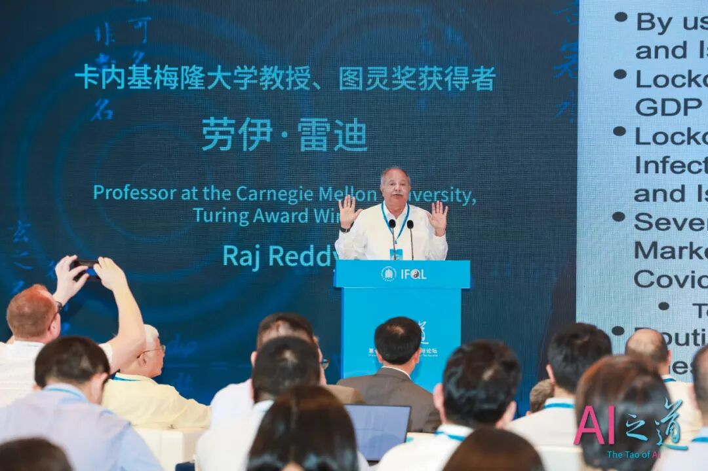

图灵奖获得者、卡内基梅隆大学教授劳伊·雷迪作主题演讲

  

**“AI 将显著提升全人类的生活质量。”** 图灵奖获得者、卡内基梅隆大学教授劳伊·雷迪进行人工智能研究已有50余年，他在演讲中探讨了人工智能的前景与风险，并提出利用人工智能进步来增强和提升人类的策略。“到2040年，由AI驱动的生产力革命，将使全球GDP从当前的大约100万亿美元增加到超过1000万亿美元，从而改善所有人的生活质量，包括边缘群体也将从中受益。”他同时指出AI可能带来的社会风险，包括人工智能的普遍运用会导致社会失业率的增加，也可能会导致虚假信息的广泛传播和用户隐私信息的泄露等。

  

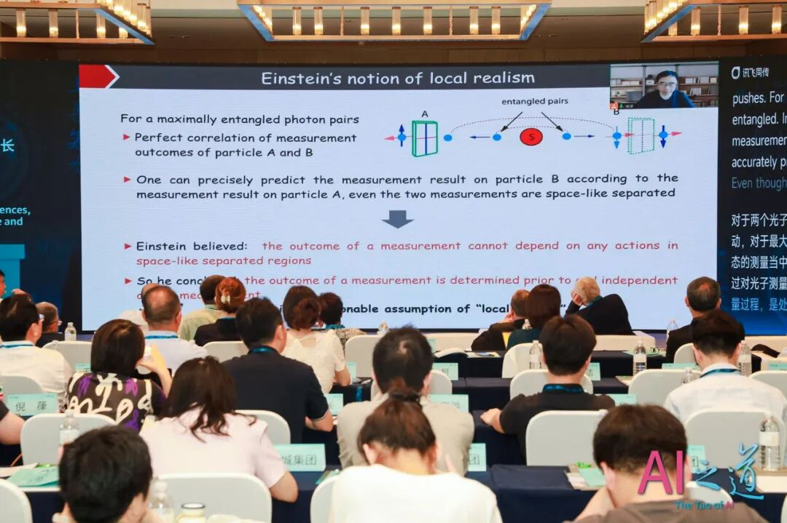

中国科学院院士、中国科学技术大学常务副校长潘建伟作主题演讲  

  

世界首颗量子科学实验卫星“墨子号”、光量子计算世界第一的“九章三号”、在超导量子计算领域超越谷歌的“祖冲之二号”……中国科学院院士、中国科学技术大学常务副校长潘建伟被誉为中国量子之父，他的在线演讲介绍了中国科学家近年来在量子科技领域取得的一系列重要突破，并对量子信息科学的未来发展进行了展望。**“一个更令人激动的未来将是通过把人工智能和量子计算结合起来，我们也许可以理解和创造新的超越自然的智能。”潘建伟说。**

  

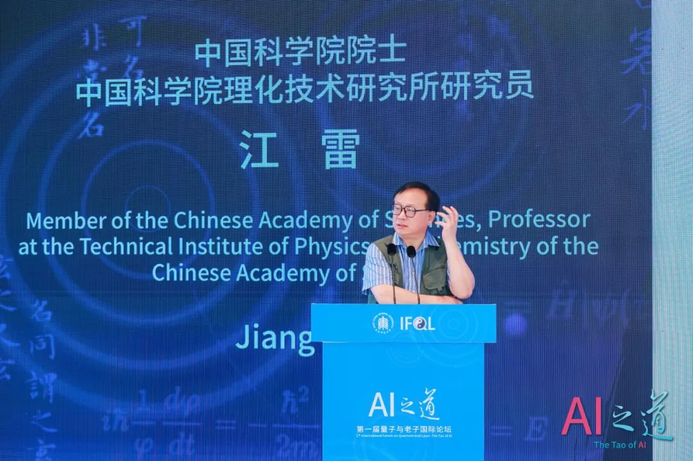

中国科学院院士、中国科学院理化技术研究所研究员江雷作主题演讲

  

**“我们的科研理念是道法自然，向自然学习，在学习的过程中发现新现象和新原理，发明新材料，创造新技术。”**中国科学院院士、中国科学院理化技术研究所研究员江雷重新审视了人类大脑超低能耗、超高效率的运算行为，提出了全新的宏观量子态理论——量子限域超流体，并以此挑战神经动作电位理论。他在演讲中指出，生命体为什么可以实现超低能耗的能量转换、信息传输和生物合成，这是生命科学的终极问题。

  

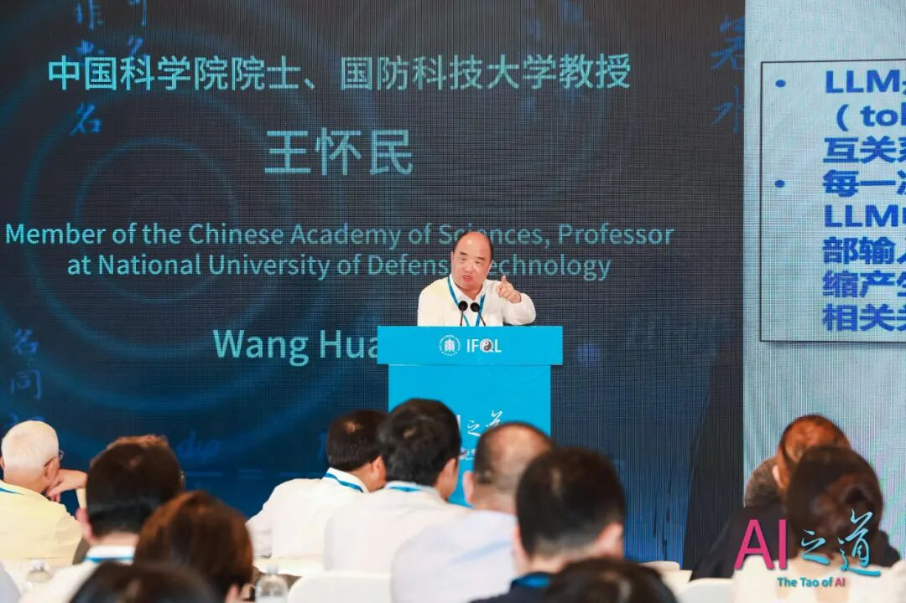

中国科学院院士、国防科技大学教授王怀民作主题演讲

  

**“老子思想和量子思维可能提供认识智能的新思维。”** 中国科学院院士、国防科技大学教授王怀民是我国分布计算领域的重要领军人物，他在演讲中探讨了西方经典科学中的确定性思维传统及其在20世纪以来所面临的挑战，并指出当下发展人工智能需要不确定性思维，从消解不一致性转为接受不一致性。他认为，图灵思想仍然是认识人工智能最深刻的参照，从人在系统外到人在系统中认识不确定性，大语言模型也是人类认识智能最新试验场。

  

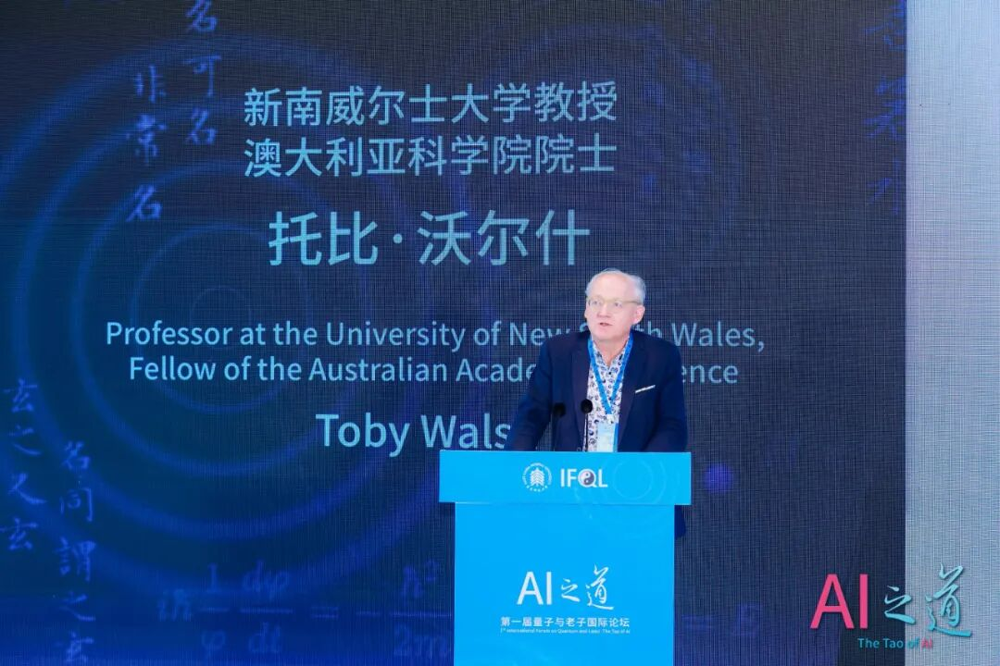

澳大利亚科学院院士、新南威尔士大学教授托比·沃尔什作主题演讲

  

**“人工智能并非改变我们生活的首项技术，但能让我们以更快的速度、更大的规模和更低的成本处理问题。”** 澳大利亚科学院院士、新南威尔士大学教授托比·沃尔什是世界知名人工智能专家，致力于研究人工智能如何更好地应用于人类生活。他在演讲中指出人工智能是一种道德上中立的技术，它是好是坏取决于被如何使用，让人工智能造福于人类，是他和其他相关领域的科学家努力的目标。

  

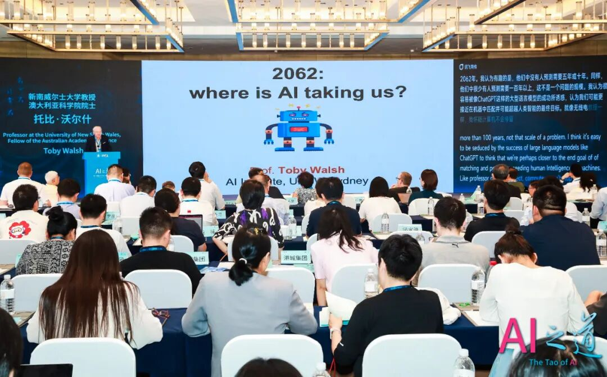

  

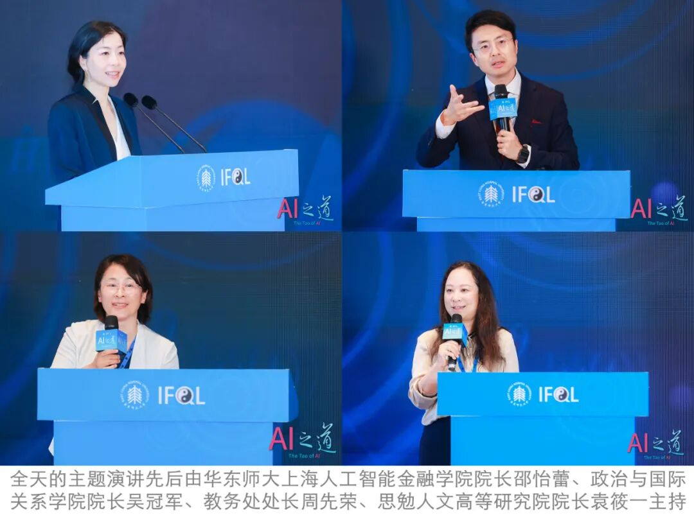

  

来自弗吉尼亚理工大学、维也纳高等研究院、维也纳大学、科罗拉多大学、圣安德鲁大学、台湾大学、清华大学、同济大学、台湾中原大学以及华东师大等高校和科研机构的十几位专家学者，从量子哲学、量子小说、量子波函数、量子道学与社会科学、超快微观量子世界、人工智能时代的人文科学、人工智能与量子计算的融合、老子与量子理论对哲学的挑战与影响等方面进行了精彩的演讲，为大家呈现了一场科技对接人文、东方融通西方、现实通往未来的具有全球性和前瞻性的思想盛宴，展现了中西之和、古今之和、文理之和的良好学术氛围。

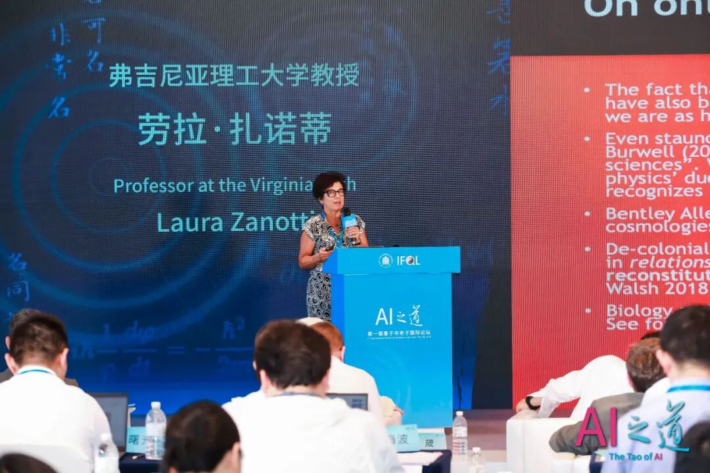

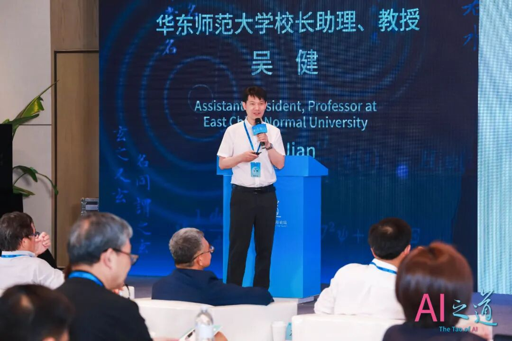

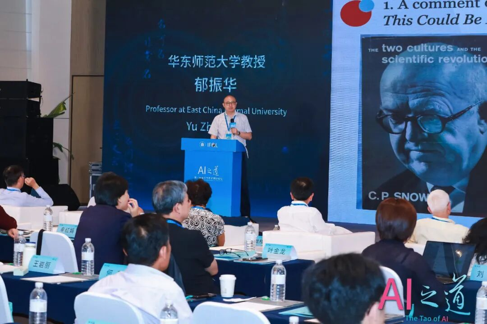

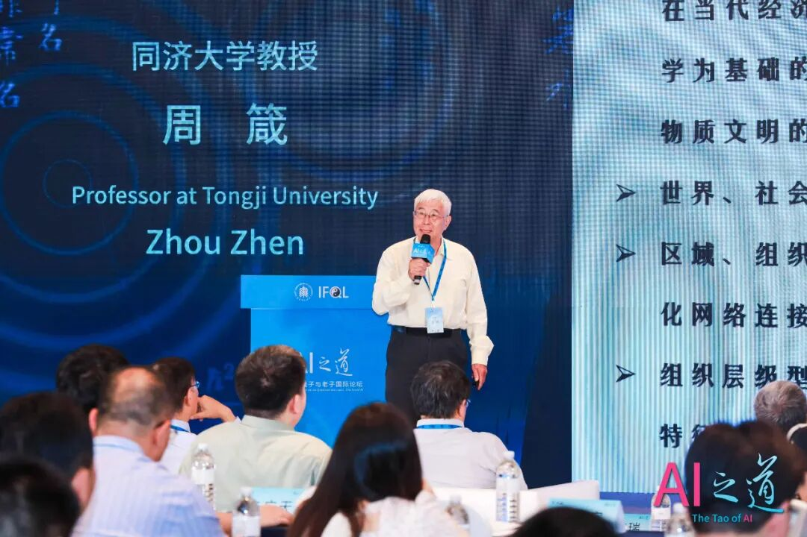

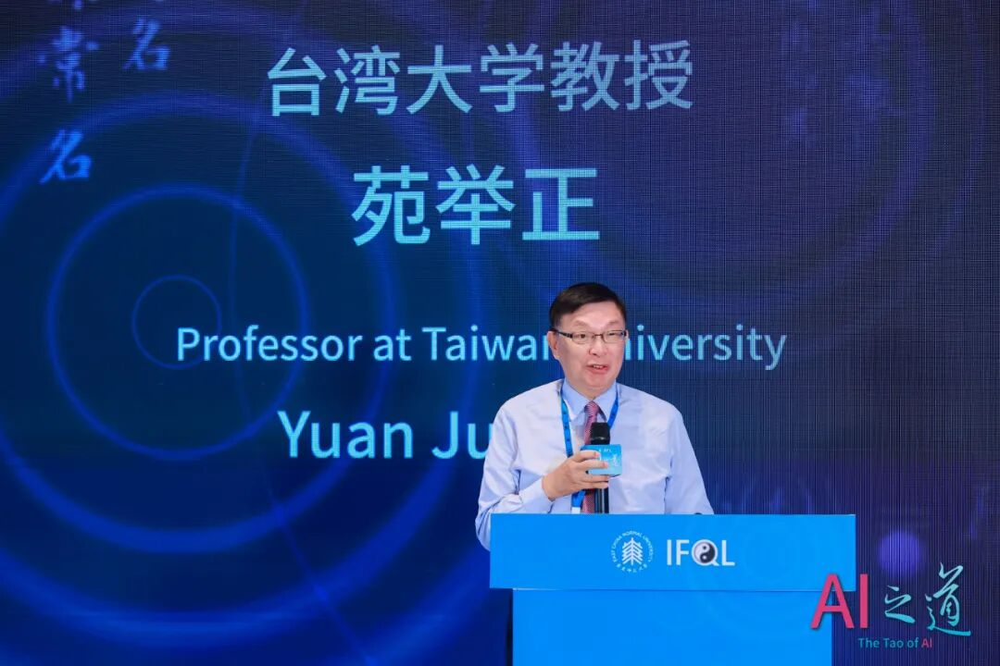

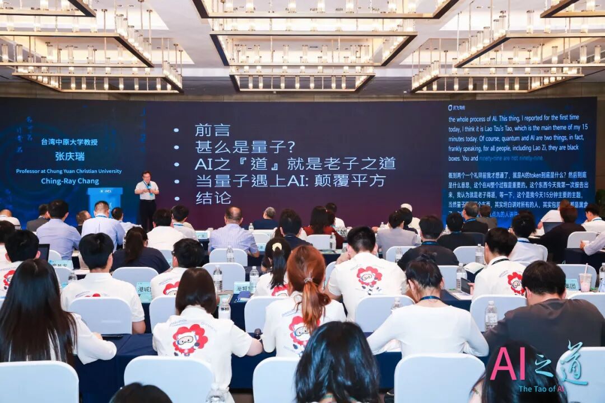

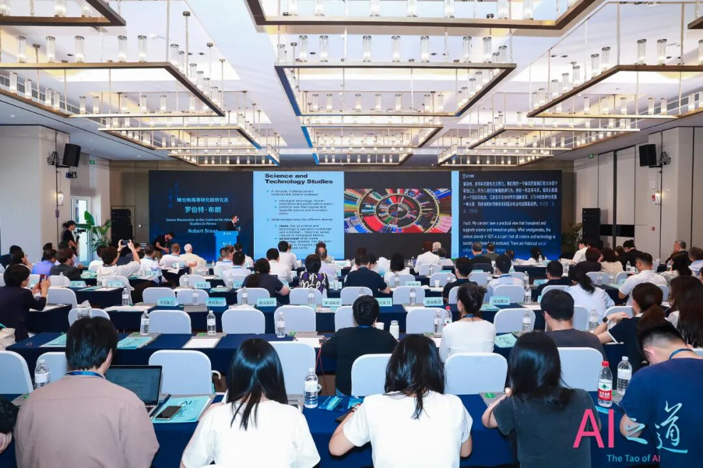

← 查看更多演讲嘉宾精彩现场→

全天的主题演讲先后由华东师大上海人工智能金融学院院长邵怡蕾、政治与国际关系学院院长吴冠军、教务处处长周先荣、思勉人文高等研究院院长袁筱一主持。

  

邵怡蕾认为，**这样一场论坛并不是对人工智能时代表达乐观或悲观的情绪，而是以学者的分析和研究态度，来重构这个世界的科学地基。** 吴冠军表示，这场盛会大咖云集，对A(G)I时代思维能力的重要性输出了强大观点，而华东师大早在AI时代来临之前就已经倡导用思维教育取代知识点教育。周先荣则认为，量子力学的建立不仅是一场思维革命，更催生了量子科技，对量子理论的哲学研究也应运而生，这场论坛具有鲜明的学术前沿性和现实意义。袁筱一在主持人文学科讨论环节时说，思想从来不是自我传播的，它总是相遇、交流和碰撞的产物，这也是今天论坛的意义所在。

  

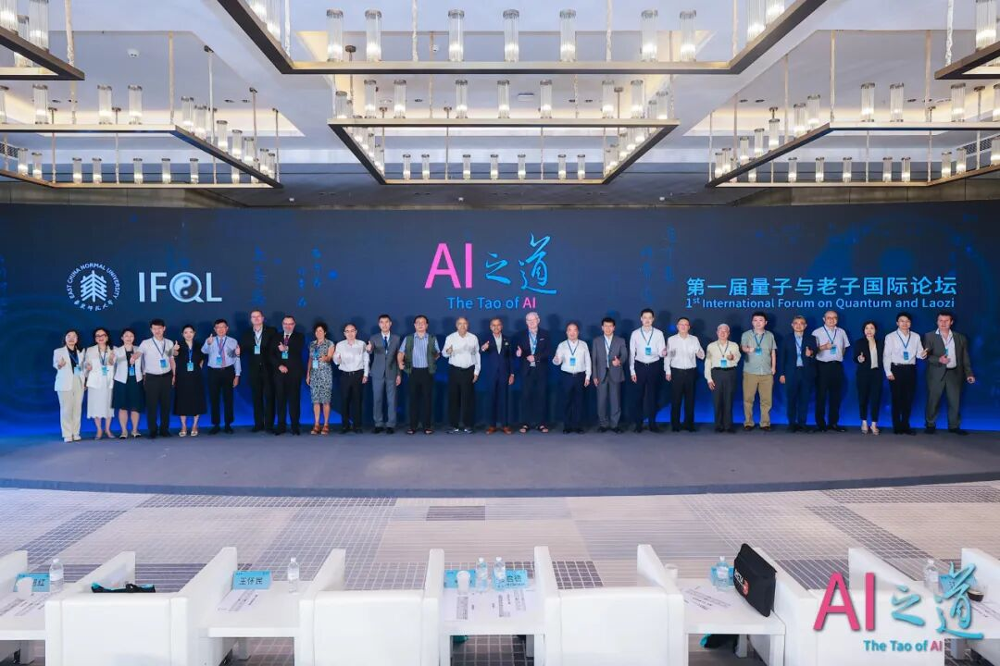

第一届量子与老子国际论坛演讲嘉宾合影

  

**“每一位演讲者都体现出了反思过去的历史感、关心当下的责任心和走向未来的行动力。”** 孟钟捷在总结讲话中表示，华东师范大学将继续通过举办论坛、合作期刊等形式，促进超学科的对话与合作，为应对AI时代人类面临的各种挑战和变革转型，提供解释范式、思维方法和解决方案。

  

转发自华东师范大学官方公众号

来源 | 滴水湖国际软件学院

上海人工智能金融学院

思勉人文高等研究院

文｜田波澜

编辑｜吕安琪