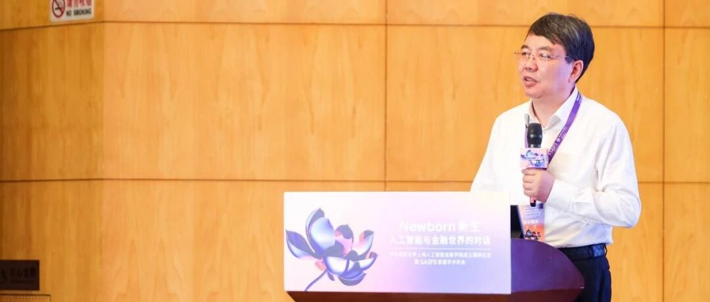
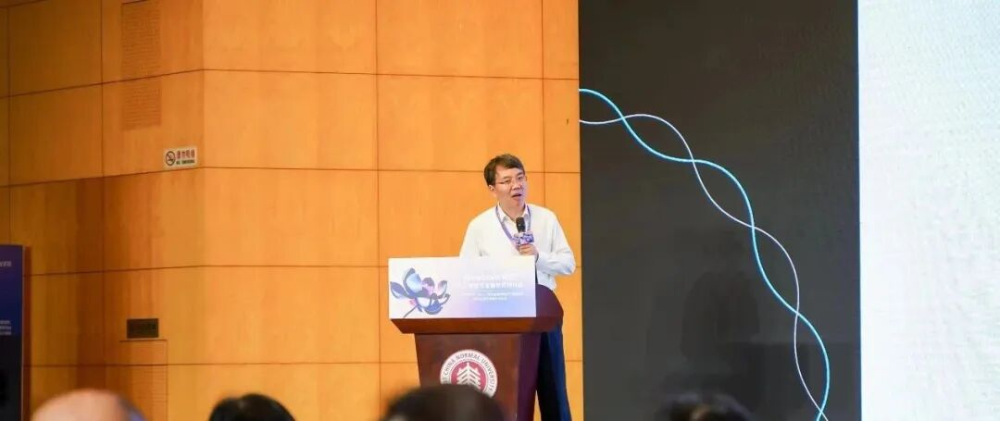
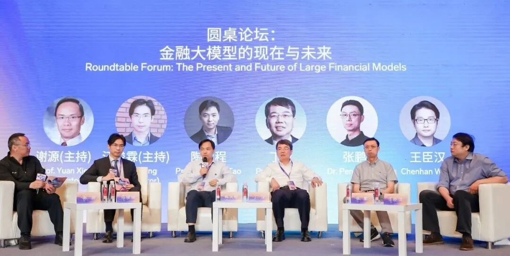

# 智金学者系列｜中国科学院院士丁汉：人形机器人——机器人与人工智能结合的爆发点

> **作者**: 李宝珠
> **发布日期**: 2024年7月12日 16:50
> **来源**: [原文链接](https://mp.weixin.qq.com/s/z9VzTI5ofqETA2jVCLv9Pw)

---

*对话中国科学院院士丁汉，了解其在智能制造领域的深厚积累，以及他对工业机器人、人形机器人等研究领域的独到见解。*

  

工业制造是国民经济的重要支柱，是实现发展升级的国之重器。早在 2002 年，党的十六大就曾提出，坚持以信息化带动工业化，以工业化促进信息化，走出一条科技含量高、经济效益好、资源消耗低、环境污染少、人力资源优势得到充分发挥的新型工业化路子。此后，「新型工业化」成为政府文件中的高频词。

  
2015 年，《中国制造 2025》发布，明确提出要推动信息化与工业化深度融合，重点发展高档数控机床、工业机器人、增材制造装备，以及智能化生产线。

  
十年间，中国制造业开启了从「中国制造」向「中国智造」的转型之路。如今，智能装备、智能产线、智能车间到智能工厂，在国内的企业广泛应用和推广，从提质增效到节能减碳，无处不体现着信息技术、自动化技术和人工智能技术对传统制造业的赋能。

  
机器人作为智能制造的关键技术之一，集成了新材料、智能传感器和人工智能等新兴技术，能直接参与制造过程，替代人工完成危险或重复性的工作。机器人已经成为推动中国制造业数字化转型的重要力量。

  
**「机器人是智能制造的四肢，智能制造的最终目标是人机共融。」**中国科学院院士丁汉在近日出席华东师范大学上海人工智能金融学院首届学术年会时，分享了他对机器人发展趋势的研判。他提出，**「机器人可以实现无处不在的制造。」**  

  
  

HyperAI超神经有幸与丁汉院士进行了一次深度访谈，进一步了解其在智能制造领域的深厚积累，以及他对工业机器人、人形机器人等研究领域的独到见解。

## 机器人是人工智能技术的重要落脚点

第一次工业革命以机器取代人力、畜力为标志，成为人类社会发展的重要里程碑。第二次工业革命见证了电力的大规模应用，推动了工厂的建立和集中式工业制造，专业技术的重要性也随着劳动分工的深化而日益凸显。

  
第三次工业革命，即信息技术革命，以计算机、数字通信、互联网等技术革新为核心，加速了生产效率的提升。**也正是这一时期，工业机器人诞生了。**1959 年，美国人英格伯格和德沃尔制造出世界上第一台工业机器人「尤尼梅特」，并在通用汽车的压铸厂生产线上投入使用，将机器人从幻想带入了现实。

  
  
  

然而，50 年代的机器人主要以机械臂的形式完成简单的重复性运动，还没有形成「人」的概念。彼时，可编程机械臂仅能根据程序完成单一工种的基础工作。近十年来，随着物联网、视觉传感器等底层技术和产品的升级，以及人工智能技术的深化应用，机器在工业制造环境中开始获得决策能力，真正向「机器人」迈进。

  
丁汉院士提出，未来，在机电系统与生命系统的深度融合下，**机器人的发展趋势是具有更高环境适应性和自主性。**人形机器人有望在非结构化环境下实现自主决策，而人工智能、大模型和传感器的无缝对接，将为机器人技术带来更大的创新与突破。

**丁汉院士强调：「未来，机器人将是人工智能的重要落脚点。」**他认为，人工智能的应用拓展应以「帮助人、拓展人、服务人」为核心，通过技术进步将人类从繁琐的事务中解放出来，使其能够从事更加高级、更加富有创造性的活动。**他判断，****未来十年将是机器人与人工智能结合的爆发期。**

回归到工业制造领域，他认为「机器人是智能制造的四肢」，将从最初的与零件交互，发展到与环境、人和其他机器人的复杂交互。机器人化制造也将为战略领域核心部件的高效高精加工提供新的思路。

## 人形机器人是机器人技术的集大成者和制高点

尽管最初的机器人难以胜任工厂内精细的制造任务，精度和灵敏度都无法和机床相比，但随着技术进步，机器人正在改变着工业制造的格局。

  
目前，很多企业推行的「黑灯工厂」，即完全无人化、依靠机器自动运行的智慧工厂，大量应用了工业机器人和机械臂，但它们主要负责一些大批量、规范性的加工制造，按照预先设定的程序和算法进行识别、反馈和循环操作。对于一些小批量、技巧性强的精密零部件加工，传统机器人难以胜任。

  
针对这一挑战，丁汉院士认为，人形机器人和灵巧操作在工业界有着巨大的潜力和价值。**人形机器人涉及机械、电器 、材料、传感、控制、人工智能等多个学科的交叉与融合，被国际公认为是机器人技术的集大成者和制高点。**  

  
Atlas，图源：波士顿动力官网  

  

近年来，国内外有许多企业纷纷投入人形机器人赛道。波士顿动力用液压系统打造的 Atlas，从蹒跚学步到步履生风，不断刷新人们对机器人的认知。虽然液压 Atlas 已经「退役」，但他为人形机器人发展奠定了基础。

  

特斯拉创始人马斯克在 2021 年宣布进军人形机器人领域，并在 2024 年初公布了第二代 Optimus（擎天柱）漫步于特斯拉工厂内部的视频。英伟达创始人黄仁勋也提出，人形机器人将会改变工业界，并在今年的 GTC 大会上介绍了基于英伟达 GR00 平台的人形机器人。

  
在中国，优必选 2023 年底成功登录资本市场，成为「人形机器人第一股」。「华为天才少年稚晖君」离开华为后创办的智元机器人，也于 2023 年 8 月发布了首款通用型具身智能机器人「远征 A1」。

  
从本质上讲，人形机器人可以拆分为「人形」和「机器人」两部分。「人形」是指其外形采用人类的两足双手设计，以更贴近人类工作方式的形式去完成各类任务；「机器人」则是需要其具备一定的决策能力，能够像人一样思考，而不是执行既定程序的机器。

  
**丁汉院士认为，拥有判断意识是人形机器人的颠覆性变化之一。**例如，过去的家用机器人（例如扫地机器人），在用户启动程序后才会根据规划路线进行清扫，但是具备判断意识的机器人则可以根据机器视觉和智能传感器检测到屋内或桌面上的垃圾或杂乱物品，从而主动进行整理和清洁。

  
在技术层面，丁汉院士提出，要加快人形机器人在特种环境中的应用，针对恶劣条件、危险场景作业等需求，**强化其在复杂环境下的本体控制、快速移动、精确感知等能力，**打造特种应用场景下高可靠人形机器人解决方案。

## 咬定青山不放松，丁汉院士的机器人技术攻坚

不可否认，在三次工业革命中，我国在技术的自主性与创新性上与西方国家存在一定的差距。但近年来，随着 5G、物联网、AI 等技术的发展，国内科研和产业界抓住机遇，在部分领域实现了追赶甚至并跑。

  
丁汉院士认为，**我国的一大优势是场景丰富，场景可以驱动技术的攻坚突破。**他指出，目前恰逢我国工业转型期，涌现出了很多应用场景，如果能够以场景和制造任务为核心，将能够提升我国在相关领域的技术水平，并为行业进步做出实质性贡献。

  
作为最早一批进入到机器人研究领域的学者，丁汉院士见证了工业机器人一路以来披荆斩棘、变革突破的历程。

  
早在 1986 年，丁汉就开始跟随导师开展机器人方向的研究工作。2001 年开始，他和团队开发的 20 余套工业机器人作业系统，广泛应用于焊接、装配、码垛和机械加工等领域，**研究成果「工业机器人作业系统的关键技术研究、开发与应用」获得了国家科技进步二等奖。**2005 年，他开始从事数字化制造基础研究，主持了数字化制造领域首个国家重点基础研究发展计划 (973 计划) 项目并获得了滚动支持。

  
2012 年前后，丁汉敏锐地洞察到机器人化制造的广阔前景，开始将机器人与数字化制造技术相融合，开创了机器人化智能制造新方向，推动了制造模式从「铁打的机床，流水的工件」到「铁打的工件，流水的机床」的转变。

  

2016 年，他担任国家自然科学基金重大研究计划「共融机器人基础理论与关键技术研究」指导专家组组长，在国际上率先开展共融机器人基础理论与关键技术研究。

  

2017 年，他主持国家重点研发计划项目「大型风电叶片机器人智能磨抛技术与系统」，其研究成果「大型构件多机器人智能磨抛加工技术」入选 2018 中国智能制造十大科技进展。

  
除了积极推动核心技术自主可控外，丁汉还强调，**「事情要一分为二：一方面做到自主可控，另一方面在科技上要进行全球合作。」**

## 结语：当智慧机床与人形机器人成为工厂常态

丁汉院士认为，未来，机器人的应用空间与范围将持续扩大，在细分领域庞杂的工业制造业中，人工智能算法将进一步推动实时在线的检测与测量成为可能，尤其是在我国 AI 芯片与传感器不断取得突破的情况下，**「机床将成为智慧机床」**。

  

同时，他预测，**人形机器人将走进工厂，**取代人类完成重复性高、枯燥、危害人体健康的工作任务，让人类能够专注于更有价值、更有意义的工作。

  

撰写和编辑：HyperAI超神经

图片素材：华东师大上海人工智能金融学院

  

SAIFS动态：

[对话SAIFS创院院长邵怡蕾：AI时代，人文见长的学校会非常有优势](http://mp.weixin.qq.com/s?__biz=MzkxMTY1ODk2Mw==&mid=2247484255&idx=1&sn=1b5a38a9d4e7c856f982f9bd72301fc1&chksm=c11999e3f66e10f5c580060cb16da2083a0808cfc42b3f899b2476c48d45685e527a00f7a6da&scene=21#wechat_redirect)  

[新生与对话｜SAIFS首届学术年会，4大洲18位顶尖专家学者共探AI-Fin新机遇](http://mp.weixin.qq.com/s?__biz=MzkxMTY1ODk2Mw==&mid=2247484110&idx=2&sn=8842b97267e75014945c7d559ceb5bae&chksm=c1199872f66e1164276d94e5e2914575a7843df733f86d7c3302b9959ef5c80de08fcce11e9e&scene=21#wechat_redirect)

  

  

