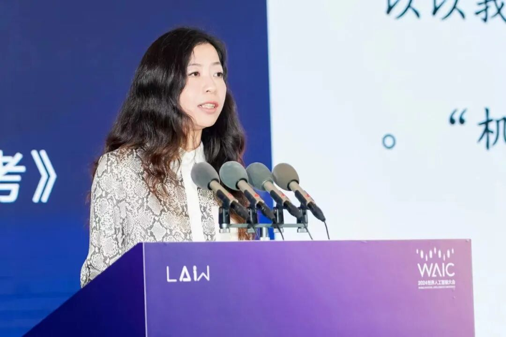
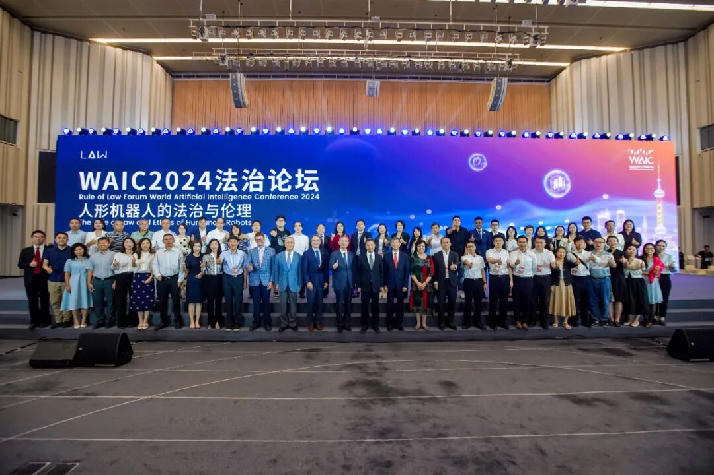

# 邵怡蕾院长出席2024WAIC法治论坛并作题为《从科幻到现实：人形机器人带来的法律思考》的报告

> **作者**: 邵怡蕾
> **发布日期**: 2024年7月24日 19:25
> **来源**: [原文链接](https://mp.weixin.qq.com/s/sKXwMp3SOKbguj72Lhl0GQ)

---

*7月6日上午，华东师范大学上海人工智能金融学院院长邵怡蕾教授应邀出席参加以“人形机器人的法治与伦理”为主题的2024WAIC世界人工智能大会法治论坛，作题为《从科幻到现实：人形机器人带来的法律思考》的演讲报告。以下为演讲原文。*

2023年以来，我们看到了生成式人工智能体的出现，它挑战了人存在的所有条件，包括生命本身，诞生性和有死性，以及我们生活的这个世界。我们的科学家创造出了一种前所未有的人造物-ChatGPT，这种人造物可以用我们的语言和我们交流。长久以来，科学届定义人的智能三大模块主要是感知智能、认知智能和行为智能，而现在我们已经发明出具有感知智能和认知智能的机器，尚未“够到”的人类智能模块就是行为智能。如果人形机器人在行为智能领域发展迅速的话，完整意义上的机器智能就能落地，出现在我们的物理世界，这对我们将是一个非常大的冲击。所以，我们现在要考虑如何面对这样的趋势，有哪些伦理与法律性的问题亟需关注。  

当机器人来到我们的世界，首当其冲的问题是来自于身份与法律的挑战：机器人是否应该被赋予法律人格？在法律上，我们到底应该如何定义机器人？第二个重要的问题是责任归属：当机器人对人造成伤害的时候，如何认定责任主体？是设计者、制造者、所有者还是使用者来承担责任？同时，隐私和数据保护对于我们作为一个人的认知是非常重要的，所以在人形机器人商用场景中，机器人收集和处理数据的法律规定能否保护个人隐私和数据安全也是需要考虑的问题。

进一步地，当我们越来越多地和机器人进行互动，我们原来社会的负荷能力也会受到非常多的挑战：在人形机器人的设计和使用中，我们应该用什么样的伦理标准？阿西莫夫的三大法则是否仍旧适用？除此之外，人形机器人是否被视为人类的同类，我们如何看待和处理人对机器人的感情投射？当然还有人形机器人与人类在互动中的偏见等伦理考量，以及国际社会聚焦热议的如何控制AI风险的议题等。

在这里，我想说的是，其实不妨从金融领域中寻找一些思路、获得一些启发。在金融领域，所有的金融产品都有风险，金融市场集聚各种风险产品，但这并不影响它被规范在风险总体可控的区间内。金融市场在过去的几十年中，面对百万亿级的风险敞口，只出现过极少数金融危机，即使在金融危机的情况下，也有响应的风险缓解措施。所以，人工智能的风险控制是否可以从金融领域中获得借鉴，这是我们现在需要做的一项非常重要的研究。

在智能管理和金融管理中，最为重要的分别是智能产品与资金，对监管者而言，我们希望智能产品或资金流向它“应该”流向的地方，我们希望把人形机器人的设计和使用控制在安全健康的范围内，这就需要进一步廓清推动科技向善、智能向善的角色。我们需要考虑的是：社会科学能为人工智能做什么？我们不能旁观人工智能的发展，需要构建“爸爸”的角色，以及更有社会和情感能力的“妈妈”的角色，需要思考能否“教会”人形机器人如何和人类相处以及如何在社会运行中更自洽。

基于此，我们需要关注机器人的法律主体性，明确机器人造成损害时设计者、制造者、所有者与使用者的责任划分，完善机器人收集与处理数据的法律规定，强调人形机器人设计与使用中的尊重、无伤害、公正等基本伦理原则，审慎对待人形机器人是否应被视为人类的同伴以及人类对机器人产生情感依赖等伦理问题，充分考虑机器人对就业市场的影响并避免机器人与人类互动中可能产生的性别、种族偏见等，构建更适配的制度环境，不仅有父爱主义的监管，也有慈母般包容审慎的促进。  

注：官方发布自上海市法学会东方法学公众号

