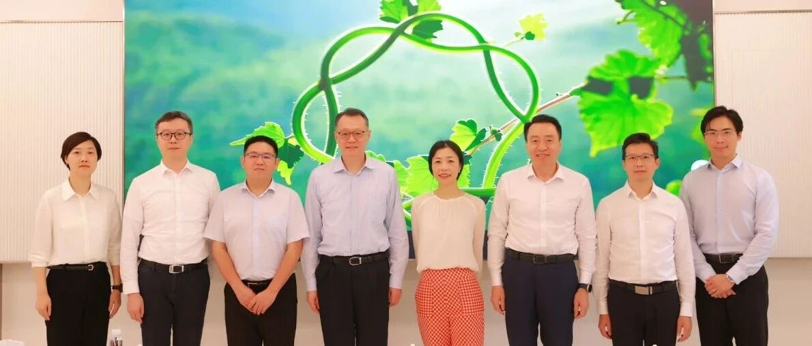
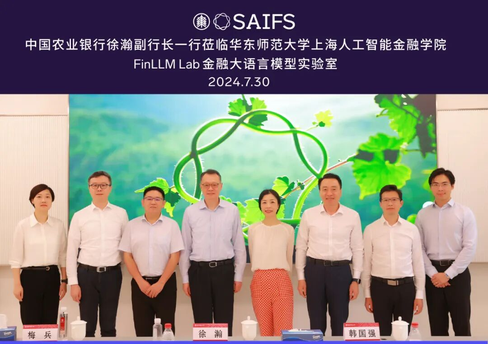
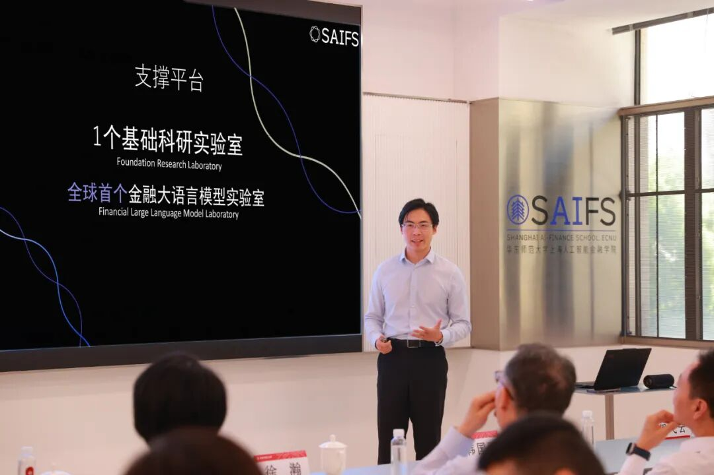
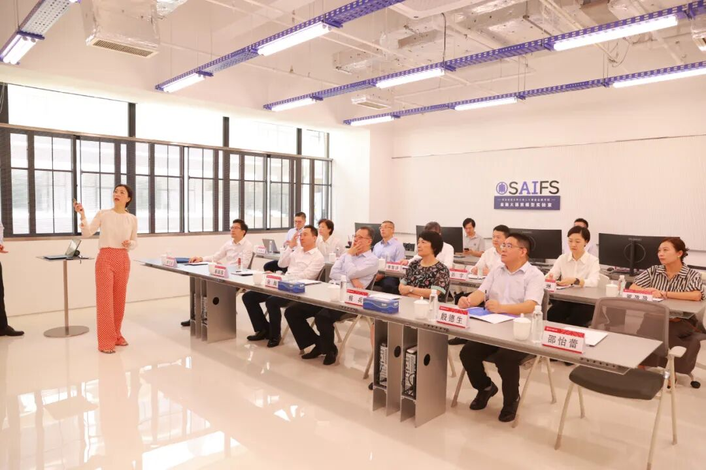
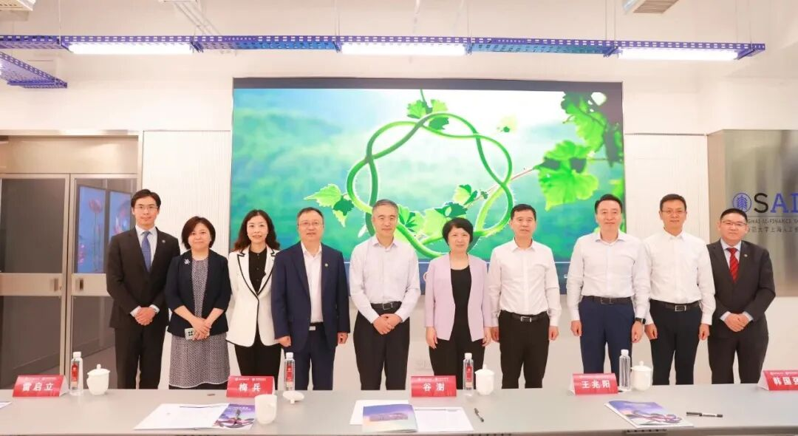

# 中国农业银行总行副行长徐瀚一行调研SAIFS金融大语言模型实验室

> **作者**: SAIFS
> **发布日期**: 2024年7月31日 17:30
> **来源**: [原文链接](https://mp.weixin.qq.com/s/tgL5C-kwmIxcMyJfWSNaew)

---

  

  

  

7月30日上午，中国农业银行总行副行长徐瀚，中国农业银行上海分行行长韩国强一行调研华东师范大学上海人工智能金融学院金融大语言模型实验室（FinLLM Lab）。华东师范大学党委书记梅兵，经济与管理学院院长殷德生，上海人工智能金融学院院长邵怡蕾、院长助理汤傲成出席并陪同总行徐瀚副行长一行调研。

  

‍

邵怡蕾院长介绍学院规划和实验室建设

  

首先，智金院邵怡蕾院长向徐瀚副行长一行介绍学院的建设规划。据邵怡蕾院长介绍，学院将设置人工智能金融专业硕士、人工智能金融MBA及博士项目，项目预计将于2024年9月开启试点，2025年正式启动。智金院作为全球首家专注于人工智能与金融跨界教育和研究的机构，课程涵盖人工智能及大语言模型通识课、机器学习/神经网络基础、人工智能在金融中的应用、金融大语言模型（FinLLM）实验室工作坊、人工智能的社会经济与伦理影响、人工智能技术在金融中的合规管理、人工智能领导力与变革管理等内容，全面提升学生在人工智能时代的创新与创业的综合能力。

  

在研究中心建设方面，学院将设立AI-Fin和AI-PPE两个研究中心，致力于推进人工智能在金融及全球哲学-政治学-经济学的研究和应用。

  

智金院助理研究员汪俊霖介绍金融智能体AI Jason

  

  

随后，智金院助理研究员汪俊霖向徐瀚副行长一行介绍了SAIFS研发的全球领先的金融垂类大语言模型，以及金融智能体AI Jason。AI Jason被赋予了专业金融人士的思维模式，凭借其金融理解、洞察、表现力、逻辑及数据五大优势，能有效支持金融分析、风险管理和客户洞察等工作。邵怡蕾院长与汪俊霖进一步解析AI Jason的革新技术路径及其三大核心技术优势，并深入阐述AI Jason如何以小而美的方式精准切入关键业务节点，解决通用大语言模型的幻觉问题，以可信、安全的方式赋能大型金融机构的各项场景。

  

徐瀚副行长一行与邵怡蕾院长相互交流意见

  

‍‍‍‍在调研的尾声，徐瀚副行长对实验室的建设和规划发展方向给予了高度肯定。他指出，人工智能在金融领域的应用正在迅速扩展，将为人类的生产和生活带来显著的创新与变革。在交流过程中，他肯定了AI Jason在金融分析、风险管理和客户洞察方面的潜力，同时鼓励实验室未来通过结合金融逻辑和大模型应用，实现更高效的金融分析和预测。他还就实验室的阶段性成果进行了深入交流，并分享了大型商业银行以及金融机构在智能化发展、业务效率和竞争力提升、数据安全和隐私保护等方面的经验和未来展望。

  

  

  

  

  

  

‍

参观陈彪如学术成就陈列室

  

实验室调研之前，邵怡蕾院长陪同徐瀚副行长一行参观了陈彪如学术成就陈列室和华东师范大学上海人工智能金融学院。

  

图文：华东师范大学上海人工智能金融学院、经济与管理学院

  

SAIFS最新动态：

[中国农业银行董事长谷澍一行调研智金院金融大语言模型实验室](http://mp.weixin.qq.com/s?__biz=MzkxMTY1ODk2Mw==&mid=2247484312&idx=1&sn=2244d80efcf15b71678445b46bb418bf&chksm=c1199924f66e10321e05cba504e8d1cbb58bd899f3d49379bd604107aa8390b156f60845b952&scene=21#wechat_redirect)  

[邵怡蕾院长出席2024WAIC法治论坛并作题为《从科幻到现实：人形机器人带来的法律思考》的报告](http://mp.weixin.qq.com/s?__biz=MzkxMTY1ODk2Mw==&mid=2247485560&idx=1&sn=9f430a455310ff7ad182d854fdb00f23&chksm=c11992c4f66e1bd23b33d2280e24e8b73027cf1d622c0b09b779edf59bade807c2bf9dc82e4b&scene=21#wechat_redirect)

  

