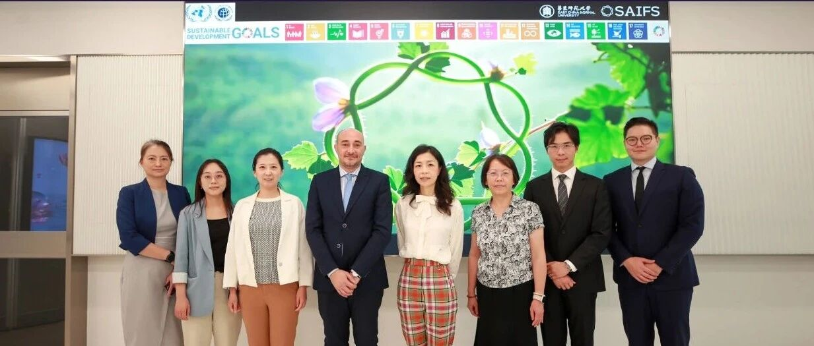
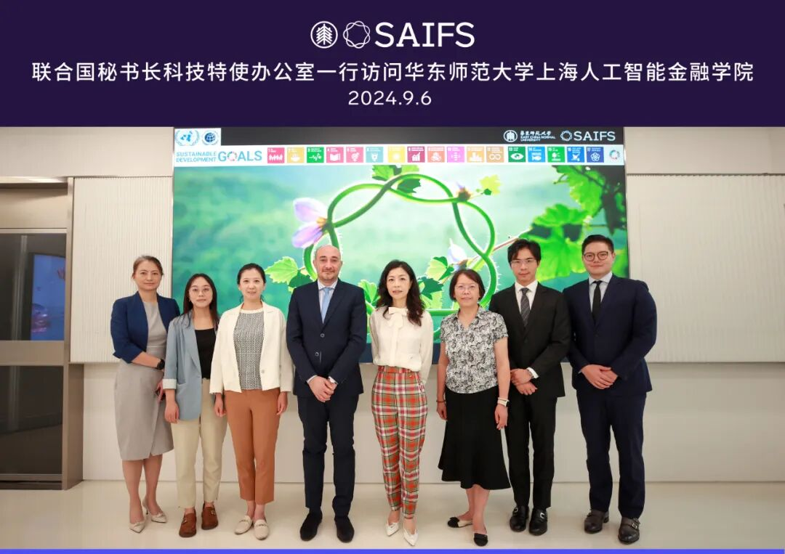
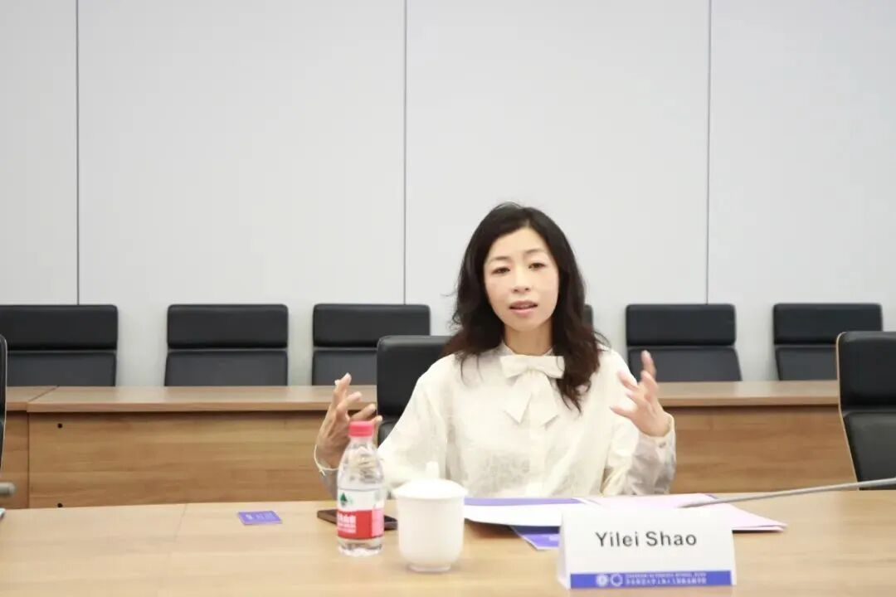
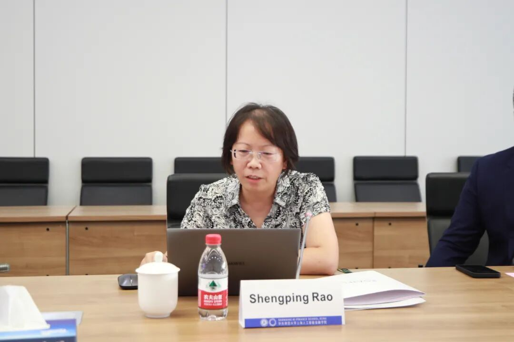
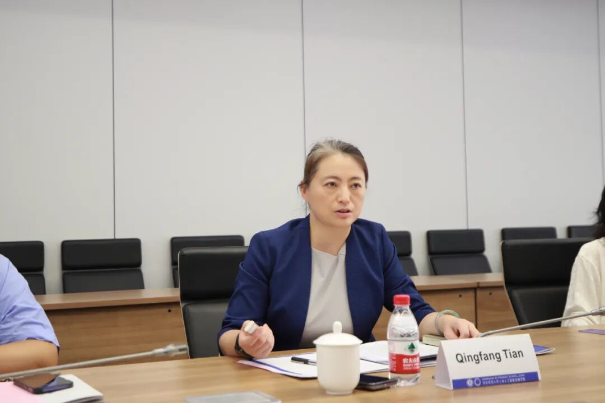
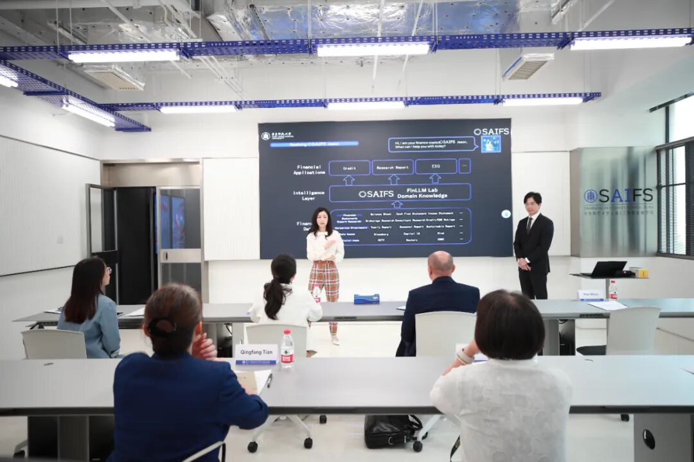
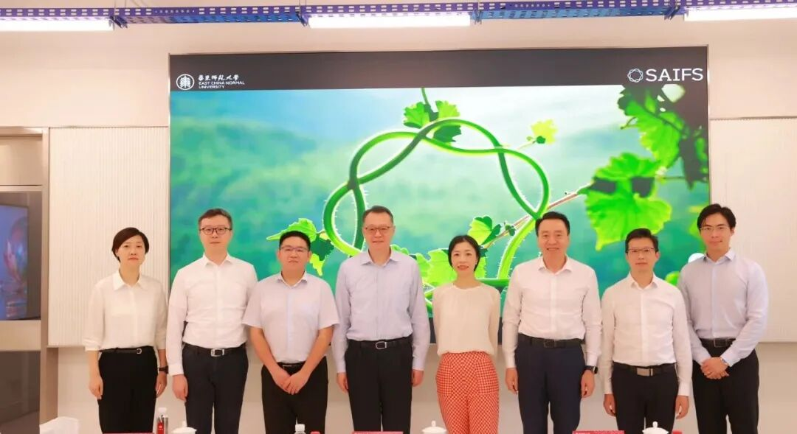
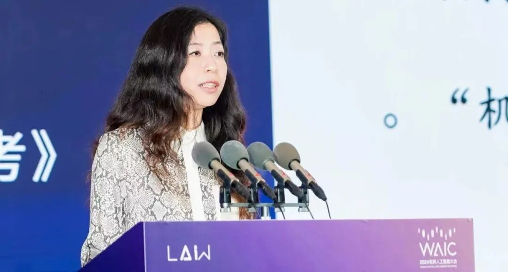

# 联合国秘书长科技特使办公室和联合国全球契约组织在华联络办公室一行访问智金院

> **作者**: SAIFS
> **发布日期**: 2024年9月10日 17:00
> **来源**: [原文链接](https://mp.weixin.qq.com/s/H5lmtSfLme6J6Jj4_rYE_w)

---

  

  

  

9月6日上午，联合国秘书长科技特使办公室人工智能和数字化转型高级顾问Mehdi Snène博士、联合国全球契约组织亚太区总代表刘萌女士等人一行访问华东师范大学上海人工智能金融学院，并参观金融大语言模型实验室FinLLM Lab。智金院院长邵怡蕾、华东师大科技处副处长饶昇苹、国际合作与交流处副处长田庆芳出席会议并发言。会议由智金院院长助理汤傲成主持。

  

‍

邵怡蕾院长介绍学院规划、科研合作以及“AI在华师大”计划

  

首先，智金院院长邵怡蕾向来访人员一行介绍学院是全球首家围绕人工智能与金融跨界交叉打造的教育和研究机构。她强调，学院致力于培养兼具金融知识、人工智能技术和实践经验的人工智能金融AI-Fin领军人才，并推动人工智能在金融领域的创新应用，助力AI-Fin行业发展。

  

邵怡蕾院长重点介绍了学院的学位项目规划、研究中心建设、政产学研合作以及AI-Fin创新应用实践的进展。同时，她简要介绍了“AI在华师大”的计划，并与来访人员就人工智能技术在公共金融领域的应用前景、如何助力联合国推动全球，特别是南方国家的人工智能科技能力建设，以及如何更好地支持联合国可持续发展目标等议题进行了深入的交流。

  

饶昇苹副处长介绍学校相关人工智能金融领域的工作情况

  

华东师大科技处副处长饶昇苹围绕“项目、机构、讨论、进展、挑战”五个关键词，详细介绍了学校在人工智能赋能、跨学科平台建设以及人工智能金融领域的工作情况。她向来访人员分享了学校在学科交叉融合方面所做的探索，以及为支持国家金融高质量发展和上海国际金融中心建设所付出的努力和贡献。

  

  

华东师

田庆芳副处长介绍学校国际合作伙伴以及EduChat平台建设

  

‍‍华东师大国际合作与交流处副处长田庆芳重点介绍了华东师大的国际交流愿景、全球合作伙伴网络以及EduChat平台的建设情况。她表示，学校将在人工智能金融领域，秉承合作、开放、互利的理念，与全球伙伴展开深入合作，共同推动该领域的发展。

‍

  

  

  

‍

Mehdi Snène博士讲话

  

在双方交流环节，联合国秘书长科技特使办公室人工智能与数字化转型高级顾问Mehdi Snène博士高度评价了华东师大及智金院在推动全球合作方面的努力，并对智金院在人工智能与金融领域的教学和科研跨界合作留下了深刻印象。他指出，为防止出现人工智能鸿沟，联合国秘书长科技特使办公室正在全球范围内积极推动建立完善的人工智能能力发展网络，以支持和促进全球人工智能能力建设。他强调，在公共金融领域，人工智能与金融的结合既具有巨大的潜力，也面临数据安全、算法偏见和可持续性等一系列挑战，而应对这些挑战需要全球范围内的合作，包括高校、研究机构、企业和政府等单位的广泛参与，共同加快人工智能发展的步伐。

  

来访人员一行参观金融大语言模型实验室FinLLM Lab

  

会议尾声，来访人员一行参观了金融大语言模型实验室FinLLM Lab，智金院助理研究员汪俊霖向来访人员介绍了学院全球领先的金融垂类大语言模型、金融智能体AI Jason，并通过现场演示，生动展示了其在绿色投资、绿色债券、普惠贷款和普惠教育等领域的应用潜力。

  

图文：华东师范大学上海人工智能金融学院、经济与管理学院

  

SAIFS最新动态：

[中国农业银行总行副行长徐瀚一行调研SAIFS金融大语言模型实验室](http://mp.weixin.qq.com/s?__biz=MzkxMTY1ODk2Mw==&mid=2247485588&idx=1&sn=c79403342d23a1fa38b7ba1eb1a3685f&chksm=c1199228f66e1b3e27d852e9a39af7fb258b76ddf75e5a9a8e99d215cc6bf56ad836ccafcdbb&scene=21#wechat_redirect)  

[邵怡蕾院长出席2024WAIC法治论坛并作题为《从科幻到现实：人形机器人带来的法律思考》的报告](http://mp.weixin.qq.com/s?__biz=MzkxMTY1ODk2Mw==&mid=2247485560&idx=1&sn=9f430a455310ff7ad182d854fdb00f23&chksm=c11992c4f66e1bd23b33d2280e24e8b73027cf1d622c0b09b779edf59bade807c2bf9dc82e4b&scene=21#wechat_redirect)

  

