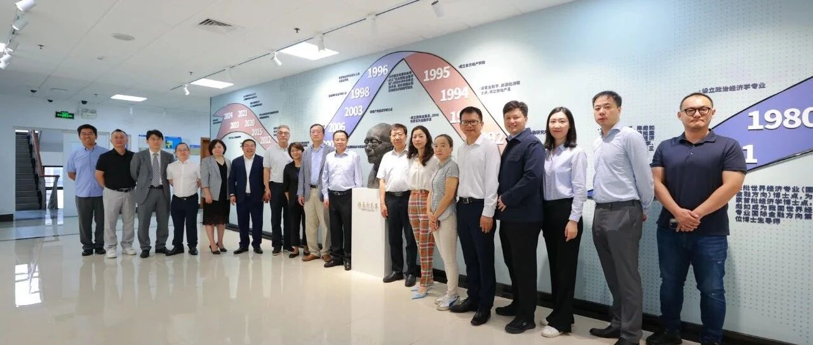
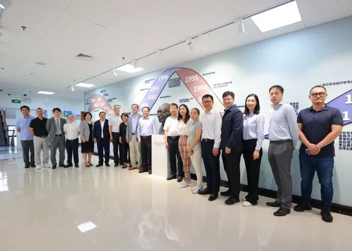
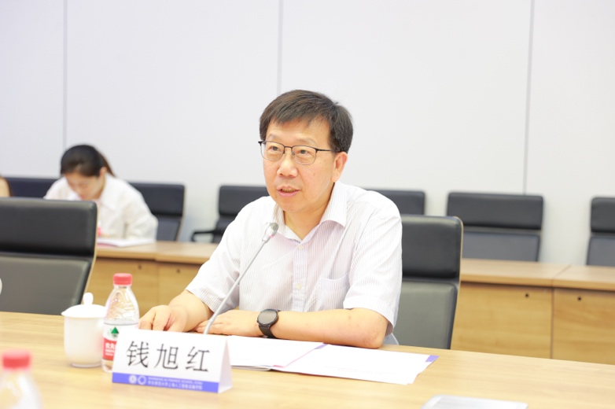
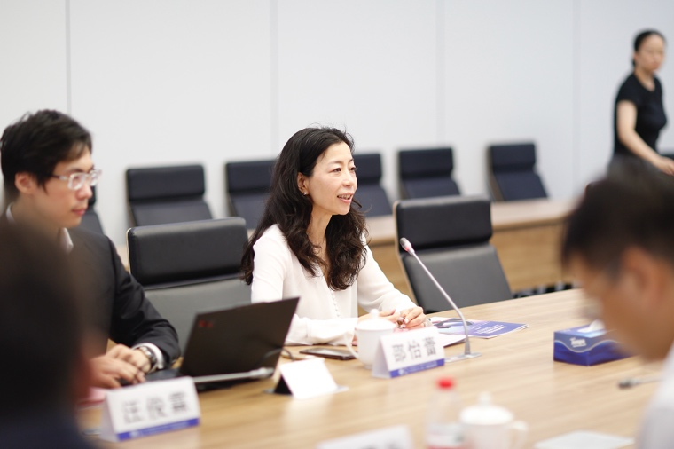
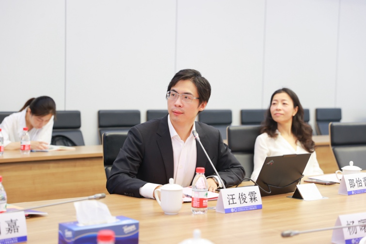
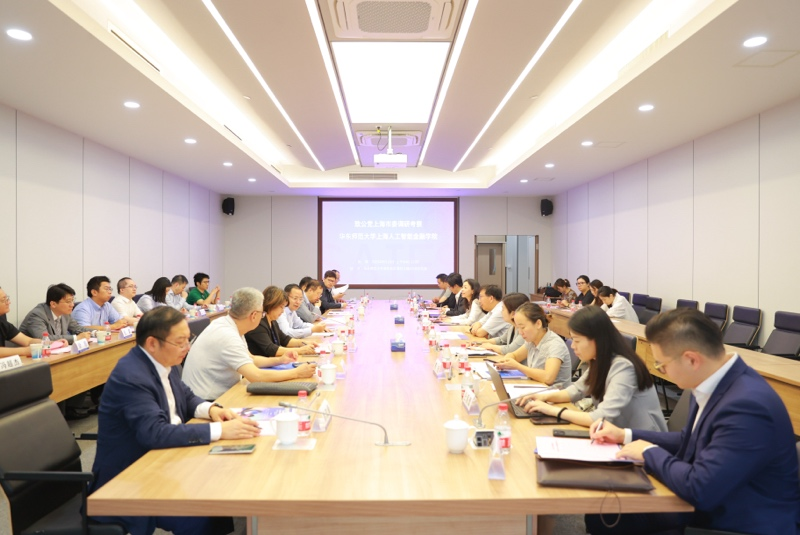
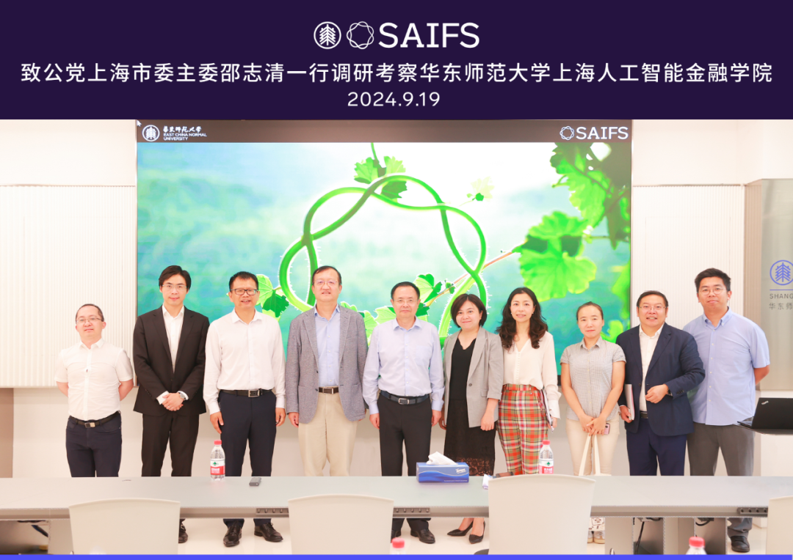

# 全国政协委员、上海市政协副主席、致公党上海市委主委邵志清一行调研考察智金院

> **作者**: SAIFS
> **发布日期**: 2024年9月20日 17:04
> **来源**: [原文链接](https://mp.weixin.qq.com/s/Iks1xfOwjU8nVddRgEMyiA)

---

  

致公党上海市委一行莅临智金院

  

  

  

全球金融科技中心建设是促进上海国际金融中心和科技创新中心双向赋能、增强上海国际金融中心竞争力和影响力的重要着力点。上海市人民政府于9月4日发布《上海高质量推进全球金融科技中心建设行动方案》，明确提出要把握金融科技迭代创新机遇，充分发挥科技赋能金融创新的乘数效应，更好服务现代金融体系安全可控发展需求，高质量推进上海金融科技中心建设，力争用3至5年把上海打造成为具有全球引领性的金融科技中心。为贯彻落实该行动方案，上海市积极探索金融科技创新融合模式。9月19日上午，致公党上海市委一行莅临华东师范大学上海人工智能金融学院，就金融科技发展前沿问题开展深入调研。

  

全国政协委员、上海市政协副主席、致公党上海市委主委邵志清，上海市政协致公党界别委员、原致公党上海市委专职副主委马进，上海市政协常委、致公党上海市委金融委主任、上海国金投资有限公司总裁王俊等致公党党员一行出席会议并讲话。华东师范大学校长、中国工程院院士钱旭红，校党委常委、统战部部长兼学校办公室主任张惠虹，上海人工智能金融学院院长邵怡蕾，致公党华东师范大学委员会副主委、教授、博士生导师陈珉等陪同调研。会议由上海人工智能金融学院院长助理汤傲成主持。

  

华东师范大学校长、中国工程院院士钱旭红讲话

  

华东师范大学校长、中国工程院院士钱旭红在致辞中回顾了著名经济学家陈彪如先生为我国南方国际金融中心建设所作出的卓越贡献。他指出，陈彪如先生曾在华东师范大学率先开创了国际金融学，为我国金融教育事业奠定了坚实基础。如今，随着金融行业面临数字化转型的挑战，科技与金融的深度融合已成为大势所趋。如何将“智能+”理念贯穿金融全领域，实现两者的创新突破，满足社会发展的新需求，推动金融学科的革新，并提升金融服务水平，是当前亟待解决的重要课题。智金院在今年5月31日的成立揭牌，标志着学校在“智能+”金融领域迈出了坚实的一步。‍

  

全国政协委员、上海市政协副主席、致公党上海市委

主委邵志清讲话

  

全国政协委员、上海市政协副主席、致公党上海市委主委邵志清在致辞中强调，上海作为国际现代化金融中心，打造功能完备的科技创新产业对于实现“五大中心”建设目标至关重要。他提出，构建“教育、科技、人才”三位一体的发展模式，将有力推动金融产业实现从信息化向智能化的跃升。邵志清同时指出，人工智能的发展必须紧密结合实际应用场景。他认为，智金院未来应通过大量实践，推动教育与科研的深度融合，为金融领域培养更多高层次人才，并搭建产学研一体化创新平台，加速人工智能技术在金融领域的应用落地。

  

智金院院长邵怡蕾介绍学院建设情况

  

智金院院长邵怡蕾向致公党来访一行介绍了SAIFS首届学术年会的成果、实验室建设、科研工作情况、“政产学研用”合作进展以及学位项目筹建等情况。她强调，人工智能金融作为一门新兴的交叉学科，不仅推动了科技与金融的深度融合，还为金融机构提供了降本增效的解决方案。智金院正积极与本地金融机构合作共建金融科技联合实验室，致力金融科技与科技金融的联通与融合，为双中心的发展提供坚实支撑。

  

致公党党员、智金院助理研究员汪俊霖

作科研成果展示

  

致公党党员、智金院助理研究员汪俊霖作科研成果展示，智金院通过构建对公信贷助理、金融风控系统和全量金融数据池三大核心场景，形成了一个有机的生态系统，彼此支持、协同迭代，可以在确保数据安全性和准确性的同时，有效加快对公信贷的审批速度，提高风险收益比，通过科技赋能提升金融效率、能力和水平，并可提供新兴科技行业的全量数据支持，对科技创新企业提供定制化的融资策略，助力金融资源有效的配置服务于科创中心的建设中。

  

与会人员进行深入交流

  

与会人员围绕学科交叉研究、科研拓展方向、数据安全、人才培养等内容开展深入交流，并为智金院的建设发展提出真知灼见。

  

在会议总结环节，邵志清主委指出，发展金融产业离不开技术、资金和人才三大要素。他强调，在科研发展过程中，把握“准、全、快”三者之间的平衡关系对科研创新至关重要。尤其是在金融科技快速发展的当下，如何将金融科技与科技金融深度融合，是科研创新的关键。他鼓励智金院青年研究员不断探索未知领域，抓住机遇，抢占科研的制高点。同时，在保证科研质量的前提下，提高研究效率，从而更有力地推动金融科技创新迭代。

  

参观金融大语言模型实验室FinLLM Lab

  

会议尾声，致公党来访一行参观了金融大语言模型实验室FinLLM Lab。

  

图文｜华东师范大学上海人工智能金融学院、

经济与管理学院