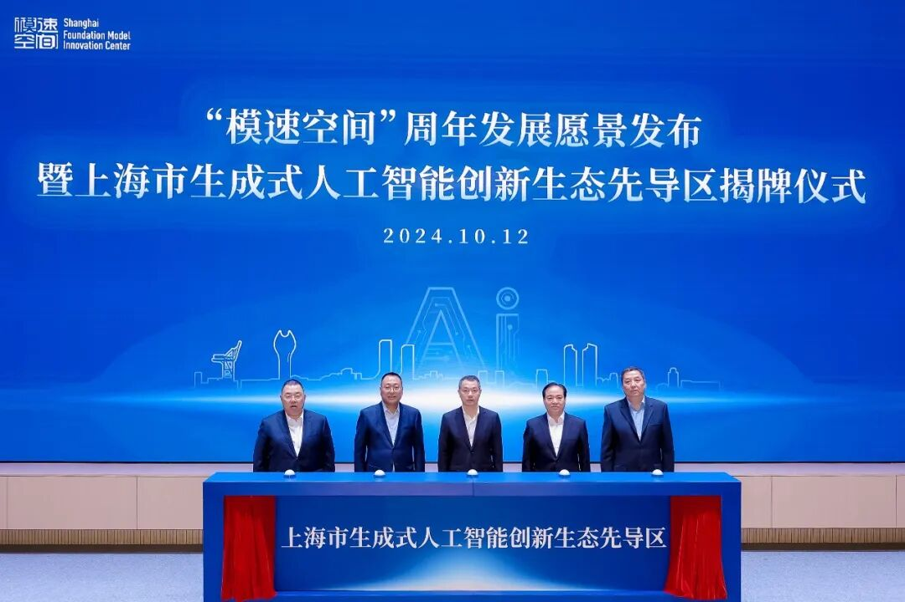
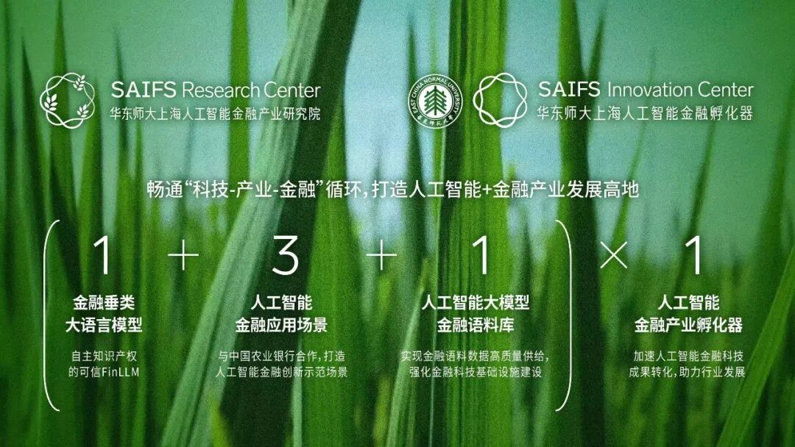
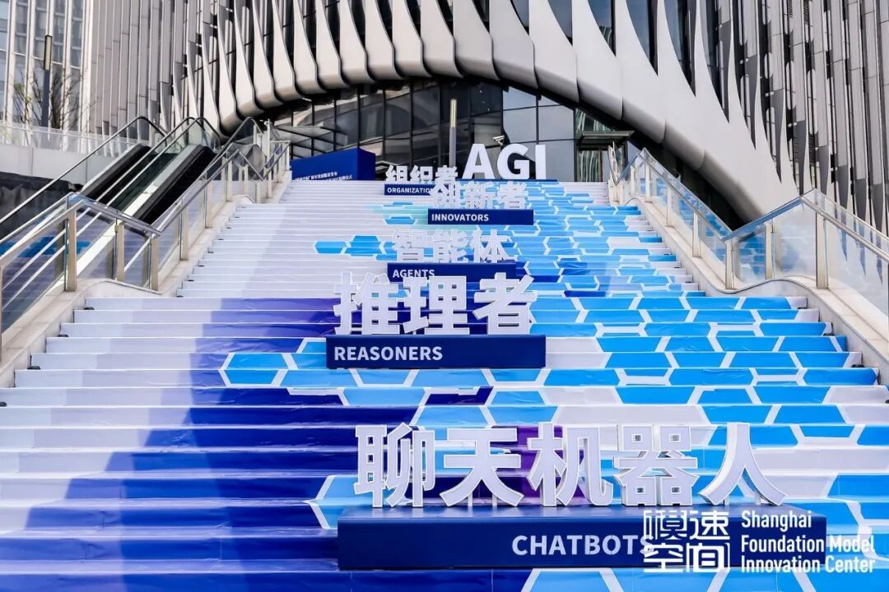
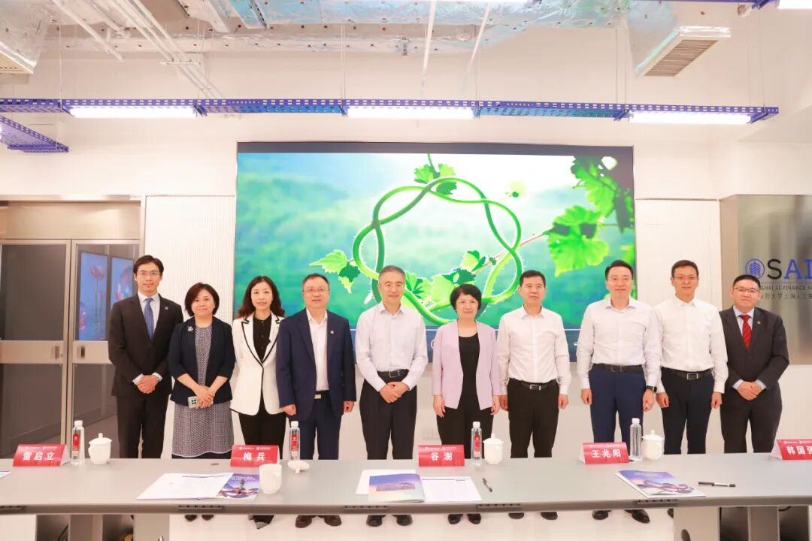

# 华东师范大学上海人工智能金融产业研究院暨孵化器在徐汇启动，为金融科技创新注入新动能!

> **作者**: 
> **发布日期**: 2024年10月14日 17:45
> **来源**: [原文链接](https://mp.weixin.qq.com/s/SR1Q_U6naNbtcV-Ka7st3Q)

---

  

  

华东师范大学

上海人工智能金融产业研究院的设立

旨在**畅通“科技-产业-金融”循环**

**打造人工智能**

**与金融产业融合发展的新高地**

不仅标志着**区校合作**和**产业转化能力**

迈上了新的台阶

更是华东师大助力徐汇区

人工智能金融产业

快速发展的一项关键举措

  

“上海市生成式人工智能创新生态先导区”揭牌

  

**10月12日上午，“模速空间”周年发展愿景发布暨上海市生成式人工智能创新生态先导区揭牌仪式**在徐汇西岸模速空间隆重举办。

  

上海市副市长陈杰，市政府副秘书长庄木弟，徐汇区委书记曹立强，徐汇区委副书记、区长王华，市经济信息化委副主任、一级巡视员戎之勤，上海国有资本投资有限公司党委书记、董事长袁国华出席仪式。市委网信办等部门及徐汇区政府相关负责同志出席。我校党委副书记孟钟捷受邀出席。

  

仪式上，陈杰、庄木弟、曹立强、戎之勤、袁国华共同为**“上海市生成式人工智能创新生态先导区”**揭牌。仪式上还展示了模速空间一周年发展成果，并发布上海市生成式人工智能创新生态先导区建设愿景。

  

‍

校党委副书记孟钟捷出席徐汇大模型重大合作项目启动仪式

  

**华东师范大学“上海人工智能金融产业研究院”等7个重大合作项目现场启动。**

  

华东师范大学上海人工智能金融产业研究院暨孵化器作为徐汇大模型重大合作项目之一，正式宣布在徐汇启动，孟钟捷代表学校启动项目。

  

华东师范大学上海人工智能金融产业研究院暨孵化器设立宗旨

  

此外，市委网信办等相关部门共同发布上海市首批22个垂类应用示范场景。随后，上海国投公司与徐汇区共同为上海人工智能生态基金揭牌，并与稀宇科技等10家企业代表共同启动战略合作。上海人工智能生态基金是上海国投公司牵头，联合徐汇资本、临港控股、漕河泾总公司等国资平台和米哈游、商汤科技、哔哩哔哩等企业，共同发起设立的基金，基金规模达100亿元。该基金将围绕大模型产业链生态进行重点布局，投资AI基础设施、基础与垂类大模型、下一代端侧AI应用三大细分领域。

  

  

华东师

徐汇“模速空间”街区

  

‍‍华东师范大学上海人工智能金融产业研究院（简称：研究院）的设立旨在**畅通“科技-产业-金融”循环，打造人工智能与金融产业融合发展的新高地**。

‍

  

  

  

‍

徐汇“模速空间”街区

  

华东师范大学上海人工智能金融学院院长邵怡蕾表示，通过与中国农业银行等合作伙伴的紧密协作，研究院将专注于构建一个具有自主知识产权的可信金融垂类大语言模型，打造三个人工智能金融创新示范场景，建立人工智能大模型金融语料库，实现金融语料数据高质量供给，强化金融科技基础设施建设。同时，研究院将成立孵化器，推动人工智能金融技术的落地与推广，加速人工智能金融科技的成果转化，为金融科技创新注入新动能，助力上海国际金融中心增能升级。

  

出席本次活动的嘉宾还包括中国农业银行上海市分行副行长翟冀、上海市分行机构业务部副总经理王轶琳、上海市徐汇支行行长黄晓，华东师范大学科技处主管熊申展等。

  

图文：上海人工智能金融产业研究院

  

SAIFS最新动态：

[中国农业银行董事长谷澍一行调研智金院金融大语言模型实验室](http://mp.weixin.qq.com/s?__biz=MzkxMTY1ODk2Mw==&mid=2247484312&idx=1&sn=2244d80efcf15b71678445b46bb418bf&chksm=c1199924f66e10321e05cba504e8d1cbb58bd899f3d49379bd604107aa8390b156f60845b952&scene=21#wechat_redirect)

[华东师大智金院SAIFS，正式成立！](http://mp.weixin.qq.com/s?__biz=MzkxMTY1ODk2Mw==&mid=2247484110&idx=1&sn=68a39cb3161b24a917f07cf05f927f6b&chksm=c1199872f66e11641dec4137f2823d27590690c33462b8b4fb40add896d45d8571858974713e&scene=21#wechat_redirect)

  

