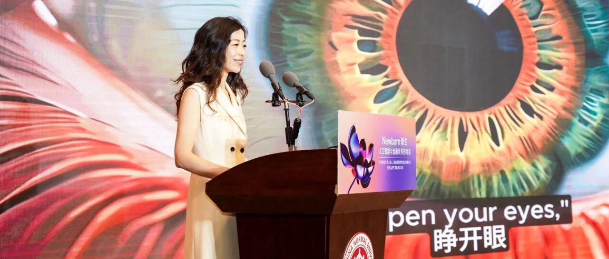
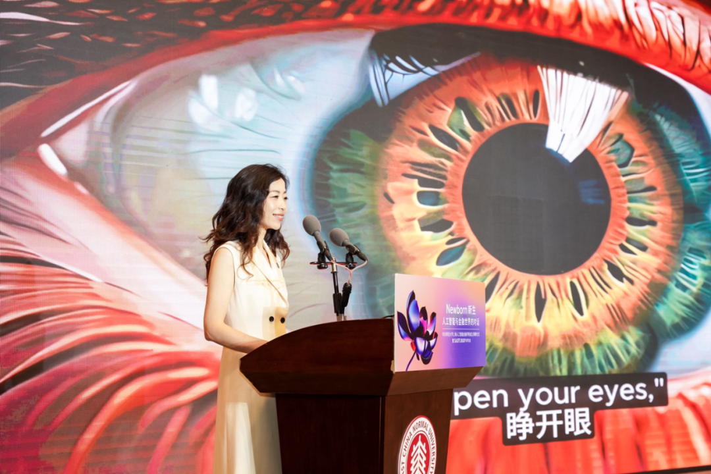

# 智金院院长邵怡蕾教授2025年博士生招生启事

> **作者**: SAIFS
> **发布日期**: 2024年11月29日 18:29
> **来源**: [原文链接](https://mp.weixin.qq.com/s/eH5kSS7c96JDErmFQTb4_A)

---

  

**01**

**智金院院长邵怡蕾教授**

**2025年博士生****招生启事**

  

  

**招生学院：**华东师范大学上海人工智能金融学院

**学科：**（学术学位）金融学

  

**招生研究方向：**（全日制）人工智能金融方向

**招生偏好：**本科为数学、统计或计算机等理工科，硕士为经济学或金融学的复合背景学生优先考虑。

**招生人数：**1人

**招生研究方向：**（全日制）“从知产到资产”，教育科技人才一体化研究

**招生偏好：**本科为数学、统计或计算机等理工科，硕士为经济学、金融学、教育学或知识产权的复合背景学生优先考虑。

**招生人数：**1人

**02**

**导师简介**

  

  

**邵怡蕾教授**

**华东师大上海人工智能金融学院创院院长**

**华东师大上海人工智能金融产业研究院和创新院院长**

**联合国大学-华东师大人工智能金融联合研究中心主任（筹）**

邵怡蕾，教授，毕业于美国普林斯顿大学，2007年获得计算机科学博士学位，博士期间主要研究方向为大数据分析和人工智能领域。她于2012年度入选“上海市浦江人才”，2014年入选“上海海外高层次人才”，引进回上海。2023年12月，邵怡蕾教授成为华东师范大学上海人工智能金融学院（简称：智金院SAIFS）的创院院长，全新打造SAIFS。智金院是全球首家以人工智能与金融跨界交叉为核心打造的教育与研究机构，学院在战略、教学、科研以及人才培养等方面将深度融合AI的思维与工具，探索与AI一起成长的道路。邵怡蕾教授还曾在2021至2023年担任国际人工智能联合会IJCAI（International Joint Conferences of Artificial Intelligence）中国办公室秘书长，她也是前纽约高盛（Goldman Sachs) 银行家。

  

**联系方式****：**yileishao@sem.ecnu.edu.cn

  

  

[对话智金院SAIFS创院院长邵怡蕾：](https://mp.weixin.qq.com/s?__biz=MzkxMTY1ODk2Mw==&mid=2247484255&idx=1&sn=1b5a38a9d4e7c856f982f9bd72301fc1&scene=21#wechat_redirect)

[AI时代，人文见长的学校会非常有优势](https://mp.weixin.qq.com/s?__biz=MzkxMTY1ODk2Mw==&mid=2247484255&idx=1&sn=1b5a38a9d4e7c856f982f9bd72301fc1&scene=21#wechat_redirect)  

  

**(一)近期参与的学术会议：**

\- 2024年4月25日，邵怡蕾教授应邀出席联合国大学澳门分校举办的**2024联合国大学人工智能国际会议（UNU Macau AI Conference 2024）**。作为**“亚太地区的生成式人工智能治理与法律”（Gen AI Governance and Law in the Asia-Pacific Region）分论坛的主席**，与来自中外的6位人工智能、工程学、政治-经济-哲学、法学以及区域研究等领域的知名专家共同探讨了国际上领先的生成式人工智能发展的治理与法律构建路径。

\- 2024年7月5日，邵怡蕾教授出席**2024世界人工智能大会WAIC**中上海市社会科学界联合会主办的 [**“人工智能新进展与社会科学的未来” 论坛**](https://mp.weixin.qq.com/s?__biz=MzkwNzM5OTYyOA==&mid=2247494199&idx=1&sn=2a912da2be5051d9a3ed1c45aab20053&scene=21#wechat_redirect)，并与5位来自国内外的政治学、科学-技术-社会学（STS）、伦理学和量子社会学领域的学者共同参与 “智能时代：社会科学何为？” 的主题讨论。在讨论中，邵怡蕾教授充分发挥其跨学科领域的知识优势，深入探讨人工智能与社会科学融合发展的法治规范问题。

\- 2024年7月6日，邵怡蕾教授出席**2024世界人工智能大会WAIC法治论坛**并作题为[**《从科幻到现实：人形机器人带来的法律思考》的主旨报告**](https://mp.weixin.qq.com/s?__biz=MzkxMTY1ODk2Mw==&mid=2247485560&idx=1&sn=9f430a455310ff7ad182d854fdb00f23&scene=21#wechat_redirect)。她在报告中充分指出人性机器人相关的科研学者应充分关注机器人的法律主体性，并在金融领域的风险管理中得到相应借鉴和启示。

\- 2024年7月31日，邵怡蕾教授出席由中国金融四十人论坛（CF40）与美国彼得森国际经济研究所（PIIE）联合主办的**CF40-PIIE中美青年圆桌会议第十八期--“AI变革与治理”专题圆桌的主席**。她与CF40资深研究员、中国证券监督管理委员会原主席肖钢，PIIE高级研究员Martin Chorzempa，以及北京第四范式智能技术股份有限公司总裁胡时伟共同探讨人工智能技术的发展趋势，以及中美两国在AI研发与全球治理领域深化对话与合作的必要性与重要意义。

\- 2024年9月5日，邵怡蕾教授出席**第六届外滩金融大会（Bund Summit）**，并担任[**外滩圆桌“AI全球发展格局与中国身位：方向、差距与前景”的主席**](https://mp.weixin.qq.com/s?__biz=MjM5NjgyNDk4NA==&mid=2686321777&idx=1&sn=156ecdcbc162cee5df21721c40fbb45c&scene=21#wechat_redirect)，与微众银行首席人工智能官杨强，中金公司首席经济学家、中金研究院院长彭文生，科大讯飞联合创始人、未来智能董事长胡郁，智谱AI首席执行官张鹏一同探讨全球AI发展的宏观格局以及中国在全球AI格局中的定位和未来前景方向。

\- 2024年11月14日，邵怡蕾教授应邀出席**2024年中国金鸡百花电影节的金鸡电影论坛·学术论坛**，并发表题为[**《理性地失控：人类主体性与机器创作的交织》的主题演讲**](https://mp.weixin.qq.com/s?__biz=MzkyMTU5MTkxNg==&mid=2247490627&idx=4&sn=b93274cea435a37b44c49fc572b5946f&scene=21#wechat_redirect)。她深入探讨了人类主体性与机器创作在交织与融合中的互动关系，阐释了人机创作的新本体论，并剖析了人类迈入3.0共脑时代所面临的机遇与挑战。

  

**（二）近期学术发表：**

\- “在爱（AI）中：重思AI世的创作”， 《电影艺术》，2023年第3期

\- “生成式人工智能体的世界图景”，《哲学分析》，2024年第3 期

\- “再见智人，再见‘爱人’”，《中国图书评论》，2024年第12期

  

**（三）近期资政成果：**

\- 2024年2月，应上海市教卫党委邀请约稿，撰写**“Sora等人工智能顶尖技术背后团队的组成和特点及对我国该领域人才建设和技术突破的启示”**一文。

\- 2024年4月，受上海市教育委员会的委托，与国家教育宏观政策研究院团队共同撰写**“人工智能高端人才培养情况调研报告”**。

  

**03**

**报名方式**

报名详细流程和截止日期请参考**华东师范大学2025年博士研究生招生简章**(https://www.ecnu.edu.cn/info/1094/68143.htm)。

  

**04**

**智金院介绍**

  

  

**上海人工智能金融学院（简称SAIFS****）****于2023年在华东师范大学成立，是全球首家围绕人工智能与金融跨界交叉打造的教育和研究机构。**SAIFS强调在超越知识点的通识教育的基础上，培养集金融知识、人工智能技术和实践经验于一身的新一代人工智能金融（AI-Fin）领军型卓越人才，并坚持扎根在学术研究的前沿，探索AI在金融中的新应用，驱动AI-Fin的发展。同时，SAIFS致力于与全球的学术机构、金融机构、科技公司和政府部门建立广泛的合作网络，通过推广AI与金融的交叉研究和应用，改善金融服务的效率和质量，为社会创造价值。

**在AI-Fin以外，SAIFS还将打造人工智能金融（AI-Fin）研究中心和人工智能伦理与治理（AI-PPE）研究中心。**人工智能金融研究中心将开发识别、量化、预测和减轻先进人工智能技术应用系统性风险的先进模型，未来将向政府部门和各大金融机构输出关于AI的内控合规理论与研究成果。而AI-PPE研究中心将致力于推进AI时代的全球哲学-政治学-经济学（PPE）思想前沿问题的研究，并打造一套全新的AI4Social Science教学体系重新激活哲学-政治学-经济学服务现代社会的动能。

  

**欢迎报考智金院2025年博士生！**

  

智金院SAIFS金融大语言模型实验室FinLLM Lab

智金院SAIFS近期动态：

  

[华东师范大学上海人工智能金](https://mp.weixin.qq.com/s?__biz=MzkxMTY1ODk2Mw==&mid=2247485675&idx=1&sn=037463bba88840b47f5fce8910001a7b&scene=21#wechat_redirect)[融产业研究院暨孵化器](https://mp.weixin.qq.com/s?__biz=MzkxMTY1ODk2Mw==&mid=2247485675&idx=1&sn=037463bba88840b47f5fce8910001a7b&scene=21#wechat_redirect)

  

[在徐汇启动，为金融科技创新注入新动能!](https://mp.weixin.qq.com/s?__biz=MzkxMTY1ODk2Mw==&mid=2247485675&idx=1&sn=037463bba88840b47f5fce8910001a7b&scene=21#wechat_redirect)

  

  

[华东师大智金院SAIFS，正式成立！](https://mp.weixin.qq.com/s?__biz=MzkxMTY1ODk2Mw==&mid=2247484110&idx=1&sn=68a39cb3161b24a917f07cf05f927f6b&scene=21#wechat_redirect)

  

  

  

图文｜华东师范大学上海人工智能金融学院、经济与管理学院