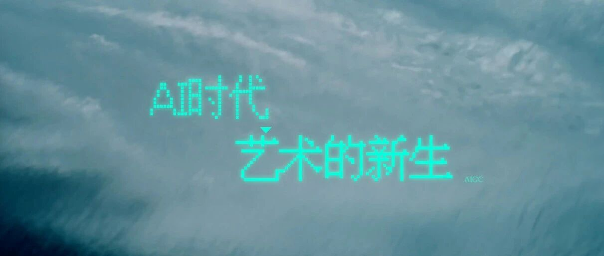

# 人类世界，还有AI闯不进去的领域吗？

> **作者**: 世相君
> **发布日期**: 2024年12月8日 22:48
> **来源**: [原文链接](https://mp.weixin.qq.com/s/XRzwombGxK45lT2Z2rmjeg)

---

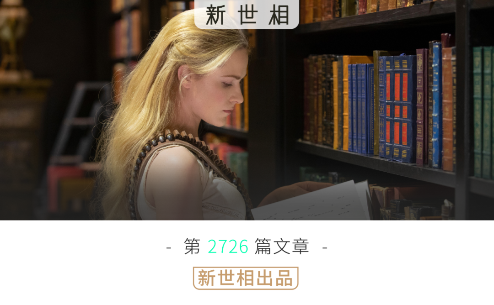

#### ***Sayings：***

如果你看过文章封面图上的这部美剧，大约能猜到，今天我们要聊的是什么。

图片来自美剧《西部世界》。整个故事发生在一个主题乐园中，乐园里的 NPC 都是人工智能机器人，为人类服务，供人类取乐。直到有一天，其中部分机器人开始意识觉醒，决心向人类反抗，夺回自己的“人”生。

这是我们在很多科幻故事里会看到的主题。面对越来越发达，越来越接近于人的 AI 技术，人类的焦虑和恐慌从来没有停止过——

AI 算是智慧生命吗？AI 会取代人吗？

AI 艺术算是艺术吗？AI 会取代艺术吗？

AI 文学算是文学吗？AI 会取代写作吗？

但到了 2024 年，有一个无可争辩的事实已经出现了——**尤其在文化和艺术领域，AI 的创造力已经足以被看作一种独立的存在，具备严肃讨论的价值。**

而我们需要的，是一次正面讨论它的契机。

数月前，为探索人工智能的创新应用，开展跨学科交流，**华东师范大学上海人工智能金融学院主办了“AIGC 之夜：人与 AI 的新生”活动**。

**新世相采访了出席本次活动的 5 位嘉宾，希望与他们了解AI在艺术创作中的角色和影响。他们是——毛尖、邵怡蕾、吴冠军、严锋、王玥婷。**他们将从文学、影像、艺术、科幻、政治学等不同专业视角，共同发起一次关于 AI 与艺术的讨论。我们期待通过讨论和共创，推动艺术在新的时代不断焕发生命力，拓展人类精神对美的享受与追求。

  

  

以下是他们的对话实录：

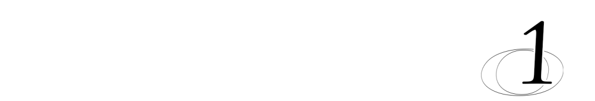

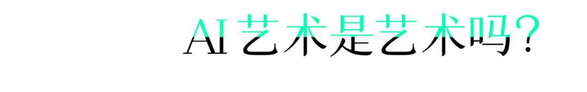

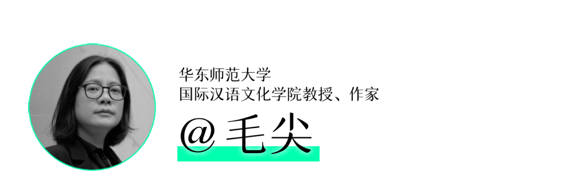

这个问题其实不是问题了。

**如果这个还是问题的话，就说明人类太自我中心主义了。**AI 会有一个作者性产生，这已经不能说只是工具或媒介了。

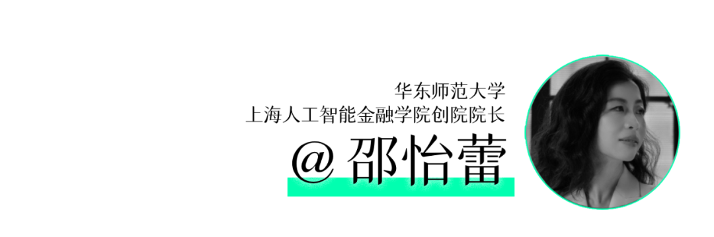

原来我们看见艺术，只是说你今年画了 10 年，美院毕业了。那是你的肌肉时间，但现在你能够把你的思考时间，能够把你整个感受世界（的过程），包括你的经历全部传达在人工智能艺术的作品当中，我觉得这也是非常非常打动人的。

**速成不等于速朽。AI 作品可以是艺术。**

（Sora）就短短的一句话，它得生成 60 秒钟的连贯性的视频。这意味着它对物理世界所有交互的理解。

举个例子，你走在江南小镇上，一片柳叶飞过来，它是直接穿过我身体而去，还是说直接从我肩头“啪”弹开，还是在我肩头轻微地停留 0.2 秒钟，抚摸一下，然后滑下去？如果说它直接穿过我身体，那很恐怖的对吧？一个柳叶直接把你杀死了。

它（AI）是个物理学家吧？它（AI）是个历史学家吧？它（AI）是一个人类学家吧？它（AI）甚至还得知道我们所有的世界的既有的和可能的，甚至不可能的。

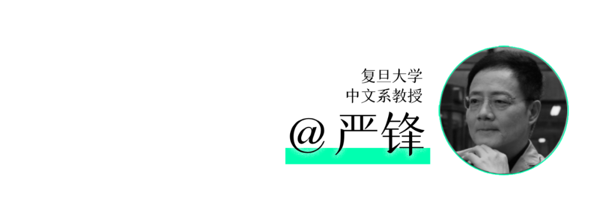

**虚拟是人的一个非常了不起的能力。正是因为人有虚拟的能力，才把我们跟动物区分开来。**

你没有虚拟化能力，你就缺少计划，想象，把世界进行拆散重组。这是什么？这是虚拟化，这也就是艺术，所以艺术它就是虚拟。

我觉得这个过程就从几万年前，我们在自己的洞穴上画了第一个岩画，我觉得这就是虚拟化的一个开始。那么 AI 是这个虚拟化过程当中的最新的一个环节。

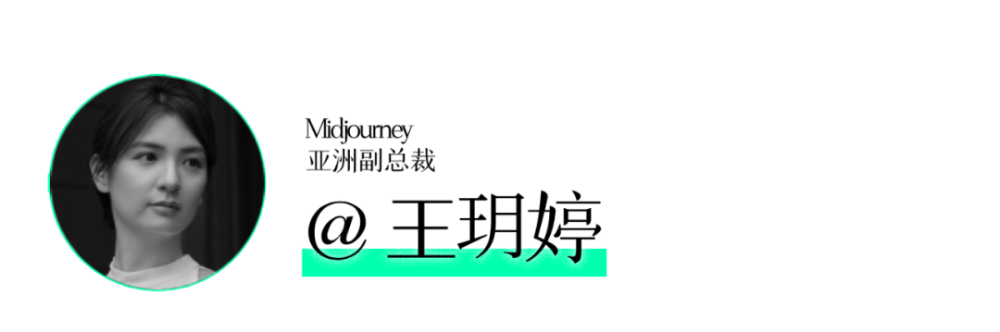

我自己觉得 AI 作品其实是一门艺术了。

因为艺术本来其实就是人类的创造力和想象力，以及人类表达的体现。而 AI 本来就是人类智慧的产物。它的创作同样也可以承载人类的情感，也可以承载人类的思想和美学价值。

所以我认为 AI 无论作为一个工具也好，还是人类创作的伙伴也好也已经是在帮助人类表达自己的内心的想法。

我从来不认为 AI 是个工具。如果它只是一个工具，不会有一个艺术家愿意刷一万张图。它是你的一个 companion，是跟你一起在做创作的人。

很多艺术家都非常有想法的人，但是他的手画不了画，但是 AI 解放了他。我觉得 AI 是一个外化的器官，所以你能够调动它和你成为一个整体去创作。

艺术没有一个定义说，这个艺术是 AI 艺术的标准。艺术的标准是通用的，就是打动人心。所以至于 AI 画的还是人画的，不重要。

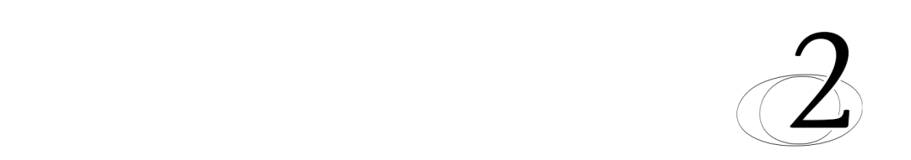

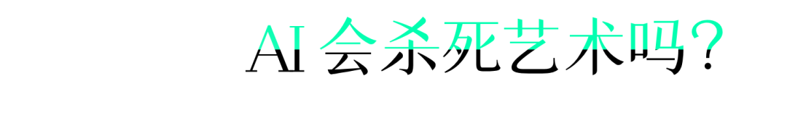

像很多年前，他们也说有声片会杀死艺术，声画同步会杀死艺术，包括彩色电影会杀死艺术，一直是有。艺术是在被杀的过程中越来越强大的。如果没有东西出来杀死艺术的话，那艺术也不会再往前版本更新的。

因为人类有很多东西是 AI 没有具有的。**AI 缺少进入人类幽暗地带的能力。AI相对来说它不知道该怎么犯错误。**

整体来说，因为 AI 是一种敞开性的过程的描述，就这里画一笔，那里画一笔。但是 AI 缺少那种这里不画一笔，那里不画一笔的能力。人类很多时候是那种突然就灵机一动，但 AI 没有这种灵机一动的东西。

**人类有堕落的可能性，但是 AI 没有堕落的可能性。**这个堕落的可能性是非常重要的，因为你只有堕落，才有其他愿望的发生。

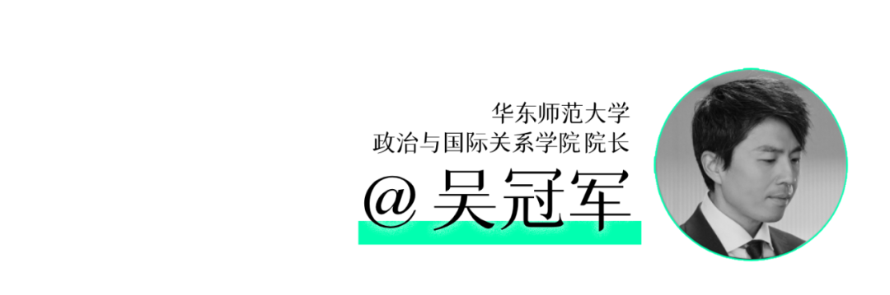

艺术这个词来自于古希腊语，有一个词叫 Poiesis。今天我们的 poetry（诗）就来自它的词根。Poiesis 是什么意思呢？To make. To make something. To make a deference.

所以雅克·朗西埃说，我们人真正的平等不体现在表面的一些话语里面，而是在我们具体的做事和方式上面。当我们还有一种叫艺术家是艺术家，而且排挤 AI 艺术家，这就是一种我们叫做权力的最集中的体现。我们都要做这个努力去平权它。

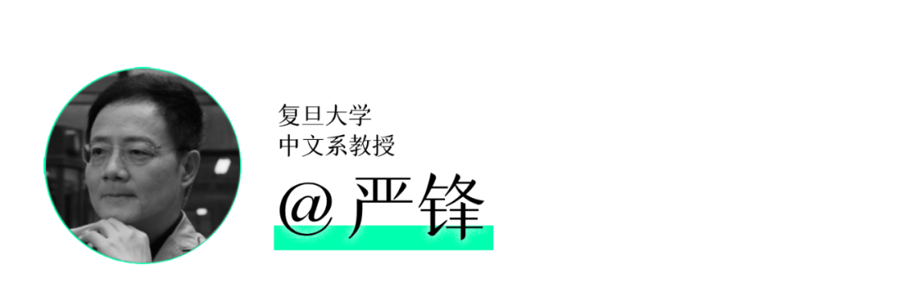

AI 的入局实际上是让我们也可以反过来看艺术史，甚至也是倒逼我们来问这样一个问题：艺术是什么？

我们在说一个什么是不是艺术的时候，其实我们往往有一个固定的模型，而且这个模型可能是非常个人化的，甚至是可能比较狭窄的。但是其实艺术已经远远突破了这些范畴。

尤其是到了 20 世纪以来，艺术的边界在不断地扩大。在新技术新媒介，包括现在 AI 加入之后，艺术疆界被扩张和打破的过程我觉得是被大大加速了。

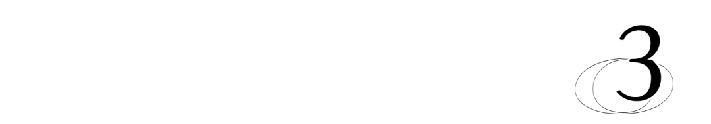

我其实非常欢迎技术进入，和时代缠斗一会。

虽然现在可能 AI 作品还没有那么辉煌，没有那么多的打入肺腑的东西，但是未来我觉得 AI 绝对有智商产生出自己的一个愿望和它自己幽深的东西，来和人类搏斗。

我知道现在很多作家已经开始用 AI 进行头脑风暴。

因为文学说到底就是体验不同的人生，就是虚拟，就不光是只写我知道的东西，我还要写我不知道的东西。那这个时候，AI 真的就是这样的一个宝库。AI 为虚拟化提供了前所未有的一个工具、手段、可能性。

我觉得在 AI 盛行的这样一个年代，人的创作的价值和独特性其实没有被剥离，反而是因为 AI 的加入得到了更大的扩展。AI 艺术也促使人们能够重新去审视和定义什么是艺术，什么是创造力的概念，也推动艺术进入一个新的时代。

AI 它是一个新的一个推力，一个新的玩家。入局了，但这个局早就开始了。

我也不知道未来艺术会是怎么样，AI 艺术会是怎么样。但是我还是希望艺术正如同它曾经的那样，是文明的一个纽带，一种基石，让我们能够生活在一个现实里面，让我们能互相看见，互相听见，能够相互地共情。

我们说到未来，其实未来本身是不可想象的。想象追问的是“can be”，不是“be”。

所以如果说未来真的有什么最最美好的事情，它不是你想象的内容，而是想象本身。

  

 **创造力的源头，**

 **永远是人本身 。**

****↓**↓**↓********

  

“AIGC之夜：人与AI的新生”活动相关报道：  

  

******[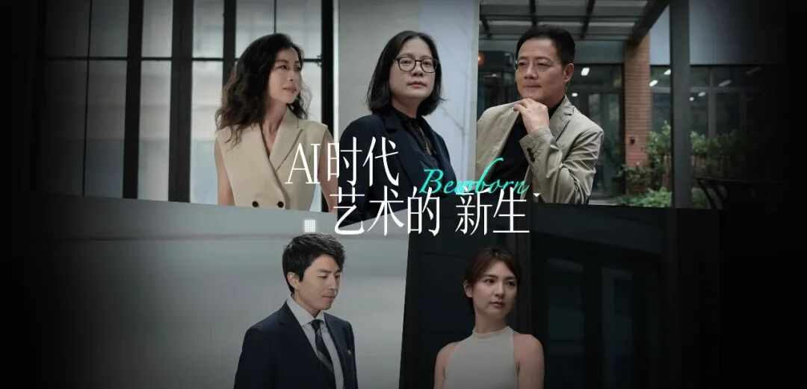](https://mp.weixin.qq.com/s?__biz=MzkxMTY1ODk2Mw==&mid=2247484226&idx=1&sn=4893e9db75d6044309a278741a709a3a&scene=21#wechat_redirect)******