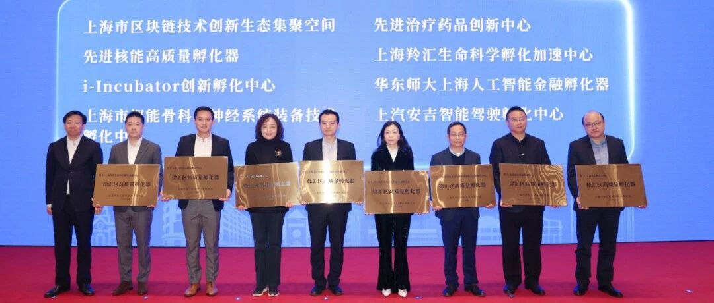
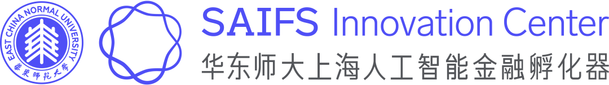
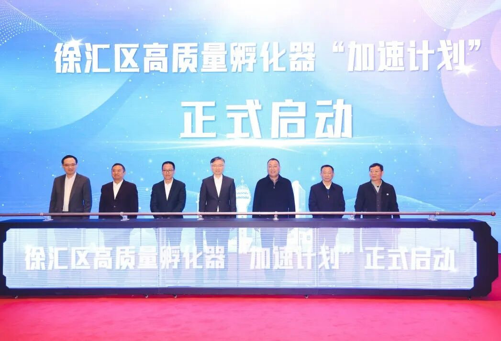
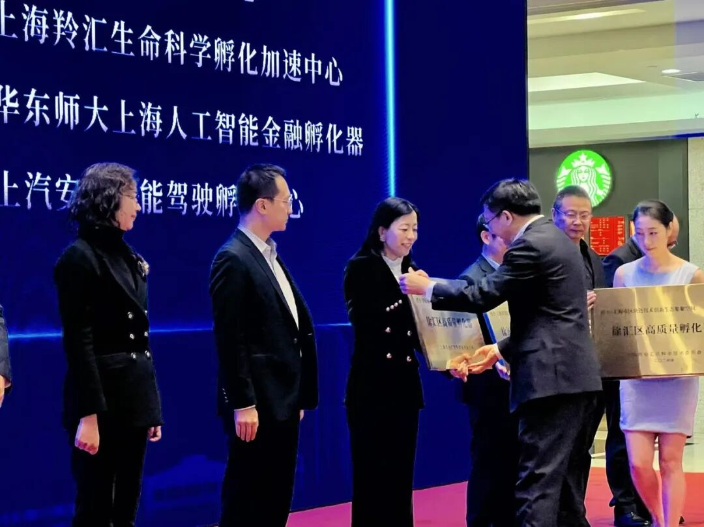
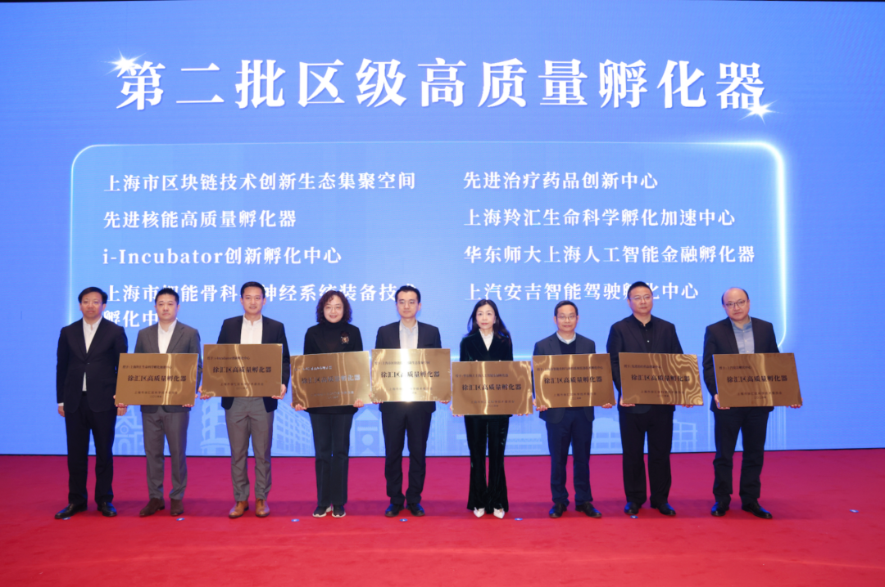

# 华东师大上海人工智能金融孵化器荣获徐汇区第二批区级高质量孵化器称号

> **作者**: SAIFS孵化器
> **发布日期**: 2024年12月11日 11:43
> **来源**: [原文链接](https://mp.weixin.qq.com/s/BDjWc6I0SxX82mEEhX76Lw)

---

  

  

12月10日，2024年徐汇区高质量孵化器建设推进大会在城开国际大厦召开。上海市科委主任骆大进，徐汇区委书记曹立强，徐汇区委副书记、区长王华，徐汇区委副书记沈权，徐汇区委常委、副区长俞林伟，上海核工程设计研究院有限公司董事长颜岩，**华东师范大学党委副书记曹友谊**，复旦大学附属中山医院院长周俭，上海市第六人民医院院长殷善开，中科院营养所副所长汪思佳出席。**华东师范大学上海人工智能金融学院院长邵怡蕾****受邀出席。**

  

‍

校党委副书记曹友谊出席徐汇区高质量孵化器“加速计划”启动仪式

  

活动中，上海市科委主任骆大进、徐汇区委书记曹立强、华东师范大学党委副书记曹友谊与其他4位院所领导共同启动了**徐汇区高质量孵化器“加速计划**”。

  

本次大会以**“孵力加速”**为主题，进一步聚焦孵化服务和要素集聚，重点展示徐汇高质量孵化的成果和进展。**徐汇区委常委、副区长俞林伟****对****华东师大上海人工智能金融孵化器****等8家第二批区级高质量孵化器进行****了授牌。**华东师大上海人工智能金融学院院长邵怡蕾代表华东师大上海人工智能金融孵化器上台领取授牌。

  

华东师大上海人工智能金融学院院长邵怡蕾上台领取授牌

徐汇区委常委、副区长俞林伟颁发授牌

  

目前，徐汇共聚集19家高质量孵化器，规划建设面积12万平方米，以国际一流孵化人才为牵引，加速科技成果转化和硬科技企业孵化，建成（合作）一批各类技术平台。同时，徐汇积极构建成果转化区域创新平台，推动技术、项目、初创企业与孵化器、社会资本、产业资源进行有效对接，促进科技创新与产业创新深度融合，有力畅通成果**“转化—孵化—产业化”**路径。

  

华东师大上海人工智能金融学院院长邵怡蕾教授表示，**孵化器的设立不仅是推动人工智能金融技术落地与推广的重要举措，更是加快构建金融科技创新生态体系的战略布局之一**。孵化器将致力于打造集前沿技术研发、产业协同创新以及人才培养于一体的综合平台，构建高效的成果转化和价值创造链条。通过深度融合人工智能与金融科技前沿，孵化器将加速科技创新驱动型金融服务模式的迭代升级，为推动上海国际金融中心从资源型到智能型的跃升注入新动能。同时，孵化器还将通过跨领域协作和拓展国际化视野，积极探索可持续发展的金融科技融合路径，为全球金融科技生态系统的建设贡献“中国智慧”和“上海方案”。

  

图文：华东师大上海人工智能金融孵化器

  

SAIFS最新动态：

[华东师大上海人工智能金融产业研究院暨孵化器在徐汇启动!](https://mp.weixin.qq.com/s?__biz=MzkxMTY1ODk2Mw==&mid=2247485675&idx=1&sn=037463bba88840b47f5fce8910001a7b&scene=21#wechat_redirect)

