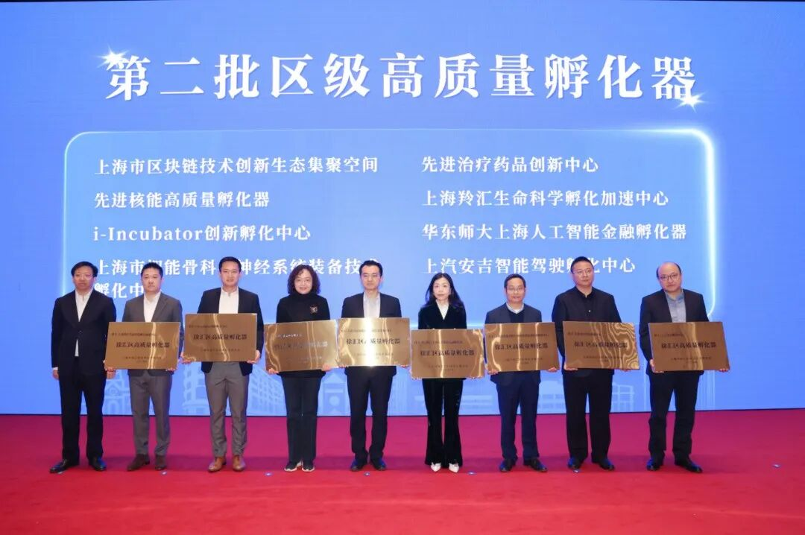

# 智金院｜智金产业研究院：招聘金融数据科学家或人工智能金融研究员，1月20日截止申请！

> **作者**: SAIFS招聘
> **发布日期**: 2024年12月17日 21:47
> **来源**: [原文链接](https://mp.weixin.qq.com/s/QMdqPR_Kf-f-fVm3cYyM5Q)

---

  

**01**

**智金院｜智金产业研究院**

**招聘启事**

  

  

生成式人工智能的爆发式增长正重新定义行业格局。站在这个全新时代的起点，我们正寻找与你一样充满潜力的人才，以**金融数据科学家或人工智能金融研究员**的身份，加入**全球领先的人工智能金融研究院**，共同攻克世界级难题，重新定义金融格局，探索科学前沿的未知领域。

  

**02**

**我们期待的候选人**

  

  

-   正直诚信，具备高度的职业素养和团队合作精神。
    
-   极高的自驱力与学习热情，用创新方法解决世界级金融与科技难题。
    
-   强大的执行力，高度结果导向，将宏大的愿景转化为切实可行的行动计划。
    
-   顶尖学府的博士或硕士，具备会计金融、人工智能、自然科学等领域的知识和经验。
    
-   具备对高新技术行业和企业基本面的深厚专业知识，以及娴熟的金融建模能力。
    
-   在业界或学界做出杰出的成就和重要贡献，获得领域内广泛认可。
    
-   优先考虑具有特许金融分析师或注册会计师资格认证的候选人。
    

  

**03**

**你的职责与收获**

  

  

  

-   加入顶尖的科研应用团队，直接参与并推动生成式人工智能技术在金融领域的落地与创新，通过技术突破解决全球金融与科技难题。
    
-   与世界一流的人工智能专家、政府机构、金融机构、国际组织合作，制定行业标准，成为全球金融行业变革的核心力量。
    
-   开放包容的工作环境，每位成员都有发挥个人潜力的机会，在实践中实现自身价值。
    
-   获得具有竞争力的薪酬，充分体现你的卓越才能与贡献。
    

  

**04**

**申请流程**

  

-   **截止时间：****2025年1月20日（周一）晚上11:59（北京时间）**
    
-   **申请材料：**你的简历以及相关成就证明（荣誉奖项、学术成果等）
    
-   **提交方式：**发送至 jlwang@sem.ecnu.edu.cn
    

我们将采用滚动录用的方式，欢迎符合条件的候选人尽早提交申请。符合条件者将进入下一步的面试流程。

  

  

**05**

**智金院｜智金产业研究院**

**介绍**

  

  

**上海人工智能金融学院（简称SAIFS****）****于2023年在华东师范大学成立，是全球首家围绕人工智能与金融跨界交叉打造的教育和研究机构。**SAIFS强调在超越知识点的通识教育的基础上，培养集金融知识、人工智能技术和实践经验于一身的新一代人工智能金融（AI-Fin）领军型卓越人才，并坚持扎根在学术研究的前沿，探索AI在金融中的新应用，驱动AI-Fin的发展。同时，SAIFS致力于与全球的学术机构、金融机构、科技公司和政府部门建立广泛的合作网络，通过推广AI与金融的交叉研究和应用，改善金融服务的效率和质量，为社会创造价值。

  

**华东师大上海人工智能金融产业研究院（简称：SAIFS Research Center）****的设立，旨在畅通“科技-产业-金融”循环，打造人工智能与金融产业融合发展的新高地。**研究院通过与中国农业银行等合作伙伴的紧密协作，将专注于构建一个具有自主知识产权的可信金融垂类大语言模型，打造三个人工智能金融创新示范场景，建立人工智能大模型金融语料库，实现金融语料数据高质量供给，强化金融科技基础设施建设。同时，研究院将成立**孵化器（SAIFS Innovation Center）**，旨在推动人工智能金融技术落地与推广，加快构建金融科技创新生态体系的战略布局。

  

智金院SAIFS金融大语言模型实验室FinLLM Lab

  

图文｜华东师范大学上海人工智能金融学院

**SAIFS近期动态：**

[华东师大上海人工智能金融孵化器荣获徐汇区第二批区级高质量孵化器称号！](https://mp.weixin.qq.com/s?__biz=MzkxMTY1ODk2Mw==&mid=2247485778&idx=1&sn=2e1277e64901345b275ceb02b321826e&scene=21#wechat_redirect)  

[华东师大上海人工智能金融产业研究院暨孵化器在徐汇启动！](https://mp.weixin.qq.com/s?__biz=MzkxMTY1ODk2Mw==&mid=2247485675&idx=1&sn=037463bba88840b47f5fce8910001a7b&scene=21#wechat_redirect)  

  

