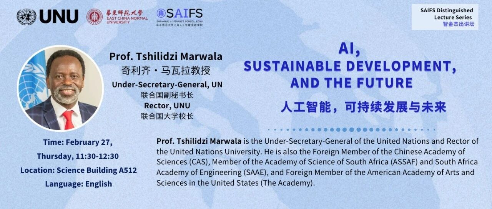
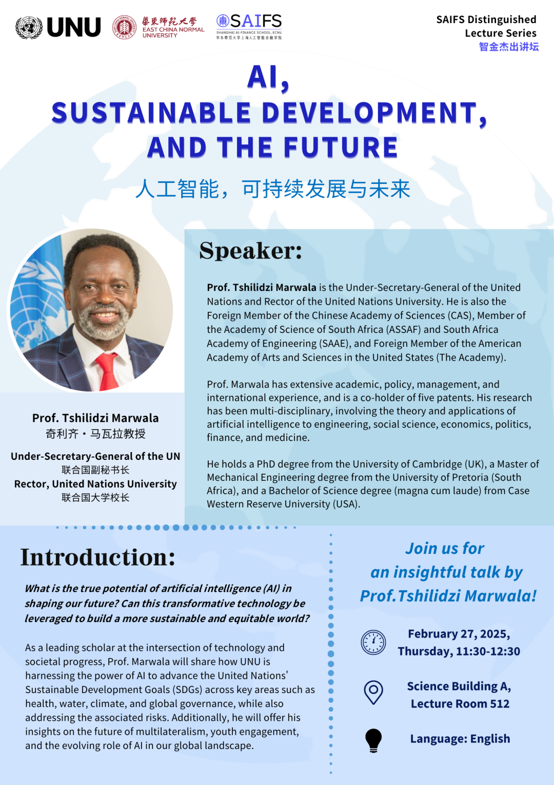

# 智金杰出讲坛·活动预告｜联合国副秘书长、联合国大学校长Tshilidzi Marwala教授在SAIFS开讲

> **作者**: 预热活动的
> **发布日期**: 2025年2月25日 17:40
> **来源**: [原文链接](https://mp.weixin.qq.com/s/uObeQ0lIhMhu5J7X1VK6WA)

---

**‍**

****智金杰出讲坛·活动预告****

      本周四，2月27日，上午11：30，"智金杰出讲坛"特邀联合国副秘书长、联合国大学校长Tshilidzi Marwala教授亲临SAIFS，带来题为“人工智能、可持续发展与未来”（AI, Sustainable Development, and the Future）的讲座。本次讲座将面向华东师大师生开放，座位有限，敬请提前入场。

  

****讲座简介****  

      AI将如何重塑人类的未来？这项变革性技术能否助力我们构建更可持续、更公平的世界？本周四，2月27日，中午11:30至12:30，联合国副秘书长、联合国大学校长奇利齐·马瓦拉（Tshilidzi Marwala）教授将在华东师大发表题为“人工智能、可持续发展与未来”的演讲，分享他对这些核心问题的深刻见解。

      作为跨越技术创新与社会发展领域的权威学者，Marwala教授现担任联合国大学（UNU）校长兼联合国副秘书长，负责统辖分布在12个国家的13个UNU研究机构，并通过前沿的研究、创新教育和专业培训，引领全球应对重大挑战。

      在本次讲座中，他将重点阐释UNU如何利用AI技术推进联合国可持续发展目标的实现，涵盖公共卫生、水资源管理、气候治理等关键领域，并深入探讨技术应用中的风险管理。此外，他还将分享对多边主义发展走向、青年全球参与机制以及人工智能国际治理等议题的见解。

  

****Tshilidzi Marwala教授简介****  

     Tshilidzi Marwala教授现任联合国副秘书长兼任联合国大学校长，自2023年3月起履职。他曾于2018-2023年担任南非约翰内斯堡大学的副校长和校长，期间历任该校主管科研与国际事务的副校长（2013-2017）、工程与建筑环境学院执行院长（2009-2013）等重要职务。Marwala同时担任中国科学院外籍院士，南非科学院及南非工程院院士，以及美国艺术与科学院外籍院士。

      作为一名具有全球影响力的跨学科学者，Marwala教授曾在美国、英国、中国及南非多所顶尖高校担任客座教授，并拥有五项技术专利。他的研究涉及多个学科，包括人工智能理论及其在工程、社会科学、经济、政治、金融和医学领域的应用。他曾在多个全球和国家决策机构任职，并与联合国教科文组织、联合国儿童基金会、世界卫生组织和世界知识产权组织等联合国机构合作。

  

**Tshilidzi Marwala教授教育背景：**

1997-2000 英国剑桥大学 工学博士

1996-1997 南非比勒陀利亚大学 机械工程硕士

1991-1995 美国凯斯西储大学 理学学士（最高荣誉毕业）

  

********活动简介************‍‍‍‍‍****

****讲座题目：****人工智能，可持续发展与未来

**时间：**2月27日（周四），上午11:30-12:30

**地点：**华东师大普陀校区理科大楼A座512教室

