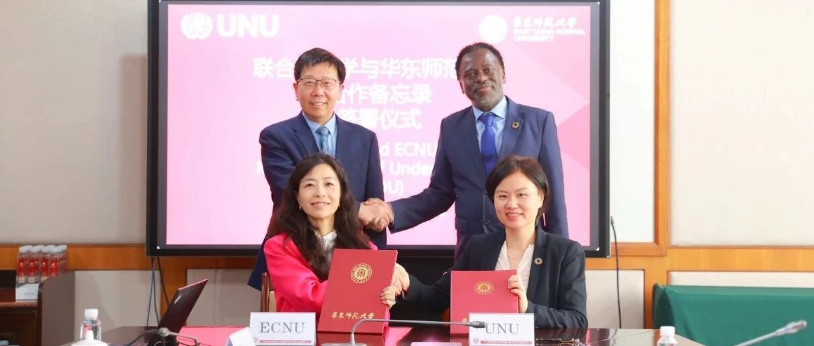
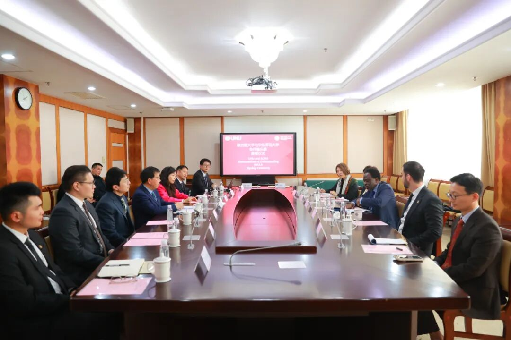
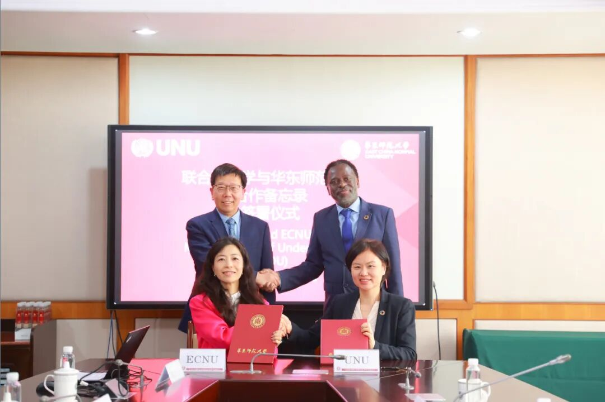
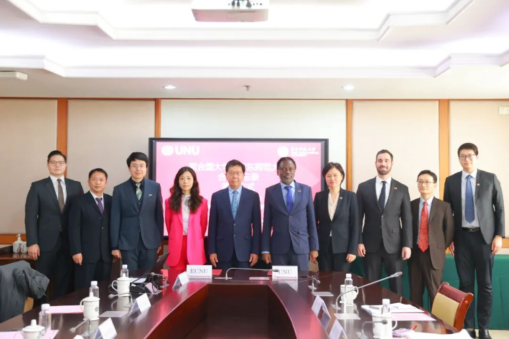

# 校长钱旭红会见联合国大学校长兼联合国副秘书长奇利齐·马瓦拉一行

> **作者**: SAIFS
> **发布日期**: 2025年3月3日 17:12
> **来源**: [原文链接](https://mp.weixin.qq.com/s/kK48-2j-06gHksUKic-5MQ)

---

  

  

  

  

       2月27日，校长钱旭红在普陀校区会见了来访的联合国大学校长兼联合国副秘书长 Tshilidzi Marwala 一行。代表团成员包括联合国大学校长办公室主任 Michael Baldock、联合国大学驻澳门研究所所长黄京波、联合国大学驻澳门研究所传播与对外关系官员戴骞。“联合国大学\-华东师范大学人工智能金融联合研究中心（筹）”、我校上海人工智能金融学院、经济与管理学院、政治与国际关系学院、国际合作与交流处等相关代表参加会见。

  

校长钱旭红会见联合国大学代表团

  

    钱旭红向来宾表示热烈欢迎。他指出，华东师范大学始终致力于推动全球合作，特别是在人工智能赋能金融产业的科学研究方面不断取得突破，此次合作将为双方提供更广阔的发展空间。他期待双方进一步深化在人工智能金融研究、人才培养及国际学术交流等领域的合作，共同推动全球金融科技创新，助力智能和普惠金融的发展。

　　Tshilidzi Marwala 介绍了联合国大学的全球学术体系及研究重点，并回顾了与华东师范大学的合作契机。他强调，在人工智能加速重塑金融行业的背景下，技术变革既带来前所未有的机遇，也伴随诸多挑战。联合国大学希望与华东师范大学携手，在 AI+金融领域深化跨学科研究和技术创新，推动人工智能在金融行业的可持续发展，为全球数字经济治理提供有力支撑。

  

双方签署合作备忘录

  

      随后，在钱旭红和 Tshilidzi Marwala 的共同见证下，华东师范大学上海人工智能金融学院院长邵怡蕾和联合国大学驻澳门研究所所长黄京波代表双方签署合作备忘录。在会谈环节，双方围绕筹建 “联合国大学\-华东师范大学人工智能金融联合研究中心”、人工智能技术在全球金融变革中的应用与合作方向等展开了交流。

  

与会人员合影

  

　    联合国大学（United Nations University），简称“UNU”，是联合国下设的国际大学，亦是全球智库和研究生教学组织。其使命是通过合作研究和教育，为解决联合国、其人民和会员国所关注的人类生存、发展和福祉等紧迫的全球问题做出贡献。为实现这一使命，联合国大学与联合国成员国的顶尖大学及研究机构合作，充当国际学术界与联合国系统之间的桥梁。

图文｜华东师范大学上海人工智能金融学院