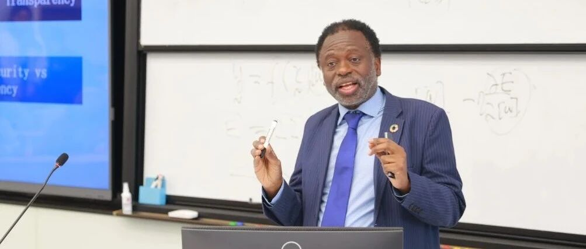

# 联合国大学校长兼联合国副秘书长奇利齐·马瓦拉作客智金杰出论坛

> **作者**: SAIFS
> **发布日期**: 2025年3月4日 17:05
> **来源**: [原文链接](https://mp.weixin.qq.com/s/OuSW8BJin98RY0bC-AnT6w)

---

  

  

      2月27日上午，华东师范大学上海人工智能金融学院首届“智金杰出论坛”系列讲座在普陀校区理科大楼A512教室举行。本次讲座邀请联合国大学校长兼联合国副秘书长 Tshilidzi Marwala 做了题为“人工智能、可持续发展和我们的未来”（AI, Sustainable Development, and the Future）的演讲。讲座由经济与管理学院党委书记岳华主持。

  

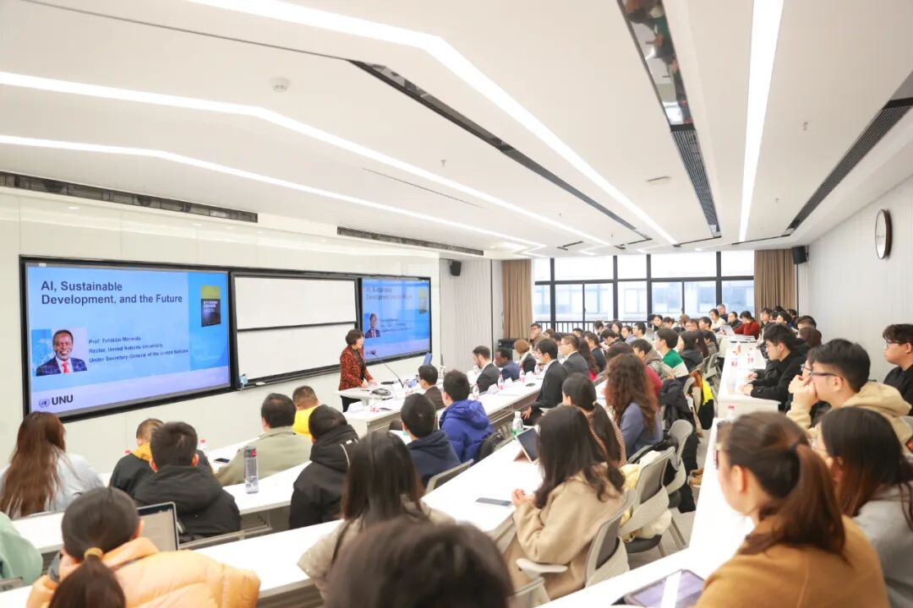

上海人工智能金融学院举办首届“智金杰出论坛”

  

     在讲座中，Tshilidzi Marwala 指出，人工智能正成为全球治理体系中的关键议题，其广泛应用不仅提升了社会生产效率，还对决策制定、公共管理和社会可持续发展等领域产生了深远影响。与此同时，人工智能的发展也带来了诸多治理挑战，例如算法透明性不足、数据偏见、隐私保护风险等可能引发的伦理问题。因此，加强人工智能治理已势在必行。他强调，构建一个负责任且可持续的人工智能治理体系需要全球社会的共同努力，包括提升公众对人工智能技术的认知和适应能力，推动行业自律与技术创新，完善法律法规，设立专门的治理机构，并加强国际协调与合作。此外，他呼吁从业人员应在技术进步与社会责任之间寻求平衡，确保人工智能的发展符合公平、可持续和包容性的全球价值观。

  

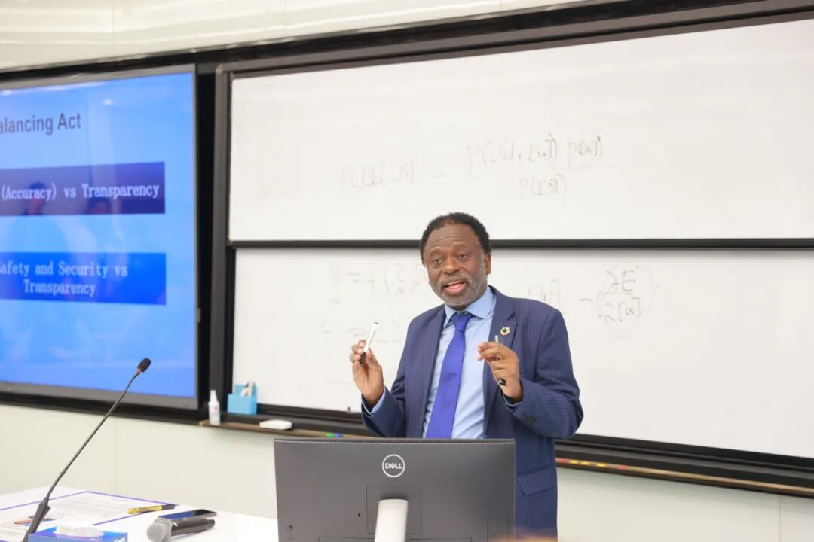

Tshilidzi Marwala 做题为

“人工智能、可持续发展和我们的未来”的主题演讲报告

  

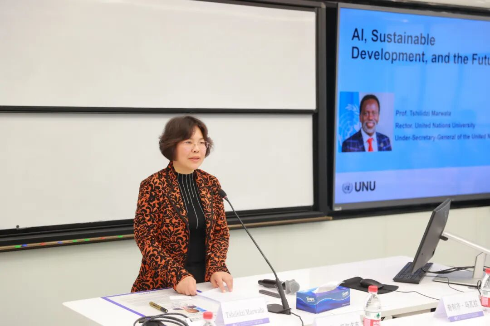

岳华主持讲座

  

     在交流环节，与会师生围绕人工智能治理框架的构建、算法伦理问题、国际治理合作以及联合国在人工智能治理中的角色等问题与Tshilidzi Marwala 展开了深入探讨。

  

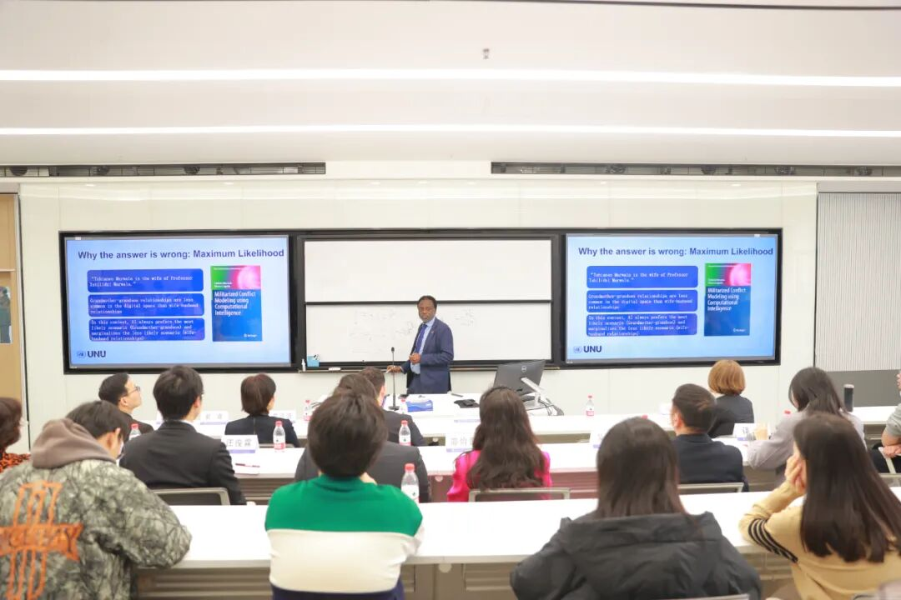

  

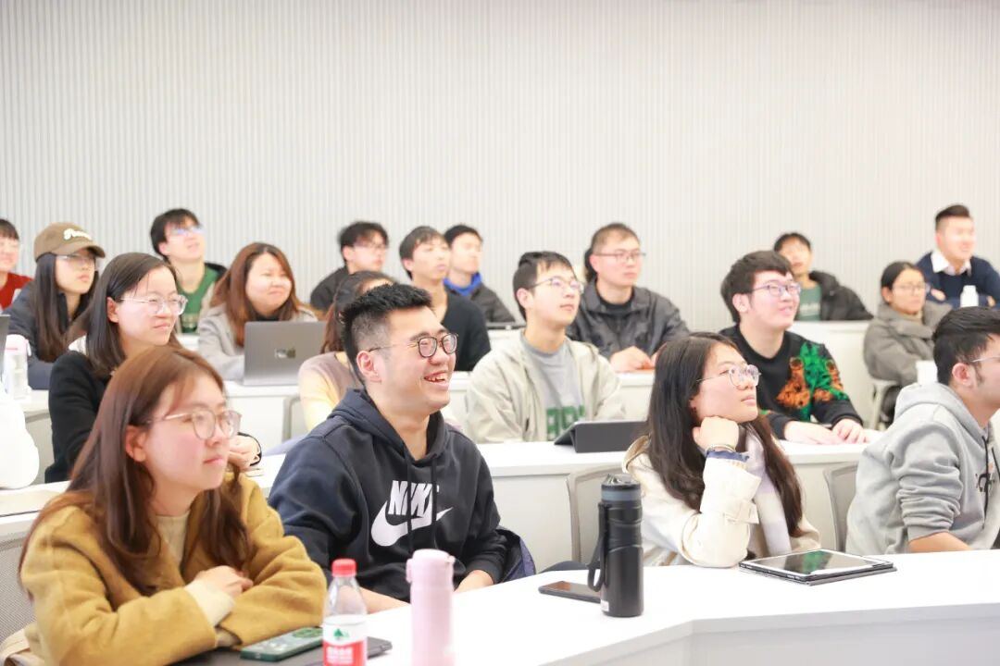

  

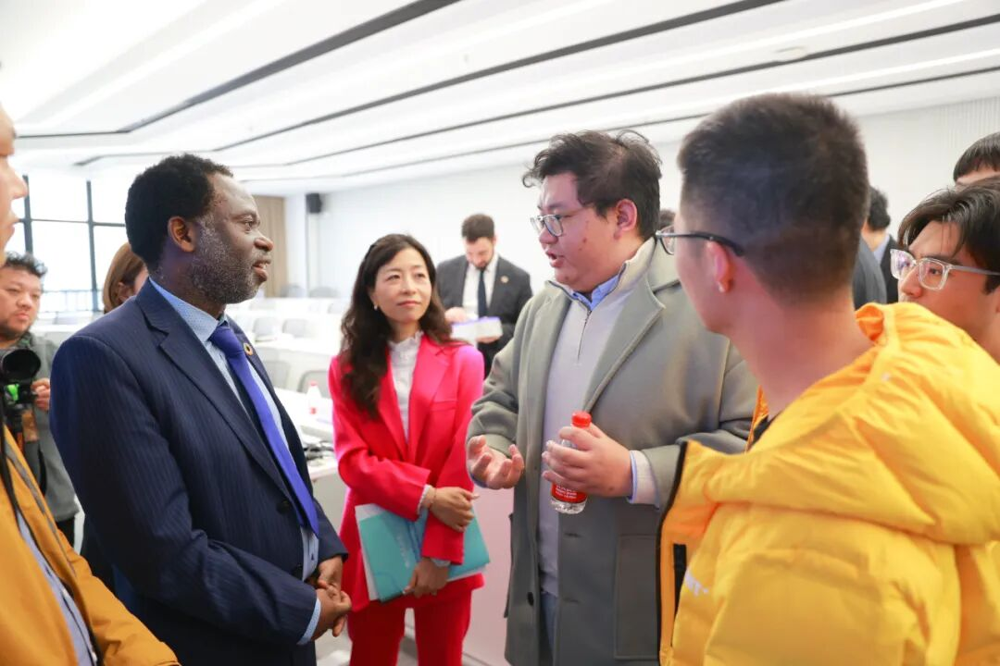

Tshilidzi Marwala 和与会师生进行讨论交流

  

     岳华在总结致辞中对 Tshilidzi Marwala 一行的到访及精彩讲座表示诚挚感谢，并高度评价他在人工智能研究及治理中的卓越贡献。她指出，人工智能正深刻重塑社会治理、经济发展和科技创新格局，已成为推动全球变革的重要驱动力。她鼓励大家紧跟人工智能时代的发展步伐，不断提升技术治理意识与跨学科协作能力，为更加可持续的未来贡献智慧与力量。

     联合国大学校长办公室主任 Michael Baldock、联合国大学驻澳门研究所所长黄京波、联合国大学驻澳门研究所传播与对外关系官员戴骞出席讲座；我校经济与管理学院、上海人工智能金融学院、相关院系师生100余人聆听讲座。

     讲座前，上海人工智能金融学院院长、“联合国大学-华东师范大学人工智能联合研究中心（筹）”主任邵怡蕾及其科研团队还与 Tshilidzi Marwala 一行就推动筹备建设“联合国大学-华东师范大学人工智能联合研究中心”的相关事宜和联合科研等方面进行合作交流，并陪同参观智金院金融大语言模型实验室（FinLLM Lab）。邵怡蕾表示，这一合作关系标志着在推进人工智能技术和可持续发展目标方面迈出了重要一步，未来将充分发挥双方优势，不断促进人工智能在金融领域的创新与应用。

  

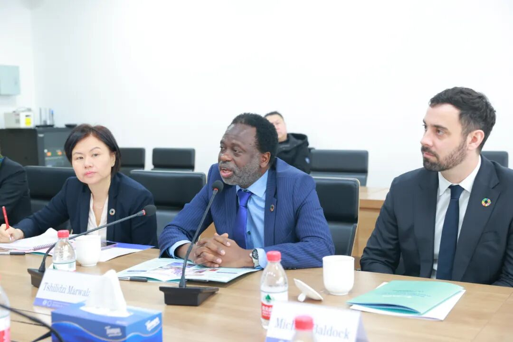

Tshilidzi Marwala 介绍联合国大学的全球学术体系

  

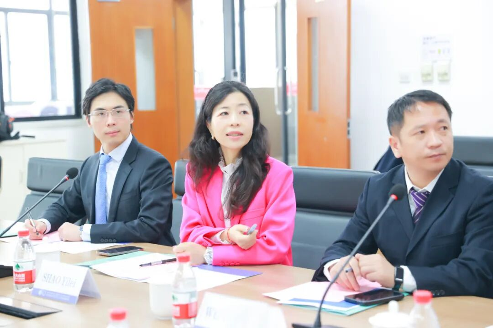

邵怡蕾介绍上海人工智能金融学院建设情况

  

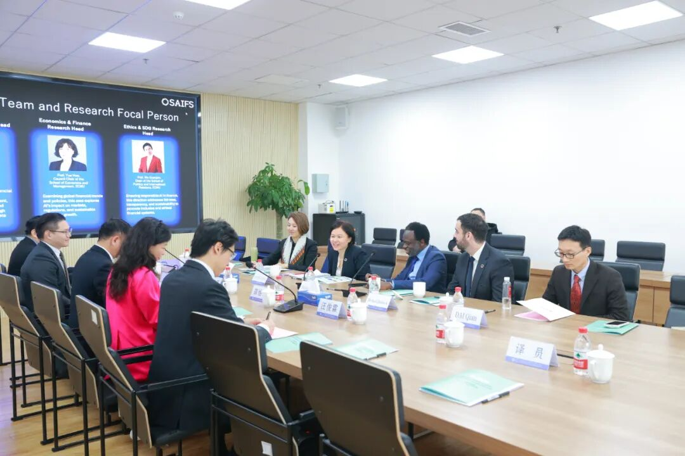

Tshilidzi Marwala 一行与邵怡蕾及其科研团队会谈

  

     在参观智金院金融大语言模型实验室期间，实验室副主任汪俊霖向来访一行介绍了学院自主研发的全球领先金融垂类大语言模型及金融智能体 AI Jason，该技术在绿色投资、绿色债券、普惠贷款和普惠教育等领域展现出广阔的应用潜力。

  

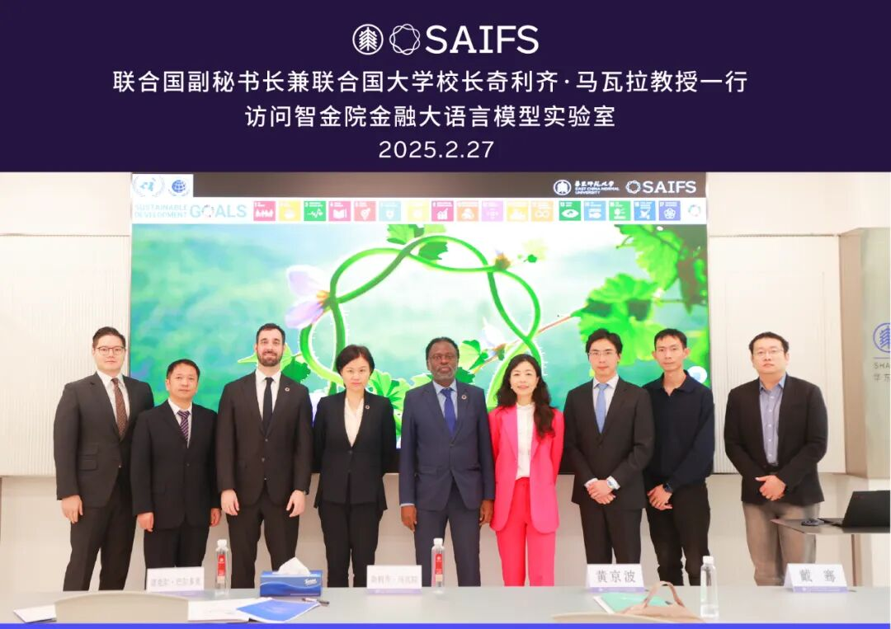

参观智金院金融大语言模型实验室

  

 图文｜华东师范大学上海人工智能金融学院

  

SAIFS最新动态：

[校长钱旭红会见联合国大学校长兼联合国副秘书长奇利齐·马瓦拉一行](https://mp.weixin.qq.com/s?__biz=MzkxMTY1ODk2Mw==&mid=2247486432&idx=1&sn=70b615836074986b3511927fc790cfef&scene=21#wechat_redirect)

