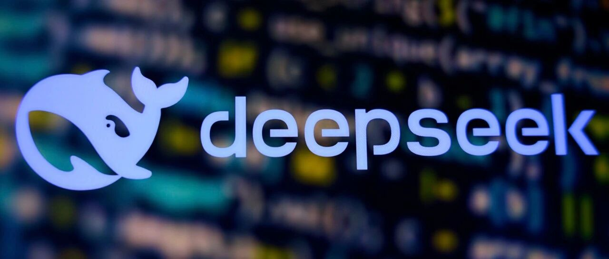
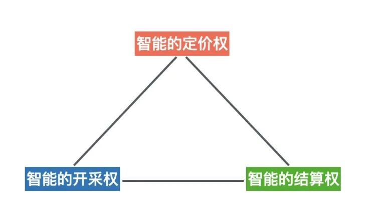

# 智金观点·新质生产力 | 邵怡蕾院长：人工智能成为新的“锚”，驱动人类社会进入高丰裕时代？

> **作者**: 
> **发布日期**: 2025年3月28日 19:13
> **来源**: [原文链接](https://mp.weixin.qq.com/s/DhRniVeY4UHn4XDQq67imw)

---

**文章转自 上观新闻**

  

  

近日，DeepSeek（深度求索）在开源平台发布升级版V3模型。从网友初步反馈的实测效果看，V3在网站开发能力、UI设计方面展现出巨大的进步，数学能力也有提升。人工智能（AI）的快速发展，不只是技术革新，更关涉未来秩序。全球范围此起彼伏的讨论，既有惊叹和警觉，也有期待与思索。

  

  

**从“黑金”到“智能金”**

  

  

  

  

  

  

  

  

  

  

  

  

  

石油曾是过去一个世纪各国财富与国力的主要源泉，被视为“黑色金属”与“工业血液”；今天，以通用人工智能（AGI）为代表的先进人工智能被视为新型战略资源。  

石油与AGI的属性不同。石油是有限的物质资源，由地理分布决定；AGI是一种技术和智能资源，主要依托算力、数据和算法。换言之，石油的地缘政治由自然禀赋塑造，而AGI的地缘政治更取决于人力和政策布局。

历史上，战略资源的发现显著驱动了生产力重构，从而带来经济增长与需求重构。石油驱动了20世纪的工业化和汽车、化工等产业繁荣，塑造了现代消费社会。同样，AGI有望丰富新质生产力定义：

一方面，生产资料正在被重构。

AGI作为通用目的技术，其应用遍及经济各领域。所有产业都可以围绕这一新的生产资料进行快速重构。其中，硅基的基础设施尤为需要快速建设，包括芯片产业链、算力中心、数据中心、智能云服务等。

AGI相较于工业革命时期的电与蒸汽机的发明，其发展速度更快、扩散更广。大语言模型在数月内即可向全球用户提供前沿服务。据预测，AI技术到2030年就能为全球经济额外贡献15.7万亿美元产出，相当于石油工业在鼎盛时期对世界经济的贡献。不同的是，石油主要通过能源供给促进工业产出，AGI则通过提升全要素生产率、自动化知识工作来推动增长。  

另一方面，劳动者正在被重构。

在未来的劳动者场景中，会出现更多的AI智能体、更少的人。随着AGI逐步成熟，智能体劳动将替代越来越多的人类基础劳动，使经济产出不再受限于劳动力供给。这种“数字劳动力”资源的爆炸式扩张，可以成为新质生产力与国家竞争力的倍增器。与此同时，很多全新的需求也将围绕智能体产生。如AI将以什么样的交互方式和形态进入我们的生活，机器人、自动驾驶还是脑机接口？AI将如何在境内外流动？

  

  

**智能定价权之争**

  

  

  

  

  

  

  

  

  

  

  

  

2025年3月1日，“DeepSeek开源周”的最后一天，在开源了FlashMLA、DeepEP、DeepGEMM、DualPipe和EPLB等核心技术之后，DeepSeek公开了最为重要的一个数字，即单位智能的价格及其成本。

其中，DeepSeek R1的定价为0.55美元/百万token输入、2.19美元/百万输出token，GPU成本为15%，毛利率达85%。

同一天，OpenAI发布了预热已久的ChatGPT4.5，定价为75美元/百万token输入、150美元/百万token输出。

这一战，DeepSeek以约100倍的性价比赢了之前的全球领跑者OpenAI。一个重要意义在于，中国企业获得了对AGI这样一种战略性生产资料的定价权。

“得AI者，得天下。”一般认为，得到所谓硅基世界的控制权需要构筑三个权力：智能的开采权、定价权和结算权。

所谓硅基世界的权力三角形

定价权之争在于谁能生产智能，谁能稳定地供给智能，谁能以合理的价格供给提炼出更优质的智能。DeepSeek通过技术革新，已争得了智能的定价权。

开采智能需要算力、数据和算法（包括顶尖人才）三个核心要素。开采权之争在于谁能够长久地、持续地保持开采智能所需要的三个核心要素供给。中国在数据、算法两项上的追赶速度很快，接近自给自足。但是，在算力这一关键要素上仍然受制于人。

智能的结算权，争夺的是国际市场上通用的智能计价货币是什么。AI井喷式爆发带来全球硅基基础设施建设浪潮以及大规模社会需求重构，将极大改变全球贸易格局。出口智能将取代出口石油成为最重要的国际贸易项，全球硅基贸易将显著增长并超越碳基贸易。

美国的策略比较清晰：通过控制算力要素（GPU芯片）来控制智能的开采权，智能的开采成本（GPU的每小时价格）由美元计价，开采后精炼（通过数据和算法）的优质智能也自然以美元计价。如此，石油作为主要货币的锚将快被以智能作为主要货币的锚所替代。当然，这里还有一个变数，不排除特朗普将某种数字货币直接挂上智能的锚，从而重建一个所谓的全球智能金融体系。

DeepSeek的横空出世，硬生生从美国科技巨头手中抢来了智能定价权。以ChatGPT为代表的智能炼化，一度被贴上了“只烧钱不获利”的标签。DeepSeek的相关技术创新，让智能可以从更差的芯片、以更分布式的方式提炼，有力推动了全球智能市场的多元化。DeepSeek的成功证明，只要有更好的技术，智能炼化可以成为一个高获利的产业。因新技术而拥有高利润，意味着推动终端智能挂钩人民币计价具备了基础条件。

目前，在世界智能版图上，主要的竞争态势以遏制与反遏制为主基调。但相关大国理应坐到智能定价和全球供给的谈判桌前，以某种形式的“AI输出国联盟”或协调机制来避免恶性竞争、确保“AI向善”。

  

  

**新旧格局演变**

  

  

  

  

  

  

  

  

  

  

  

  

从ChatGPT看，GPT三个字母不仅代表通用目的技术（General Purpose Technology），也代表地缘政治的张力（Geopolitical Tension）。气候变化和新能源革命使石油的战略价值预期下降，全球石油需求预计在本世纪30年代见顶并转而下降。即便AI浪潮带来额外用电需求，也难逆转化石能源需求放缓的大趋势。

与之相对，AGI的影响力将愈发凸显。AI技术每一次突破都可能催生新产业、颠覆旧模式，如自动驾驶、AI制药，从而重新分配资源和优势。掌握AGI技术的国家将引领新的产业链和新的全球贸易体系，智能生产国和跨国智能公司将主导世界智能体系。由此，人类社会也将从资源约束进入技术驱动的高丰裕时代。

与之相伴，人类认知以及存在本质也通过DeepSeek等“赫尔墨斯之杖”与机器智能、比特世界连接在一起。未来，当算法以量子叠加态同时计算100种气候模型时，传统科学范式中“观察—假设—验证”的线性认知模式会被解构。柏拉图的“洞穴寓言”将被倒置——不是人类通过火光投射的阴影理解世界，而是AI直接在理念世界建模，继而将真理投影至感官可及的“洞穴”。如果有一天，当脑机接口将神经脉冲转化为可编辑的代码，渐冻症患者通过机器输出思维的速度有望超越正常语言表达，“自我”就可能只是生物电信号与算法解码协议的某种共在。

不仅如此，AI技术的发展，会不会使时间被压缩，“一日如一年”，且“生物身体”的永恒和“数字意识”的永恒变得可能；空间被重载，当元宇宙中每个虚拟原子都携带机器模型生成的物理属性，空间不再仅是康德所谓的先天直观形式，而成为可编程的存在维度。如果这样，那么，人的“在场”能够重来吗？

  

**作者：邵怡蕾**

普林斯顿大学计算机科学博士，华东师范大学上海人工智能金融学院院长。长期关注人工智能技术在金融领域的应用，以及人工智能技术的伦理与治理等问题。