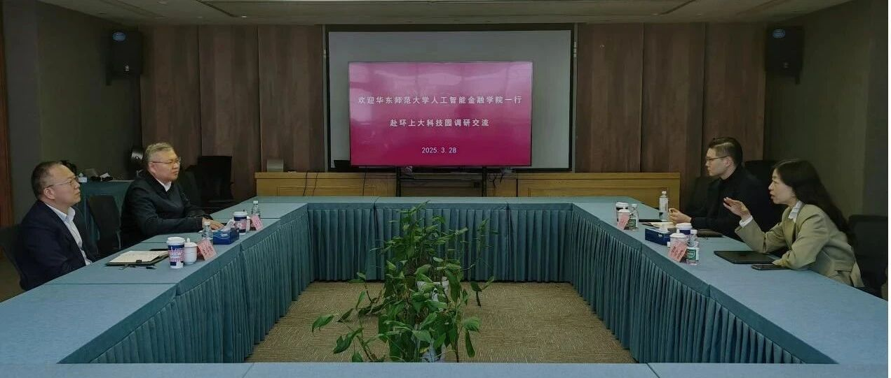
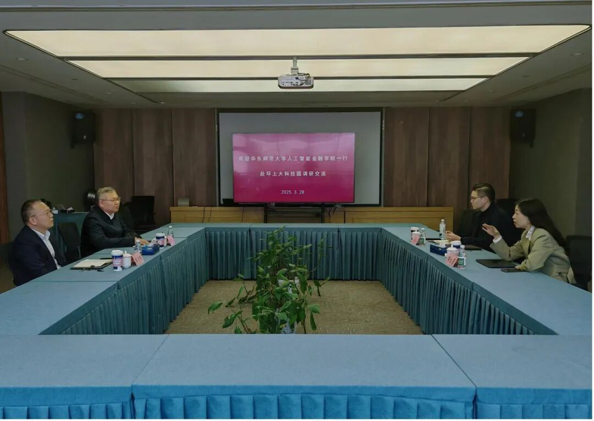
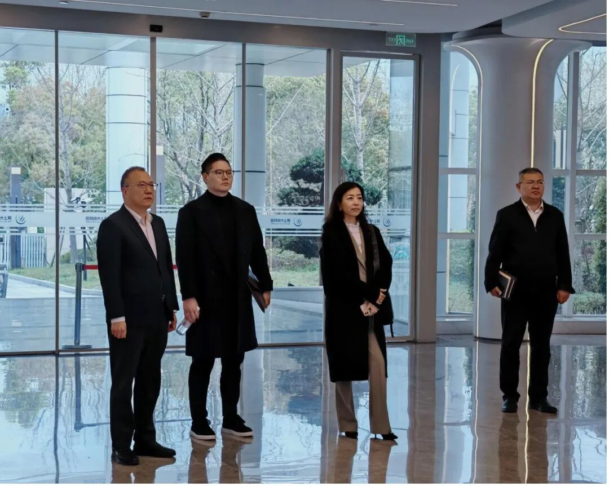
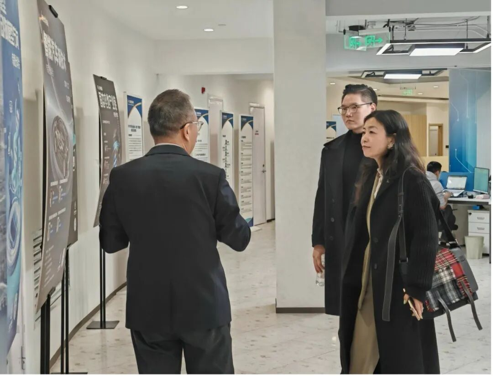

# 产学研融合发展，助力“AI+金融”｜智金院赴环上大科技园调研交流

> **作者**: 赴调研交流的
> **发布日期**: 2025年3月31日 19:02
> **来源**: [原文链接](https://mp.weixin.qq.com/s/35VIlRqCzBrfIptwcHeIrw)

---

  

  

  

  

       3月28日上午，华东师范大学上海人工智能金融学院院长邵怡蕾、院长助理汤傲成一行赴环上大科技园开展调研交流活动。双方围绕人才培养、学院发展以及产学研深度融合等议题进行了深入交流。上海大学国家大学科技园/环上大科技园总经理李宇阳、上海大学国家大学科技园副总经理岳中岳等陪同调研。

  

双方交流

  

    首先，李宇阳总经理对华东师大智金院一行的到访表示热烈欢迎，并简要介绍了环上大科技园近年来的发展建设情况。他指出，高校肩负着人才培养与科技创新的重要使命，在推动高校科技成果产业化过程中，大学科技园发挥着重要作用。目前，环上大科技园在各级政府及高校的支持下，不断强化政产学研融合沟通机制，积极推动高校科研成果转化落地。科技园成立以来，已累计吸引超过600家企业入驻，并于近年来推动建立了环上大智能制造概念验证中心，着力打造集“教育－科技－人才”于一体的高质量发展体系，服务区域经济社会发展。他表示，人工智能与金融融合领域潜力巨大，希望双方进一步加强合作，共同推动科技创新与金融服务效能提升。

     随后，邵怡蕾院长详细介绍了智金院的建设发展情况以及近期取得的科研进展。她表示，智金院作为全球首家专注于人工智能与金融跨界融合的教育科研机构，始终紧密对接经济社会发展实际需求，着力培养既具备金融专业素养又掌握人工智能技术的高层次复合型人才。未来，学院将持续深化人工智能技术在金融领域的应用探索，积极培养具备合规管理意识和能力的专业人才，助力上海国际金融中心建设迈向更高水平。

参观环上大科技园

  

      座谈会前，李宇阳总经理陪同邵怡蕾院长一行参观了环上大科技园零号基地及环上大概念验证中心。

  

图文｜环上大科技园、华东师范大学上海人工智能金融学院