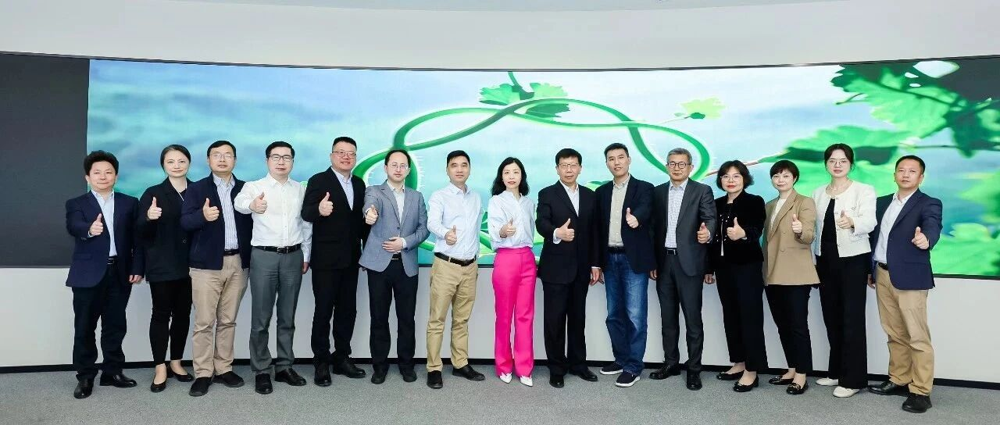
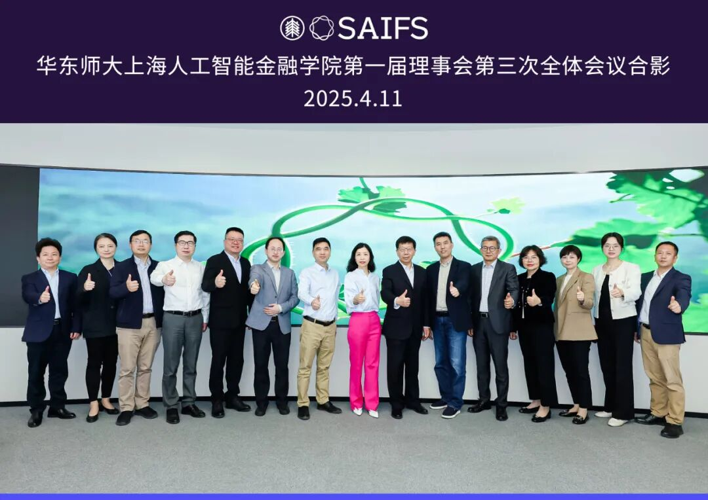
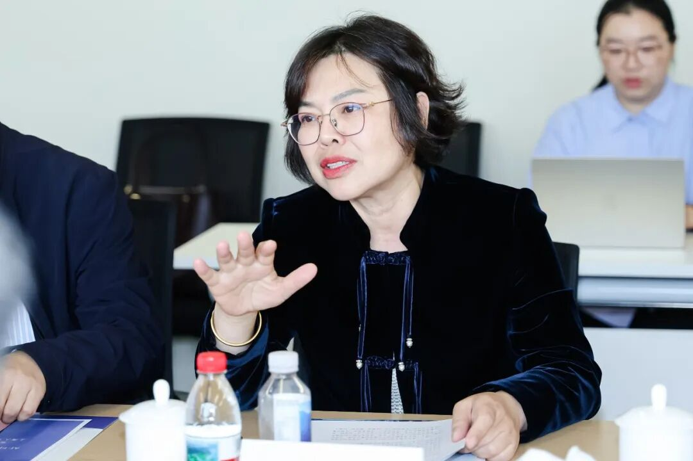
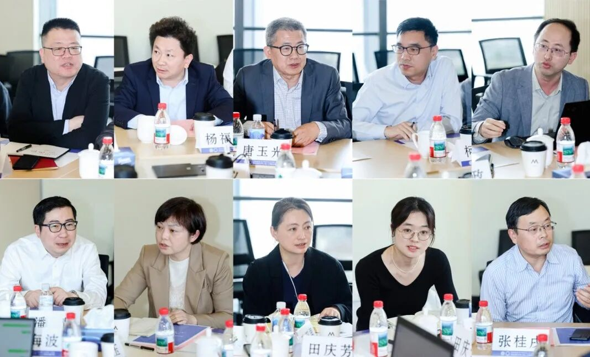
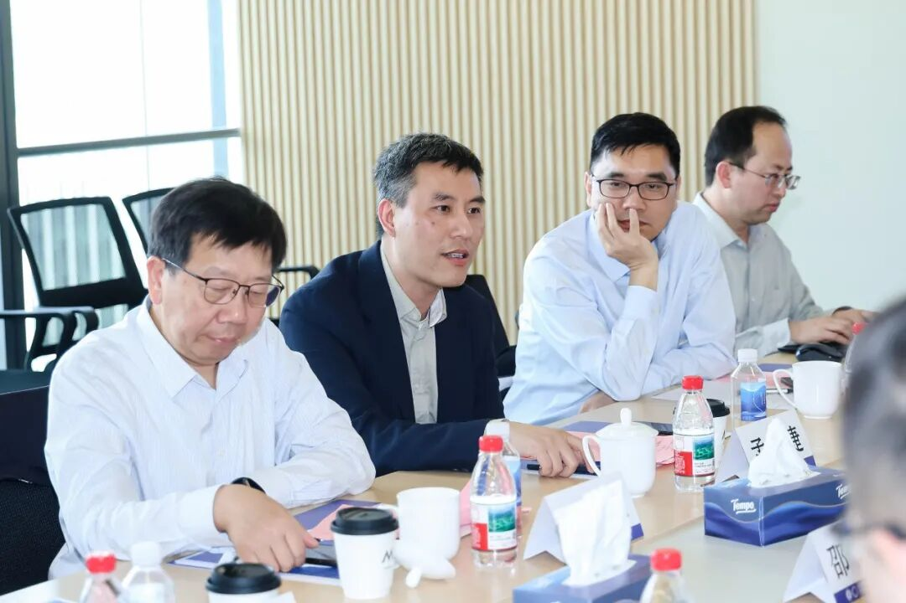
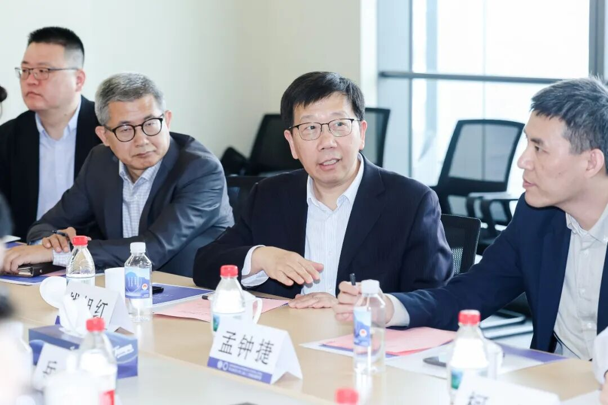
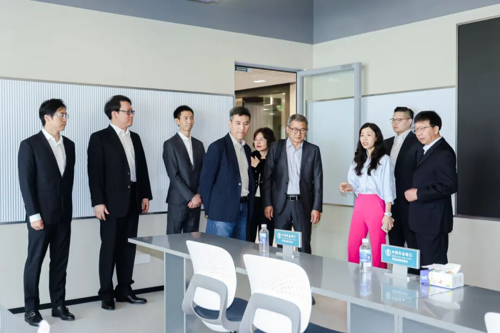
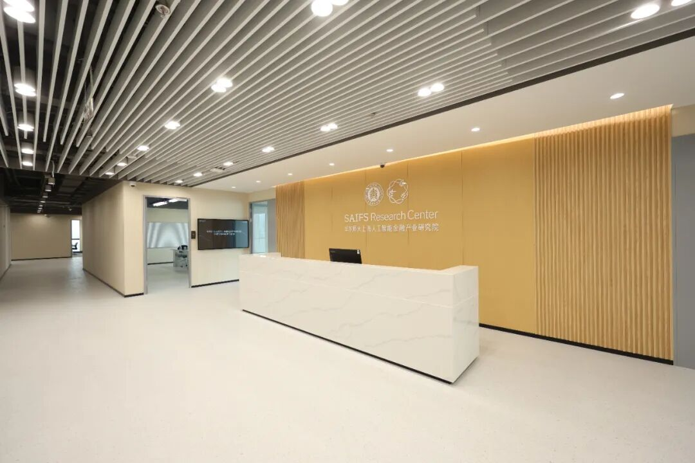

# 探索超限融合机制，赋能人工智能金融未来——智金院第一届理事会第三次全体会议顺利举行

> **作者**: SAIFS
> **发布日期**: 2025年4月22日 17:00
> **来源**: [原文链接](https://mp.weixin.qq.com/s/4Lk_wA10ZyUrW8H68WrQmA)

---

  

智金院第一届理事会第三次全体会议合影

  

  

  

     4月11日上午，华东师范大学上海人工智能金融学院（以下简称“智金院”）第一届理事会第三次全体会议在徐汇区“模速空间”华东师大上海人工智能金融产业研究院大会议室召开。华东师范大学校长、智金院理事会理事长钱旭红，党委副书记、智金院理事会副理事长孟钟捷出席会议并讲话。华东师范大学校学术委员会秘书长唐玉光、发展规划部部长柯政、研究生院副院长杨福义、科技处处长杨海波、人文与社会科学研究院院长吕志峰、国际合作与交流处副处长田庆芳、人事处人才办主任张亚男、财务处副处长曹芳、计算机科学与技术学院院长张桂戌、政治与国际关系学院党委书记潘靓、经济与管理学院党委书记岳华以及经济与管理学院党委副书记、上海人工智能金融学院副院长吴文钰出席会议。会议由智金院院长助理汤傲成主持。

  

岳华致辞

  

     经济与管理学院党委书记、智金院理事岳华代表经济与管理学院致辞，向长期以来关心和支持学院发展的校领导、各职能部门及兄弟院系表示诚挚感谢，向邵怡蕾院长及在人工智能金融领域开拓奋进的同仁们致以敬意。她指出，智金院的成立与发展，是学校主动对接国家战略、服务上海全球金融科技中心建设的重要举措，也是经管学院深化“新文科”改革、推进学科交叉融合的重要实践。

       岳华书记在致辞中提到，智金院成立不到一年便已取得令人瞩目的阶段性成果，包括创建全国首个人工智能金融（AI-Fin）研究中心，成立国内首个具有中国自主知识产权的金融大语言模型实验室（FinLLM Lab）、与中国农业银行和徐汇区政府达成重大校企、校地合作项目，上海人工智能金融产业研究院暨孵化器已被授予徐汇区第二批区级高质量孵化器称号。今年初，学院还与联合国大学签署合作备忘录，共建全球首个、中国唯一的“联合国大学\-华东师大人工智能金融联合研究中心”。未来，经管学院将围绕“学科—产业”“本土—国际”“制度—文化”三个维度，持续深化协同创新机制，与智金院携手共进，全力打造学科交叉融合新高地，积极培育创新生态和文化氛围，推动人工智能金融领域教育、科技、人才的一体化发展。

  

邵怡蕾介绍智金院近期工作

  

       智金院院长、理事会执行理事长邵怡蕾详细介绍了学院近期在人才梯队建设、学科战略布局以及政产学研用合作方面的进展。她强调学院通过高层次人才引进和青年人才培养，不断优化师资结构，致力打造具备国际视野和实践能力的高素质复合型人才团队。在学科建设方面，学院系统布局了一批战略性学科方向，逐步形成了特色突出、优势明显的交叉学科生态。此外，学院积极与政府部门、金融机构、科技企业及研究机构展开协同创新，探索政产学研用深度融合，推动创新链、产业链和人才链的深度贯通。未来学院将持续强化前瞻布局，拓展多元合作渠道，持续增强学院在人工智能金融领域的影响力，为上海全球金融科技中心建设提供强有力的人才和智力支持。

  

理事会成员交流

第一排自左向右：吕志峰、杨福义、唐玉光、柯政、杨海波讲话

第二排：潘靓、曹芳、田庆芳、张亚男、张桂戌讲话

  

       在随后的讨论环节中，理事会成员围绕人才引进与培养机制、科研重点方向布局、产学研深度合作模式、校企合作长效机制等议题展开了充分交流与深入研讨，结合学院发展实际和当前人工智能金融领域的发展趋势，提出了诸多前瞻性和建设性建议，为学院未来明确发展目标、优化资源配置、提升核心竞争力提供了有益指导。

  

孟钟捷讲话

  

       在会议总结环节，华东师范大学党委副书记、智金院理事会副理事长孟钟捷在发言中指出，智金院在发展过程中面临着诸多前所未有的挑战，这也对学校各职能部门提出了更高的要求，需要加强协同对接、主动创新作为。他充分肯定了智金院团队在推动人工智能与金融学科深度融合过程中积极探索、勇于尝试，并取得了初步成效。同时，他强调，人工智能与金融领域融合发展的前景十分广阔，但也需要进一步突破传统思维束缚与现有机制限制，积极探索新的路径与方法，以更好地回应时代的需求，实现学院的高质量发展。

  

钱旭红作总结讲话

  

       最后，华东师范大学校长、智金院理事会理事长钱旭红作总结讲话。他表示，智金院的建设发展要积极探索“超限融合”的新路径，突破传统学科边界，构建交叉融合的学科生态。他指出，智金院应主动打破学院和学科之间的壁垒，搭建多元沟通合作的平台，积极整合学校各学院、各职能部门的优势资源，打造富有活力、高效的运行机制。同时，他强调要建立有效的资源共享机制，学校层面应支持跨学院、跨领域的人才合作与项目协作，通过建立动态灵活的管理模式，形成“精干核心、广泛外围”的组织架构。此外，他还提出，要明确学院发展不同阶段的管理要求与激励机制，既充分释放学院发展的创新活力，又确保稳定高效的团队建设和运营质量。钱旭红校长认为，智金院应保持自身的特色优势，避免陷入传统学科建设的路径依赖，要以问题为导向，真正以需求驱动学科发展、以项目推动人才培养，持续提升学院在人工智能金融领域的核心竞争力和创新引领能力。

  

参观智金产研院报告厅和实验室

  

       会前，邵怡蕾院长及智金院科研团队陪同全体与会人员参观了华东师大人工智能金融产业研究院暨孵化器，并详细介绍了研究院的功能规划和未来发展布局。

  

智金产研院教学设施和科研环境

  

     据悉，[华东师范大学上海人工智能金融学院](https://mp.weixin.qq.com/s?__biz=MzkxMTY1ODk2Mw==&mid=2247484110&idx=1&sn=68a39cb3161b24a917f07cf05f927f6b&scene=21#wechat_redirect)[于](https://mp.weixin.qq.com/s?__biz=MzkxMTY1ODk2Mw==&mid=2247484110&idx=1&sn=68a39cb3161b24a917f07cf05f927f6b&scene=21#wechat_redirect)[2024](https://mp.weixin.qq.com/s?__biz=MzkxMTY1ODk2Mw==&mid=2247484110&idx=1&sn=68a39cb3161b24a917f07cf05f927f6b&scene=21#wechat_redirect)[年](https://mp.weixin.qq.com/s?__biz=MzkxMTY1ODk2Mw==&mid=2247484110&idx=1&sn=68a39cb3161b24a917f07cf05f927f6b&scene=21#wechat_redirect)[5](https://mp.weixin.qq.com/s?__biz=MzkxMTY1ODk2Mw==&mid=2247484110&idx=1&sn=68a39cb3161b24a917f07cf05f927f6b&scene=21#wechat_redirect)[月正式成立揭牌](https://mp.weixin.qq.com/s?__biz=MzkxMTY1ODk2Mw==&mid=2247484110&idx=1&sn=68a39cb3161b24a917f07cf05f927f6b&scene=21#wechat_redirect)，致力于整合人工智能、金融科技与经济管理领域的多学科优势，推动学科交叉融合发展。2024年10月，[智金产业研究院暨孵化器](https://mp.weixin.qq.com/s?__biz=MzkxMTY1ODk2Mw==&mid=2247485675&idx=1&sn=037463bba88840b47f5fce8910001a7b&scene=21#wechat_redirect)正式落地“全球最大的人工智能孵化器”、全国首个大模型创新生态社区“模速空间”，[2024](https://mp.weixin.qq.com/s?__biz=MzkxMTY1ODk2Mw==&mid=2247485778&idx=1&sn=2e1277e64901345b275ceb02b321826e&scene=21#wechat_redirect)[年](https://mp.weixin.qq.com/s?__biz=MzkxMTY1ODk2Mw==&mid=2247485778&idx=1&sn=2e1277e64901345b275ceb02b321826e&scene=21#wechat_redirect)[12](https://mp.weixin.qq.com/s?__biz=MzkxMTY1ODk2Mw==&mid=2247485778&idx=1&sn=2e1277e64901345b275ceb02b321826e&scene=21#wechat_redirect)[月荣获徐汇区第二批区级高质量孵化器称号](https://mp.weixin.qq.com/s?__biz=MzkxMTY1ODk2Mw==&mid=2247485778&idx=1&sn=2e1277e64901345b275ceb02b321826e&scene=21#wechat_redirect)。

  

图文｜华东师大智金院及产研院

  

**附：华东师范大学上海人工智能金融学院**  

**第一届理事会名单**  

  

理事长：钱旭红

副理事长：孟钟捷

执行理事长：邵怡蕾

理事（按姓氏笔画排序）：

吕志峰  杜震宇  杨海波  吴冠军  吴  健  

张桂戌  陆智萍  邵怡蕾  岳  华  孟钟捷

柯  政  钱旭红  殷德生  唐玉光  蒯曙光