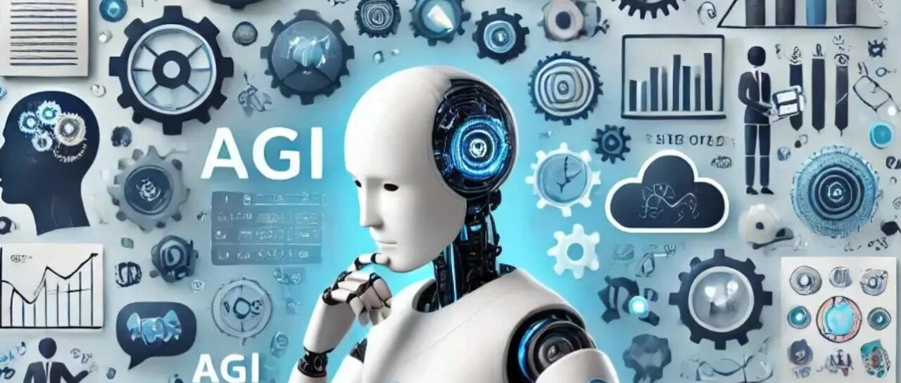
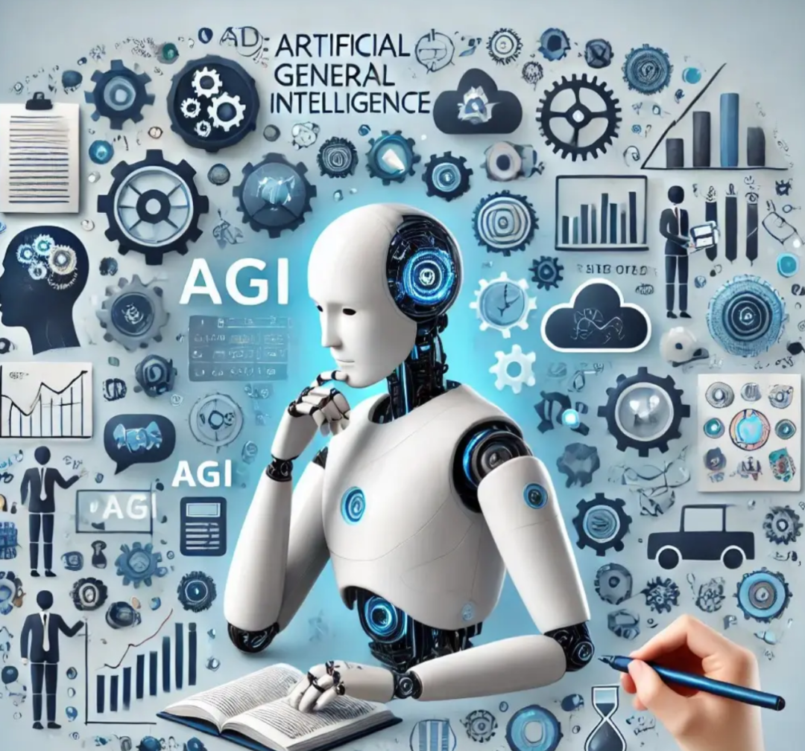
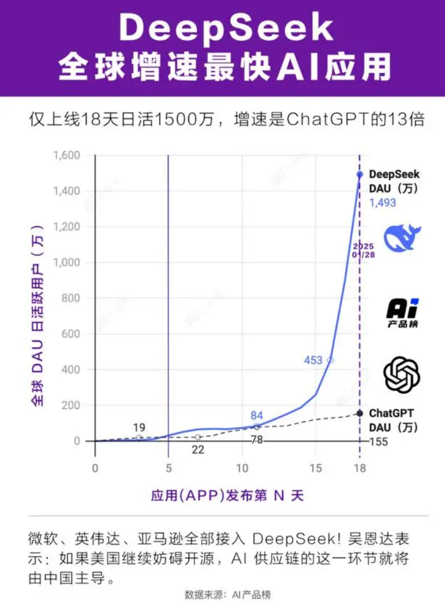

# 学术发表·邵怡蕾院长｜硅基经济学：AGI如何成为新的全球权力杠杆

> **作者**: 邵怡蕾
> **发布日期**: 2025年4月23日 17:02
> **来源**: [原文链接](https://mp.weixin.qq.com/s/FJ3yDi_LAxIrze4S9_dXcw)

---

硅基经济学：AGI如何成为新的全球权力杠杆

  

邵怡蕾｜华东师范大学上海人工智能金融学院院长、教授

本文原载《探索与争鸣》2025年第3期  

具体内容以正刊为准

非经注明，文中图片均来自网络

  

邵怡蕾

2025年开年，DeepSeek犹如一场突如其来的飓风，横扫全球智能版图。关于它的讨论持续发酵，令人充满了惊叹与质疑、期待与警觉。人们争论的焦点，不仅是它的低价策略和技术革新，更是它背后潜藏的未来秩序。那么，笔者以一个人工智能研究者和国际金融研究者的跨界身份来探究：目前各国间的智能博弈，究竟在争夺什么？

  

**从黑金到智能金：智能定义新质生产力**

历史上，战略资源的发现显著地驱动生产力的重构，从而带来经济增长和需求结构的变革。石油曾是过去一个世纪各国财富与国力的核心源泉，被誉为“黑色金属”和“工业血液”。控制石油不仅意味着能源安全和经济增长，还引发合作与冲突（如20世纪的中东战争和石油危机）。而今，**AGI（通用人工智能）代表的先进人工智能被视为21世纪的新型战略资源。**谁在人工智能领域率先取得突破，谁就能在一定程度上获得经济和军事上的优势 。

  

  

石油与AGI的属性截然不同。石油是一种有限的物质资源，其分布由地理条件所决定；而**AGI/AI则是一种技术和智能资源，依赖于算力、数据和算法。**石油储量天然有限且高度集中于少数国家，这赋予了产油国巨大的议价权。相比之下，AI创新活动虽遍布全球，但其关键支柱——尖端芯片、云计算设施、数据资产及大型模型——也主要掌握在美、中等少数国家手中。自然因素决定了石油的埋藏位置，而人工智能所依赖的算力中心、数据中心和算法中心（即高密度的人才中心）则可以由国家决策建造在哪里，以及如何产出。换言之，石油的地缘政治格局是由自然禀赋塑造，而AI的地缘政治格局则更多地取决于人力投入和政策布局。

  

石油驱动了20世纪的工业化，使得汽车、化工等产业繁荣发展，塑造了现代消费社会。同样地，**AGI正在定义新质生产力。****一方面，生产资料被重构，智能正在替代能源成为主要的生产资料。**AGI作为通用目的技术（general purpose technology）其应用遍及经济各领域，所有的产业围绕着这种新的生产资料正在进行快速的重构。硅基的基础设施需要快速的建设，包括芯片产业链、算力中心、数据中心以及智能云服务等。同时，智能技术的快速发展也迫使现有的产业链重构，几乎所有的产业都必须在AGI之上进行垂域智能的再加工。AGI相较于工业革命时期的电与蒸汽机的发明，其发展速度更快、扩散更广。大语言模型可在数月内向全球提供前沿AI服务。这使得掌握AGI技术的国家能够迅速将其转化为生产力和影响力，就像工业革命时期掌握新动力的国家一样，有望在全球竞争中获得霸权地位。据预测，到2030年AI技术可能为全球经济额外贡献高达15.7万亿美元的产出。这一规模相当于石油工业在鼎盛时期对世界经济的贡献。不同的是，石油主要通过能源供给促进工业产出，而AGI通过提升全要素生产率、自动化知识工作来推动增长，展现了其独特的价值和潜力。

  

**另一方面，劳动者被重构了。未来的劳动者会包含更多的AI智能体，人的比重会减小。**随着AGI逐步成熟，智能体将能够替代越来越多的人类劳动，从而使经济产出不再受限于劳动力供给。 这种“数字劳动力”资源的爆炸式扩张，将成为新质生产力与国家竞争力的倍增器。与此同时，许多全新的需求也将围绕AI智能体的“衣食住行”产生。“衣”，即AI智能体的应用，AI将以什么样的交互方式和形态进入我们的生活，机器人、自动驾驶还是脑机接口？“食”，AI依赖电，未来的能源需求或许将大幅增长。“住”，AI需要更多的超算中心和智能存储基础设施来支撑。“行”，AI将如何在国内外流动，如何从高智能地区向低智能地区输出？劳动者从现在的人类向人类与AI智能体的组合演变将极大地重塑社会的需求，我们将从物质消费社会进入一种新的社会形态。这种新形态的动能将来源于以下两部分：**人类有了AI之后的新硅基消费需求，以及AI智能体作为需求主体的消费需求。**

  

**智能定价权之争**

2025年3月1日，即DeepSeek开源周的最后一天，在开源了FlashMLA、DeepEP、DeepGEMM、DualPipe和EPLB等核心技术之后，DeepSeek公开了最为重要的一项数据，即单位智能的价格及其成本。

  

具体而言，DeepSeek R1的定价为0.55美元/百万token输入， 2.19美元/百万token输出，其GPU成本仅占总成本的15%，毛利率则高达85%。同日， OpenAI 发布了预热已久的ChatGPT 4.5，其定价为75美元/百万token输入， 150美元/百万token输出。

  

DeepSeek以约100倍的性价比优势击败了之前的全球领跑者OpenAI。**这种技术突破，更重要的意义在于影响了对AGI这一战略性生产资料的定价权。**AI模型的价格战争是21世纪乃至人类历史上最重要的没有硝烟的战争之一。AI科技博弈似乎已经代表了国力乃至全球权力格局的博弈。各国在这场竞争中的投入也是空前的：2025年2月21日，美国宣布了规模空前、旨在重塑全球人工智能版图的“星际之门计划”，该计划由OpenAI、软银、甲骨文等多家龙头企业联合发起，预计在未来四年内投入5000亿美元用于建设全新的人工智能基础设施；同月，巴黎峰会期间，欧盟委员会主席冯德莱恩官宣了欧盟版的“星际之门”计划——“InvestAI”，誓言为欧盟的AI发展筹集2000亿欧元；中国在人工智能（AI）领域的投资计划涵盖政府战略规划、金融机构支持和企业自主投资等多个层面，显示出全方位推动AI产业发展的决心。2025年1月，中国银行发布《支持人工智能产业链发展行动方案》，计划未来五年为AI全产业链提供不少于1万亿元人民币的专项综合金融支持。同年2月，阿里巴巴宣布未来三年将投资3800亿元人民币（约524亿美元）用于云计算和AI领域。

  

**硅基世界的权力三角形**

“得AI者得天下”是一个毫不夸张的说法，**想要得到硅基世界的控制权就需要得到三个权力：智能的开采权、定价权和结算权。** 

  

**定价权之争在于谁能生产智能，谁能稳定地供给智能，谁能以合理的价格供给提炼得更优质的智能。**在DeepSeek横空出世之前，智能的定价权争夺主要集中在OpenAI、谷歌、XAI与Anthropic之间。美国的一些公司因拥有世界上最优质好用的智能技术，因此对于智能的定价权拥有绝对的控制，并有望发展出大型跨国智能公司。然而，DeepSeek的出现打破了这个局面：这家只有160人的中国公司，以仅为竞争对手三十分之一的价格向全世界提供了最优质的智能，同时使用了开源体系，将大规模生产智能和稳定地供给智能这个原本在闭源体系中耗费巨大资源和人力的问题绕开了。在不到两个月的时间内，DeepSeek赢得了全球公认的单位智能定价权。

  

  

然而，**智能的开采权与结算权的争夺亦至关重要。开采智能需要算力、数据和算法（即顶尖人才）三个核心要素。**开采权之争在于谁能够长久地持续地保持开采智能所需要的这三个核心要素的供给。目前，美国拥有最全面的AI生态，从尖端芯片（如英伟达、AMD）的设计生产到云服务（如谷歌、亚马逊），再到高质量的数据资源，以及顶尖的研究机构和人才储备，均领先全球。近年来，美国政府积极出台政策以巩固这一优势，例如2022年颁布的《芯片与科学法案》投入2800亿美元扶持本土半导体制造和AI研发，以确保供应链安全。同时，美国以国家安全为由，收紧对华技术出口，严格限制先进AI芯片和工具流向潜在竞争对手。这种战略定位与冷战时期美国对待中东石油的态度如出一辙——确保自己掌握充足“战略储备”，同时遏制对手获得关键资源。中国在数据和算法两项上皆追赶得很快。然而，在算力这一关键要素上，中国仍然面临外部制约。虽然中国企业已在加紧研发替代性的国产芯片，但要在短期内实现长期稳定且优质的智能开采，挑战依然巨大。智能的主要开采权目前仍然为美国所拥有。中国企业越成功，美国对于算力这一要素的控制越严格，甚至全面禁止所有AI芯片进入中国，以保持其对智能开采权的绝对控制。

  

智能的结算权争夺的焦点在于确定国际市场上通用的智能计价货币，究竟是0.55美元还是4.01人民币？智能的井喷式发展带动了全球的硅基基础设施的大规模建设以及社会需求的深刻重构，这两大动力将极大地改变全球贸易的格局。出口智能有望取代出口石油，成为最重要的国际贸易项目，智能将从硅基生产国流入那些无法自行生产智能的硅基净消费国。全球硅基贸易将显著增长，并快速超越碳基贸易。石油作为主要货币的锚将快速地转变成以智能作为主要货币的锚。美国长期主导石油全球金融体系（如以美元计价石油）并通过军事同盟确保中东石油稳定供应。如今，美元迫切地需要再次与智能挂钩。美国的策略非常清晰：通过控制算力要素（如GPU芯片）来控制智能的开采权，并将智能的开采成本（即GPU的每小时价格）以美元计价，因此开采后精炼（通过数据和算法）的优质智能也自然以美元计价。如果美国成功通过控制芯片掌握智能的开采权和全球供给，并将美元与智能挂钩成为计价货币，那么美国在石油全球金融体系下的主导权将如出一辙地复制到正在构建中的智能全球金融体系。如此一来，美国就完成了以石油作为全球权力杠杆向以智能作为全球权力杠杆的转换。这里，还有一个不可忽视的变数就是特朗普，不排除他将某种数字货币直接挂上智能的锚，从而绕开美联储，重建一个美元之外的全球智能金融体系。

  

直到2024年底，美国仍拥有着硅基世界权力三角形的三个角。然而，DeepSeek硬生生从美国科技巨头手中夺走了智能的定价权。**DeepSeek提供了从原始算力（GPU芯片）通过数据和算法提炼优质智能的最便宜高效的技术。**因此，OpenAI、谷歌，Anthropic、XAI等科技巨头不得不跟随DeepSeek设定的智能的单位定价（0.55美元/百万token），否则就得将全球市场拱手相让。以ChatGPT为代表的智能炼化曾经是一个只烧钱不获利的产业，而DeepSeek证明了只要有更好的技术，智能炼化就能成为一个高利润的产业。由于新技术带来的高利润空间，DeepSeek不仅拥有了炼化后终端智能的定价权，还有了筹码要求终端智能挂钩人民币计价，打破美国正在构建的以美国技术供给为主导，以美元单一货币计价的垄断性硅基技术和硅基金融体系。从ChatGPT出现以来，在国际智能市场保持了两年之久的“美国例外主义”事实上已经成为过去。

  

DeepSeek发明的一系列智能炼化技术创新，其意义不亚于当年美国的“页岩气革命”。美国自2000年代初以来，依靠水力压裂（fracking）和水平钻井（horizontal drilling）技术的突破，大规模开发页岩气资源，从而彻底改变了全球能源格局。页岩气革命被誉为“一百年来石油工业最重大的事件”。假设我们从2045年回望现在，DeepSeek在2025年初所引发的“智能炼化革命”或许也会成为未来二十年智能工业最重大的事件：它使得智能可以从性能较低的芯片中，以更加分布式的方式提炼，从而大规模提取此前无法低成本开发的智能资源。这无疑是重大创新：**它有助于使中国摆脱对智能进口的依赖，削弱智能开采大国（美国）的影响力，同时推动全球智能市场的多元化。**

  

目前，硅基世界的权力三角形中，智能开采权为美国拥有，智能定价权为中国拥有，智能结算权之争尚不明了。美中作为全世界唯二能大规模生产通用智能和炼化终端智能的国家，两者的竞合关系也变得相当微妙。虽然目前美中的竞争态势以遏制与反遏制为主基调，DeepSeek在智能炼化技术上的超级领先优势很可能促使美国和中国坐到智能定价和全球供给的谈判桌前，以某种形式的“AI输出国联盟”等协调机制来避免恶性竞争和确保最大获利。

  

**全球经济政治新旧动力格局的演变**

**GPT三个字母不仅仅代表着通用目的技术（general purpose technology）, 同时代表着地缘政治的张力（geopolitical tension）。**未来十年，石油和智能在全球经济格局中的地位此消彼长。气候变化和新能源革命的大势所趋，使石油的战略价值预期下降。国际能源署预测全球石油需求将在2030年代见顶并转而下降，而即便AI浪潮带来额外用电需求，也难逆转化大趋势。可以预见，石油在地缘政治中的“武器化”难度将提高：当替代能源丰富时，断供石油不再像过去那样致命。与之相对，AGI的影响力将愈发凸显。AI技术每一次突破都可能催生新产业和颠覆旧模式（如自动驾驶颠覆交通，AI制药加速医药革命），从而重新分配各国的经济优势。掌握AGI技术的国家将引领新的产业链和新的全球贸易体系，智能生产国和跨国智能公司将主导世界智能体系，构建新的硅基世界权力版图。另一方面，如果真正的通用人工智能出现，其带来的生产力飞跃可能远超想象，地球经济版图或许被彻底改写——人类社会将从资源约束进入技术驱动的高丰裕时代。

  

上面，我们已然看到技术突破正从局域的技术革新升维到对整个世界政治经济版图的重写。与此同时，**人类认知以及存在本质也通过DeepSeek这个“赫尔墨斯之杖”与机器智能和比特世界连接在一起。**在不久的将来，当算法能以量子叠加态同时计算100种气候模型时，传统科学范式中“观察－假设－验证”的线性认知模式就被解构。柏拉图的洞穴寓言将被倒置——不是人类通过火光投射的阴影理解世界，而是AI直接在理念世界建模，再将真理投影至感官可及的“洞穴”。如果有一天，当脑机接口将神经脉冲转化为可编辑的代码，渐冻症患者通过机器输出思维的速度已能超越正常语言表达，“自我”可能只是生物电信号与算法解码协议的某种共在。不仅如此，技术使得人类存在的时空严重异化和变形：时间被压缩，一日如一年，而“生物身体”的永恒和“数字意识”的永恒都在AI的帮助下变得可能。空间被重载（superposition），当元宇宙中每个虚拟原子都携带机器模型生成的物理属性，空间不再仅是康德所谓的先天直观形式，而成为可编程的存在维度，那么人的“在场”是否是可以重来的游戏？

  

人类到底走向哪里？是不是像Max Tegmark所说，目下我们正在上演电影《不要抬头》（“Don’t Look Up”）？

  

相关链接：

[“DeepSeek：人工智能的中国时刻？”学术研讨会综述](https://mp.weixin.qq.com/s?__biz=MzA4MjcxMDEwNQ==&mid=2686347835&idx=1&sn=a7ae1b32e8b8f0843ddeb00676d2054c&scene=21#wechat_redirect)

---

智金观点：

[新质生产力 | 邵怡蕾院长：人工智能成为新的“锚”，驱动人类社会进入高丰裕时代？](https://mp.weixin.qq.com/s?__biz=MzkxMTY1ODk2Mw==&mid=2247486528&idx=1&sn=1a4cf64f899d2e1b8d49e5fa35293eca&scene=21#wechat_redirect)