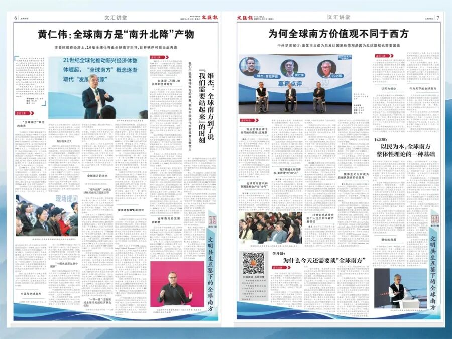
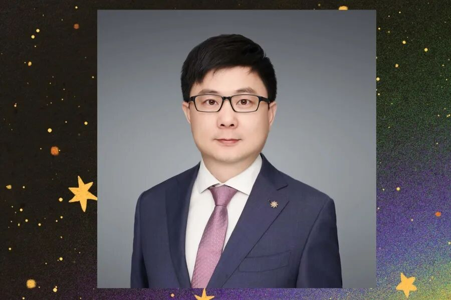
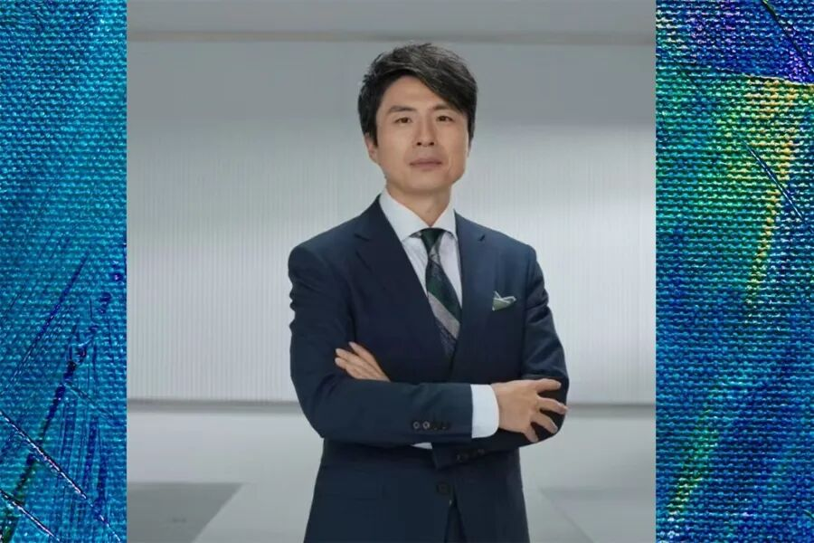
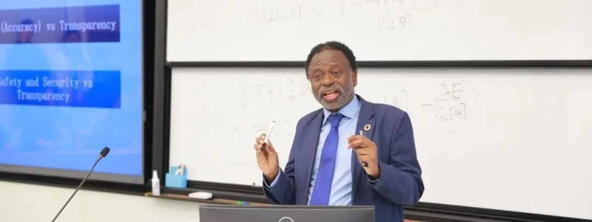

# 活动预告｜本周六！4月26日，与您相约文汇讲堂，共话「数字技术如何在全球南方开源与共享」

> **作者**: 文汇·上观/李念
> **发布日期**: 2025年4月24日 17:01
> **来源**: [原文链接](https://mp.weixin.qq.com/s/fPdr95SIxC9r8miWNd23SA)

---

4月26日，余南平、邵怡蕾、余祖坤、吴冠军同台，畅谈实践现状与挑战

全球南方在数字技术阶段是跟跑，DeekSeek开源后角色如何变化？

在日本和墨西哥、东南亚等地部署智能平台，带来怎样不同的效果？

AI金融领域在全球南方可否杀出一条南南数字带来的经济发展新路？

人类文明的奇点正在逼近，如果智人出现会对全球南方有何挑战？

4月26日下午，2025年第176期文汇讲堂“文明共生互鉴下的全球南方”（以下简称“全球南方”）系列讲座进入第二期，主题为《数字技术在全球南方的开源与共享》。

主讲嘉宾余南平曾主持关联国家社科基金重大课题，如“颠覆性技术发展对新型国际关系型塑研究”；对话嘉宾华东师范大学上海人工智能金融学院创院院长邵怡蕾，刚履新联合国大学－华东师范大学人工智能金融联合研究中心主任，她不仅有全球金融实践，也有AI领域的全球实践；字节跳动智能算法产品原高级总监余祖坤，拥有在日本和全球南方国家墨西哥、东南亚国家部署AI软件测试平台的双重体验；华东师大政治与国际关系学院院长吴冠军，从事以政治－技术－艺术－教育－本体论为中轴的跨学科研究，带来哲学视角的观察。四位嘉宾不同维度的汇聚将进一步展示全球南方在数字技术领域面临的机遇与挑战，和中国如何互助的前景。

4月26日14:00-16:40分全球南方系列十讲第二期开讲“全球南方”系列十讲，是文汇报社与九家沪上学术机构聚势共启的公共产品。本系列讲座的特点是“理论阐释+案例呈现+跨文明对话”，力求真实、全面地讲好中国故事和全球南方故事。同时，这也是上海学术界构建中国特色自主知识体系的尝试，“全球南方”系列覆盖国际关系、国际传播、政党理论、技术革命、文明互鉴等多重领域，显示出新文科建设中浓厚的学科交叉融合特色。讲堂也希冀通过系列讲座，帮助公众进一步开拓国际视野、培育理性品质。首讲《21世纪的全球南方与其未来》由黄仁伟、维杰·普拉沙德、石之瑜三位主讲破题，李开盛点评，赢得线上线下及学界其他领域普遍好评。4月12日文汇报第6、7版刊发第一期讲座内容第二期讲座由文汇报社、华东师范大学政治与国际关系学院联合主办。现场设在中山北路3663号华东师大普陀校区逸夫楼，现场实名制报名显示成功后还需经过工作人员22日下午起至23日中午电话确认，并入群后方有效。本期开始新增“5分钟下期主场青年观察员说”环节，复旦大学一带一路与全球治理研究院的助理研究员荆鸣和博士后刘喆将上台快评。现场报名二维码, 系统显示成功后须经电话确认拉群后方有效五个直播平台，上观App（2025年1月1日起解放日报、文汇报、新民晚报三家共建、共用、共享上观新闻客户端）拥有线上提问优先权，观众下载后点击首页下端右下角的“视频”键，即可进入直播页面；亦可扫直播二维码，通过右上端“关注上观App”下载，绑定手机后享有评论、点赞、提问等权限，并拥有积分；央视频和喜马拉雅亦可在线提问。结束后，上观App和文汇报视频号保留30小时回看。上观App直播二维码，下载后绑定手机可参与互动

【讲座详情】

**讲座名称：****文明共生互鉴下的“全球南方”**

**主办：**文汇报社

华东师大政治与国际关系学院

**协办：**（排名不分先后）

—复旦大学一带一路与全球治理研究院

—复旦大学国际关系与公共事务学院

—上海外国语大学上海全球治理与区域国别研究院

—上海国际问题研究院

—上海政法学院上海市“一带一路”安全合作与中国海外利益保护协同创新中心

—上海大学政党治理与社会发展研究中心

—华东师大·全球南方学术论坛

—上海社科院国际问题研究所

第二期：数字技术在全球南方的开源与共享

**主讲嘉宾：**

余南平（上海市人民政府决策咨询研究基地/余南平工作室领军人物）

**对话嘉宾：**

邵怡蕾（华东师大上海人工智能金融学院院长）

余祖坤（字节跳动智能算法产品原高级总监）

吴冠军（华东师大政治与国际关系学院院长）

**全场主持：**顾文俊（文汇报记者《顾问天下》UP主）

**圆桌主持：**李念（文汇讲堂工作室主任）

**看点：**

\* 数字经济曾经和正在赋予全球南方哪些新技能和新观念

\* 人工智能技术与数字技术不同的范式如何挑战全球南方

\* DeepSeek的中国时刻，会给全球南方带来哪些新突围

**时间：**2025年4月26日周六14:00-16:40

**地点：**中山北路3663号华东师大普陀校区逸夫楼报告厅（凭身份证入校门，进逸夫楼需报名并被电话确认）

**直播：**上观App、华东师范大学视频号、央视频、文汇报视频号、喜马拉雅

（直播无需报名，可预约观看）

本期优秀提问奖为华东师大文创产品4件，吴冠军著作《再见智人》2本。

**【讲座报名及入场须知】**  

1.本系列现场为类演播室，请有意愿者从速报名，并确认当天能准时出席。

新听友请加文汇讲堂工作微信号“讲堂君”wenhuijt123。22日下午至23日中午将建群沟通具体事宜。

文汇讲堂工作微信讲堂君wenhuijt123

2.因软件无法立刻升级，扫码显示“报名成功”者，需得到讲堂电话确认后方有效。敬请谅解。

3.如果报名后无法参加讲座，请通过报名系统并于规定日期前取消报名，若累计3次未取消且未出席，将予以提醒并不再推送活动通知，若累计5次将进入诚信黑名单无法进行报名。

4.欢迎大家关注上观App，订阅【文汇讲堂】栏目，及时获得更多文汇讲堂相关信息。嘉宾演讲内容经编辑后将在上观App-文汇讲堂栏目上刊发，随后在文汇报上整版刊登。部分内容会制成短视频，发布在上观APP--文汇讲堂栏目、文汇报微信公众号的视频号上。各家主办方和协办方将分享报名与报道内容。

【嘉宾简介】

**余南平**

华东师范大学二级教授，政治与国际关系学院博士生导师。上海市人民政府决策咨询研究基地/余南平工作室领军人物。  

主要研究领域：国际政治经济学，技术革命与国际关系；主持国家社科基金重大课题“全球价值链与新型国际关系型塑研究”（2020）、“颠覆性技术发展对新型国际关系型塑研究”（2023）；在《中国社会科学》等高水平CSSCI期刊发表学术论文30余篇，出版学术专著四部。

**邵怡蕾**

普林斯顿大学计算机科学博士。华东师范大学上海人工智能金融学院创院院长，联合国大学－华东师范大学人工智能金融联合研究中心主任。  

前国际人工智能联合会（IJCAI）中国办公室秘书长（2021-2023），前高盛集团纽约总部银行家。作为一位学科跨界的开拓者，不仅关注人工智能技术在金融领域的应用，更积极探索其在艺术和教育领域的创新融合，并深入思考人工智能技术的伦理与治理等前沿问题。

**余祖坤**

浙江大学计算机系博士。字节跳动智能算法产品原高级总监，负责豆包大模型产品和商业化工作。有10多年的人工智能研究和产业落地的前沿实践经验，曾主持落地了日本头部企业的企业智能工作平台，大幅提升了企业员工的工作效率，也有在印度、墨西哥和东南亚国家落地AI软件测试平台的经验，对人工智能带来的生产力变化及其对产业发展路径的影响，有来自产业界实践的思考。  

**吴冠军**

澳大利亚Monash University哲学博士。华东师范大学二级教授，政治与国际关系学院院长、奇点研究院院长，华东师范大学学术委员会委员，教育部长江学者特聘教授，上海领军人才。兼任上海纽约大学双聘教授、上海市欧美同学会副会长、上海政治学会副会长、《海归学人》主编、《华东师范大学学报》英文版执行主编。  

从事以政治－技术－艺术-教育-本体论为中轴的跨学科研究，主持国家社科基金重大项目。有中英文著作十余种，最新专著多次获奖包括《陷入奇点：人类世政治哲学研究》（2021），《从元宇宙到量子现实：迈向后人类主义政治本体论》（2023），《再见智人：技术-政治与后人类境况》（2024）。

  

未经正式授权严禁转载本文，侵权必究

---

  

SAIFS近期动态：[联合国大学校长兼联合国副秘书长奇利齐·马瓦拉作客智金杰出论坛](https://mp.weixin.qq.com/s?__biz=MzkxMTY1ODk2Mw==&mid=2247486459&idx=1&sn=ab2c209e8d8f79040ebe0ee0ab4812f0&scene=21#wechat_redirect)