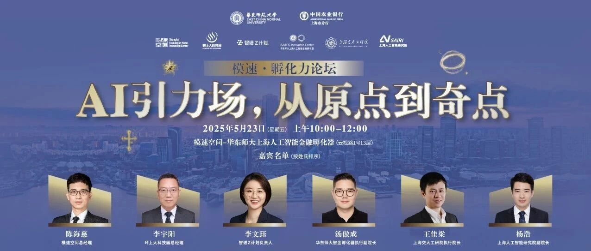
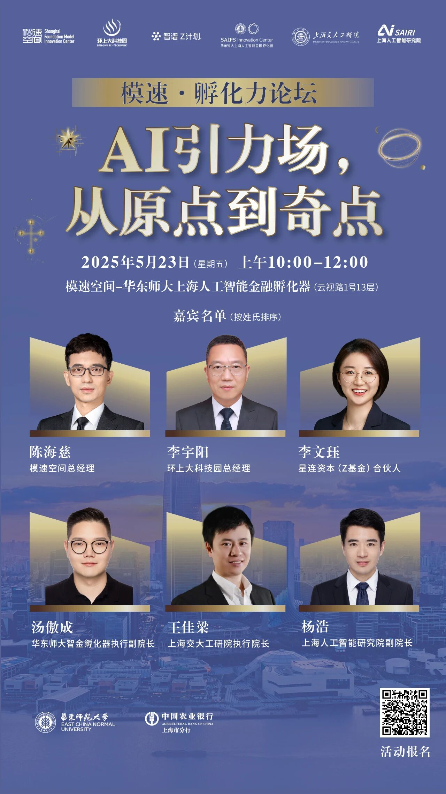

# 智金活动｜六大孵化器集结“模速空间”，你来不来！

> **作者**: 在“模速空间”的
> **发布日期**: 2025年5月15日 20:42
> **来源**: [原文链接](https://mp.weixin.qq.com/s/swVgJaDjal7woGNXfmVB9g)

---

  

  

谁能抓住下一个AI爆点？  
谁能连通技术、产业和资本的黄金通道？  
别只在朋友圈围观，

这次你可以亲临现场！

  

  

由**华东师范大学上海人工智能金融孵化器**主办，**模速空间、环上大科技园、**智谱Z计划、上海交大工研院、****上海人工智能研究院********协办的“模速孵化力论坛”，将汇聚AI孵化领域的关键力量，聚焦“引力构建｜资源聚变｜爆发机遇”三大核心议题，解锁AI孵化生态的未来路径。

  

  

  

  

三大议题，逐一引爆！

**引力构建｜人才与路径**  
AI孵化的起点不只是代码，

从人到人群，爆点藏在思维方式里。

  

**资源聚变｜技术与行业**  
大模型+大场景怎么玩？

技术如何和真产业深度捆绑？

一线操盘手给你答案。

  

**爆发机遇｜资本与支持**  

好点子怎样不止停在PPT？

让资源流动起来，找到你的“点火器”。

  

  

## 重磅嘉宾阵容 全员实战派

## 本次论坛邀请六大孵化机构的核心负责人，

## 共同探讨AI孵化的生态系统升级之路。

##   

陈海慈｜模速空间总经理

王佳梁｜交大工研院总经理

李宇阳｜环上大科技园总经理

杨 浩｜上海人工智能研究院副院长

李文珏｜星连资本（Z基金）合伙人

汤傲成｜华东师大智金孵化器执行副院长

  

他们不是来讲“愿景”的，

是来分享他们每天正在做的事。  
能听懂他们的语言，

也许你就离AI孵化的“核心场”更近一步。

  

  

## 「星图构想」全球首发

## 

六大孵化器将联合发布  
AI孵化生态未来图景。  
**“点”怎么变“场”？**

**“场”如何成“系”？**  
这个蓝图，年轻人要有一份话语权。

  

  

## 打破壁垒，一起搞事业！

## 

这不是一场会议，

是一次集体行动！  
六大孵化器要联手拆掉壁垒，  
共建一个“技术-人才-产业-资本”

一体化的AI孵化生态。

  

如果你是👇  

✅ 想要亲手打造下一个AI项目的

在校学生或青年研究员  
✅ 正在组队创业、寻找技术落地

以及资本支持的创业者  
✅ 关注前沿AI动向、

想提前捕捉行业信号的投资人  
✅ 想看清下一轮技术爆点的

企业创新负责人/产业合伙人

  

这场论坛，就是为你准备的！

  

  

**论坛时间和地点：**

2025年5月23日（周五），10:00-12:00

模速空间-华东师大上海人工智能金融孵化器

  

**席位有限，扫码即刻报名！**

请扫描下方二维码或点击“阅读原文”

  

  

一起进入“模速”时区，

和改变世界的人们碰个面！