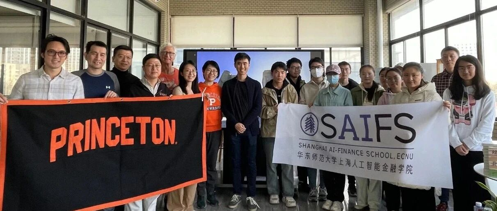
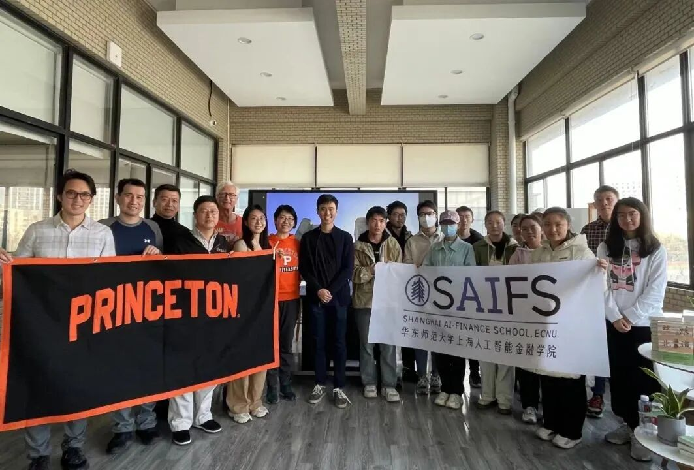
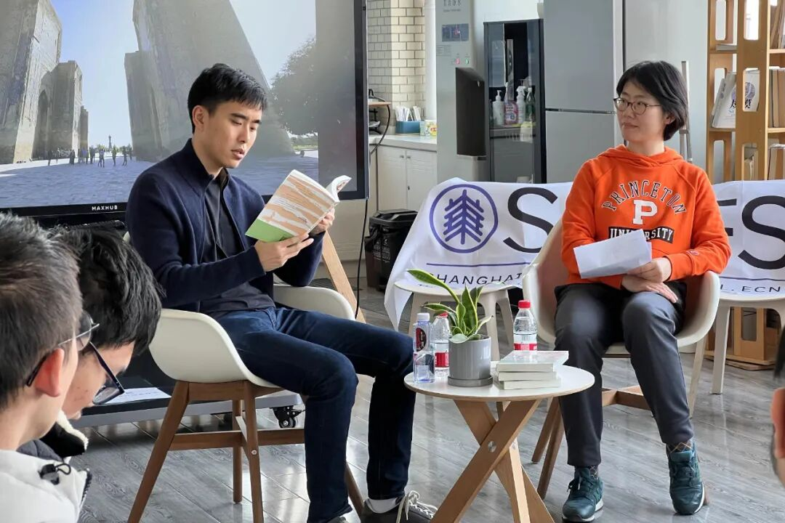
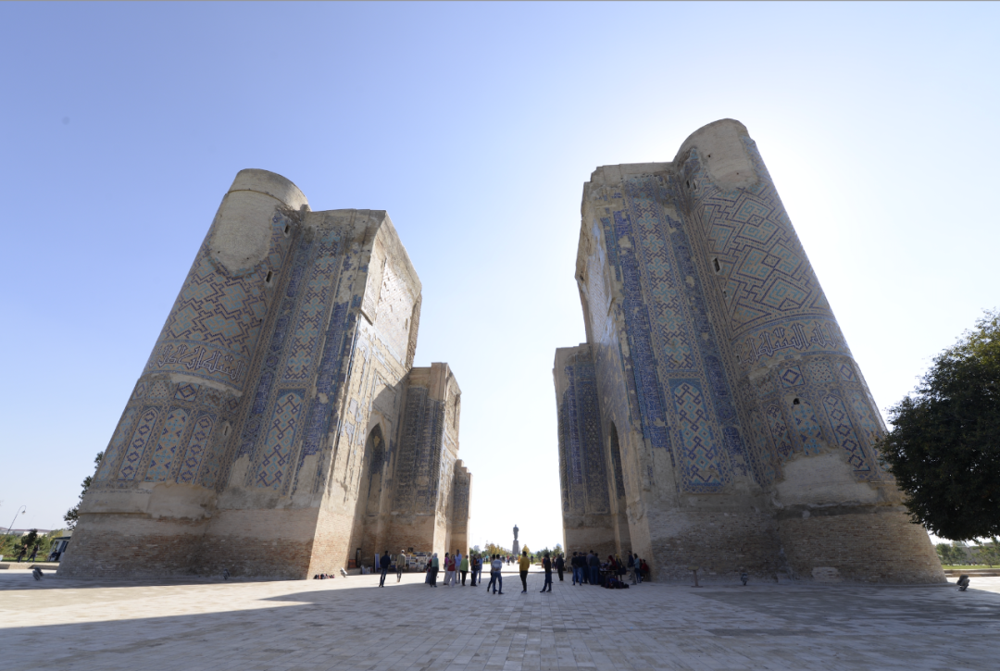
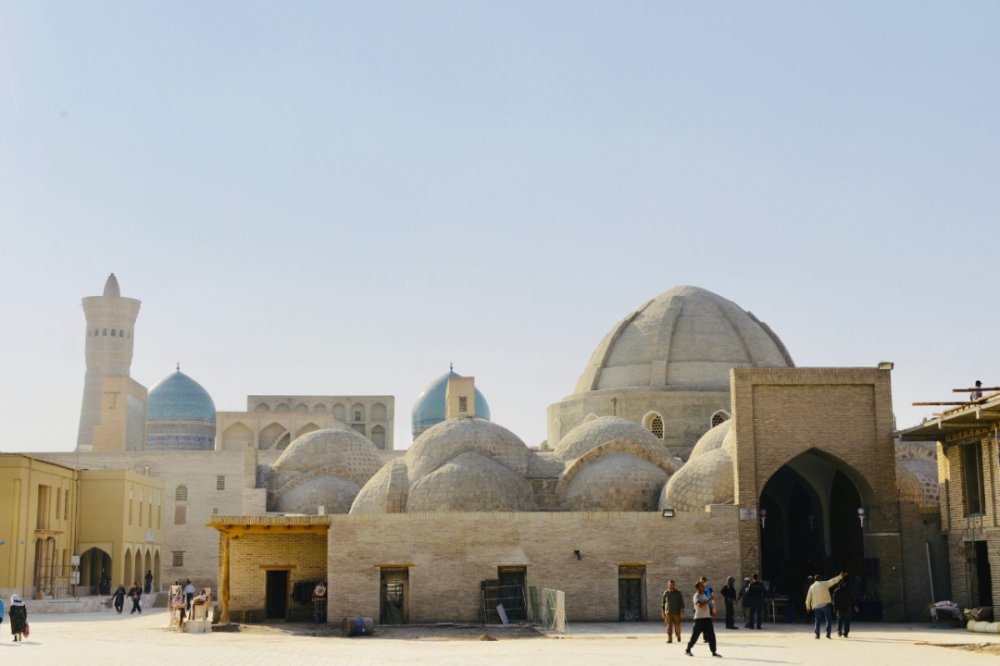
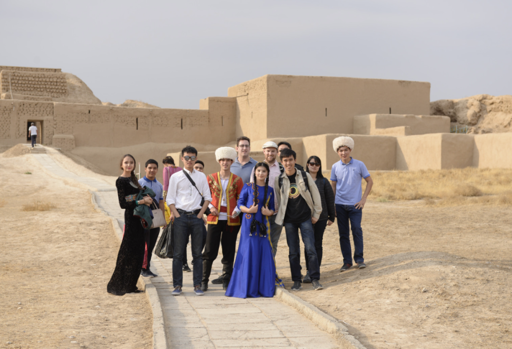
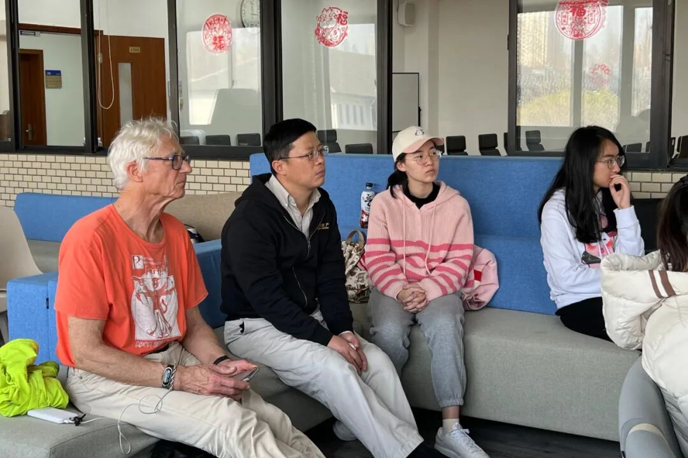
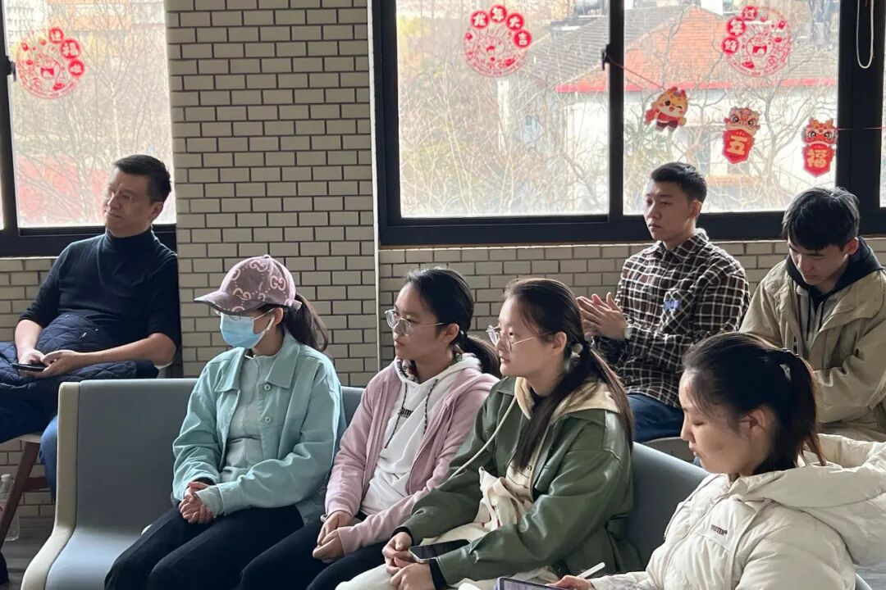
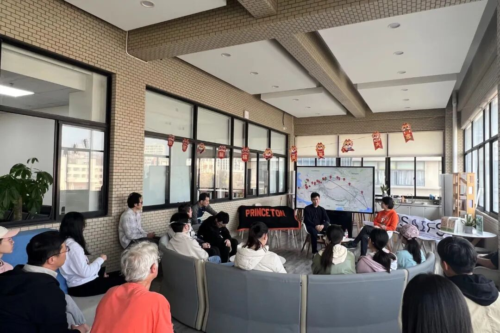

# 常春藤国际视野系列｜普林斯顿校友新书分享会：丝路见闻和跨文化视野下的启迪

> **作者**: SAIFS
> **发布日期**: 2024年3月18日 18:45
> **来源**: [原文链接](https://mp.weixin.qq.com/s/dxz_C9UpGltCkrHBjibOHQ)

---

  

  

（图：普林斯顿校友们和华师大学子们与作家彭英之合照）

  

3月16日周六下午，由普林斯顿上海校友会和上海人工智能金融学院联合举办的首场常春藤国际视野系列活动之“普林斯顿校友新书分享会：写给当代人看的丝绸之路”在中北校区的理科大楼三楼顺利举行。智金院推动该系列活动旨在通过常春藤校友们分享他们的人生故事、行业洞见及生活经验，为华师大的学生们展现广阔的国际视野以及跨界人生的无限可能性。

  

本次活动智金院荣幸地邀请到普林斯顿大学2010届数学系校友、作家彭英之前来分享他的旅行文学作品《丝路北道》。此次分享采用英文进行，共吸引了多名来自上海和杭州的普林斯顿校友及华师大6个不同学院的数名学生参加。该活动纳入华师大第二课堂的“人文素养”模块。

  

  

作者彭英之在2015年与师兄兼同事一起设计了旅途时间长达一个月的陆路出行计划，并于 2017年与同时代创业者、律师、工程师朋友一起整装出发。彭英之既是旅行的亲历者，也是旁观者，从起点西安一直到德黑兰，旅途期间经历了伙伴们的加入与离开，他将沿途的感悟写成了《丝路北道》。

  

本次分享会由普林斯顿大学2006届经济系校友徐秋瑜担任主持人，并在一段由她和彭英之引人入胜的相互介绍和对话中揭开了序幕。

  

（左：彭英之；右：徐秋瑜）

  

彭英之不仅分享了他的丝路经历、挑战与惊喜以及在旅途中对于跨文化的理解，也分享了他在不同行业角色转换的经历和构建他职业框架的养分来源。他的分享激发了在场听众对旅行的热爱，并向他们展示了如何利用旅行经历在不同领域进行探索和成长。他还讲述了自己的探索旅程如何激发他的跨界思考，并为未来的职业发展做铺垫，以及他是如何从金融领域的佼佼者转变为多元发展的斜杠青年。

  

  

**听华师大学子们说**

ECNUer's Sharing

  

经管学院2022级信息管理与信息系统专业倪同学：

“这场分享会让我印象最深的地方在于作者的广泛涉猎和从不间断的好奇心。从年轻时抱有单纯的乐趣到为寻求知识及背后的故事，再到通过旅行保持敏锐、跳出舒适区，以保护好奇心和探索欲。他在不同维度上的人生体验分享非常打动我，过程中我不断有‘人生原来还可以这样’的感慨，这也为我以后的选择拓宽了道路。”

  

经管学院2022级旅游管理专业敖同学：

“在旅途中，会面临各种挑战和未知，而正是这些经历让作者和他的旅伴们学会适应、学会独立，同时也让他们更加珍惜和感激生活中的点滴。我更值得欣赏的是作者将这一段经历写成文字。” 

  

公管学院2022级行政管理专业蒋同学：

“作者这本旅行文学作品带我们领略自然的浩瀚绮丽、历史的源远流长，让我们更加积极地去探索生活中的美好与幸福。”

  

  

在对话尾声，彭英之也分享了他对华师大学子们在跨界探索人生方面的建议。“You should try to enjoy life more and pursue things not just for practical reasons but also for the joy and enrichment they bring to your life. This approach helps you endure tough times, like the challenging situations you might face in your career.” （翻译：你应该尝试更多地享受生活，并追求那些不仅仅是出于实际原因，而是因为它们能给你的生活带来欢乐和丰富的事物。这种方法能够帮助你渡过艰难时期，比如你可能在未来职场面临的挑战性情况。）

  

           

文字撰写和图文编辑｜华师大智金院

      审核 | 普林斯顿上海校友会，华师大智金院

  

  

  

  

