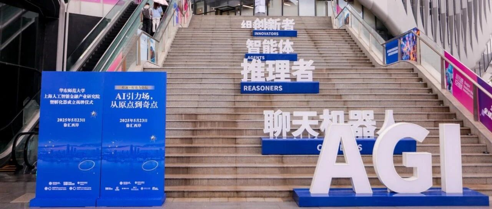

# AI+金融，未来已来！华东师大上海人工智能金融产业研究院暨孵化器在“模速空间”正式成立揭牌！

> **作者**: 
> **发布日期**: 2025年5月26日 12:02
> **来源**: [原文链接](https://mp.weixin.qq.com/s/zYxlGh6gUTiWwudyW7JWIQ)

---

30天的人类分析师工作

30秒即可由智能体完成

一键生成信贷报告

长达44页、近两万字

所有数据均通过幻觉检测器核验

并带有准确数据引用来源

今天，华东师大上海人工智能

金融产业研究院暨孵化器

在“模速空间”揭牌！

现场发布多项

“AI+金融”重磅研究成果

一起来看

  

  

在习近平总书记“加快建成具有全球影响力的科技创新高地”“力争在人工智能发展和治理各方面走在前列”重要指示精神指引下，华东师范大学上海人工智能金融产业研究院暨孵化器揭牌仪式于5月23日在徐汇区“模速空间”举行。

来自上海市经济和信息化委员会、上海市徐汇区、中国农业银行上海市分行、华东师范大学及相关企业孵化器的政产学研用金多方代表近百人出席，共同开启人工智能与金融深度融合的新篇章，为上海建设国际金融中心与科创中心注入强劲动能。

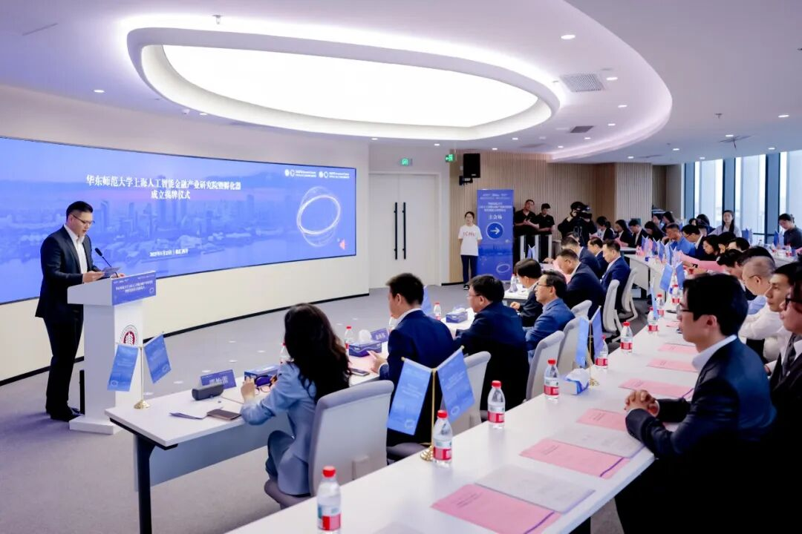

华东师范大学上海人工智能金融产业研究院暨孵化器揭牌仪式在徐汇区“模速空间”举行

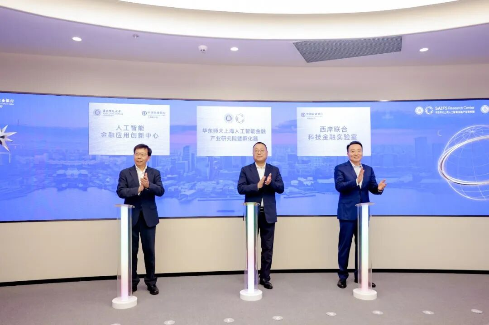

曹立强、韩国强、钱旭红共同为三大平台揭牌

上海徐汇区委书记曹立强、中国农业银行上海市分行行长韩国强，以及华东师范大学校长钱旭红共同为华东师范大学上海人工智能金融产业研究院暨孵化器、“华东师范大学-中国农业银行上海市分行”人工智能金融应用创新中心、西岸联合科技金融实验室三大平台揭牌，标志着华东师范大学与徐汇区、农行携手绘制“科技-产业-金融”良性循环的上海蓝图。

据悉，作为华东师范大学首家区级高质量孵化器，华东师范大学上海人工智能金融产业研究院暨孵化器获徐汇区大力支持，聚焦可信金融垂类大语言模型研发、人工智能金融示范场景打造及金融语料库建设，推动“产学研用”深度融合。

在徐汇区政府、农行上海市分行、华东师范大学的三方协同下，孵化器将加速构建“金融科技大模型研发-场景验证-产业转化-生态孵化”的全链条闭环，助力上海建设全球金融科技中心。

  

 政银校协同，锚定国家战略新坐标

  

作为落实总书记考察上海重要讲话精神的具体实践，研究院暨孵化器的成立标志着“政产学研用金”协同创新迈入新阶段。

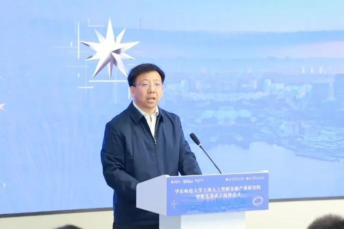

徐汇区委常委、副区长俞林伟致辞

徐汇区委常委、副区长俞林伟指出，徐汇作为上海科创中心的重要承载区，近年来市区联手打造了全国首个大模型创新生态社区模速空间，带动全区聚集了人工智能企业超1000家，为建成全国人工智能高地和世界级人工智能产业集群奠定了基础。

本次活动标志着三方的合作迈上新的台阶，徐汇区将深度链接华东师范大学、中国农业银行创新资源，全链条升级科技创新体系，加速人工智能金融科技的成果转化，期待此次三方合作的平台能够在风险管理、资产定价等核心领域取得关键进展。

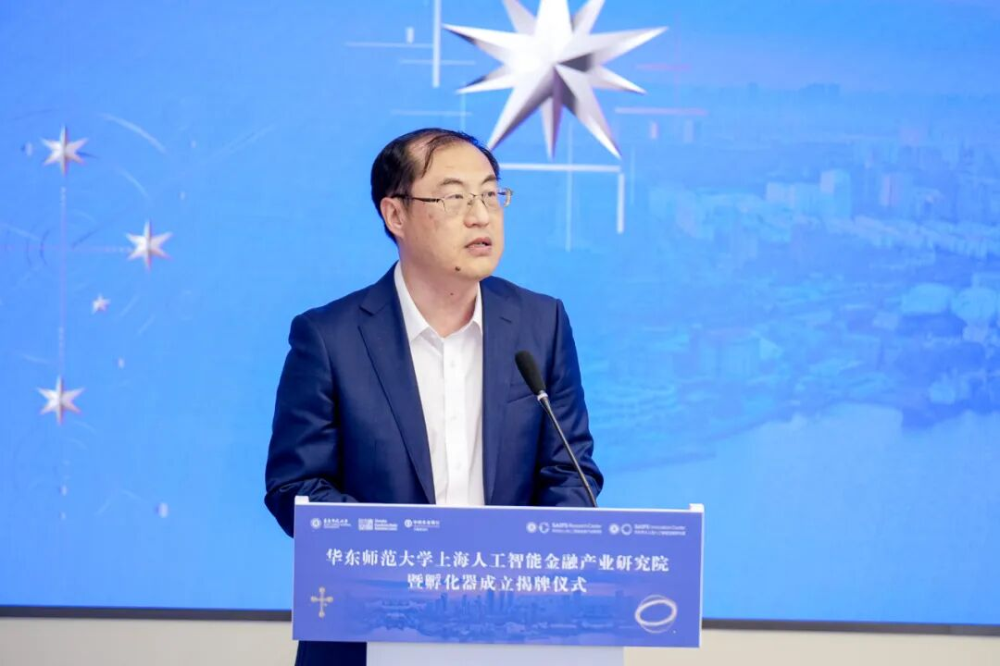

中国农业银行上海市分行党委委员、副行长翟冀致辞

中国农业银行上海市分行副行长翟冀强调，作为农行系统重点城市行，上海市分行强化高质量服务上海“五个中心”建设，不断深化改革创新，推动金融与科技深度融合，以金融赋能新质生产力发展。

上海市分行以本次揭牌为新起点，与徐汇区、华东师范大学以及社会各界构建起“技术研发-产业场景-创业孵化”的“创新共同体”，为加快推动人工智能这一年轻事业发展注入新活力新动能。

  

 技术突破与场景落地双轮驱动

  

仪式现场，华东师范大学上海人工智能金融产业研究院院长邵怡蕾及团队重磅发布三大核心成果。

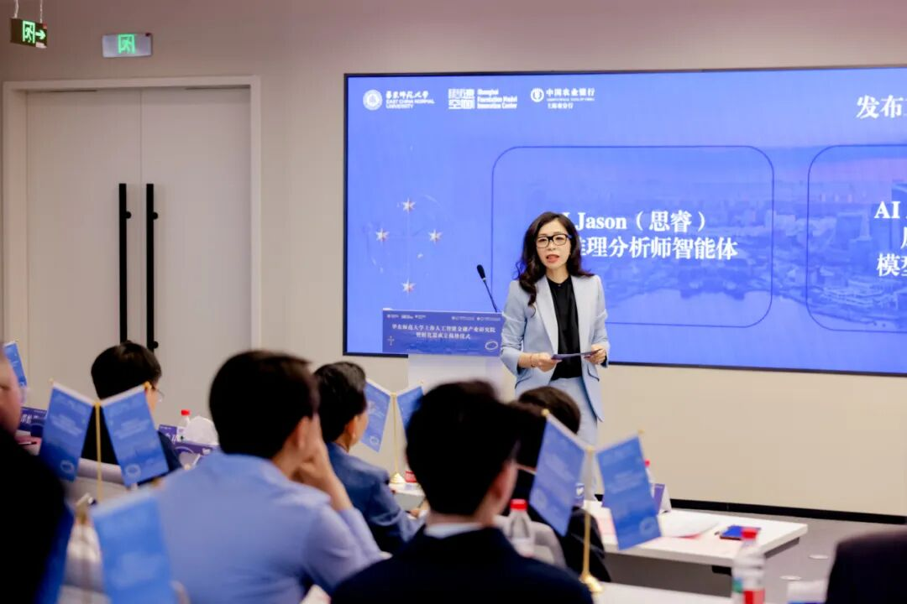

华东师范大学上海人工智能金融产业研究院院长邵怡蕾发布成果

一是嵌入“金融推理思维链数据库”“政策-行业-公司多源多态数据池”基础上的多模态、去幻觉、推理增强型金融推理大模型“SmithRM”，为智能信贷、金融分析以及风险控制等场景提供自主可控的技术底座。

同步发布的金融智能评测基准FinAR Benchmark，用于评估各类通用大模型以及金融垂类模型在财务理解、逻辑分析和基本面判断任务中的综合能力。

这一评测体系不仅填补了国内金融推理能力量化评测的空白，同时也为监管机构、金融企业选型部署大模型提供了系统性参考。

二是金融智能体家族SAIFS-F4（Finance 4），包括AI Jason（思睿，金融分析师智能体）、AI Alex（律衡，风控与合规模型治理智能体）、AI Jay（观微，政经宏观分析师智能体）、AI Emma（织元，数据科学家智能体）。这些智能体将重构金融中后台的知识劳动逻辑，构成新智能金融系统中的“数字协作者群”。

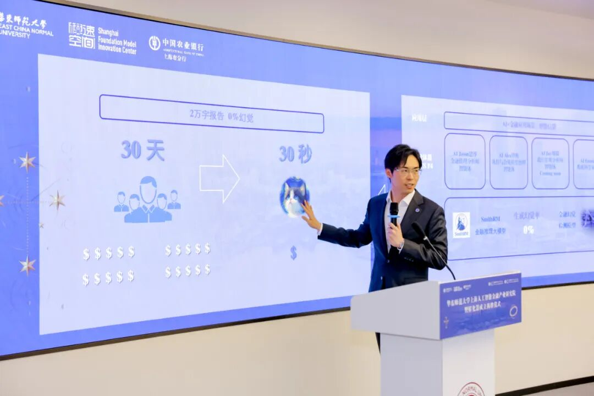

金融大模型实验室副主任汪俊霖在现场演示金融分析师智能体AI Jason一键生成信贷报告

金融大模型实验室副主任汪俊霖（Jason）在现场演示金融分析师智能体AI Jason，用30秒即完了某上市公司一份长达44页、18947个字的信贷报告，且其中所有数据均通过SAIFS的幻觉检测器的核验，达到0幻觉，并带有准确数据引用来源。

现场演示展示了AI Jason的三大特征，首先是快，30天的人类分析师工作，30秒即可由智能体完成；其次是准，0幻觉，数字100%正确率；其次是可解释性，通过10万条精标注的思维链数据来将15TB大小的行业、企业、政策报告及尽调数据提炼成SmithRM的能力，从而生成出逻辑严密，可解释的信贷报告。

三是AI+金融示范场景，华东师范大学上海人工智能金融产业研究院与农行上海市分行共建智能信贷与智能宏观分析两大示范场景，借助金融智能体SAIFS-F4体系，实现“数据-模型-智能体-场景-学习再反馈”闭环，以“可嵌入系统的智能能力”回应金融安全与效率的双重挑战。

  

 创新生态构建，培育新质生产力

  

“本次揭牌既是华东师范大学对总书记打造全球科创高地殷切嘱托的坚定回应，也是对上海建设‘五个中心’战略的主动担当，更是高校以交叉学科优势培育战略急需人才的创新实践。”  

华东师范大学党委副书记孟钟捷指出，学校将依托研究院聚焦三大战略支点发力，即锻造核心技术高地，攻关金融科技底层技术，为金融安全装上“中国锁”；创新产教融合范式，以“学科交叉+场景驱动”培育复合型人才，打造创业孵化全链条；构建兼顾创新与伦理的评估体系，输出人工智能治理“上海经验”。

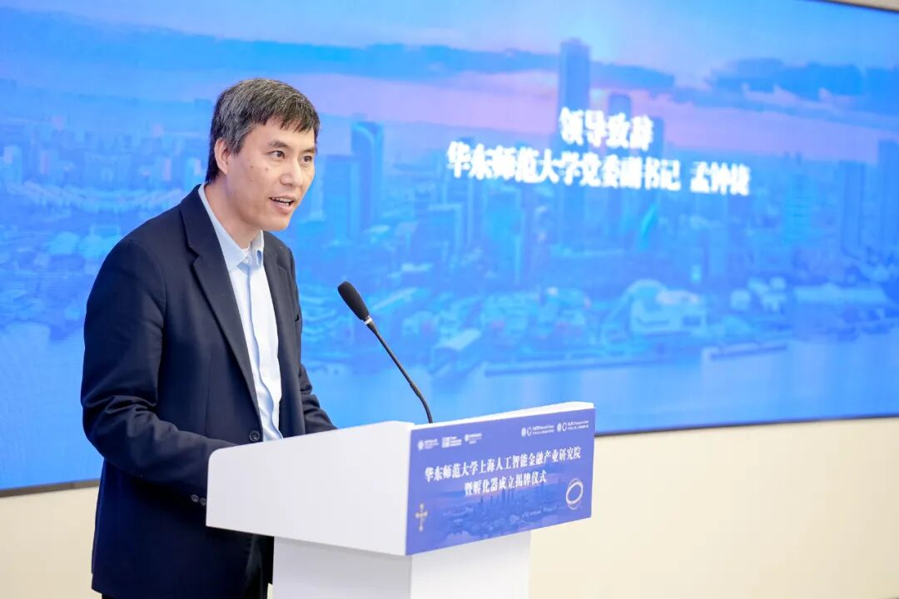

华东师范大学党委副书记孟钟捷致辞

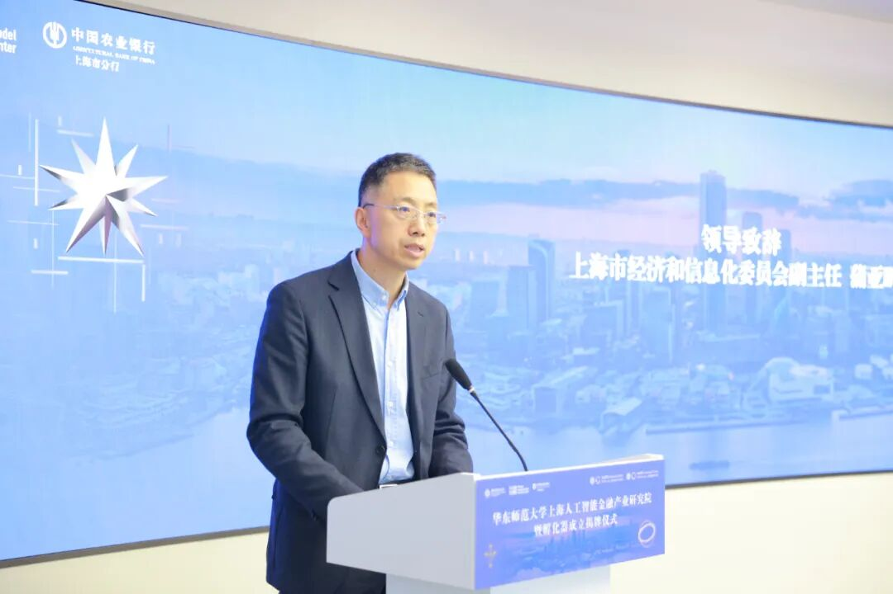

上海市经济和信息化委员会副主任蒲亚鹏致辞

上海市经济和信息化委员会副主任蒲亚鹏强调，上海将深入贯彻落实习近平总书记重要讲话精神，持之以恒支持人工智能前沿创新和产业应用，继续当好全国人工智能排头兵和先行者。

“我们将加快夯实AI基础底座，打造超大规模智能算力基础设施，完善语料数据供给体系，更好支撑人工智能应用创新。”他期待人工智能金融产业研究院暨孵化器能够抢抓人工智能发展机遇，加快研发可信金融垂类大模型，建设金融行业示范场景，打造金融AI创新产品，深化人工智能在金融行业的应用。

  

 金融活水润泽科创沃土

  

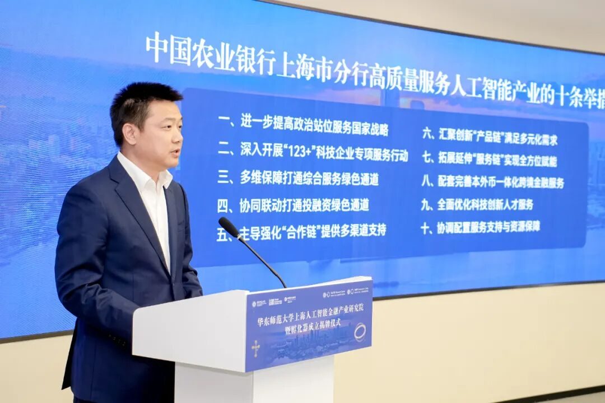

中国农业银行上海市分行副行长朱卫峰发布“十条举措”

中国农业银行上海市分行副行长朱卫峰同步发布“中国农业银行上海市分行高质量服务人工智能产业的十条举措”，坚持将支持人工智能产业作为服务国家战略的重要方向，构建“政府+农行+配套服务”的科技金融服务生态体系，开创服务人工智能企业“投行+商业银行+交易银行”的特色模式。

同时，中国农业银行上海市分行发布模速贷产品，推出“一园一策”批量服务模式，重点服务模速空间内人工智能企业。

  

 全球新使命：定义智能金融的可信未来

  

回应总书记“在人工智能发展和治理方面走在前列”的殷切嘱托，现场发布了华东师范大学上海人工智能金融产业研究院暨孵化器使命手册。

以人工智能与金融深度融合为目标，手册提出在技术突破（北极星）与伦理底线（南十字星）之间构建张力场域，以应对科研如何转化为可信生产力，风控如何嵌入智能底层，金融体系如何回应“全球南方”的呼声，监管科技与伦理责任如何协同，人才结构如何从“技术者”变为“协调者”等重大议题，在追求北极星代表的科研极致的同时也让南十字星代表的伦理坐标守护人类文明底线，致力于打造中国式现代化金融治理的“东方方案”。

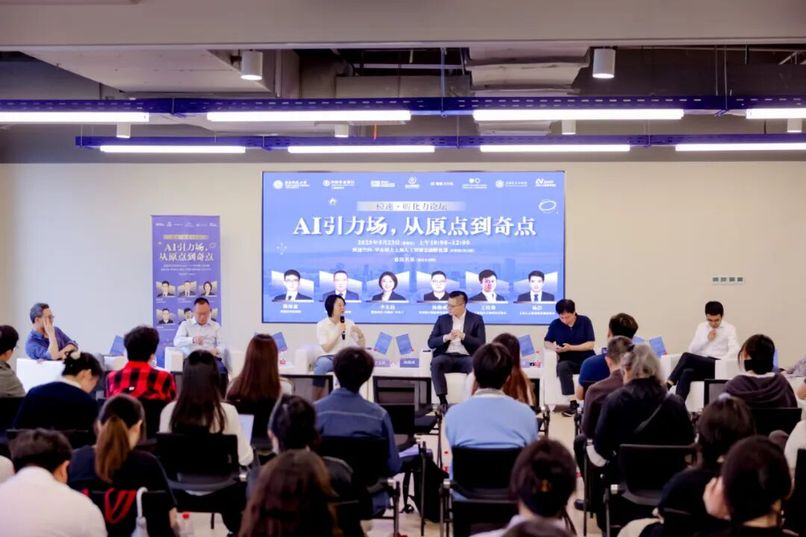

“模速孵化力论坛”同期举行  

揭牌仪式后，由华东师范大学上海人工智能金融产业研究院暨孵化器主办，模速空间、交大工研院、环上大科技园、上海人工智能研究院、智谱Z计划共同支持的“模速孵化力论坛”同期举行。

论坛以“AI引力场，从原点到奇点”为主题，汇聚六大孵化器与加速器的领军人物，共同探讨AI时代创业生态的构建与发展路径，论坛还发布了“星图构想”，展望AI创业生态的未来趋势。

  

来源丨华东师范大学上海人工智能金融产业研究院暨孵化器

编辑丨华东师范大学党委宣传部 戴琪