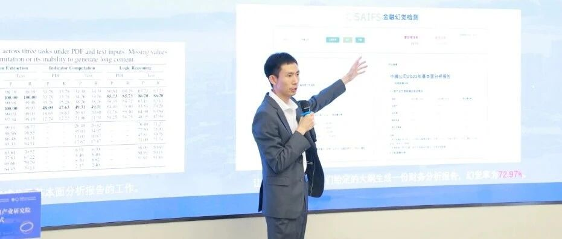

# 导师介绍｜吴宗翰助理教授：国际人工智能领域“万引”青年学者｜智金院“模速”夏季学校首轮报名即将截止！

> **作者**: 推荐夏校导师的
> **发布日期**: 2025年5月28日 18:42
> **来源**: [原文链接](https://mp.weixin.qq.com/s/NldeE4B_DzEmSv0KLvcQdQ)

---

**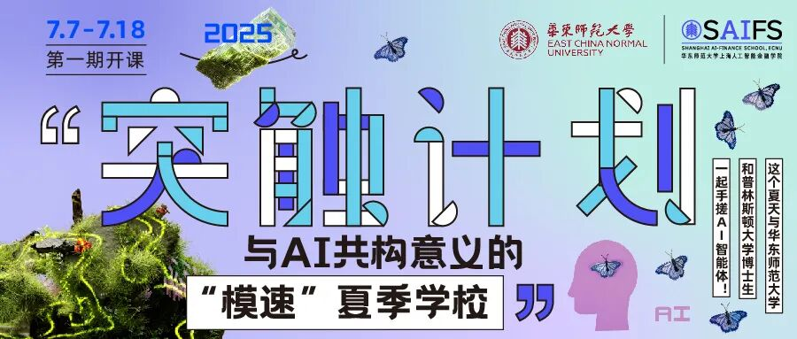**

****导师介绍****

  

吴宗翰 助理教授

国际人工智能领域“万引”青年学者

华东师范大学上海人工智能金融学院助理教授

悉尼科技大学博士

  

吴宗翰助理教授的研究兴趣包括图机器学习和大语言模型，他的研究在谷歌学术（Google Scholar）上的引用次数超过17,000次, 研究成果在学术界得到了广泛认可和应用。

  

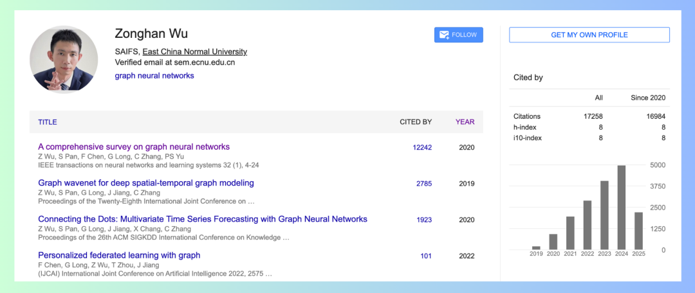

吴宗翰助理教授的谷歌学术个人页面

  

最近，吴宗翰助理教授及其科研团队推出了一个人工智能金融评测基准FinAR-Bench。这个评测基准主要评估大语言模型是否具备撰写基本面分析报告的能力。生成式人工智能，尤其是大语言模型，正在开始改变金融行业，通过自动化任务并帮助理解复杂的金融信息。其中一个特别有前景的应用场景是自动生成基本面分析报告，这类报告对于做出明智的投资决策、评估信用风险、指导企业并购等具有重要意义。尽管大语言模型尝试通过单个提示生成这些报告，但其存在显著的不准确风险。糟糕的分析可能导致错误的投资决策、监管问题以及信任的丧失。吴宗翰助理教授及其团队的研究结果清晰地揭示了当前LLMs在基本面分析中的优势与局限性，并提供了一种更贴近实际金融环境的性能评估方式。

  

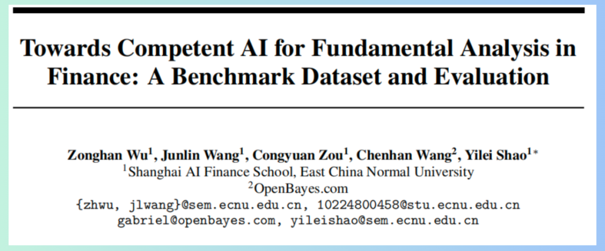

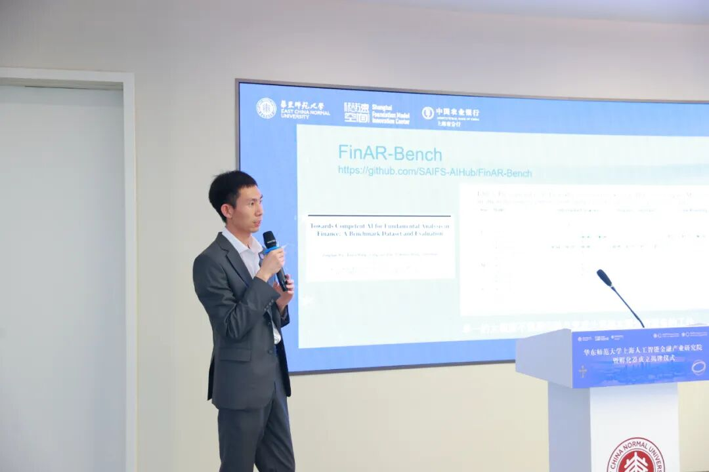

5月23日，吴宗翰助理教授在华东师大智金产研院暨孵化器

成立揭牌仪式中向观众介绍人工智能金融评测基准FinAR-Bench  

  

2020年，吴宗翰助理教授在IEEE TNNLS杂志上发表的一篇关于图神经网络的文章，详细地归纳和总结了各种类型的图神经网络，并提出了一种新的图神经网络分类方法，提供了对现代深度学习技术在图数据方面的最全面的概述，讨论了图神经网络的理论方面，分析了现有方法的局限性，并就模型深度、可扩展性、异质性和动态性提出了四个可能的未来研究方向。这篇文章目前已收获了超过一万余次的引用量，并获得IEEE CIS Transactions颁发的2024杰出论文奖。

  

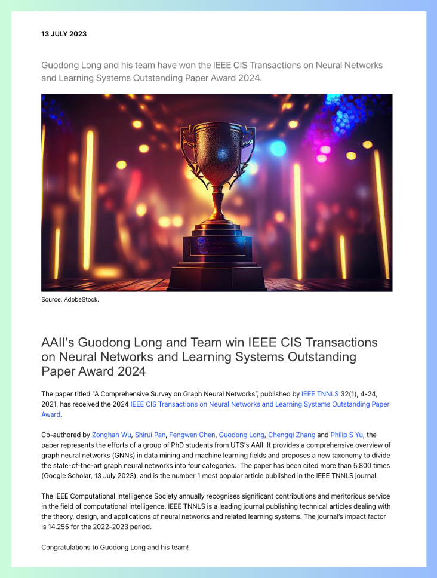

吴宗翰助理教授在IEEE TNNLS杂志上发表的

关于图神经网络的综述文章

荣获**IEEE CIS Transactions2024****杰出论文奖**

  

2019年，针对传统图神经网络局限于静态图的问题，吴宗翰助理教授在IJCAI会议上发表的文章"Graph WaveNet for Deep Spatial-Temporal Graph Modeling"创新性地将空洞卷积与图卷积网络相结合，有效捕捉动态图中的时空依赖关系。这篇文章引用量超过2000次，入选IJCAI 2019最具影响力论文榜单。

  

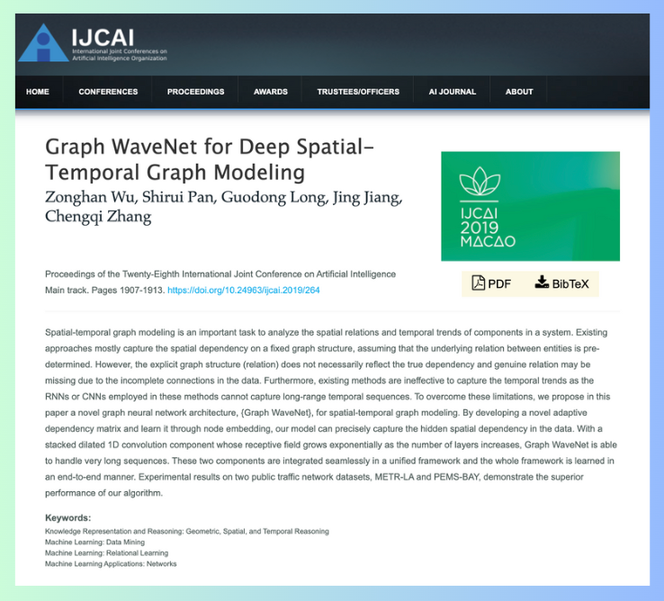

吴宗翰助理教授发表的文章入选IJCAI 2019最具影响力论文榜单

https://www.ijcai.org/proceedings/2019/264

  

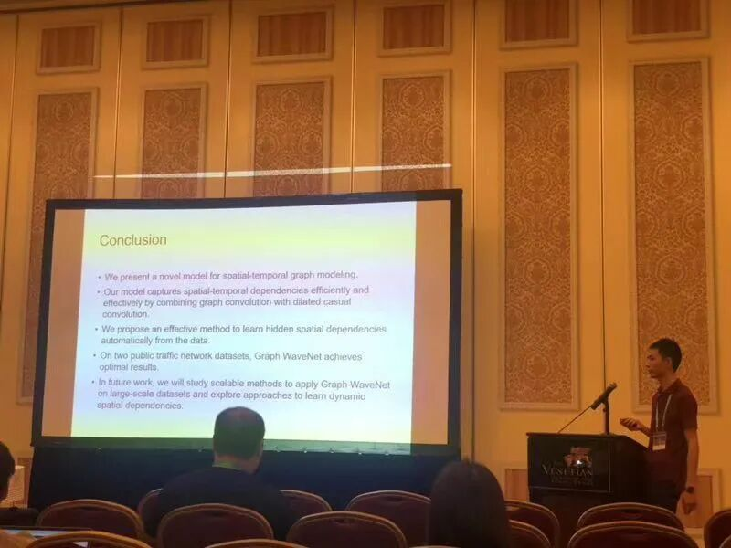

吴宗翰助理教授（左一）及其科研同事参加2019IJCAI会议

  

2020年，吴宗翰助理教授在ACM SIGKDD会议上发表"Connecting the Dots: Multivariate Time Series Forecasting with Graph Neural Networks"，提出了一种学习动态图数据隐藏结构的新方法，为多元时间序列分析开辟了新思路。该论文引用量超过1000次，入选KDD 2020最具影响力论文榜单。

  

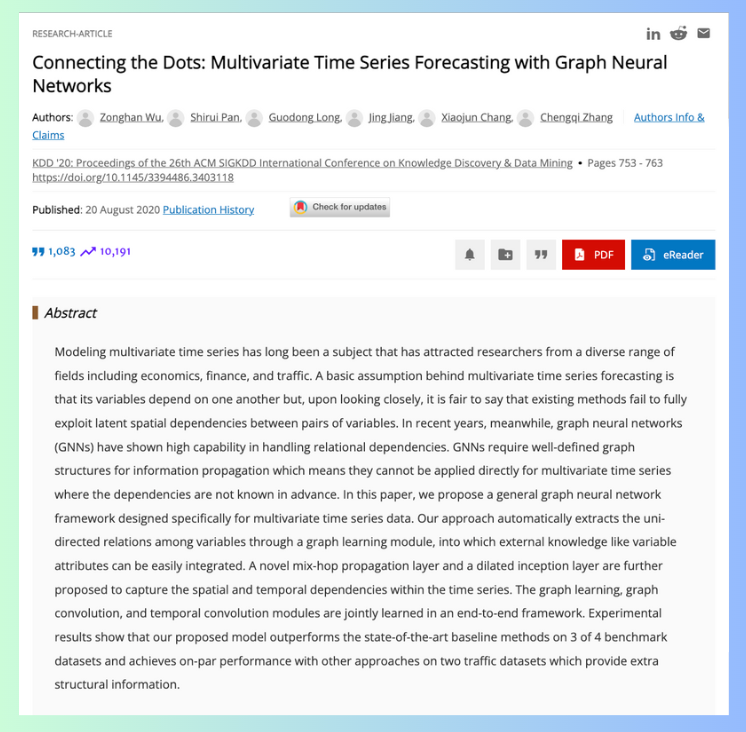

吴宗翰助理教授在2020**ACM SIGKDD****会议中发表的文章**

**入选****KDD 2020****最具影响力论文榜单**

https://dl.acm.org/doi/abs/10.1145/3394486.3403118

  

  

****吴宗翰助理教授将在2025智金院****

****“模速”夏季学校中********主讲****

****《智能的基石：深度学习的原理与未来》****

课程简介：

人工智能正深刻地改变我们的生活，而“深度学习”是让电脑变聪明的关键技术。在本课程中，吴宗翰助理教授将用通俗易懂的方式介绍深度学习的核心原理和热门应用。从识别图片里的猫，到让AI写作文、说话聊天，你将逐步了解这些神奇技术背后的工作方式。课程结合讲解与动手实验，让你在实践中真正理解并应用深度学习的基本方法，为未来学习AI打下坚实基础。

  

学习目标：

-   理解什么是深度学习，它和人工智能、机器学习的关系；
    
-   了解让AI“学习”的基本方法，比如“误差”“训练”“优化”等关键概念；
    
-   学会搭建几种常见的神经网络模型，比如：能识别图片的卷积网络、能处理语句的循环网络、ChatGPT背后的Transformer；
    
-   掌握训练模型的基本流程，了解如何“调试”和“改进”一个AI系统；
    
-   初步掌握使用一种流行的AI开发工具（PyTorch）来进行简单的模型实验；
    
-   了解未来深度学习的发展方向，如智能体、多模态、安全和可解释性等。
    

  

你将收获：

-   清楚深度学习是什么，它是如何“让电脑学会做事情”的；
    
-   能亲手搭建并训练一个简单的AI模型，体验“让AI动起来”的过程；
    
-   了解深度学习如何应用在现实中，比如：人脸识别、语音助手、聊天机器人等。
    

  

2025智金“模速”夏季学校授课安排

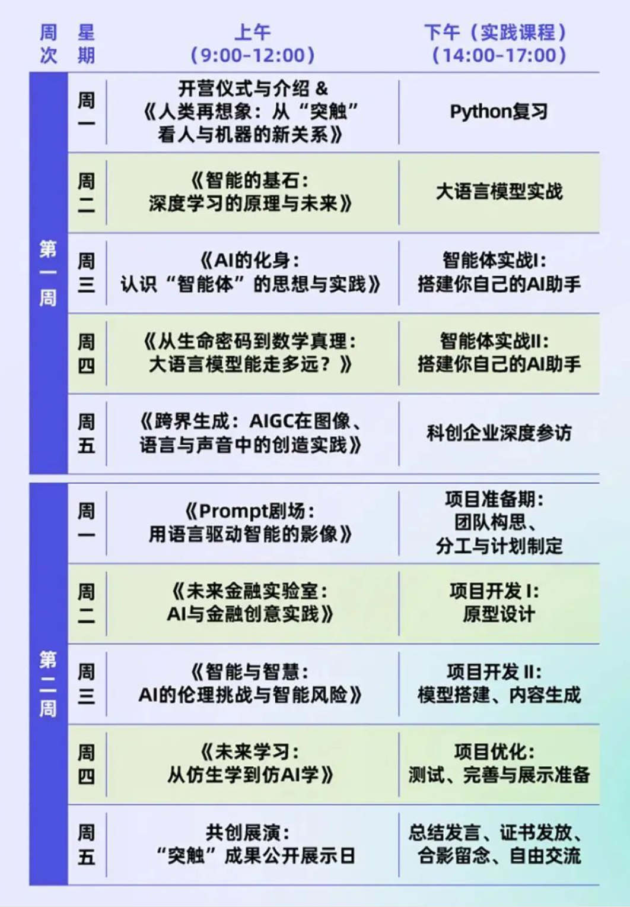

  

  

2025智金“模速”夏季学校课程：

7月7日至7月18日

第一轮报名截止日期：

本周五，5月30日

报名可咨询微信：ECNU\_SAIFS

  

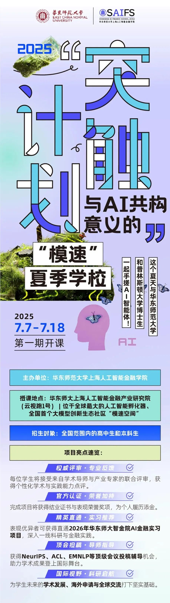  

  

---

  

2025智金“模速”夏季学校官方简章：

[这个夏天，来“模速空间”，一起搞“年轻人的事业”！｜“手搓”AI智能体“模速”夏季学校](https://mp.weixin.qq.com/s?__biz=MzkxMTY1ODk2Mw==&mid=2247486718&idx=1&sn=bbf57b10e997d2e1e7f81892ff13935f&scene=21#wechat_redirect)