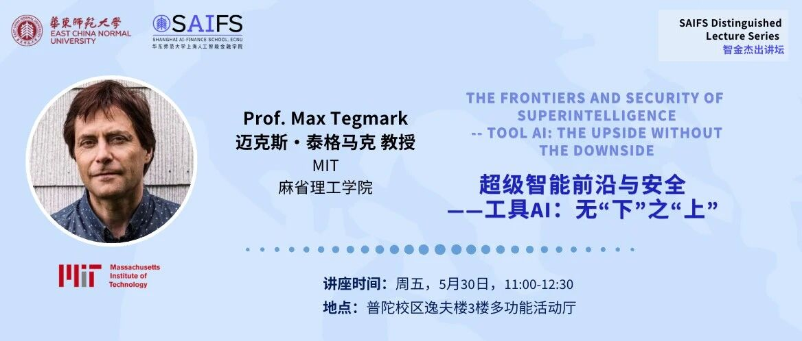
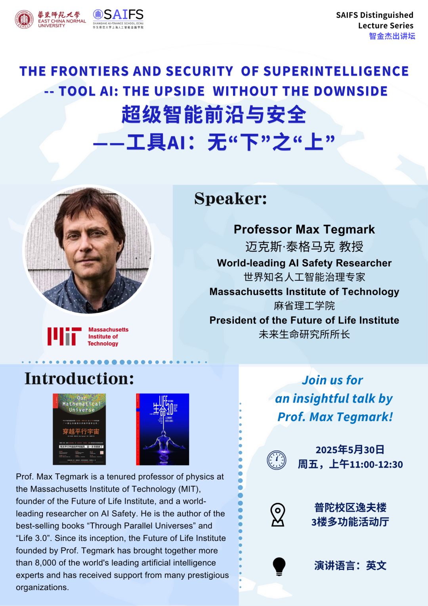



# 智金杰出讲坛·活动预告｜明天，世界知名人工智能治理专家Max Tegmark教授在SAIFS开讲！

> **作者**: 预热活动的
> **发布日期**: 2025年5月29日 13:38
> **来源**: [原文链接](https://mp.weixin.qq.com/s/PQ8AVDsYg9UkV70Pa_EtCw)

---

**‍**

****智金杰出讲坛·活动预告****

      本周五，5月30日，上午11：00，"智金杰出讲坛"特邀世界知名人工智能治理专家、麻省理工学院终身教授、未来生命研究所所长Max Tegmark教授亲临SAIFS，带来题为**“超级智能前沿与安全—工具人工智能：无“下”之“上”（The Frontiers and Security of Superintelligence--Tool AI: The Upside without the Downside）**的讲座。本次讲座座位有限，敬请提前入场。

  

****讲座简介****  

      ***如果我们能够在不失去对人工智能控制的情况下充分发挥人工智能的威力会怎样？是否有一条既能避免超级智能带来的危险，又能拥抱其前景的前进之路？***

     在本次讲座中，Max Tegmark教授将介绍人工智能发展的新模式。与人工通用智能（AGI）不同，工具人工智能（Tool AI）明确设计为在人类的直接监督下运行。它将为科学、金融、医学和教育等领域带来革命性的变革\--既能带来先进人工智能的好处，又不会面临失控的超级智能所带来的生存威胁。Max Tegmark教授将利用他的最新研究和政策倡导，概述确保人工智能系统符合人类价值观、透明运行并遵循其他高风险领域安全协议的具体策略。

  

****Max Tegmark教授简介****  

      Max Tegmark教授是世界知名人工智能治理专家，麻省理工学院终身教授、未来生命研究所的创始人。他被誉为“最接近理查德·费曼的科学家”。他是《穿越平行宇宙》和《生命3.0》两本畅销书的作者。泰格马克教授所创办的未来生命研究所自成立汇聚了8000多位世界杰出人工智能专家，还获得了许多著名组织的支持。

  

********活动简介************‍‍‍‍‍****

****讲座题目：****  

超级智能前沿与安全—工具AI：无“下”之“上”

**时间：**

**5**月30日（周五），上午11:00-12:30

**地点：**

**华东师大普陀校区逸夫楼3楼多功能活动厅**

