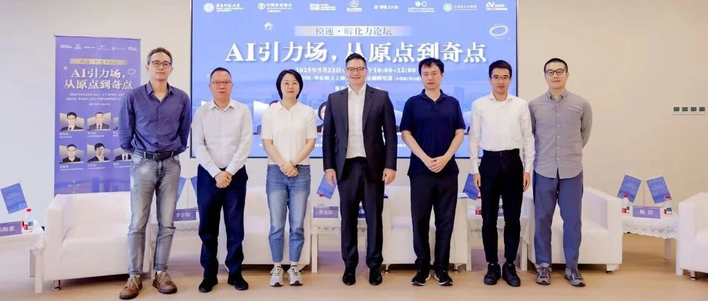

# 智金孵化器对话六大孵化器掌门人

> **作者**: 在“模速空间”的
> **发布日期**: 2025年6月3日 17:08
> **来源**: [原文链接](https://mp.weixin.qq.com/s/4xy43G_o74CEjnUwH7cfFA)

---

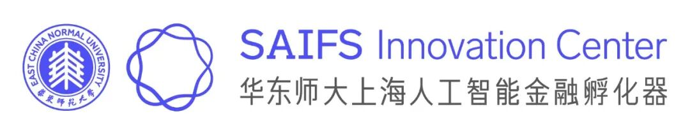

  

当AI掀起新一轮科技革命

创业生态如何突破技术“奇点”

构建可持续的创新引力场

六大孵化器掌门人的深度洞见

一起来听！

  

  

刚刚过去的五月，黄浦江畔迎来一场聚焦未来的思想盛宴——由华东师范大学上海人工智能金融产业研究院暨孵化器主办，模速空间、交大工研院、环上大科技园、上海人工智能研究院、智谱Z计划共同支持的“模速孵化力论坛”在模速空间举行。

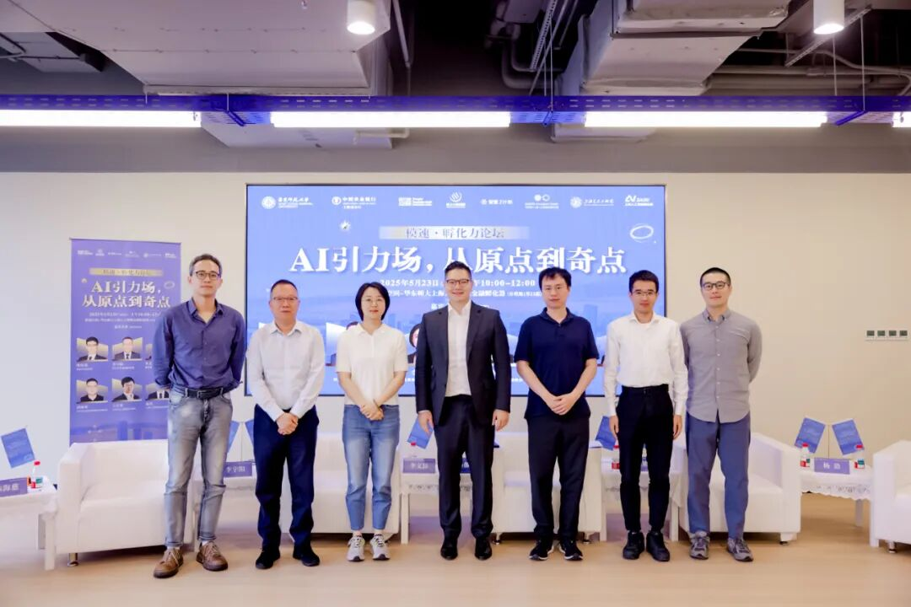

“模速孵化力论坛”在模速空间举行

论坛以“AI引力场，从原点到奇点”为主题，汇聚六大孵化器与加速器的领军人物，共同探讨AI时代创业生态的构建与发展路径，论坛还发布了“星图构想”，展望AI创业生态的未来趋势。活动由流利说联合创始人胡哲人主持。

  

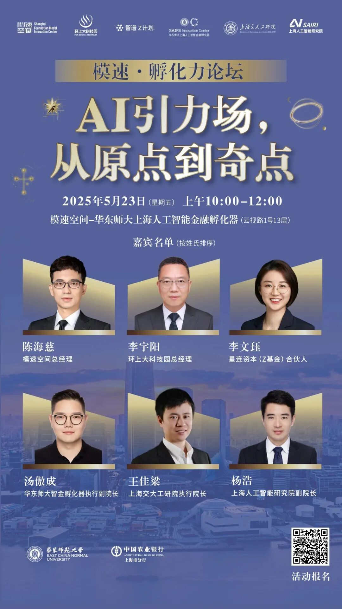

  

****我们真正孵化的是什么？****

****团队、技术还是新物种？****

  

  

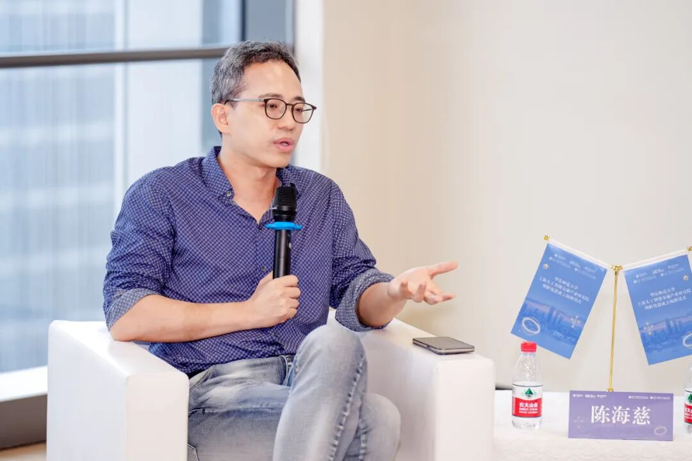

  

陈海慈（模速空间总经理）：创新具有天然的不确定性，而孵化器是创新链条中的关键环节。从国家战略到地方实践，再到个体创业，虽然目标维度不同，但都需要找到创新生态这个‘最大公约数’。

  

面对新的历史性机遇，需要做的一件事是顺势而为，打造一个创新的生态，无论是团队还是新物种，我们是要解决生态的问题。以模速空间为例，我们通过“引育、选育、孵育”，吸引优质项目种子，资源精准匹配培育企业，在这样的方法论和过程中离不开开放式的孵化和各方资源的携手，所以我做这件事是怎么把生态闭环做起来，做一个生态的打造，这个生态成立之后才能够支持我继续做下去。

  

我专注于大模型和研发赛道的一个孵化器和加速器，希望通过我的服务能够有更多的人工智能创业者愿意把模速空间作为他们的始发站，从这个目标出发，我更期待的是无论今天是同行业者还是资本方还是创新的研发机构，能够更关注模速空间，给予模速空间为大家服务的机会。

  

****当前高校人才培养体系（如AI学科设置）****

****与产业需求存在哪些错配？****

****孵化器如何补足这一缺口？****

  

  

  

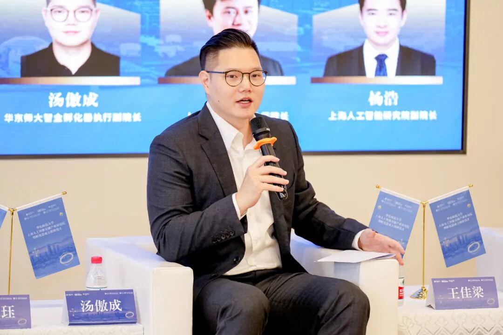

  

汤傲成（华东师大人工智能金融孵化器执行副院长）：问到“AI+X”或者跨界的问题，大家可以从华东师大上海人工智能金融产业研究院的名字定义中直观感受到，我们聚焦人工智能在金融领域的应用。不管是学院的成立还是研究院和孵化器的成立，其实都是华东师范大学的一次非常大胆的创新。我们发布了学院最底层智座金融大模型，除此之外还发布了四个非常重要的金融智能体，它们其实都是来自于金融行业非常真实的需求，通过不断在金融领域探索以后，结合我们自己的科研能力让AI跟金融这两样东西嫁接在一起。未来我们还会有更多的金融领域需求被挖掘，这个是我们整体的模式。

  

事实上，“AI+X”，包括我们所聚焦的“AI +金融”，在人才培养维度具有重要价值。我们观察到，高校在人工智能教学中，单纯传授技术知识并无障碍，但当需要引导学生探讨技术在具体行业中的应用场景时，往往面临培养难点——学生缺乏对产业真实需求的直观认知，导致技术与场景的衔接存在断层。

  

产业研究院与孵化器的成立，为解决这一问题提供了关键突破口。通过搭建产研融合平台，我们为学生开辟了接触金融产业一线需求的通道，使他们能够在真实场景中理解行业痛点。这种“技术教学 + 产业实践” 的双轨模式，推动学生将所学技术与实际需求深度耦合，从而在“AI+”跨界创新的赛道上具备更扎实的落地能力与长远发展潜力。

  

****在推动AI与传统行业融合时，****

****如何破解“懂技术的不懂行业，****

****懂行业的不信技术”的双向认知壁垒？****

  

  

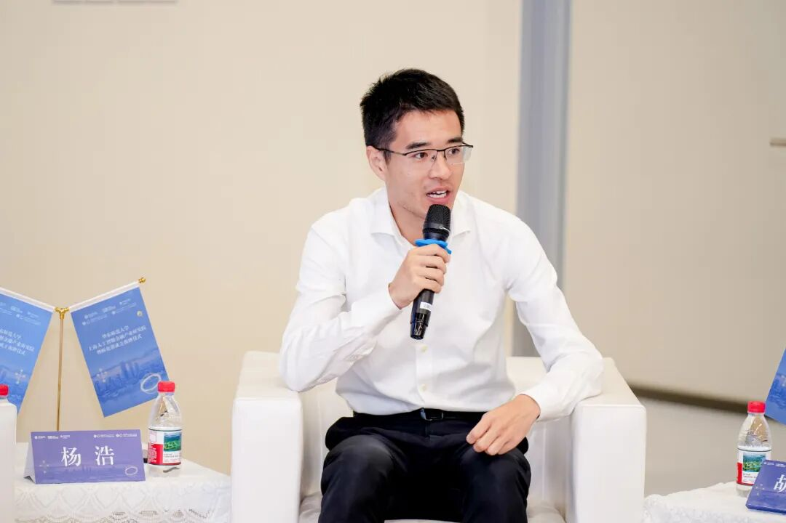

  

杨浩（上海人工智能研究院副院长）：作为上海市与上海交通大学共建的新型研发机构，上海人工智能研究院聚焦AI技术从实验室走向产业化的关键环节。科研机构与企业存在本质差异——企业需要多元化的角色配置，而真正优秀的创业者往往具备“多面手”特质。在我们观察中，成功的商业化项目不一定是技术最先进的，而是那些能够整合资本、场景、客户及合作伙伴资源的。 从以前的数据来看，科研创业项目在前两轮发展中表现尚可，但后续往往面临增长乏力。还有一些企业从市场需求出发，一开始并不注重技术的先进性，而是找技术去解决问题。这类一开始经营比较困难，但通过市场化的项目、产品和不断验证的循环之后，往往在后期能得到爆发式的快速增长。

  

针对这一痛点，上海人工智能研究院一手连接高校科研团队，一手培育市场化经营团队，研究院孵化的机器人企业“致远”正是这一模式的典型案例。项目由交大教授、技术天才少年和资深企业高管组成的团队，在研究院支持下仅用半年时间就完成技术验证和商业模型构建，目前该模式已复制到大模型等多个领域，经营团队+技术组合在技术正式成立之后是经营团队主导企业经营或者未来的发展。

  

****在资本寒冬中，孵化器如何设计****

****“资源换股权”“政府补贴联动”****

****等非现金支持模式？****

  

  

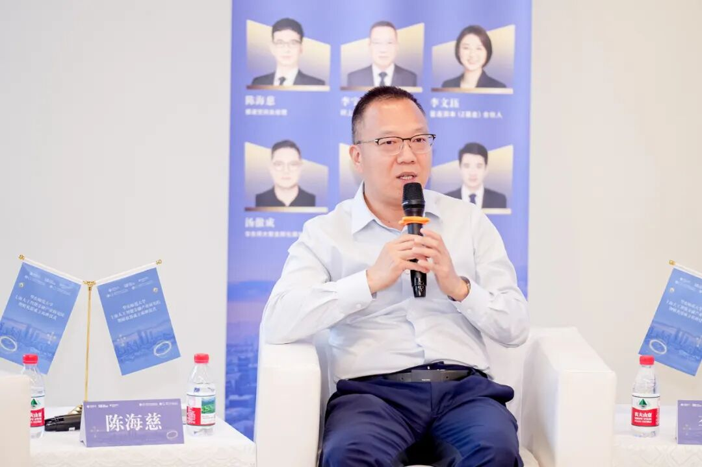

  

李宇阳（环上大科技园总经理）：目前资本寒冬，整个产业形式下全世界经济都面临很大的挑战。我们认为整个创业过程中都需要钱，就要把它切得更细，针对不同阶段去提供不同的资金方面的支持。

刚开始第一笔钱我们觉得最理想的投资人肯定是天使投资，因为在刚一开始的阶段商业模式和技术都不成熟，特别是前沿领域，前沿技术项目初期往往难以获得市场认可，因为它在刚一开始的阶段商业模式和技术都不成熟，特别是前沿领域，懂得人很少，很多时候是相信人品的人去投它，目前我们很难找到。针对这一现状，环上大科技园针对创业不同的阶段提供不同的资金方面的支持。目前我们也是希望通过公益和半公益的支持，但是政策的支持有很大的挑战，政策的评审跟我们的技术还是很多的不匹配。我们科技园就是当好翻译器，帮我们的教授或者帮青年创业者拿到第一笔钱。

获得初始资金后，项目将进入为期6-12个月的的免费空间支持，这是一个商业验证的环节，验证成果继续往下走就变成了一个商业主体就去市场充分竞争，如果验证失败就继续回归自己的主业。这样整个社会的创新效率比较高、比较精准、精细化，会提升整个社会的创新效率和创新的信心，第一笔钱解决之后变成了商业主体之后会自己去市场争取资源。

环上大科技园今年成立“未来产业创新工程院”。这一平台既非传统孵化器，亦非学术机构，而是专为“非共识创业”打造的试验场。我们聚焦于青年群体创新创业活力最旺盛的阶段，为有想法、有冲劲的创新者打造产业导向的多学科交叉创新平台——通过整合跨学科资源，推动人工智能、材料科学、生物医学等领域的交叉融合，在学科交叉领域挖掘新技术、孵化新成果，并针对具备商业潜力的项目提供资源扶持与专业服务，加速成果向产业的转化。

  

****如何看待“超级个体创业者”****

****（如单兵开发AI工具月入百万）现象？****

****这是否会颠覆传统孵化模式？****

  

  

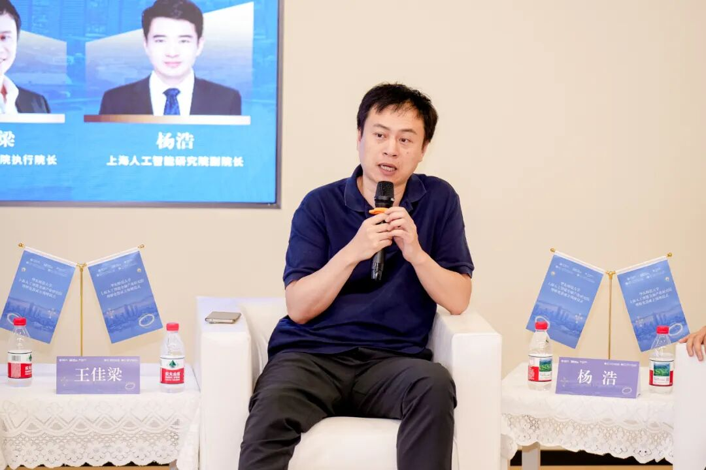

  

王佳梁（上海交大工研院执行院长）：AI盛行之后现在越来越多的“超级个体”出现，AI时代的创业范式已从“技术精英主导”转向“多元背景协同”，超级个体与轻量级团队的崛起成为可能，甚至未来会出现更多的一人独角兽公司。 我们就去探索有没有可能用AI原生的这些能力深化出一些新的可能性，我经常跟年轻人讲，新世界没有旧生。AI本身是比工业革命更大的一次转变，往往在时代的变革的时候很多范式有可能都成为过去，新的范式开始萌生。自媒体也是新的传播范式，我相信未来会有越来越多的“超级个体”出现，甚至新的项目不是靠一轮一轮融资，可能早期的种子投资就可以。 

我们也在探索三种创新模式，首先是适应“超级个体”时代的创业支持体系，通过“超级个体实验室”培育一人独角兽企业；其次是运用AI技术重构孵化流程，开发智能体辅助创业公司完成招聘、资源对接等工作；最后是构建中国最大的AI原生人才库，突破传统学历限制，发掘散落在各领域的实战型人才。 我们跟云启成立了交大云启基金，会做一些早期项目的投资和联动，我们在交大徐汇校区附近有一个很小的园区，方便教授和学生可以到这边来。另一方面我们也在连接很多大厂资源，本身我们也希望能够把一些行业的龙头企业AI的场景开放给创业者，我也希望构建一个AI的概念研究中心，能够把大公司和创业公司联动起来，让大家一起去开源做一些早期的MVP。

  

****在这个时代创业公司****

****怎么去构建创新壁垒？****

  

  

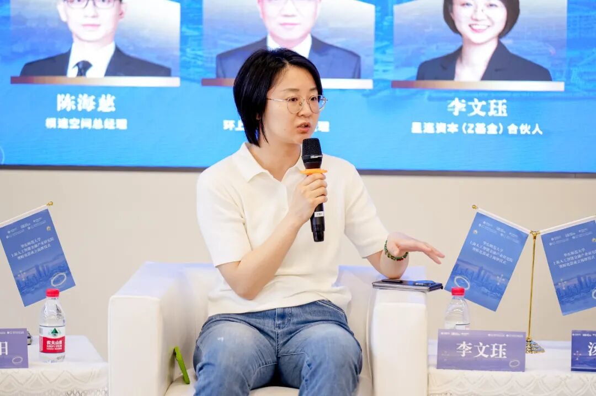

  

李文珏（星连资本【Z基金】合伙人）：大模型发展已经走过两个重要阶段，现在正进入更具挑战性的第三幕。第一阶段依靠海量原始数据（raw data）进行基础训练，到了第二幕会把非常高密度的知识之间的关联通过一定的引导和RLO让模型在智能方面有一个大的提升，而当前第三阶段的关键在于“高价值问题交互”——通过人类提出的深度问题（inside questions），同时模型把这些数据和环境非常快速学到，再去大幅度提升它的智能。

如果按照这个叙事，对于创业者而言，“交互”是非常好的构建壁垒的方式，这包括产品的设计和新的交互范式的探索，我觉得这是值得琢磨的。如果有好的交互范式，并且能够积累数据，对于创业者而言，也是很有帮助的。

  
  

华东师范大学上海人工智能金融产业研究院暨孵化器

通联丨潘诚男

整理 | 钟雪莹 徐心成

编辑丨徐心成

  

---

  

SAIFS近期动态：

[AI+金融，未来已来！华东师大上海人工智能金融产业研究院暨孵化器在“模速空间”正式成立揭牌！](https://mp.weixin.qq.com/s?__biz=MzkxMTY1ODk2Mw==&mid=2247486766&idx=1&sn=f2cf048f151c17640c844eedd32caf1d&scene=21#wechat_redirect)

  

[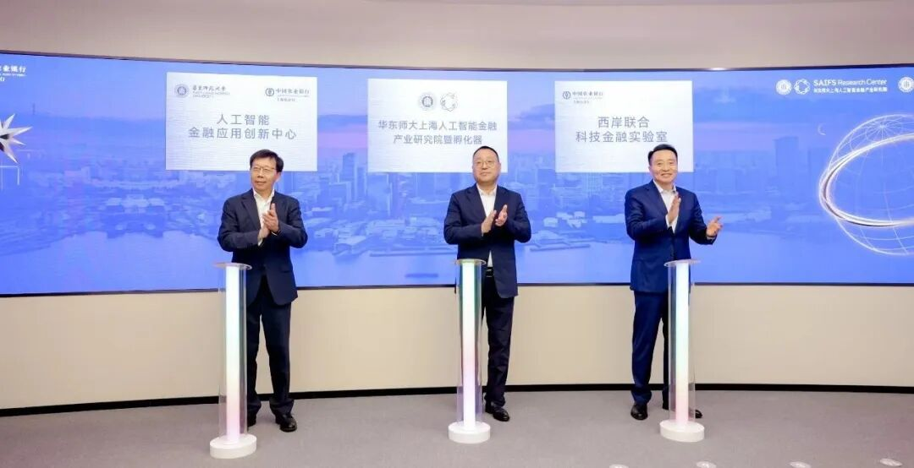](https://mp.weixin.qq.com/s?__biz=MzkxMTY1ODk2Mw==&mid=2247486766&idx=1&sn=f2cf048f151c17640c844eedd32caf1d&scene=21#wechat_redirect)

  

