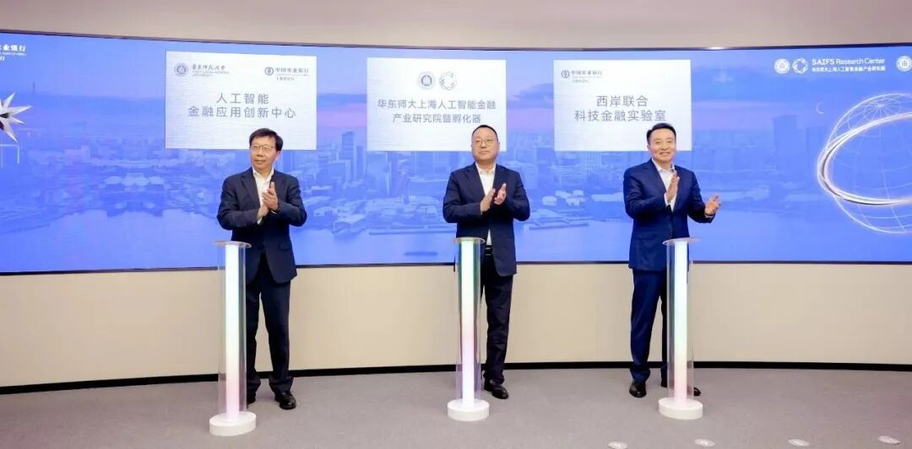
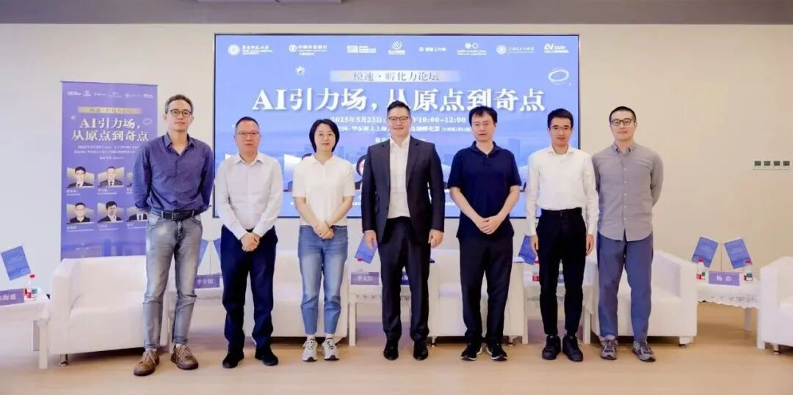

# 智金院｜智金产研院：“AI+金融”科研实习项目来了！

> **作者**: 正在招聘的
> **发布日期**: 2025年6月5日 15:54
> **来源**: [原文链接](https://mp.weixin.qq.com/s/r_8szyHtgMMlo2snPp5A7w)

---

  

**01**

**智金院｜智金产研院**

**实习招聘启事**

  

  

你是否对AI如何重塑金融世界充满好奇？

你是否渴望参与真实的科研项目，

亲手推动科技与金融的结合？  

你是否正在寻找一个暑期实践平台？

  

华东师范大学上海人工智能金融学院及产业研究院现面向本科学生，开放科研实习项目招募计划！我们正在寻找对“AI+金融”交叉领域充满热情的你，以科研实习生的身份，加入全球领先的人工智能金融跨学科交叉研究院，与我们共同探索技术背后的金融智慧。

  

**02**

**实习方向一览**

  

  

我们提供3**个聚焦“AI+金融”交叉领域**的实习方向。每位实习生将有机会深度参与项目团队，协助完成数据处理、文献调研、原型构建与分析验证等关键环节：

  

方向一：金融大模型**/智能体评测基准建设｜金融幻觉检测**

参与构建面向金融场景的大模型与智能体评估体系，识别并分析金融语言生成中的“幻觉”问题，推动可信AI工具在金融实务中的落地。

  

**方向二：硅基经济体系建模｜AI金融指数设立｜宏观智能体开发**

从“硅基经济学”视角出发，参与新型经济系统建模与AI金融指数的初步设计，协助搭建宏观智能体原型，探索智能驱动的经济研究新范式。

  

**方向三：金融分析师智能体“AI Jason”**

参与金融分析师智能体“AI Jason”科研项目的理论构建与实验推进，探索具备自主学习与金融推理能力的下一代研究型AI智能体，助力打造“可演化”的金融研究助手。

  

**03**

实习要求与工作职责

  

方向一：金融大模型**/智能体评测基准建设｜金融幻觉检测**

**实习要求：**

1\. 具备良好的沟通能力，能够高效地与团队成员协作和及时反馈问题及进展。

2\. 具有AI通识基础，包括了解机器学习、深度学习的基本概念，熟悉主流模型与算法框架。

3\. 具备英文文献阅读的能力，能够理解英文学术论文和快速获取关键信息。

4\. 熟练掌握Python编程能力，且具备一定的项目经验。

**工作职责：**

1. 学术研究支持：跟踪AI领域最新研究动态，撰写文献综述与分析报告；复现经典或SOTA算法，验证实验结果与适用场景。

2. 模型训练与实验执行：执行基线实验、消融实验，分析结果并撰写实验记录；协助撰写科研论文中的实验部分内容。

3. 数据处理和可视化：进行数据收集、清洗、标注与预处理，确保实验数据的准确性与可用性；设计并绘制论文图表，呈现实验数据与模型效果。

4. 项目开发支持：参与团队正在进行的项目的可行性研究，以及参与项目的部分开发与测试工作。

  

**方向二：硅基经济体系建模｜AI金融指数设立｜宏观智能体开发**

**实习要求：**

1. 具备良好的沟通能力，能够高效地与团队成员协作和及时反馈问题及进展。

2. 具备相关的学术背景，经济、金融、数学、统计、计算机或相关专业背景均可，有宏观经济学科能力优先。

3. 具备基础的科研能力，即具备基础的数据处理或编程能力。

4. 具备英文文献阅读的能力，能够理解英文学术论文、快速浏览文献及查找资料。

**工作职责：**

1. 信息收集与整理：关注国内外宏观经济、金融科技及人工智能行业的最新动态，协助整理政策文件、新闻报道和科研论文，为团队后续分析打底。

2. AI工具实践：跟着团队一起上手AI模型、自动化数据分析和可视化工具，体验将AI嵌入宏观研究流程的具体场景。

3. 数据处理和可视化：进行数据收集、清洗、标注与预处理，确保实验数据的准确性与可用性；设计并绘制论文图表，呈现实验数据与模型效果。

4. 项目开发支持：你会接触到真实项目，参与团队正在进行项目的可行性研究；参与项目的部分开发与测试工作。

****方向三：金融分析师智能体“AI Jason”****

****实习要求：****

**1. 具备高度的职业素养和团队合作精神。**

**2. 具备极高的自驱力与学习热情，能用创新型方法解决金融与科技难题。**

**3. 具备强大的执行力，高度结果导向，能将宏大的愿景转化为行动计划。**

**4. 具备金融、会计、经济、人工智能、自然科学等领域的知识和经验。**

**5. 具备对高新技术行业和企业基本面的专业知识，以及娴熟的金融建模能力。**

**6. 优先考虑具有特许金融分析师或注册会计师资格认证的候选人。**

****工作职责：****

**1. 金融知识图谱的构建与应用: 基于企业基本面数据、财务数据、行业数据和宏观经济指标，利用自然语言处理技术构建全面的金融知识图谱。同时，将金融知识图谱应用于多个业务场景。**

**2. 生成式人工智能研究与孵化实践: 深入研究生成式人工智能行业的发展动态，深度参与企业成长全过程，协助初创企业的孵化与建设工作。同时，承担市场调研、会议记录及展示材料的制作。**

**3. 金融语料库的构建与管理: 从多种来源收集、清洗和整合多维度金融数据，为模型的开发提供高质量语料库支持。设计科学的标注体系，并协调标注团队，确保标注的一致性和语料库的准确性。**

**04**

实习时间

  

实习时间为7月至8月，原则上每周到岗2至3天，个别项目需每周到岗5天，具体安排由各项目导师根据实际进度灵活协调。优先考虑可全职实习者。

  

**05**

**申请流程**

  

-   **截止时间：****2025年6月20日，周五**
    
-   **申请材料：**你的简历以及相关荣誉奖项、学术成果等证明
    
-   **提交方式：**发送至saifsadministration@sem.ecnu.edu.cn
    

欢迎符合条件的候选人提交申请，符合条件者将进入下一步的面试流程。

  

  

**06**

**智金院｜智金产研院**

**介绍**

  

  

**上海人工智能金融学院（简称“SAIFS”****）****于2023年在华东师范大学成立，是全球首家围绕人工智能与金融跨界交叉打造的教育和研究机构。**SAIFS强调在超越知识点的通识教育的基础上，培养集金融知识、人工智能技术和实践经验于一身的新一代人工智能金融（AI-Fin）领军型卓越人才，并坚持扎根在学术研究的前沿，探索AI在金融中的新应用，驱动AI-Fin的发展。同时，SAIFS致力于与全球的学术机构、金融机构、科技公司和政府部门建立广泛的合作网络，通过推广AI与金融的交叉研究和应用，改善金融服务的效率和质量，为社会创造价值。

  

**华东师大上海人工智能金融产业研究院（简称“SAIFS Research Center”）****的设立，旨在畅通“科技-产业-金融”循环，打造人工智能与金融产业融合发展的新高地。**研究院通过与中国农业银行等合作伙伴的紧密协作，将专注于构建一个具有自主知识产权的可信金融垂类大语言模型，打造三个人工智能金融创新示范场景，建立人工智能大模型金融语料库，实现金融语料数据高质量供给，强化金融科技基础设施建设。同时，研究院已成立**孵化器（简称“SAIFS Innovation Center”）**，旨在推动人工智能金融技术落地与推广，加快构建金融科技创新生态体系的战略布局。

  

智金产研院SAIFS Research Center科研实习工作环境

  

图文｜华东师范大学上海人工智能金融学院及产业研究院

**SAIFS近期动态：**

[AI+金融，未来已来！华东师大上海人工智能金融产业研究院暨孵化器在“模速空间”正式成立揭牌！](https://mp.weixin.qq.com/s?__biz=MzkxMTY1ODk2Mw==&mid=2247486766&idx=1&sn=f2cf048f151c17640c844eedd32caf1d&scene=21#wechat_redirect)  

[智金孵化器对话六大孵化器掌门人](https://mp.weixin.qq.com/s?__biz=MzkxMTY1ODk2Mw==&mid=2247486849&idx=1&sn=6b73c4ce5ad26352f3079edfa759dd6f&scene=21#wechat_redirect)