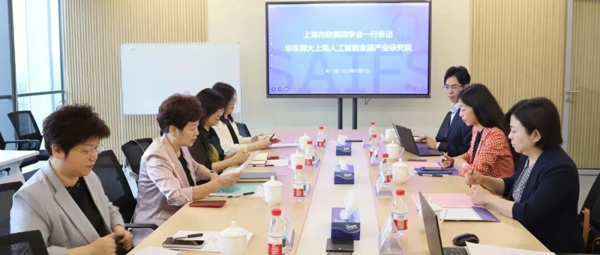
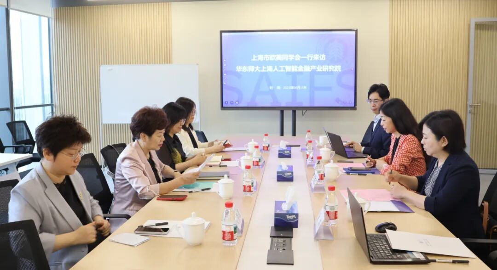
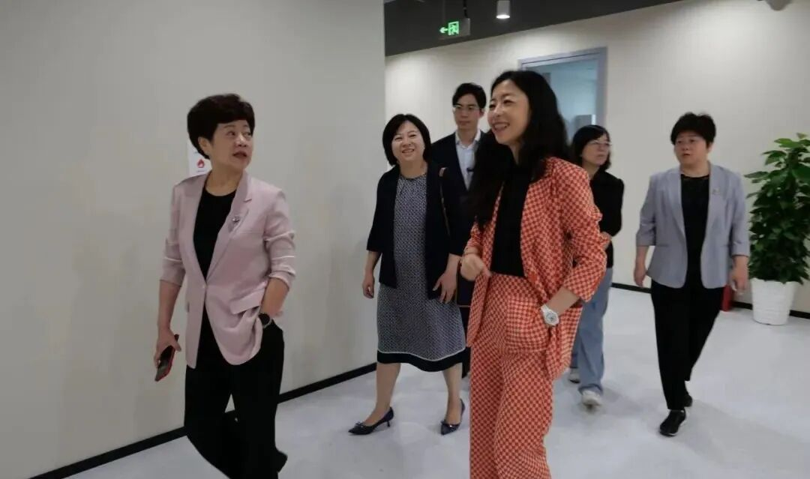
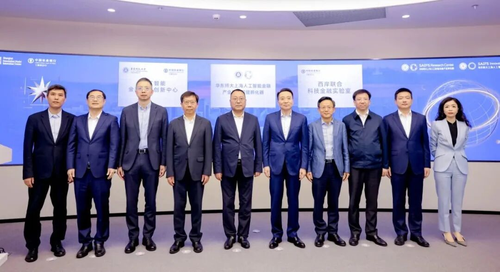

# 市委统战部一级巡视员、市欧美同学会党组书记李霞调研华东师大智金产研院暨孵化器

> **作者**: 参与调研活动的
> **发布日期**: 2025年6月16日 17:03
> **来源**: [原文链接](https://mp.weixin.qq.com/s/coriWXHjvzi7kupFr6h4Zw)

---

#       6月13日上午，市委统战部一级巡视员、市欧美同学会党组书记李霞带队赴模速空间，调研华东师范大学上海人工智能金融产业研究院暨孵化器，深入了解人工智能与金融跨界融合的前沿实践。华东师范大学党委常委、统战部部长、学校办公室主任张惠虹、华东师范大学上海人工智能金融学院院长邵怡蕾、学院金融大语言模型实验室副主任汪俊霖参与调研。

#   

调研座谈

     调研座谈会上，邵怡蕾详细介绍了研究院的创新定位、学科建设、团队建设和发展成果，以及作为全球首个聚焦AI与金融交叉学科的教育科研机构，与徐汇区、中国农业银行上海市分行等携手畅通“科技-产业-金融”循环，打造人工智能+金融产业发展高地的创新实践。汪俊霖结合自身学术背景及实践经验，现场演示了AI Jason金融分析师智能体在量化投资、风险管理等领域的应用突破。

  

智金产研院院长邵怡蕾陪同市委统战部一级巡视员、  

市欧美同学会党组书记李霞一行参观产研院

     李霞充分肯定研究院在产教融合方面取得的显著成效，特别赞赏研究院通过校企合作、项目孵化等方式，有效促进了教育链、人才链与产业链、创新链的有机链接。她表示，上海作为国际金融中心和科技创新中心，具备得天独厚的优势，市欧美同学会将进一步发挥人才荟萃、智力密集的优势，为海归人才创新创业提供更优质的服务，并充分发挥桥梁纽带作用，针对海归创新创业者的技术转化、政策配套等需求搭建精准对接平台，与学界、业界共同助力上海全球金融科技中心建设。

图文：华东师大统一战线（公众号：丽娃同心）

---

  

SAIFS近期动态：

[AI+金融，未来已来！华东师大上海人工智能金融产业研究院暨孵化器在“模速空间”正式成立揭牌！](https://mp.weixin.qq.com/s?__biz=MzkxMTY1ODk2Mw==&mid=2247486766&idx=1&sn=f2cf048f151c17640c844eedd32caf1d&scene=21#wechat_redirect)