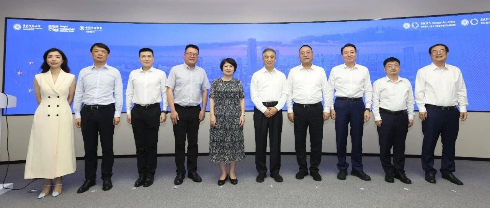
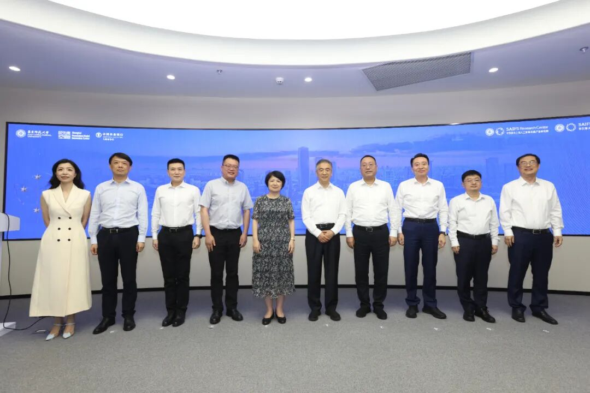
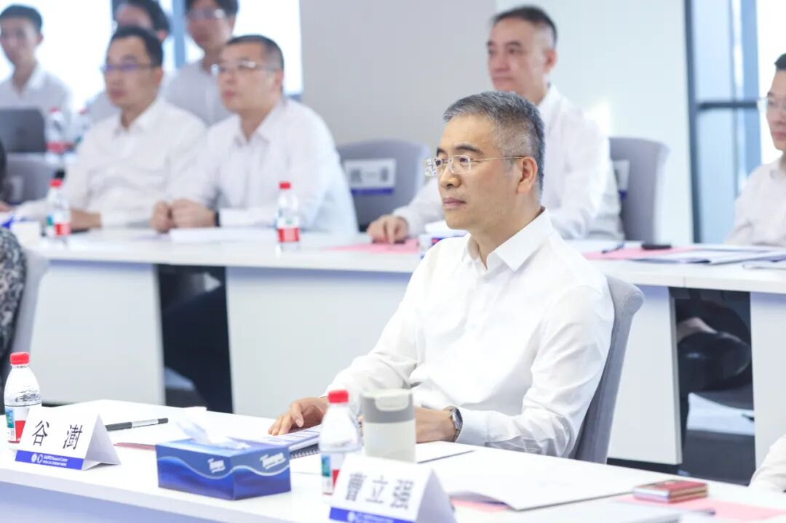
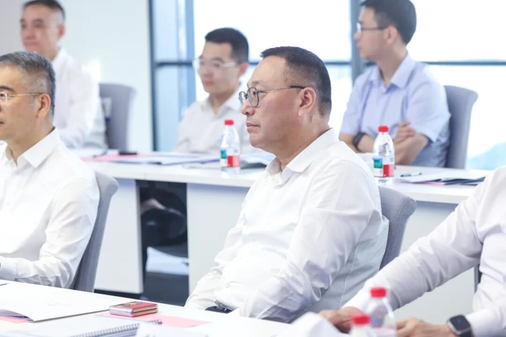
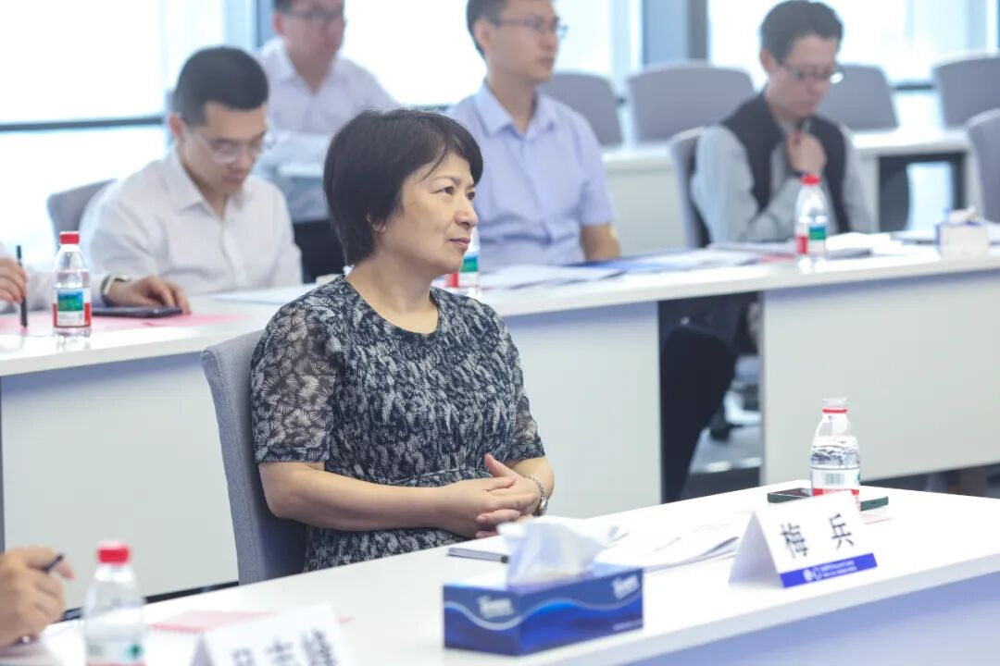
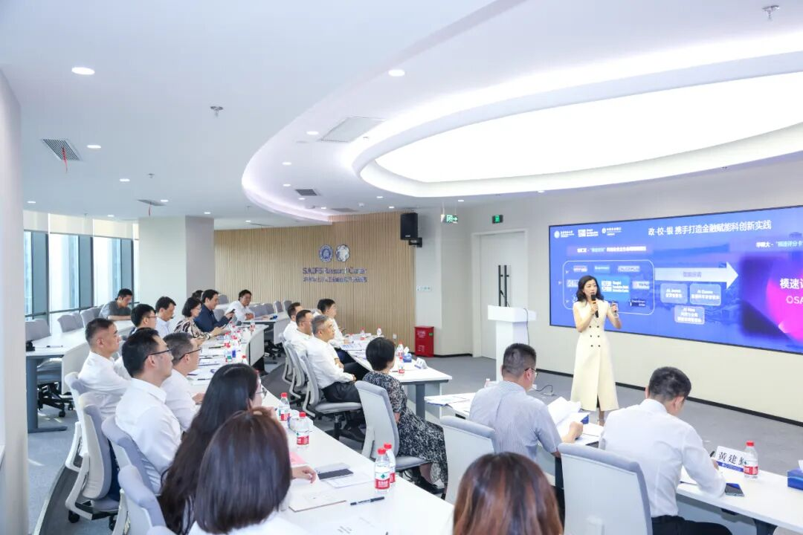
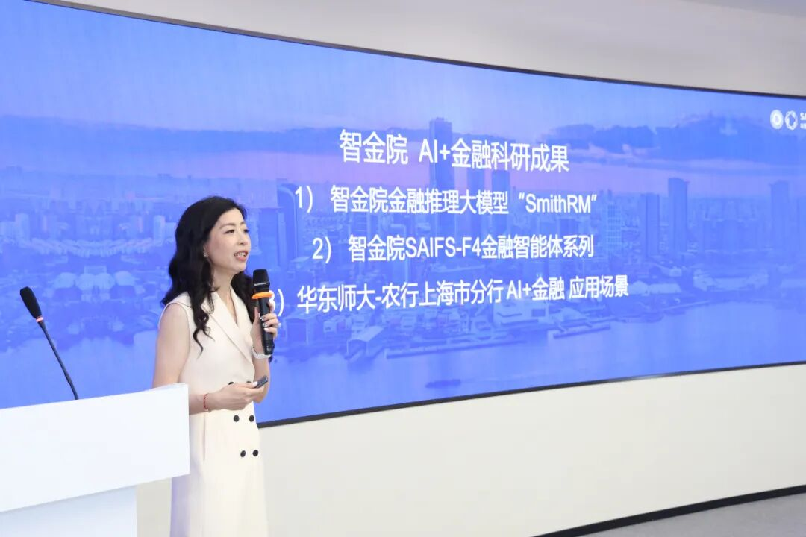
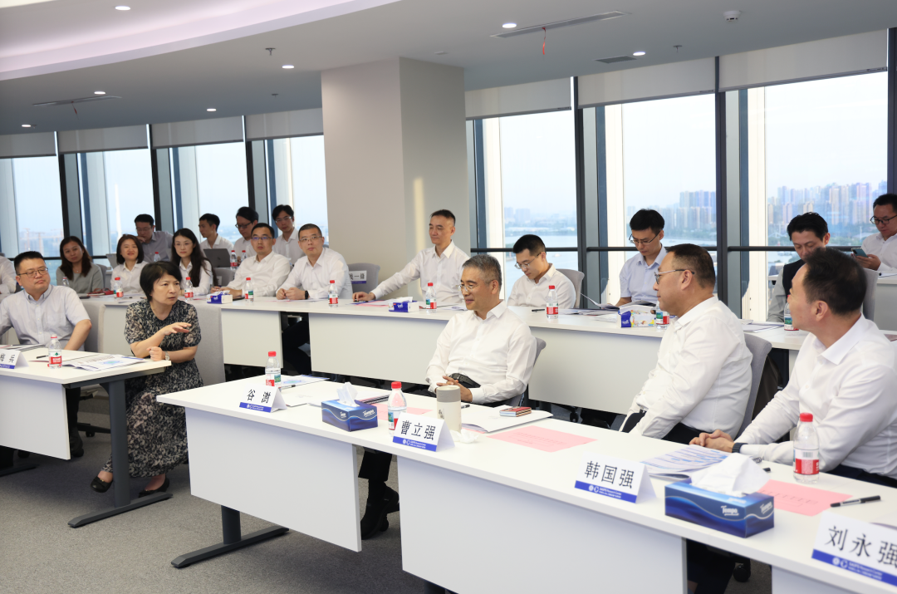
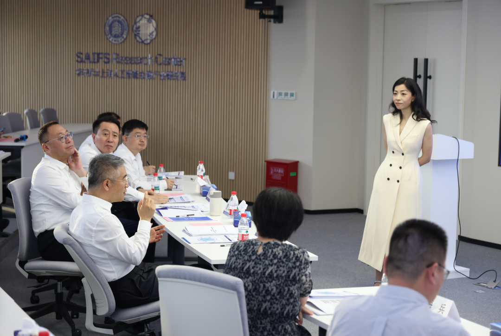
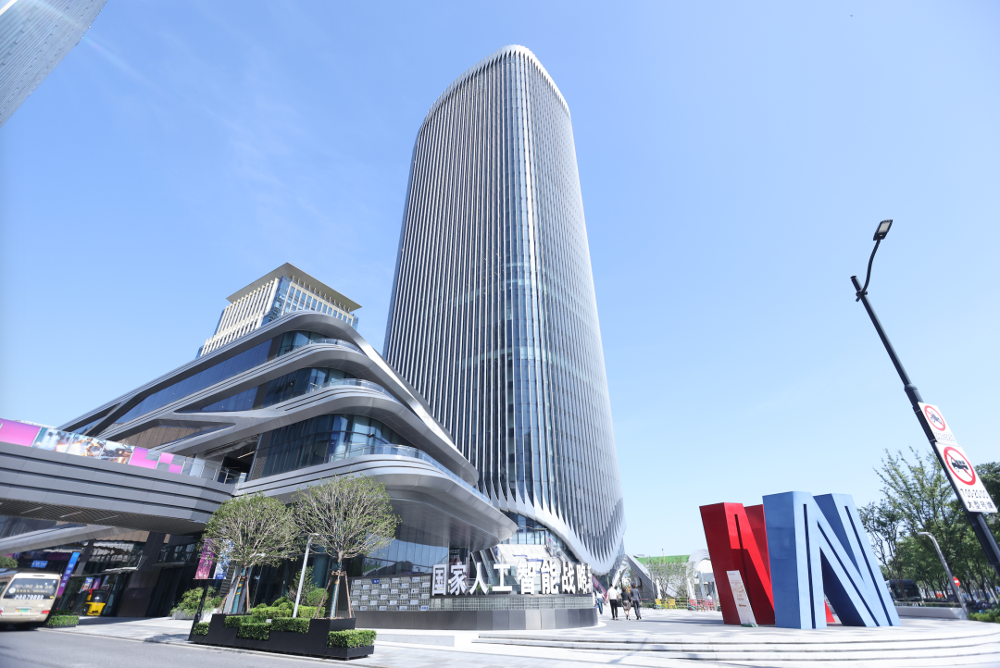

# 华东师范大学与中国农业银行深化全面战略合作，共促“人工智能+金融”融合发展新高地

> **作者**: 在“模速空间”的
> **发布日期**: 2025年6月20日 10:21
> **来源**: [原文链接](https://mp.weixin.qq.com/s/vtgRASI_aVQdxgMGDZruEQ)

---

中国农业银行董事长、党委书记谷澍一行来访

华东师大上海人工智能金融产业研究院暨孵化器

  

  

  

     2025年6月18日下午，中国农业银行董事长、党委书记谷澍一行赴华东师范大学调研人工智能金融科技协同应用创新工作，实地考察华东师大上海人工智能金融产业研究院暨孵化器（简称“智金产研院暨孵化器”）建设及落地应用情况。双方围绕人工智能金融科技协同发展、银校合作机制创新及重点平台建设等议题展开深入交流。

     中国农业银行总行办公室主任刘永强、上海分行行长韩国强、总行普惠金融事业部总经理黄建勤、上海分行副行长翟冀等随行人员参加调研。徐汇区委书记曹立强、区委办主任何鹤、新型工业化推进办公室主任陈勇、区商务委主任杨晓洁、西岸集团总经理张滋、区委办副主任郭晓村出席相关调研活动。华东师范大学党委书记梅兵、人文与社会科学研究院院长吕志峰、学校办公室副主任董盈盈、上海人工智能金融学院及产业研究院院长邵怡蕾以及学院院长助理、产业研究院执行副院长汤傲成陪同调研。

  

中国农业银行董事长、党委书记  谷澍

徐汇区委书记  曹立强

华东师范大学党委书记  梅  兵

调研现场

  

     调研中，华东师大智金产研院院长邵怡蕾首先回顾了华东师范大学与中国农业银行近三十年来的合作历程，自1996年联合创办“远东国际金融学院”以来，双方在金融服务、人才培养、科研协同等方面建立了长期稳定的合作机制，形成了优势互补的良好局面。

     进入人工智能时代，双方持续深化合作，于2024年6月签署全面战略合作协议，聚焦“人工智能+金融”重点方向，共同探索以科技驱动金融创新、以场景牵引科研落地的深度融合模式。2025年5月，三大合作平台——华东师范大学上海人工智能金融产业研究院暨孵化器、华东师大\-农行上海分行人工智能金融应用创新中心、农行西岸联合科技金融实验室相继揭牌运行，进一步夯实了“政产学研用”协同创新体系，打造“银校”融合发展的示范样板。

  

华东师大智金产研院院长邵怡蕾介绍近期“AI+金融”科研成果

  

     调研期间，邵怡蕾重点介绍了产研院近期正式发布的两项重要成果，包括SmithRM金融推理大模型与“Finance4（SAIFS-F4）”智能体家族，标志着人工智能在金融领域迈入推理增强与智能协作的新阶段。此外，邵怡蕾及科研团队系统汇报了以人工智能为核心的金融科技合作应用进展，包括智能信贷、智能宏观分析、科技企业普惠金融服务三大典型场景。

     在“模速贷”科创企业评分体系建设场景中，数据科学家智能体与金融分析师智能体聚焦中小科技企业信用评价难、风险识别难等痛点，依托“模速空间”实际运营环境，联合农行徐汇支行推出“模速评分卡”，实现一键式、差异化、智能化的公司金融评分服务。

  

双方交流

  

     在交流中，中国农业银行董事长、党委书记谷澍高度评价了华东师大智金产研院科研团队在金融垂类推理模型方面取得的基础能力突破。他指出，在真实场景中可用的金融人工智能模型，是迈向人工智能金融应用世界一流的重要攻关内容。他表示，农行拥有全球最大的普惠金融银行业务，正在与华东师大智金院形成优势互补、协同发展的合作态势。

     华东师范大学党委书记梅兵表示，华东师大与农行虽早在30多年前即建立合作关系，但近年来双方合作层次不断提升，特别是自2024年6月签署全面战略合作协议，以及在徐汇区政府支持下成立智金产研院暨孵化器以来，在“人工智能+金融”领域的协同发展取得新进展、迈上新台阶，这也是持续深化校地合作、银校合作，一体推动“政产学研用”融合发展的积极探索和实践。她对今年7月将与农行共同承办的2025年世界人工智能大会（WAIC）“人工智能金融领导者论坛”以及在核心展区联合发布合作成果充满期待，希望以此为契机进一步汇聚政府、金融、科技、学术多方资源，搭建有全国引领力和国际传播力的金融科技交流平台。

  

华东师大智金产研院暨孵化器位于徐汇“模速空间”

  

     据悉，2024年10月，[智金产业研究院暨孵化器](https://mp.weixin.qq.com/s?__biz=MzkxMTY1ODk2Mw==&mid=2247485675&idx=1&sn=037463bba88840b47f5fce8910001a7b&scene=21#wechat_redirect)正式落地“全球最大的人工智能孵化器”、全国首个大模型创新生态社区“模速空间”。2024年12月，[华东师大上海人工智能金融孵化器荣获徐汇区第二批区级高质量孵化器称号](https://mp.weixin.qq.com/s?__biz=MzkxMTY1ODk2Mw==&mid=2247485778&idx=1&sn=2e1277e64901345b275ceb02b321826e&scene=21#wechat_redirect)。2025年5月，[华东师大上海人工智能金融产业研究院暨孵化器在“模速空间”正式成立揭牌！](https://mp.weixin.qq.com/s?__biz=MzkxMTY1ODk2Mw==&mid=2247486766&idx=1&sn=f2cf048f151c17640c844eedd32caf1d&scene=21#wechat_redirect)

  

图文｜华东师大智金院及产研院