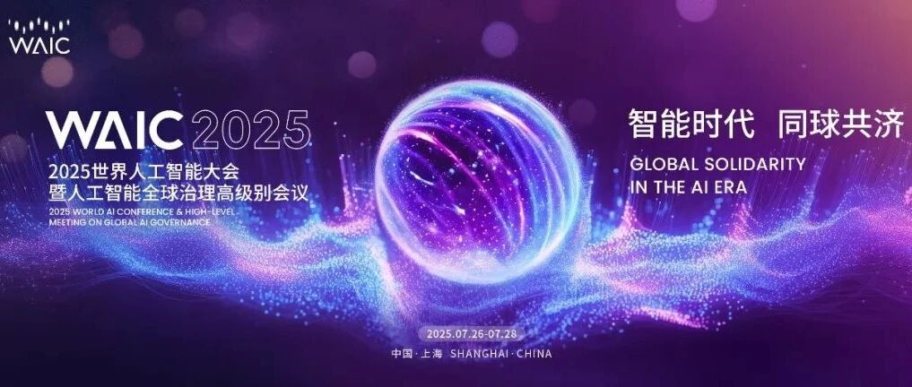

# 2025WAIC世界人工智能大会：30天倒计时启动！共启AI智能新时代

> **作者**: WAIC
> **发布日期**: 2025年6月27日 16:05
> **来源**: [原文链接](https://mp.weixin.qq.com/s/iaxGpMZeI1886Ly580wW4g)

---

#   

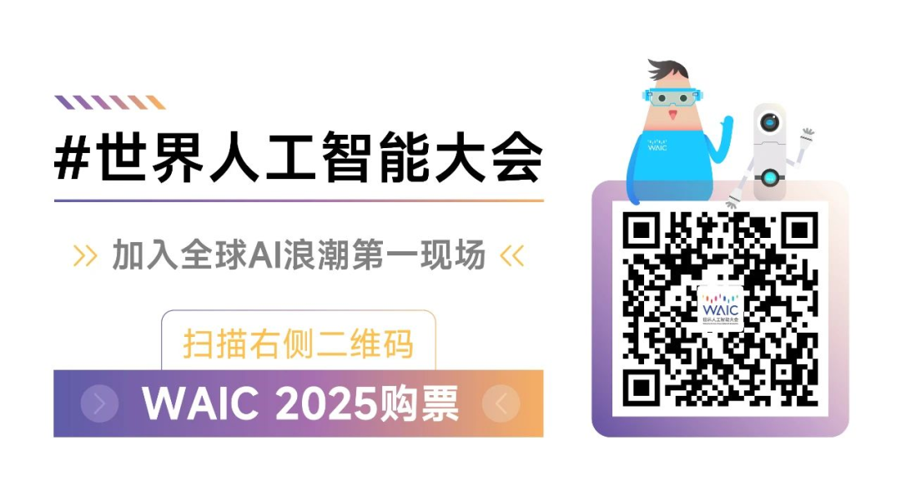

  

黄浦潮生，问势正当其时。

6月26日，2025世界人工智能大会暨人工智能全球治理高级别会议（WAIC）召开倒计时30天活动，正式发布大会主题与主视觉，系统介绍各项筹备进展。观众报名、媒体注册与采购团组通道同步开启，这场全球人工智能盛会正式进入冲刺阶段。

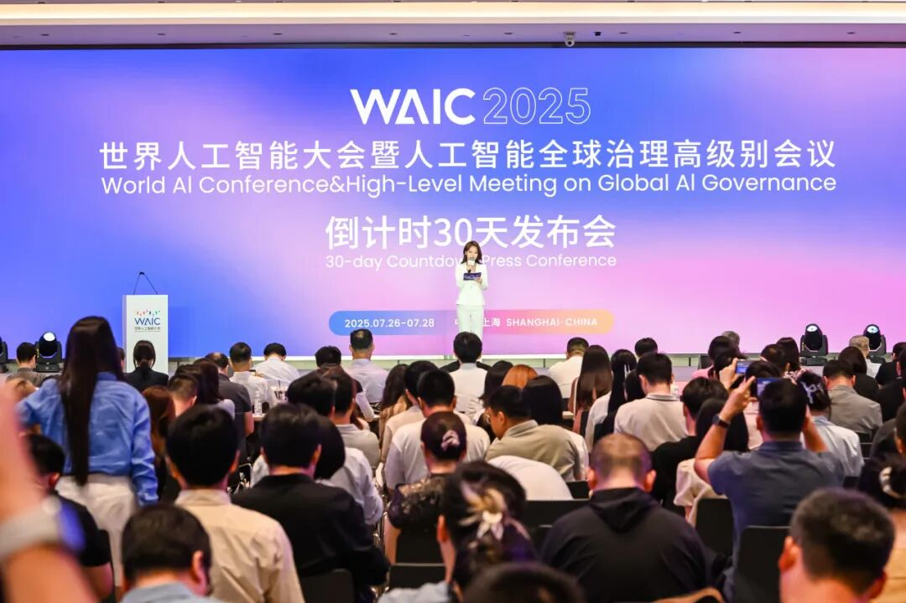

作为中国科技创新面向世界的重要平台，本届大会以“智能时代 同球共济”为主题，围绕“会议论坛、展览展示、评奖赛事、应用体验、创新孵化”五大核心板块加快推进，汇聚全球智慧，展现中国方案，书写一份植根国家战略、立足城市实践的时代答卷。

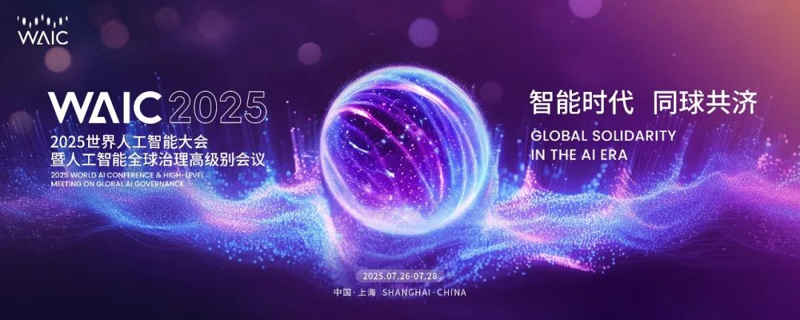

  

**一、以问启思，百场论坛拓展国际视野**

思想的刻度，往往标注时代的走向。

  

今年的大会“钻”得更深，既钻技术之“理”，也钻时代之“问”。

  

来自30余个国家和地区的1200余位嘉宾已确认参会，其中汇聚图灵奖、诺贝尔奖等共计12位国际顶尖奖项得主，80余位中外院士，以及多个国际顶尖实验室代表，构成历届之最的知识共创阵容。  

  

约书亚·本吉奥（Yoshua Bengio）、斯图尔特·罗素（Stuart Russell）、菲利普·兰巴赫（Philippe Rambach）等跨学科专家、以及联合国工业发展组织全球工业人工智能联盟卓越中心、菲尔茨数学研究所等国际机构，将围绕AI基础设施、AI for Science、智能终端、AI赋能新型工业化、AI+金融、AI+医疗与健康、AI+教育与人文、AI重塑行业、安全治理、生态发展等十大板块展开一系列思想交锋与趋势对话，共同搭建一个全球智慧共振的认知场域。

  

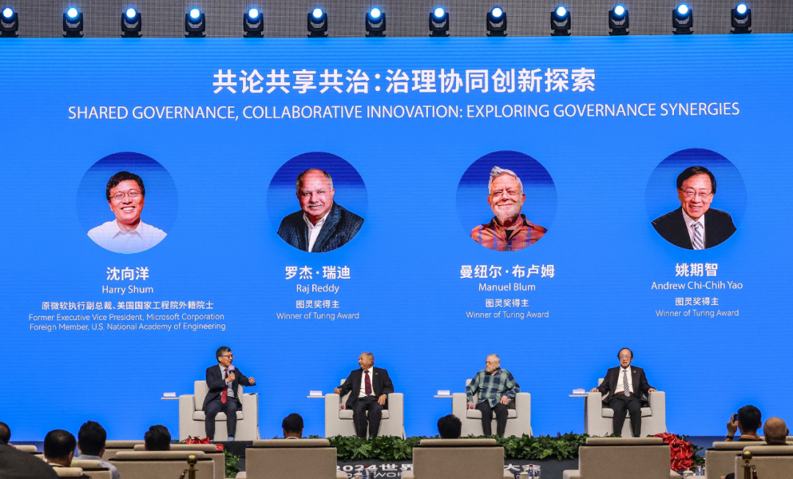

WAIC 2024

这不仅是一场标注智能时代方向的思想策源，也是一场链接全球智慧的高峰对话。理念之辨、技术之争、制度之构，在此交汇为通往未来铺就思想坐标。

  

**二、以技载道：三千展项映照产业新图**

“技”者，创新之核；“道”者，时代所趋。

2025世界人工智能大会，以“技”立身、以“道”为归，系统勾勒从底层创新到全域赋能的智能产业图谱。

今年大会展览展示面积首次突破7万平方米，800余家企业集中亮相，3000余项前沿展品即将展出，涵盖40余款大模型、50余款AI终端产品、60余款智能机器人，以及80余款“全球首发”或“中国首秀”的重磅新品，规模创历届之最。

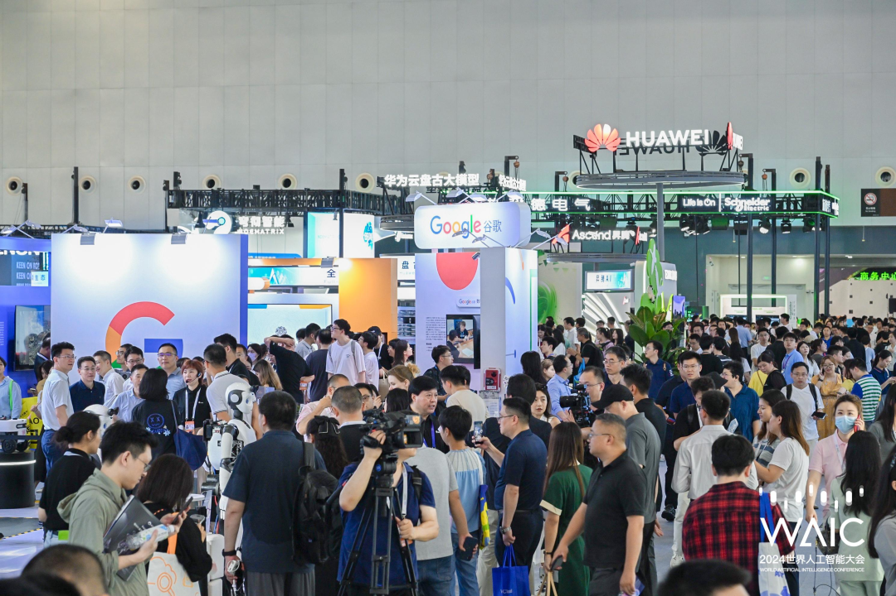

WAIC 2024

四大展馆分设核心技术馆、行业应用馆、智能终端馆与全域链接馆，构建起一条贯通算法模型、场景融合、具身协同与供需撮合的“AI能力走廊”。其中，核心技术馆聚焦大模型、算力芯片与数据平台，映射人工智能底层能力的演进逻辑；行业应用馆聚焦AI新型工业化、智能驾驶、智慧城市与金融科技等重点领域，系统呈现人工智能与实体经济深度融合的前沿图景；智能终端馆集成人形机器人、硬件与自动驾驶系统，回应“AI如何走出屏幕”的现实命题；全域链接馆则面向初创企业与资本方，打造闭环式投融资生态，同时贯通成果展示、需求发布、订单撮合与资源匹配，加速科技成果迈向商业化“最后一公里”的落地转化。

这不仅是一场集中展示，更是一场全景式的产业演练。四馆联动贯通模型算法、行业实践与供需撮合，一幅从局部应用迈向全域产业的未来图景，正从这里徐徐铺展。

  

 **三、以才育势：万象青年激荡创新涌流**

青年如浪，奔涌不息；创新如潮，因聚而兴。

2025世界人工智能大会以赛为引、以奖为核、以会为桥、以夜为场，构建起多维一体的青年创新场域，激活青年人才的思维灵光与实践潜能，推动“万象青年”在全球人工智能竞逐中脱颖而出、激荡潮头。

  

大会全面升级SAIL奖、青年优秀论文奖、云帆奖三奖体系，表彰在基础研究、技术突破、应用创新等层面展现卓越潜力的青年科技力量，为新一代科研者与创业者打开登台亮相的窗口与通道。同时推出BPAA第五届应用算法模型实践典范大赛、团市委青少年人工智能创新大赛等多层次赛事平台，为青年才俊提供“以赛促学、以赛促创”的实战舞台。

  

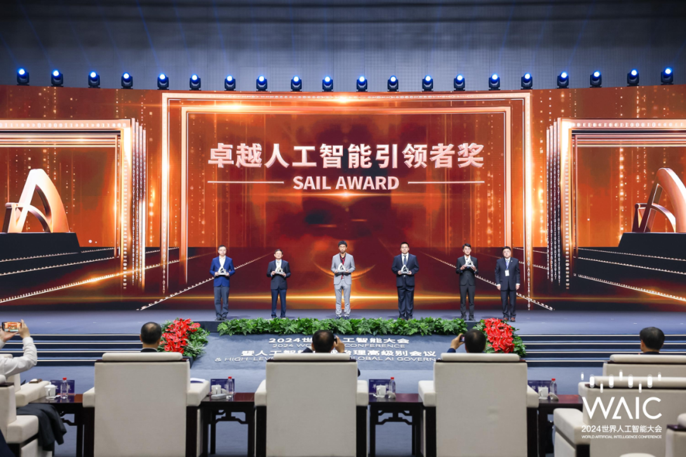

WAIC 2024

除赛奖外，WAIC 2025亦搭建起多元化的交流空间。WAIC青年菁英会将首次设立“青年会客厅”“青年开放麦”等灵感场域，邀请40岁以下的青年领军人物与公众、学生、投资人跨界对话，呈现AI发展中的青年视角与时代思想；“思辨会”圆桌辩论、“WAIC UP之夜”特别夜场等活动则在轻松氛围中激发思想碰撞与圈层破壁，构筑“白天论道、夜晚燃情”的沉浸式青年科技节奏。

  

来自牛津大学、清华大学、新加坡国立大学、加州理工、香港科技大学等海内外顶尖高校的师生团队将集体参会，全球高校社群、开源社群与初创社群形成联动共振，进一步拓宽青年参与的广度与深度。

  

在这场属于时代青年的创新长跑中，WAIC既是起跑线，也是加速器。它见证着有智青年的登台发声、思想闪耀与成果诞生，也不断刷新着人工智能事业的底色与张力。

  

**四、以链促融：资本机制贯通价值转化**

技术的锋芒，唯有在产业中落地，方能生长为现实的生产力。

2025世界人工智能大会锚定“更实效”的落地导向，全面升级Future Tech创新孵化与CONNECT精准产业对接平台，打通从“展品展示”到“订单转化”、从“供需匹配”到“生态流通”的价值闭环，贯通展示、撮合、签约、转化等关键环节，加速科技成果向现实生产力跃迁。

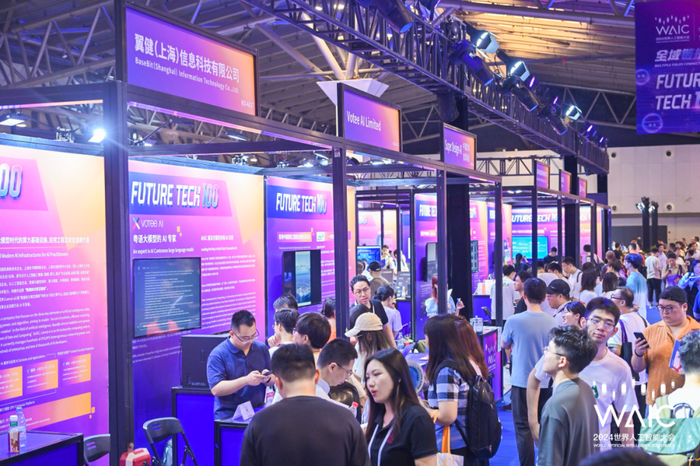

WAIC 2024

  

作为面向全球AI初创力量的关键平台，Future Tech持续打磨从项目到产品、从展示到融资”的一站式扶持路径，今年已吸引500+全球初创项目报名，涵盖智能硬件、AIGC、AI4S、具身智能等关键赛道；同时，CONNECT平台也在机制层面实现了系统升级，聚焦城市更新、出海服务、智能制造、医疗健康四大应用场景，滚动发布30+场景任务、200+采购清单，组织150+VIP采购团组开展超100场1V1洽谈与闭门交流，构建直达真实需求的落地通路。

  

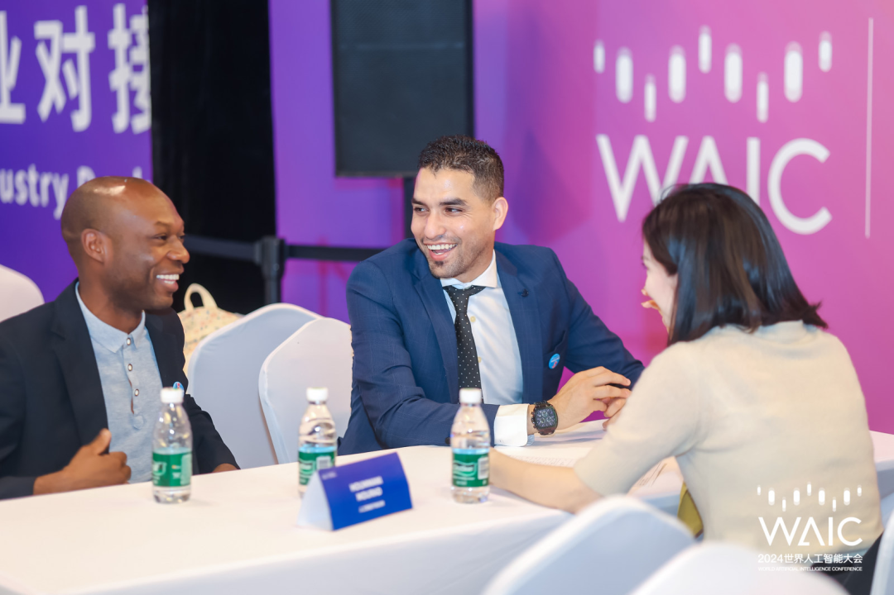

WAIC 2024

值得一提的是，CONNECT平台也首次从“大会三日”走向“全年运营”，将承接后续资源追踪、项目孵化与生态链接任务，成为AI企业落地生根、持续成长的中枢通道。

  

实效，是链接的深度，更是生态的温度。WAIC正以更具行动力的机制设计、更具操作性的服务场景，推动“可见的创新”转化为“可用的价值”，让“新质生产力”在链接中加速生成，在生态中蓄势而发。

  

**五、以境生趣：智能体感拓边认知疆界**

科技不仅重塑世界的运转方式，也在悄然改写人类感知世界的方式。

2025世界人工智能大会首度提出“WAIC City Walk环游记”概念，以“智能体感”为核心驱动，系统搭建“生活智能内环”“城市服务中环”“产业生态外环”三大应用主环，描绘出人工智能融入城市肌理、融入百姓生活的生动图景。

  

生活环聚焦“AI日常化”的沉浸场景。展馆内打造「WAIC 里 2025弄」主题街区，以“复古里弄+智能未来”的强烈反差，演绎“劳动最光荣”机器人秀场，集结“机器人天团”快闪演绎、大模型应用集市与AI实操小课堂等体验场景，在学用玩一体中释放科技的普惠温度；服务环以未来出行与低空飞行为亮点，构建“空地一体化智慧出行”网络。智己、小马智行、奇瑞、文远知行等企业联手构建无人接驳服务体系，串联起展馆、街区与园区，形成可实时体验的立体交通走廊；产业环则联动上海多区，以城市为展厅、以产业为内容，串联各具特色的AI产业集群，打造兼具“烟火气”与“科创力”的智能生活带。

  

此外，大会推出数字“智”愿者——Hi! WAIC智能体，深度嵌入大会策展与服务体系，集大模型、语音交互与知识推理能力于一体，具备全局理解、智能问答、个性推荐等功能，联动“场景码”实现“即问即达”的语义导览，开启“人机共游”的智能体验。

  

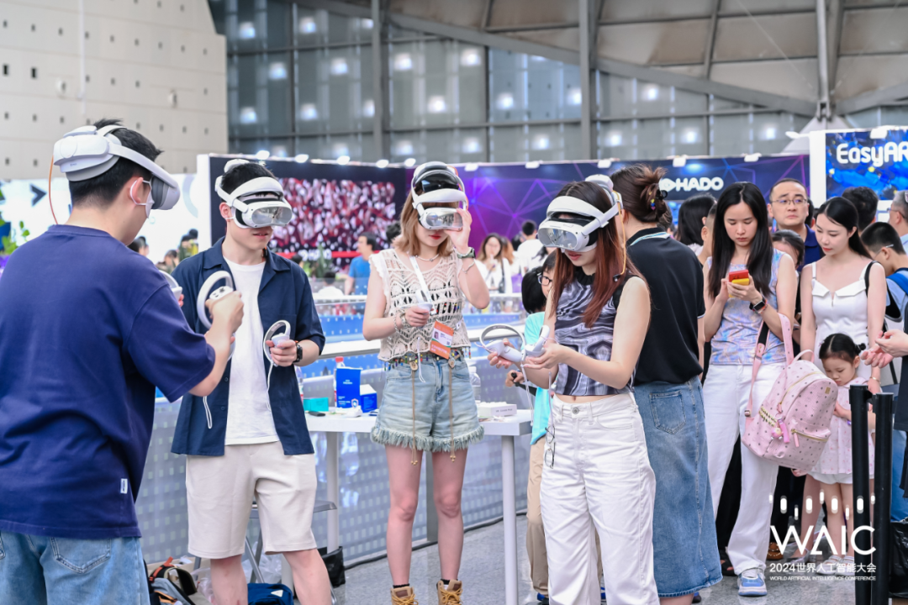

WAIC 2024

当人工智能不再是展台上的“演示物”，而是成为“身边的陪伴者”，我们也正在从“观看AI”迈向“共感AI”。今年的WAIC，不仅让我们看见AI做了什么，更在于我们如何与AI一起感知世界、共塑未来。

循着技术脉动与时代回响，人工智能的中国叙事，正在浦江之畔不断生长。从理念到实践、从语境到落地，WAIC既是一场面向未来的全球对话，更是一场来自中国的真诚邀约。

  

倒计时30天，2025世界人工智能大会正以更加自信、更加开放的姿态，迎接全球智能时代的来临。

  

答案，正在上海展开；未来，由我们共同书写。

  

  

WAIC 2025

世界人工智能大会

论坛：2025年7月26日-28日 上海世博中心

展览：2025年7月26日-29日 上海世博展览馆

  

记者注册：

[https://mp.weixin.qq.com/s/Ub-ISqfnzgZhzOMlxnxwfg](https://mp.weixin.qq.com/s?__biz=MzU4MjgzNTk2OQ==&mid=2247592209&idx=1&sn=cdf7bbbe3640e2bf843fb14beeedde6f&scene=21#wechat_redirect)

采购团组：

[https://mp.weixin.qq.com/s/ub4sYmRKQzOQRGLYLhSgHg](https://mp.weixin.qq.com/s?__biz=MzU4MjgzNTk2OQ==&mid=2247591017&idx=1&sn=33ad292a440ea289a4436033e8813baf&scene=21#wechat_redirect)

观众购票：

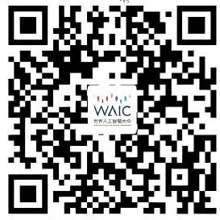

  

通道均已开启，抢先预约，共赴这场世界瞩目的智能盛会。

来源：世界人工智能大会