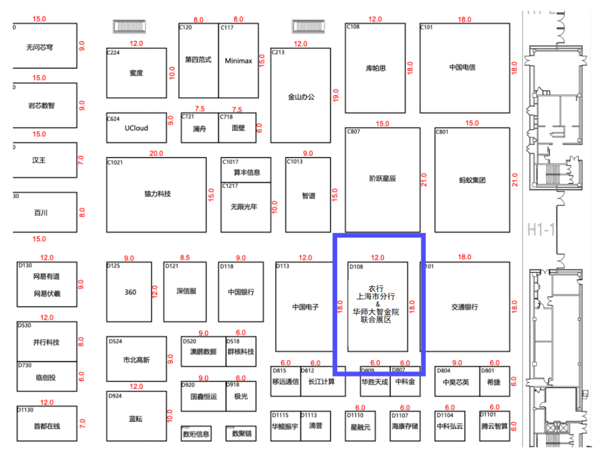
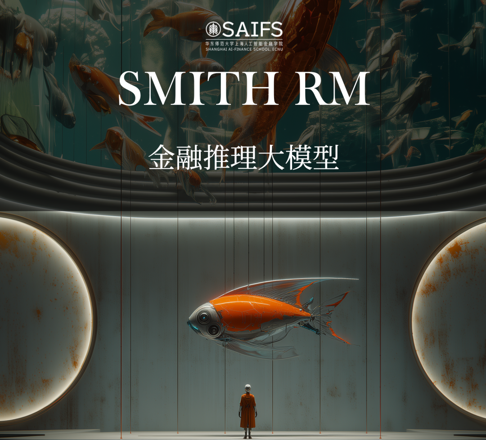
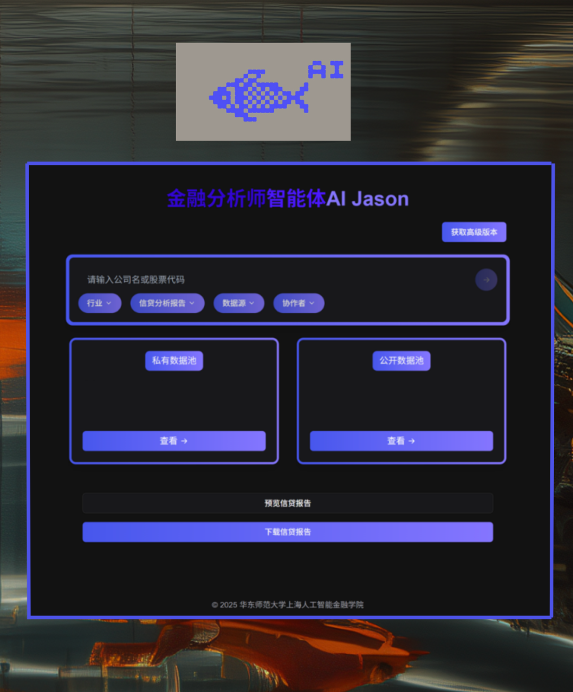
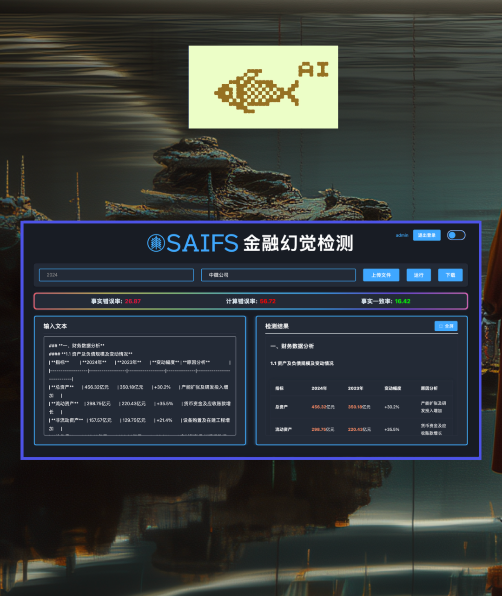
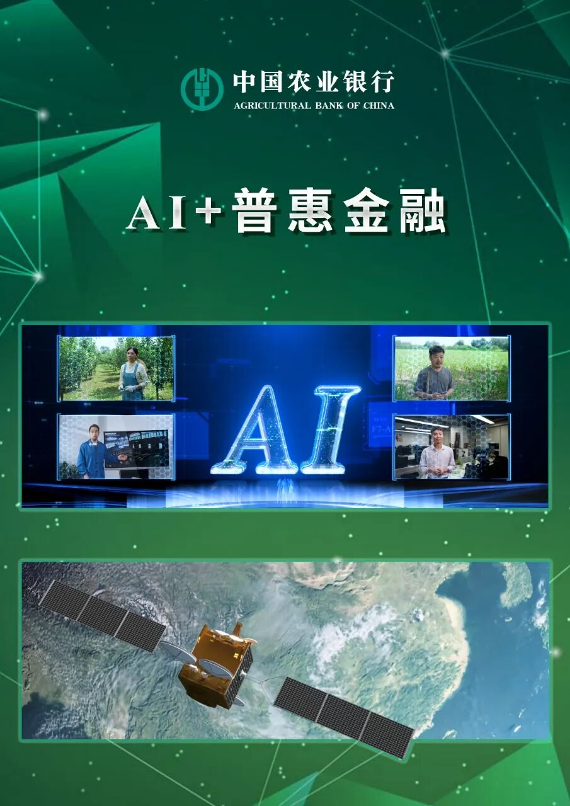
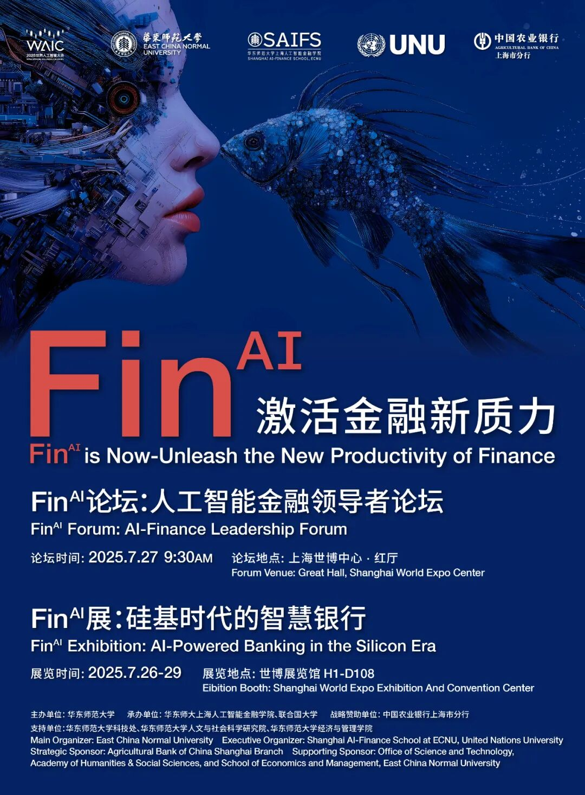

# 2025WAIC“FinAI展：硅基时代的智慧银行”最美展区揭秘，镇馆之宝出没！

> **作者**: 预热WAIC展览的
> **发布日期**: 2025年7月23日 13:10
> **来源**: [原文链接](https://mp.weixin.qq.com/s?__biz=MzkxMTY1ODk2Mw==&mid=2247486986&idx=1&sn=57c1f1e2f8b965d4b0cc653201d62dd7&chksm=c0de31e057d62209cd628cf83be6f96bbd04624230b08aeda69acf4b6f164c5abc061c8ea4a5#rd)

---

**‍**

已关注

关注

重播 分享 赞

关闭

**观看更多**

更多

*退出全屏*

*切换到竖屏全屏**退出全屏*

上海人工智能金融学院SAIFS已关注

分享视频

，时长00:30

0/0

00:00/00:30

切换到横屏模式

继续播放

进度条，百分之0

[播放](javascript:;)

00:00

/

00:30

00:30

[倍速](javascript:;)

*全屏*

倍速播放中

[0.5倍](javascript:;) [0.75倍](javascript:;) [1.0倍](javascript:;) [1.5倍](javascript:;) [2.0倍](javascript:;)

[超清](javascript:;) [流畅](javascript:;)

您的浏览器不支持 video 标签

继续观看

2025WAIC“FinAI展：硅基时代的智慧银行”最美展区揭秘，镇馆之宝出没！

观看更多

原创

,

2025WAIC“FinAI展：硅基时代的智慧银行”最美展区揭秘，镇馆之宝出没！

上海人工智能金融学院SAIFS已关注

分享点赞在看

已同步到看一看[写下你的评论](javascript:;)

[视频详情](javascript:;)

  

FinAI展：硅基时代的智慧银行

       2025年7月26日至29日，上海世博展览馆H1-D108展区，由华东师范大学主办，上海人工智能金融学院（SAIFS）携手联合国大学（UNU），联合中国农业银行上海市分行共同呈现**——** **FinAI****展：硅基****时****代的智慧****银****行（FinAI Exhibition: AI-Powered Banking in the Silicon Era），即将亮相！**

      **作为全球首个聚焦**“人工智能+金融”融合落地的大型主题展，本次展览不仅汇聚了最新的AI大模型技术应用、场景级创新解决方案，还带来了沉浸式体验与数字打卡互动。每一个展区，都是一次未来金融的预演，每一个打卡点，都是智慧银行的拼图。

      其中，“**镇馆之宝****SmithRM”**尤为引人注目——这是我们自研的金融推理大模型代表作，也是一座可视化的智能殿堂，既有超高颜值，又具超强能力，堪称FinAI展“智慧与美感”的象征核心。来与它合影打卡，感受科技与艺术的奇妙融合！

  

展厅在哪里？

2025年7月26日-29日

地点：上海世博展览馆（博成路850号）

展位号：H1-D108

  

  

**镇馆之宝SmithRM，**

抢先看！

****

SAIFS自研金融推理大模型SmithRM将化身数字鱼群，闪耀登场——致敬亚当斯密，让“看不见的手”被看见。走进展区中心，你可以与SmithRM同框合影、置身流光溢彩的智能空间，同时了解四大金融智能体如何协作办公：

  

**金融分析师智能体思睿**

30秒生成2万字信贷报告

  

  

**安全合规智能体律衡**

实时调用 SAIFS 幻觉检测

为结论加注可信度

  

  

**宏观分析智能体观微**

国内外形势、政策、经济，

前瞻关税、利率、汇率及大宗走势

**数据科学家智能体织元**

统摄多源数据

驱动模型自我迭代

 **技术与艺术并存，**

**推理与美感共鸣——**

**这就是****FinAI****的智慧殿堂！**

“AI+普惠金融”展区，

不容错过！

在“AI+普惠金融”展区，讲述农业银行在普惠金融领域应用AI技术取得的成绩。金融科技不是“高冷”，而是深入田野的“懂你”。

打造智能化移动金融服务平台

赋能高效办贷

依托农银智+平台

创建智慧畜牧贷款新模式

利用卫星遥感技术

及时掌握农业墒情及受灾情况

助农纾困

搭建科技金融六力模型

精准量化科技价值

提供精准服务

  

  

****晒出你的“硅基时代”****

****精彩瞬间！****

**硅基世界已上线，FinAI银行正在加载——**

**2025年7月26日至29日**

**在上海世博展览馆H1-D108展区**

**你准备好穿越了吗？**

看展注册

请扫下方二维码

