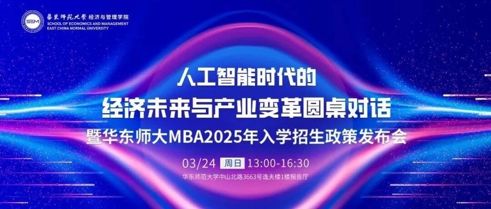
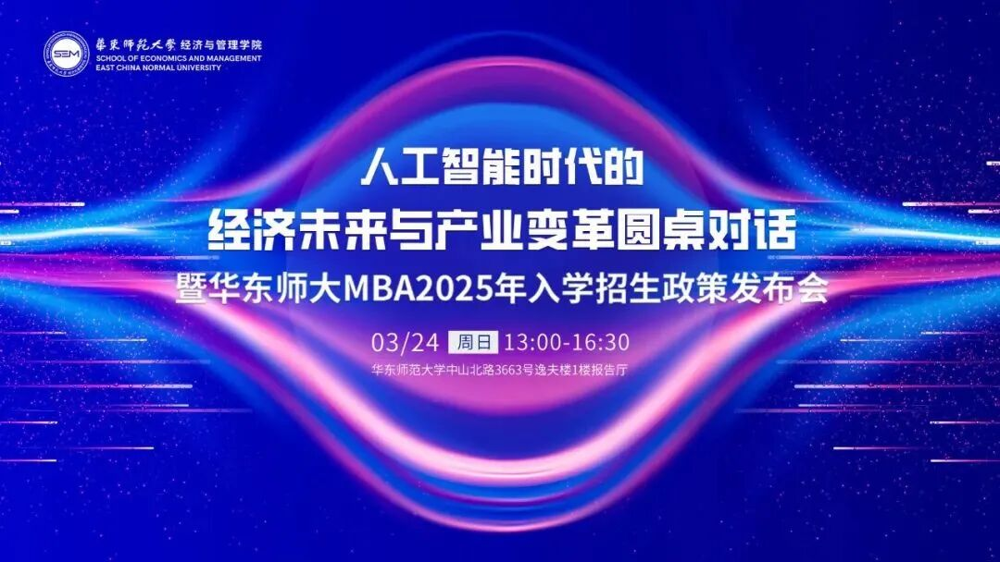
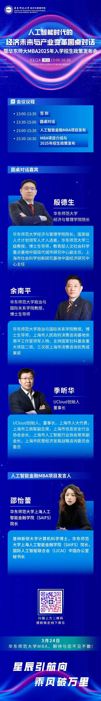
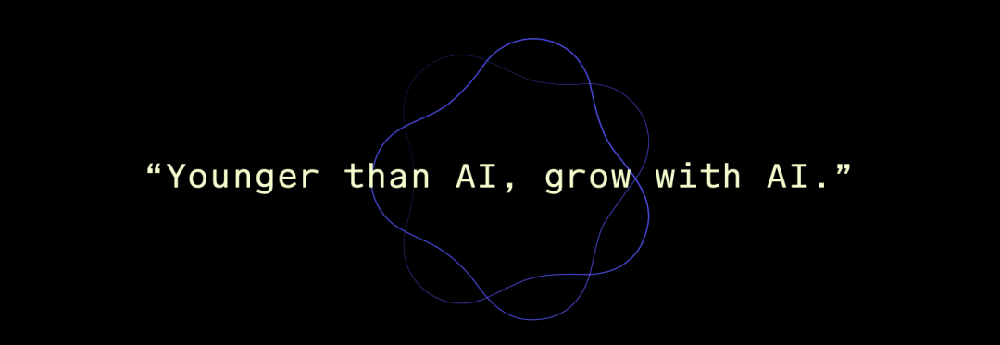
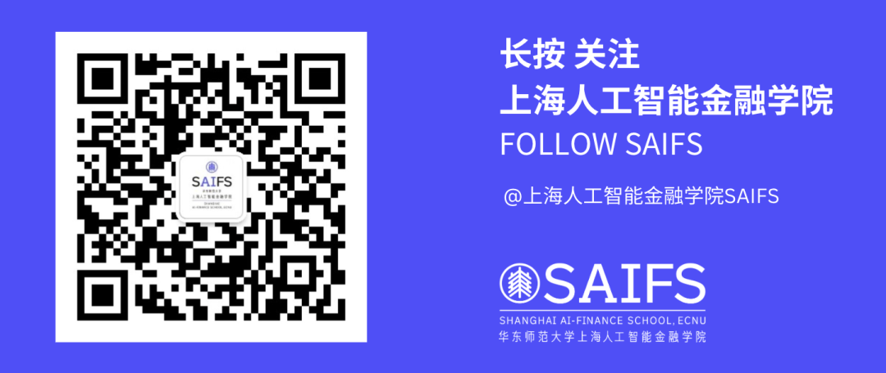

# 开启人工智能金融新纪元：人工智能金融MBA项目发布会暨2025年MBA入学招生政策发布会

> **作者**: SAIFS
> **发布日期**: 2024年3月19日 17:10
> **来源**: [原文链接](https://mp.weixin.qq.com/s/wfUYDZpA_y8NFrpKGwCZMg)

---

  

  

  

随着AI技术的不断突破，我们正站在一场前所未有的产业变革潮头。这一浪潮不仅正在重塑行业生态，更深刻地改变着我们的生活、工作方式，乃至全球经济的底层结构。华师大人工智能金融MBA项目发布会、人工智能时代的经济未来与产业变革圆桌对话暨华师大MBA2025年入学招生政策发布会将于本周日3月24日重磅开启！

  

本次活动汇聚学术界权威教授与行业内顶尖专家，共同探讨人工智能如何引领经济新潮流，重塑产业结构，以及如何在新一轮科技革命中把握机遇，应对挑战。同时，将隆重发布人工智能金融MBA项目，该项目专注于智能金融领域的创新与发展，致力于培养未来的金融领导者和人工智能技术创新者。

  

届时，上海人工智能金融学院（SAIFS）创院院长邵怡蕾教授将主持人工智能金融MBA项目的发布仪式，并介绍该项目人才培养目标、项目优势及课程特色等，MBA中心也将为报考同学们讲解2025年招生政策并进行答疑。

  

      **发布会议程**

Conference Agenda

  

       转载自公众号华东师范大学MBA

  

  

  

  

