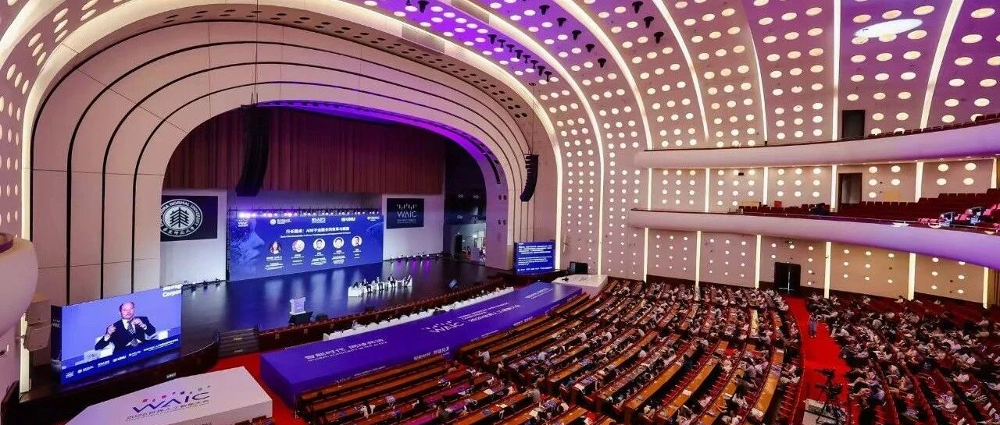

# WAIC华东师大聚力！首发金融智能未来引擎，三大应用场景落地

> **作者**: 在上海世博中心的
> **发布日期**: 2025年7月30日 14:40
> **来源**: [原文链接](images/image2.jpg)

---

已关注

关注

重播 分享 赞

关闭

**观看更多**

更多

*退出全屏*

*切换到竖屏全屏**退出全屏*

上海人工智能金融学院SAIFS已关注

分享视频

，时长00:58

0/0

00:00/00:58

切换到横屏模式

继续播放

进度条，百分之0

[播放](javascript:;)

00:00

/

00:58

00:58

[倍速](javascript:;)

*全屏*

倍速播放中

[0.5倍](javascript:;) [0.75倍](javascript:;) [1.0倍](javascript:;) [1.5倍](javascript:;) [2.0倍](javascript:;)

[超清](javascript:;) [流畅](javascript:;)

您的浏览器不支持 video 标签

继续观看

WAIC华东师大聚力！首发金融智能未来引擎，三大应用场景落地

观看更多

原创

,

WAIC华东师大聚力！首发金融智能未来引擎，三大应用场景落地

上海人工智能金融学院SAIFS已关注

分享点赞在看

已同步到看一看[写下你的评论](javascript:;)

[视频详情](javascript:;)

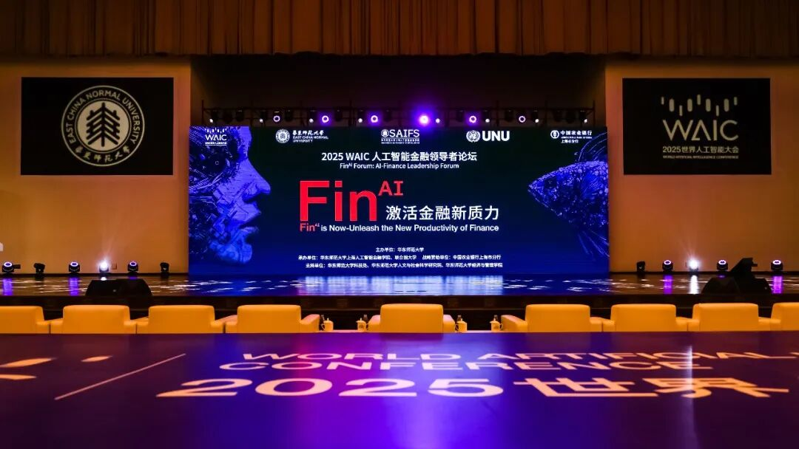

  

人工智能金融的发展

不仅事关技术创新与产业升级

更深刻关乎社会公平、经济韧性

与全球治理模式的重塑

要确保人工智能金融的发展

既能推动效率提升

又能维护金融稳定和社会公平

  

7月27日（今天上午），聚焦“AI金融+硅基经济学”核心议题，中国首个面向行长级别的人工智能金融高端对话论坛——“2025 WAIC人工智能金融领导者论坛”在上海世博中心红厅举行。

论坛以“激活金融新质力”为主题，汇聚国际领袖、四大行行长级领导者、“硅基经济学”首提者、新经济学家，以及人工智能产业界领袖，共同探讨硅基文明浪潮下，人工智能如何重塑金融基因，重构经济图景，推动全球金融体系向更智能、更高效、更可持续的方向跃迁，吸引超千名观众线下参会，线上直播观众逾10万人。

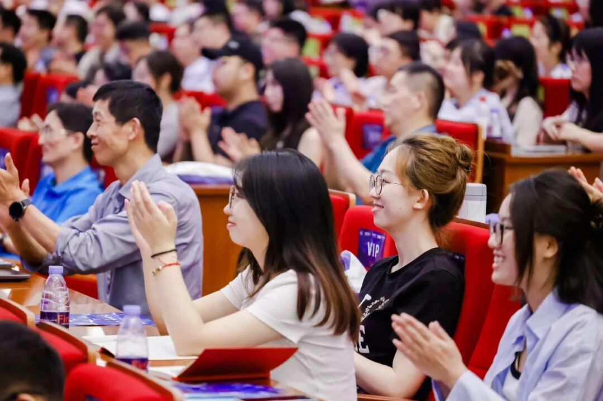

2025 WAIC人工智能金融领导者论坛现场

  

 全球协力

沪上共绘AI金融未来  

  

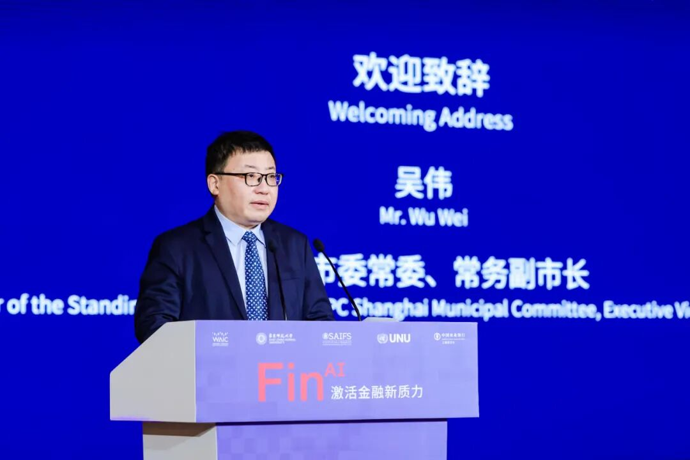

上海市委常委、常务副市长吴伟致辞

人工智能不仅是技术革命的产物，更是推动金融行业新质生产力落地的关键力量。论坛开幕式上，上海市委常委、常务副市长吴伟出席并致辞，他指出，近年来，上海抢抓人工智能大模型发展机遇，推动金融业与人工智能发展双向赋能、相互促进。未来，上海将打造前沿技术的“策源地”、场景赋能的“样板间”、安全可信的“示范区”，加快打造AI与金融融合发展的创新高地。

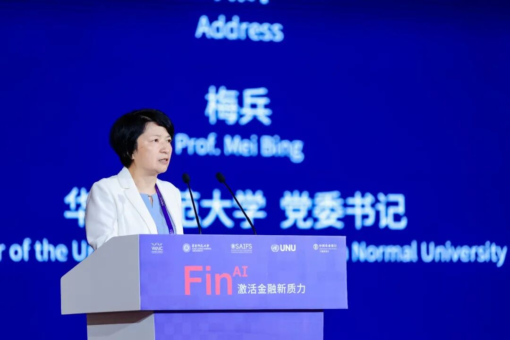

华东师大党委书记梅兵致辞

  

华东师范大学党委书记梅兵在致辞中指出，人工智能金融的发展不仅事关技术创新与产业升级，更深刻关乎社会公平、经济韧性与全球治理模式的重塑，要确保人工智能金融的发展既能推动效率提升，又能维护金融稳定和社会公平。华东师大主动拥抱人工智能这一“年轻的事业”，大力推动金融学与数据科学、人工智能等学科交叉融合，在AI金融领域积极探索。她期待以本次论坛为起点，与各界携手共同推动人工智能与金融的深度融合，为上海国际金融中心与科创中心建设，为构建更加智能、普惠、可持续的全球金融未来作出更多贡献。

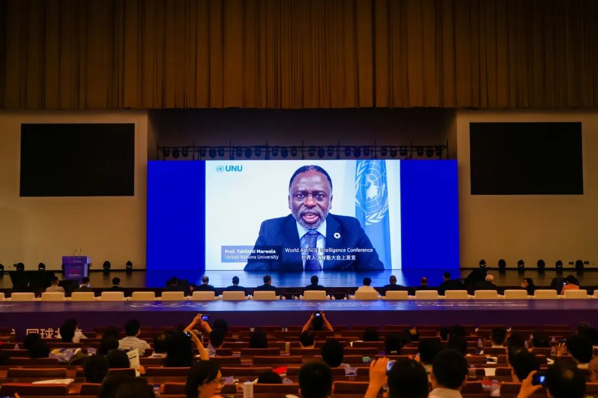

联合国副秘书长、联合国大学校长奇利齐·马瓦拉致辞

联合国副秘书长、联合国大学校长奇利齐·马瓦拉（Dr. Tshilidzi Marwala）在线致辞。他指出，在思考人工智能与金融的未来时，应认识到人工智能不仅是技术革新，更是全球经济与国际治理挑战；人工智能在金融领域的发展将为打造更加可持续、公平的全球经济体系提供一个契机。他呼吁全球合作与跨学科协作，在人工智能促进经济增长的同时实现公平、可持续与共享发展。

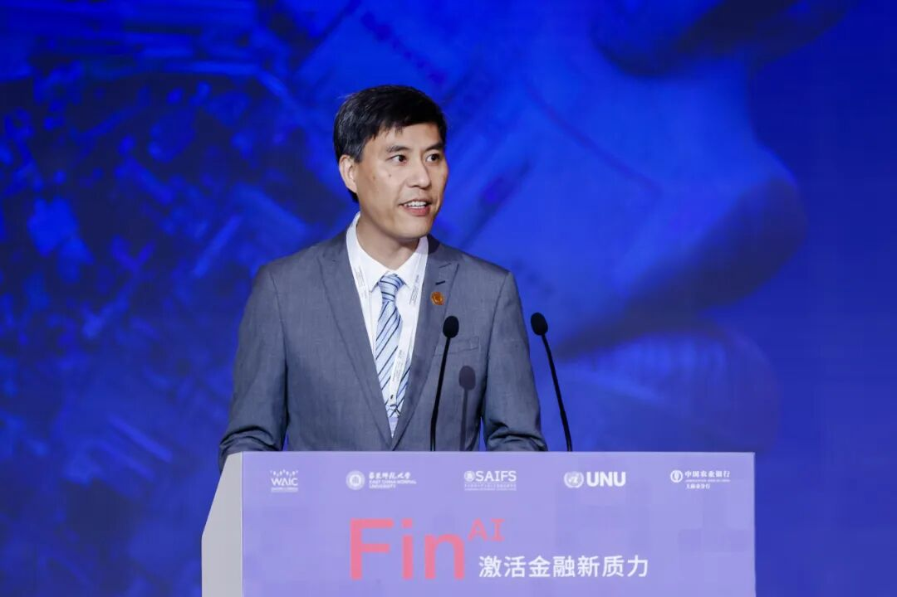

华东师大党委副书记孟钟捷主持开幕式

论坛开幕式由华东师范大学党委副书记孟钟捷主持。

  

 金融新质生产力

智慧银行与硅基共创未来  

  

中国农业银行行长王志恒在题为“全面拥抱人工智能生产力，深化建设数字时代的智慧银行”的主旨演讲中，回顾了中国农业银行举全行之力，打造以AI应用为核心的智慧银行，塑造AI与银行业深度融合的新型经营模式，生动展现了国有大行如何运用AI锻造金融新质生产力。

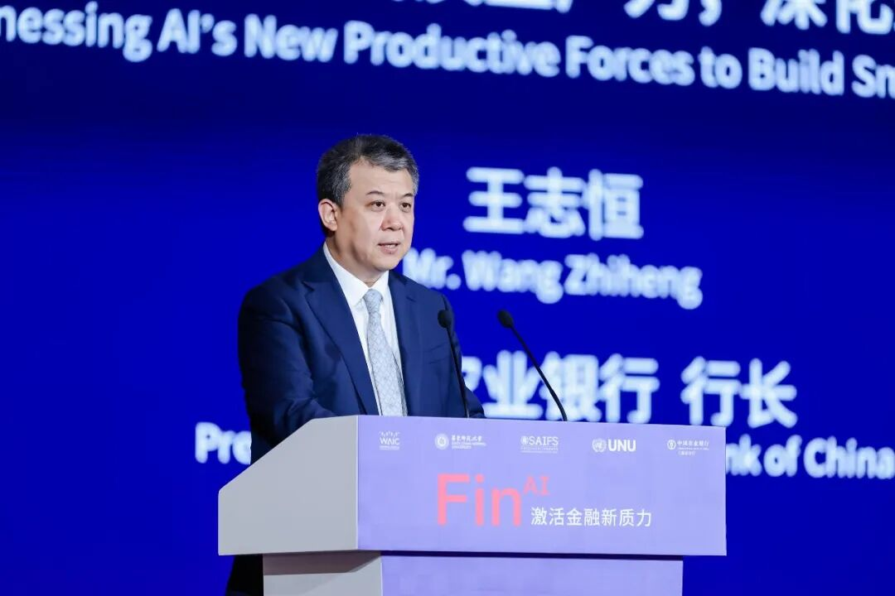

中国农业银行行长王志恒主旨演讲

他表示，人工智能技术的迅速发展，为商业银行的经营管理和对客服务带来了新的挑战和契机。作为一家致力于服务乡村振兴和实体经济的国有大行，农业银行一是遵循科技应用必须持之以恒的客观规律，打造了“一蓝图一地图一平台”的农业银行AI体系，实现智能化业务场景的百花齐放；二是坚持以问题和结果为导向，针对性地调整现有的劳动组合、作业流程、管理制度等，努力以高效的人机协同，统筹服务各类业务的高质量发展以及各类风险的有效控制；三是在AI应用上突出以客户为本、以员工为本的基本原则，注重人文关怀，增加客户和员工的获得感。

在人工智能飞速发展的数字时代，农业银行将以高水平安全为前提，以高质量数据供给为基础，以人工智能的创新应用为发力方向，深入推进智慧银行建设，为金融强国建设贡献智慧和力量。

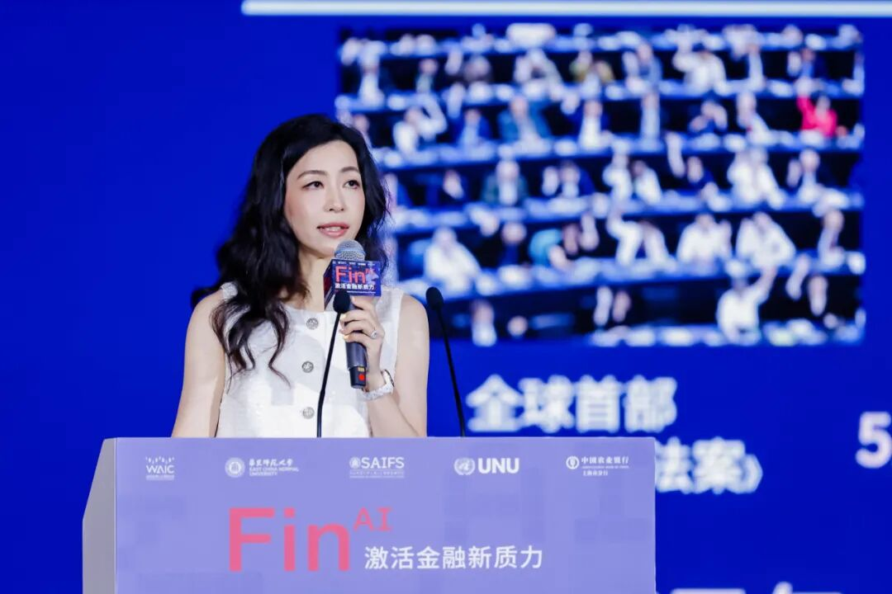

华东师大上海人工智能金融学院院长邵怡蕾主旨演讲

自2024年成立至今的一年里，华东师范大学上海人工智能金融学院（SAIFS）院长邵怡蕾教授团队不仅搭建了FinAI原型系统，更是首次提出了“硅基经济学”新范式，将算力、算法、数据作为新的生产资料，从硅基的角度重新审视当下的经济与社会。观察行业发展趋势，该团队认为，人类文明开启了从“纯碳基”走向“硅碳混合”的时代。在这一过程中，技术不再只是外部工具，而是每个人、每家机构不可或缺的“体外器官”。

当AI发展快车驶入2025年，越来越多的突破性成果涌现，人类社会进入了AI的生产力元年。在主旨演讲中，华东师范大学上海人工智能金融学院院长邵怡蕾提出，生产力不只是算力规模，更加需要明确的是，AI能否真正创造经济价值？与此同时，当AI落地于金融学，避免“生产力黑洞”至关重要，即需要严格把控风险。

面对这一核心问题，SAIFS提出了“硅基经济学”。其与传统经济学最大的不同在于，不再以“劳动-资本”的碳基逻辑为起点，而是以“算法-算力-数据”的硅基要素构建新型社会生产关系，其并非替代经济学，而是继承并重构它。

邵怡蕾说：“硅基经济学的使命是为新质生产力与全球智能经济，提供一套系统性认知地图与政策嵌套空间。”

  

金融智能引擎发布

三大“AI+金融”场景落地  

  

本次论坛的核心亮点之一是华东师范大学上海人工智能金融学院（SAIFS）院长邵怡蕾教授团队研发的“Silicon Fin：SAIFS金融智能未来引擎”正式发布。

该系统搭建了一套贯通数据底座、模型森林、智能体家族以及落地应用场景的FinAI原型系统，构建出一个以人工智能驱动的人机协同金融认知网络，标志着AI在金融领域认知建模与制度嵌入方面的全新突破。

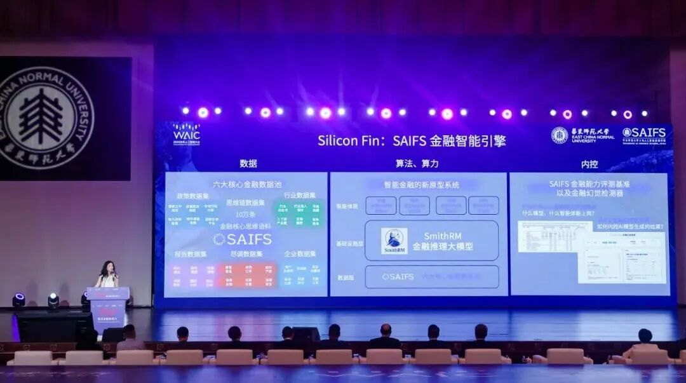

“Silicon Fin：SAIFS金融智能未来引擎”正式发布

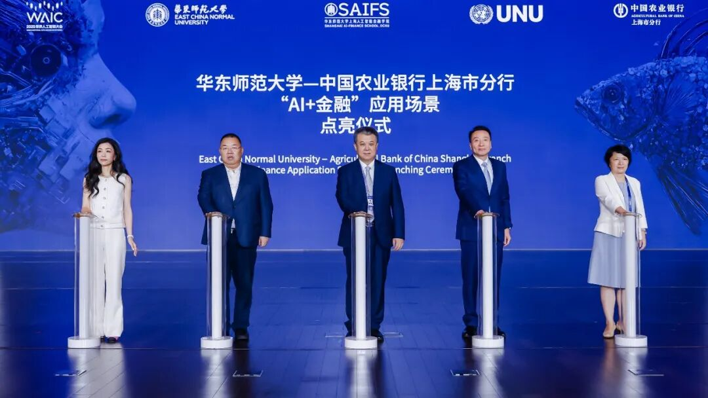

中国农业银行行长王志恒、中国农业银行上海市分行行长韩国强、上海国有资本投资有限公司董事长袁国华、华东师大党委书记梅兵、华东师大上海人工智能金融学院院长邵怡蕾共同启动三大应用场景

此外，华东师范大学与中国农业银行上海市分行联合发布三大“AI+金融”示范应用场景，包括智能信贷报告、模速贷科创企业服务方案、智能宏观分析。

智能信贷报告基于金融分析师智能体思睿，整合15TB全量数据集与10万条精标注思维链语料库，可在30秒内生成2万字无幻觉企业全景分析报告，助力快速形成高可用的信贷调查报告，实现人工智能金融新质力的落地转化。

模速贷科创企业服务方案则围绕五大维度对人工智能企业进行综合评估，由人工智能便捷生成模速贷评分卡，便利客户经理快速筛选优质客户，精准服务上海科创中心建设。

智能宏观分析覆盖15种语言、全球20大经济体央行与官方媒体数据，整合结构化信息与非结构化信息，助力多场景决策。

双方将共同以科技之力服务国家战略，推动金融高质量发展，携手打造更高效、更普惠、更智能的金融服务新格局。

  

 硅基对话

AI跨时空激荡金融新范式  

  

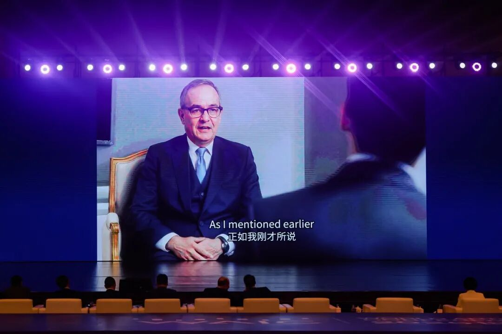

司马贺教授的数字人形象与华东师大吴冠军教授跨时空对话

借助AI技术，论坛特别呈现了全球迄今唯一获得了诺贝尔经济学奖和图灵奖及世界人工智能终身成就奖的著名科学家司马贺（Herbert Simon，赫伯特·西蒙，1916-2001）数字人形象与华东师范大学政治与国际关系学院院长吴冠军的跨时空对话，就人工智能与经济学的交互与相互影响进行了深入探讨。

尽管司马贺教授已于2001年去世，但其思想与理论仍具有深远影响。司马贺“希望”人工智能和经济学结合打造出既可理解又可控制，既具有人性又具备智能的经济与智能体系。他“呼吁”要以好奇和谦逊驾驭AI，让AI成为可信同事，从而让世界更理性、更人性化、满意化。

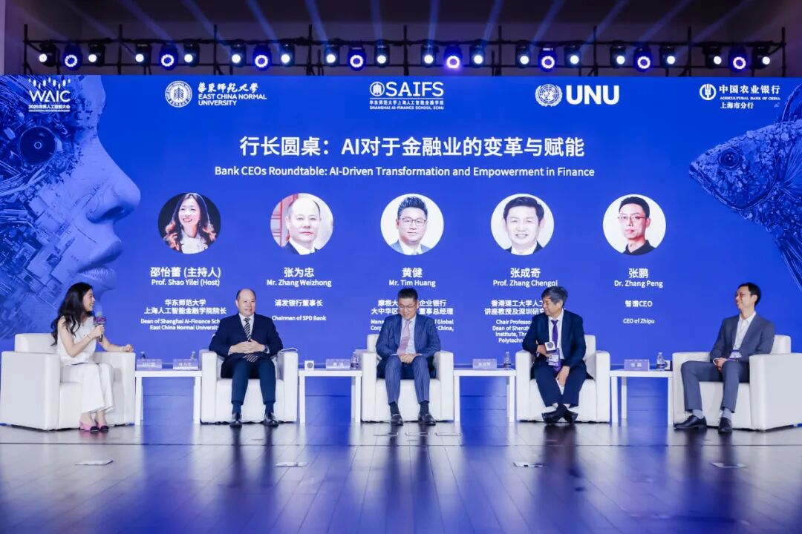

“行长圆桌”主题：“AI 对于金融业的变革与赋能” 

  

“行长圆桌”由邵怡蕾主持，浦发银行董事长张为忠，摩根大通环球企业银行大中华区总裁、董事总经理黄健，中国香港理工大学人工智能讲座教授张成奇，智谱CEO张鹏围绕主题“AI对于金融业的变革与赋能”展开讨论。

与会者认为AI与金融的融合，不只是科技落地的问题，更是认知、制度、人才、生态的系统重构，面对未来可能出现的金融新范式，在激进创新的同时，必须守住稳定与信任的底线。

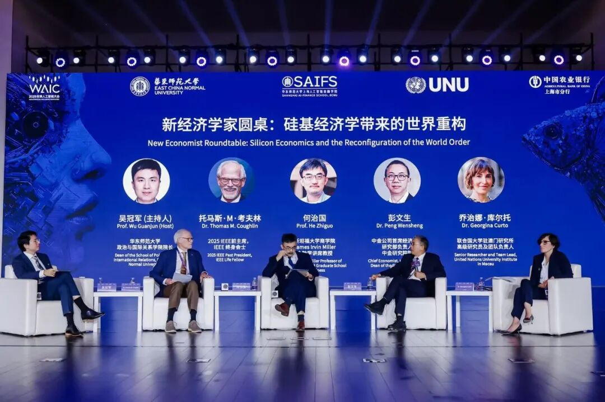

“新经济学家圆桌”主题：“硅基经济学带来的世界重构”

  

“新经济学家圆桌”由华东师范大学政治与国际关系学院院长吴冠军主持，2025 国际电气与电子工程师学会前主席、终身会士托马斯·M·考夫林（Dr. Thomas M. Coughlin），斯坦福大学商学院 James Irvin Miller 金融学讲席教授何治国，中金公司首席经济学家、研究部负责人、中金研究院院长彭文生，联合国大学驻澳门研究所高级研究员及团队负责人乔治娜·库尔托（Dr. Georgina Curto）聚焦主题“硅基经济学带来的世界重构”，就人工智能对全球经济治理的影响展开充分讨论。

专家们认为科技、金融、治理三重奇点交织的时代已然来临，技术与金融的双重革命正冲击既有秩序与价值观；面对算法霸权与数字主权的碎片化，需要在深入对话与合作中寻找新的世界坐标。

  

 AI金融的“华东师大”智慧

与“上海方案”  

  

2025 WAIC人工智能金融领导者论坛以“激活金融新质力”为主题，汇聚全球顶尖智慧，推动人工智能与金融的深度融合。论坛不仅是一场思想的盛宴，更是一次技术落地与产业变革的实践展示，为全球可持续与包容发展贡献了“华东师大”智慧和“上海方案”力量。

未来，AI金融将重塑金融底层逻辑，推动行业向智能化、可信化、高质量发展迈进。从“硅基经济学”到智能稳定币，AI正成为金融与治理的核心杠杆，全球经济结构可能被重构，这一趋势的实现，离不开全球合作与跨学科对话，唯有在创新与稳定之间找到平衡，才能构建更加公平、包容、韧性的未来金融体系。

上海作为国际金融中心与科技创新高地，正以高水平开放与创新驱动，推动AI金融落地实践。华东师范大学致力于构建AI与金融融合的人才生态，推动更多AI+金融应用场景落地，为金融高质量发展提供坚实支撑。

人工智能不仅是技术革新，更是全球经济治理的重要议题。必须坚守伦理底线，推动AI在金融领域实现公平、透明、可持续的应用，确保技术进步惠及全人类。

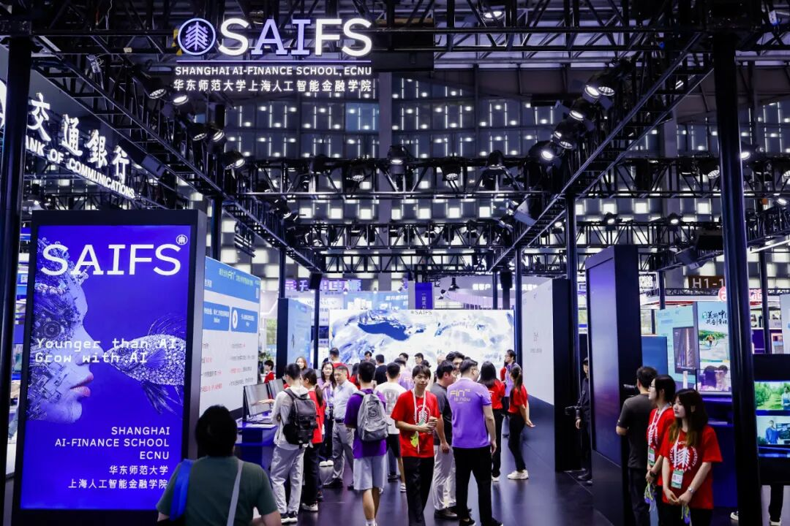

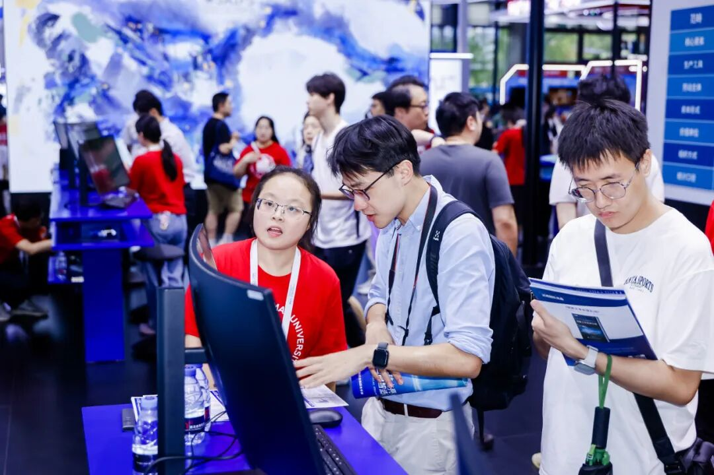

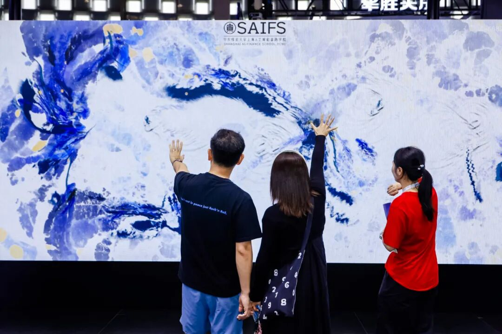

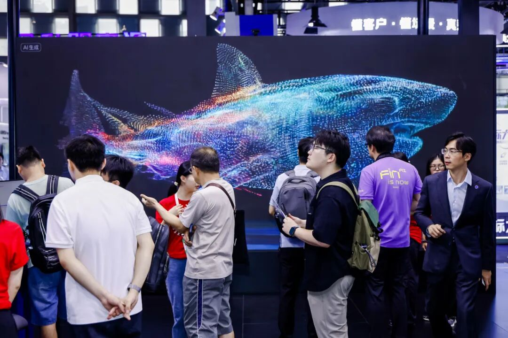

“FinAI展：硅基时代的智慧银行”在上海世博展览馆H1-D108展区展出

此外，由华东师范大学主办，上海人工智能金融学院（SAIFS）携手联合国大学（UNU），联合中国农业银行上海市分行共同呈现的—— FinAI展：硅基时代的智慧银行，7月26日至29日在上海世博展览馆H1-D108展区展出。

作为全球首个聚焦“人工智能+金融”融合落地的大型主题展，不仅汇聚了最新的AI大模型技术应用、场景级创新解决方案，还带来了沉浸式体验与数字打卡互动。由上海人工智能金融学院自研的金融推理大模型代表作“镇馆之宝SmithRM”，化身数字鱼群闪耀登场，致敬“现代经济学之父”亚当·斯密，让“看不见的手”被看见。

  

来源｜华东师范大学上海人工智能金融学院

华东师范大学经济与管理学院

通联丨潘诚男

编辑｜戴琪

  

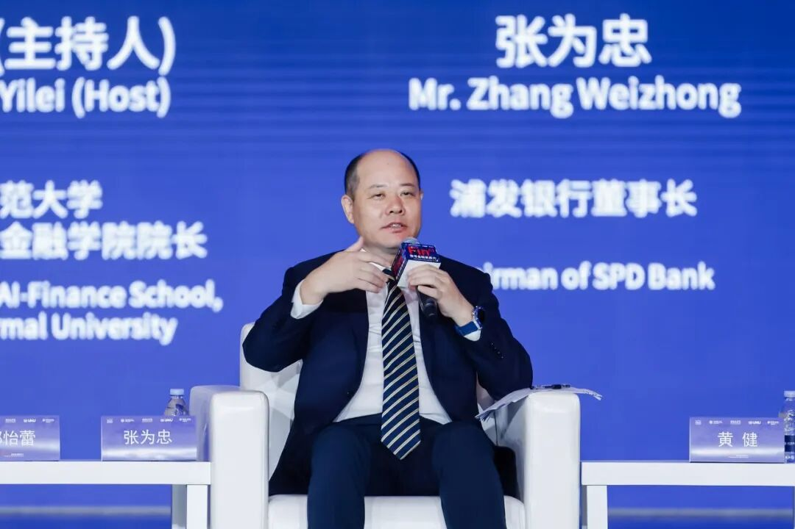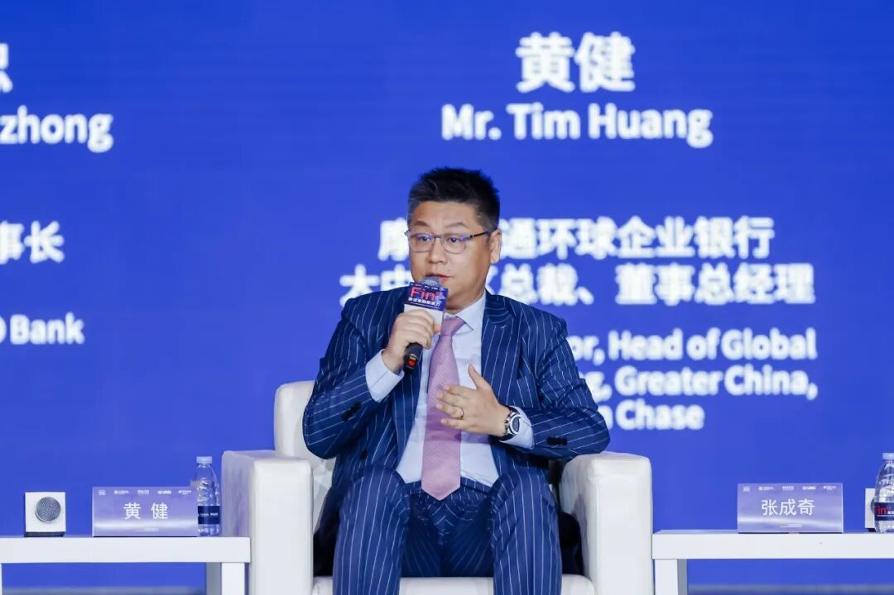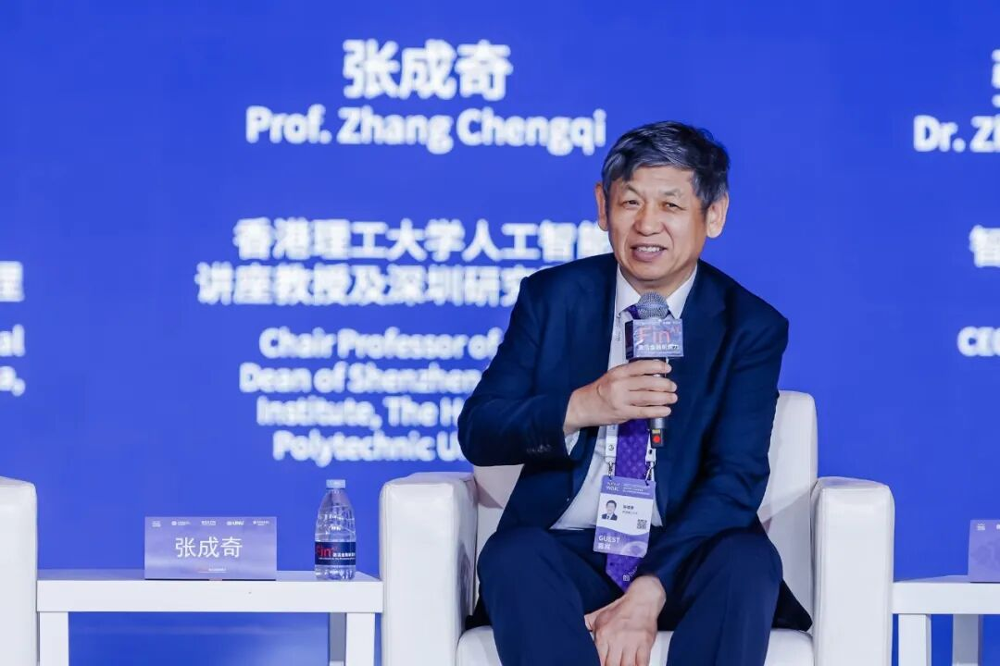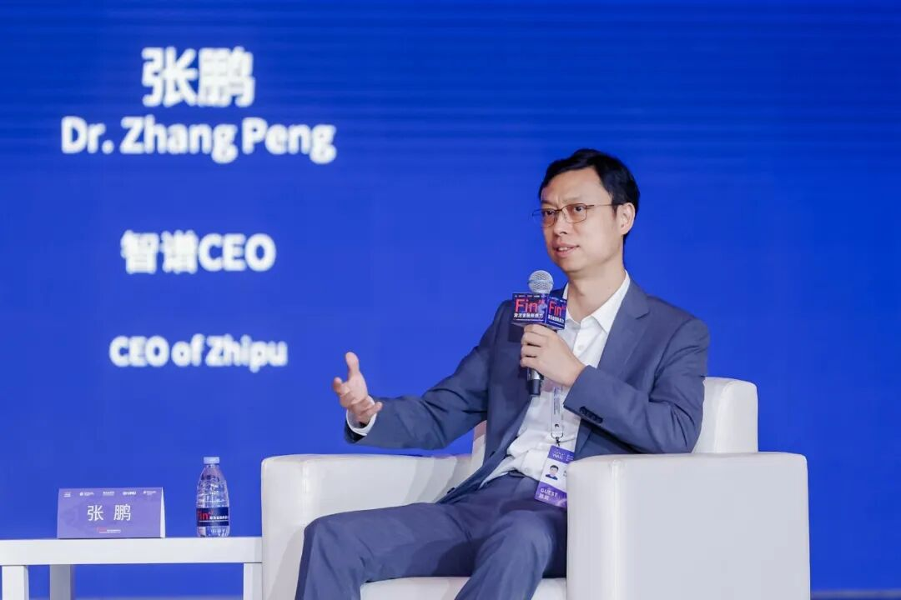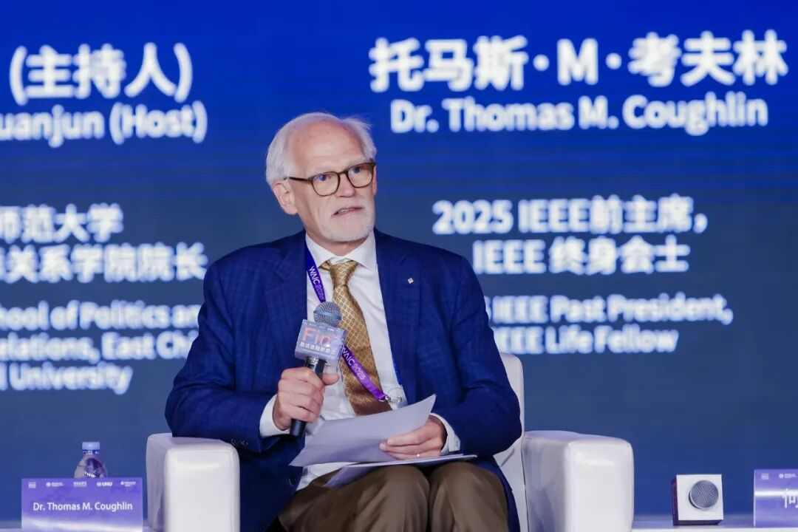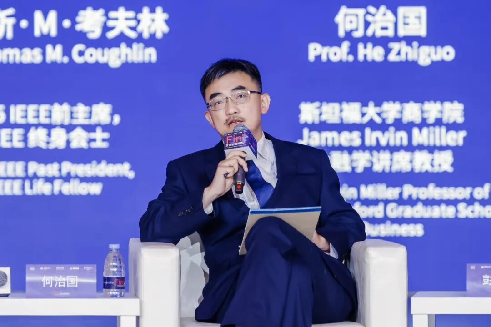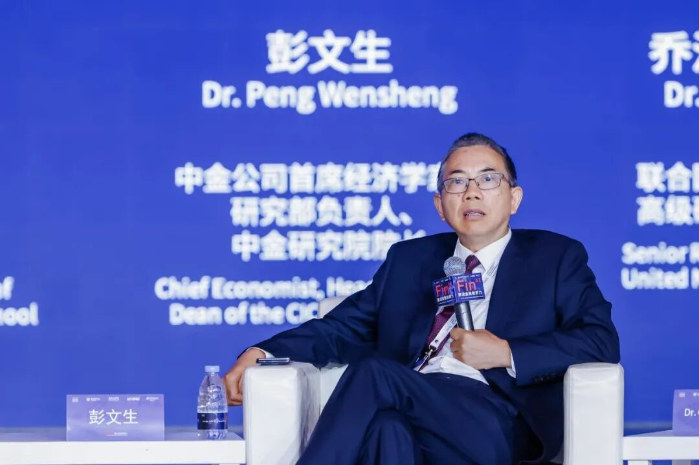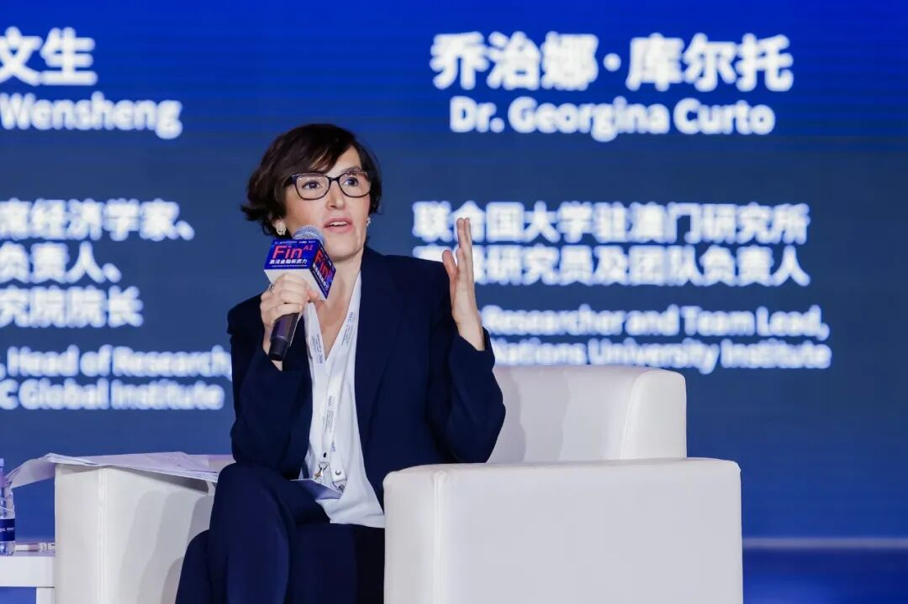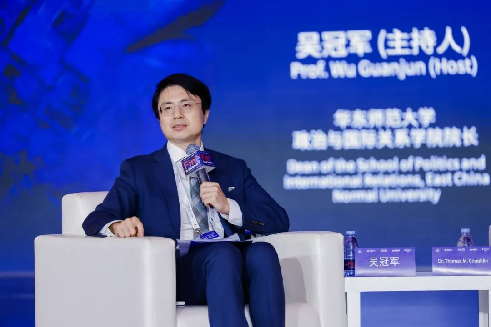