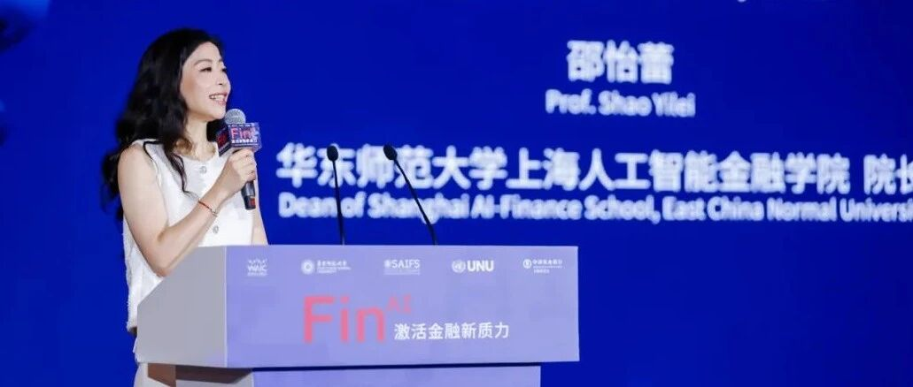
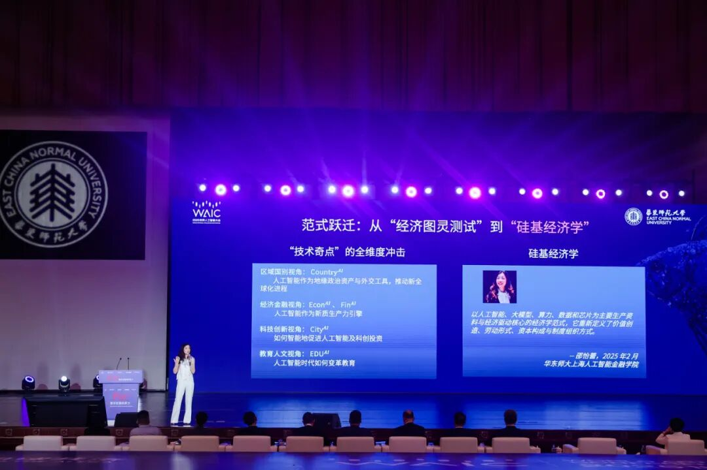
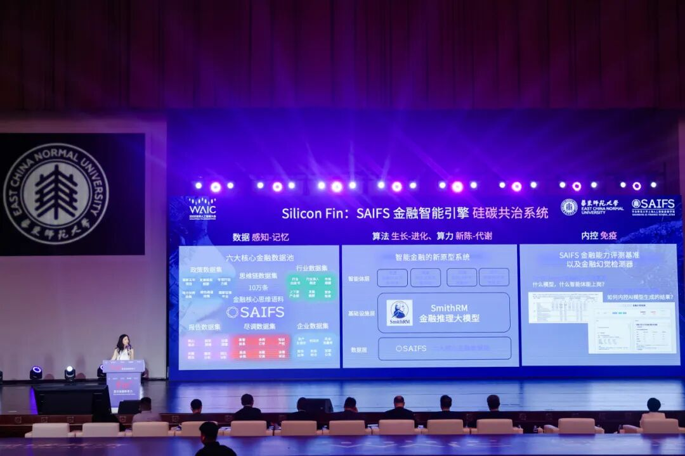
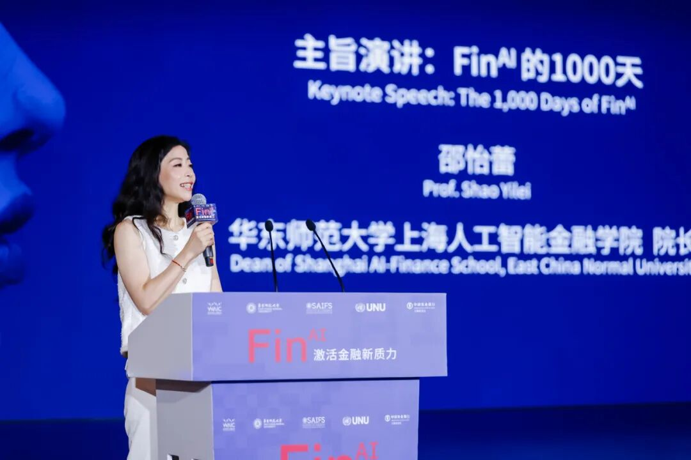
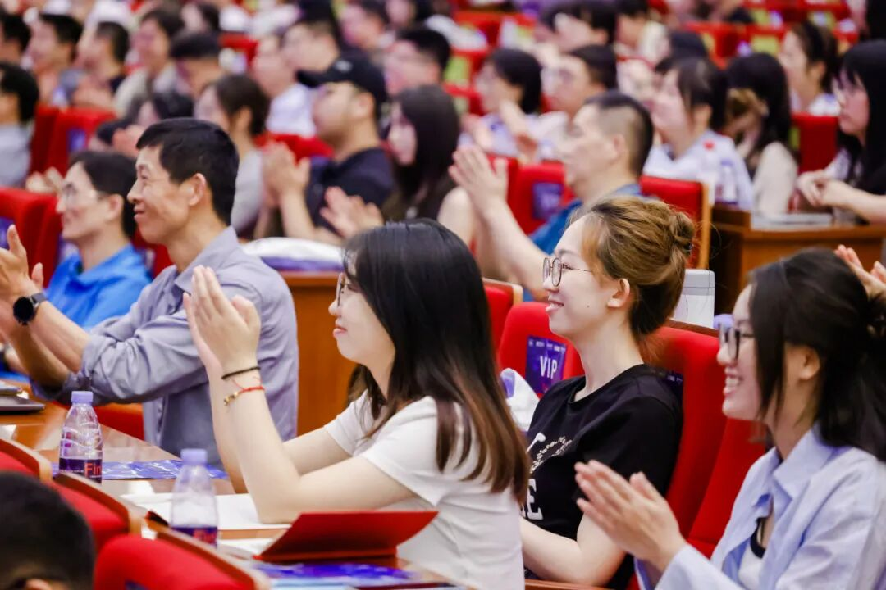
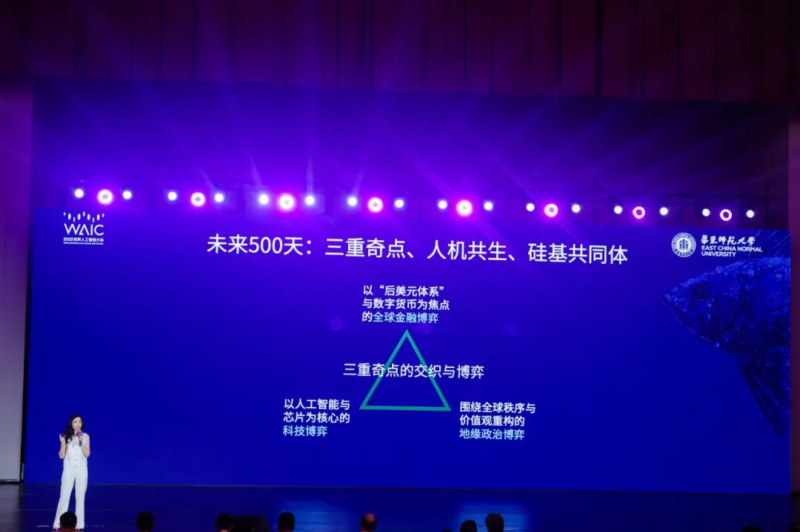
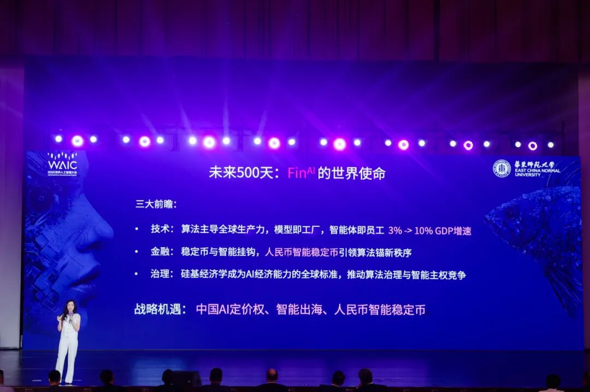
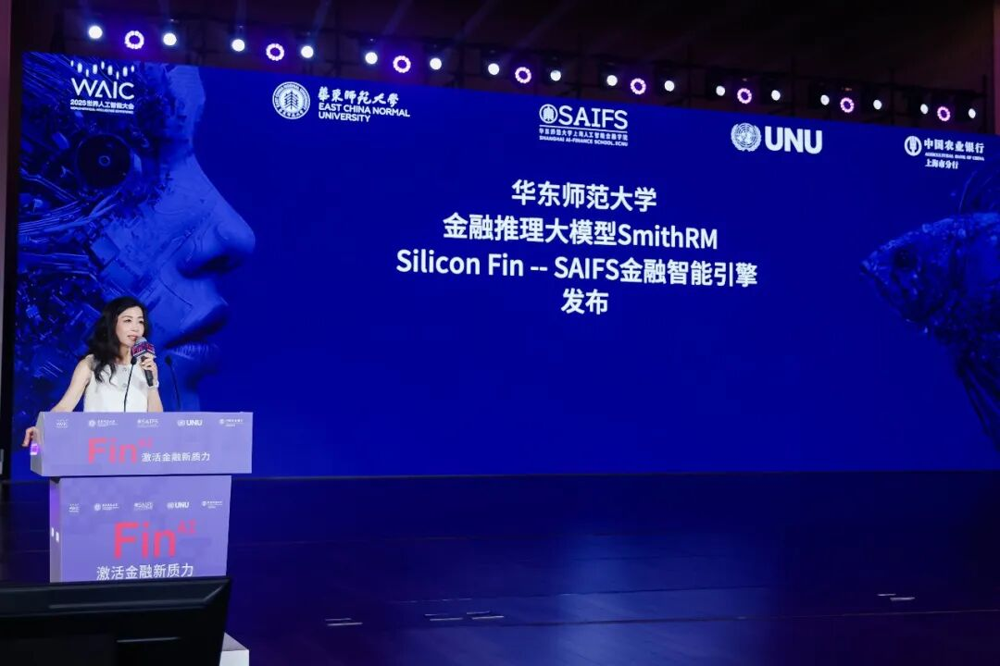
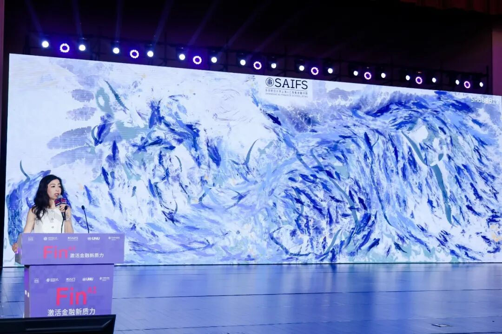
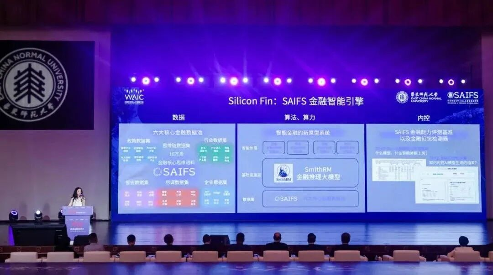

# 当智能成为主要生产资料，硅基经济学引爆「AI+金融」

> **作者**: 李宝珠
> **发布日期**: 2025年7月31日 12:07
> **来源**: [原文链接](https://mp.weixin.qq.com/s/kMHJoIsE86YIhhHJ4CSFgw)

---

转载自机器之心

**作者：李宝珠**

  

> 从碳基迈向硅基，华东师范大学上海人工智能金融学院院长邵怡蕾提出「硅基经济学」，该经济学范式将引领世界经济体系的范式转移。

  

过去，人类社会的经济运行长期依赖「碳基」结构，即以人力、自然资源和传统能源为核心的生产与决策模式。如今，AI 正在引领世界经济体系的范式转移 —— 从碳基迈向硅基。面对这一趋势，华东师范大学上海人工智能金融学院（SAIFS）院长邵怡蕾教授率先提出了「硅基经济学」，这是一种以人工智能、大模型、算力、数据和芯片为主要生产资料与经济驱动核心的经济学范式。

  

邵怡蕾院长首提「硅基经济学」

邵怡蕾院长曾在 2025 年 3 月的公开演讲中首次提出了硅基经济学对全球经济的重构，首先是生产资料的重构，智能会替代能源成为主要生产资料，所以需要加快硅基基础设施建设，例如建算力、智能云服务等。其次是劳动力的重构，人力占比降低，劳动型机器人或 AI Agent 会越来越多。第三是贸易格局的重构，当智能成为出口贸易的主力，谁是出口国？谁是进口国？以何种价格出口？以哪种货币结算？都将以全新的形式展开。

  

邵怡蕾院长介绍 Silicon Fin：SAIFS 金融智能引擎

从「纯碳基」走向「硅碳混合」

  

作为「硅基经济学」首提者，邵怡蕾院长在「2025 WAIC 人工智能金融领导者论坛」上，进一步阐释了这一新范式的核心概念及其将带来的深刻影响。

  

邵怡蕾院长发表主题演讲：FinAI 的 1000 天

她介绍道，自 2024 年成立至今的 1 年中，华东师范大学上海人工智能金融学院（SAIFS）院长邵怡蕾教授团队不仅搭建了一套贯通数据底座、模型森林、智能体家族以及落地应用场景的 FinAI 原型系统，更是首次提出了「硅基经济学」，将算力、算法、数据作为新的生产资料，从硅基的角度重新审视当下的经济与社会。察变行业发展趋势，其团队认为，人类文明开启了从「纯碳基」走向「硅碳混合」的时代。在这一过程中，技术不再只是外部工具，而是每个人、每一家机构不可或缺的「体外器官」。

  

2025 WAIC 人工智能金融领导者论坛现场

当 AI 发展快车驶入 2025 年，越来越多的突破性成果涌现，正如邵怡蕾院长所言，「2025 年，我们进入了 AI 的 生产力元年」，但她也提出，生产力不只是算力规模，更加需要明确的是 ——AI 能否真正创造经济价值？

  

面对这一核心问题，邵怡蕾院长提出了「硅基经济学」。其与传统经济学理论最大的不同在于，它不再以「劳动-资本」的碳基逻辑为起点，而是以「算法-算力-数据」的硅基要素构建新型社会生产关系，其并非替代经济学，而是继承并重构它。邵怡蕾院长认为，「硅基经济学的使命是为新质生产力与全球智能经济提供一套系统性认知地图与政策嵌套空间」。

  

毫无疑问，范式变革之下不仅是技术的升级，同时也需要伴随社会规则与全球体系的重构。对此，邵院长提出了硅基世界的「权力三角形」，首先是智能的开采权，即如何稳定地向全球提供智能产品，它需要供给国能够稳定地供给算力、数据、算法（即人才），目前看来，世界上只有中国与美国具备这样的能力。其次是智能的定价权，即将由哪个国家、机构来决定单位智能（每百万 token）的国际市场通用价格。最后是智能的结算权，即以何种货币进行单位智能的国际结算。

  

现今我们正处于从「纯碳基」向「硅碳混合」过渡的关键时刻，上述体系尚在形成的过程中，是一个机遇与挑战并存的阶段。在这一阶段，邵怡蕾院长提出，「未来 500 天内，我们将能够看到三重奇点的交织，第一重是人们已经非常熟悉的以人工智能与芯片为核心的科技奇点；第二重奇点也已经到来，即以『后美元体系』与数字货币为焦点的全球金融奇点；第三重便是围绕全球秩序与价值观重构的地缘政治奇点。这三重奇点从未在历史上任何一个时刻如此交织与重合」。

  

  

随后，邵院长就未来 500 天 AI 对于 世界的变革，提出了三大前瞻：首先，她认为算法将主导全球生产力，模型即工厂，智能体便是员工，当下的 GDP 年增长为 3%，这一数字很快将增长至 10%，而这个增长将是由 AI 驱动的。其次，在金融领域，稳定币将与智能挂钩，而人民币稳定币或将引领算法锚点新秩序。最后，硅基经济学将成为 AI 经济能力的全球标准，推动算法治理与智能主权竞争。

  

基于此，她认为我国正面临三重重要的战略机遇 —— 中国 AI 的国际定价权，智能如何出海及人民币智能稳定币。

  

邵怡蕾院长提出的三大前瞻：技术、金融及治理

正是基于以上观察，面对金融行业硅基生产力革命的真实需求，邵院长及其团队构建了完整的「智能金融新原型系统」：Smith RM 金融推理大模型 + Silicon Fin: SAIFS 金融智能引擎。

  

SAIFS 金融智能引擎发布

利刃出鞘，双核驱动的智能金融新原型系统

  

最初，基于安全隐私、风险控制等方面的考量，金融领域并未似其他传统行业那般直接将 AI 的强劲动力注入核心业务中，而是以「工具」的形态帮助数据量大、结构清晰的任务进行提效，或是以聊天机器人的形式应用于客户服务。

  

如今，随着大模型、Agent 快速迭代，AI 开始系统性地融入业务流程中，面向实际行业痛点与挑战，形成从数据采集→建模→决策支持→执行反馈的闭环，加之模型推理能力的提升，使其在风险评估、投研分析、合规审查等复杂任务中不仅具备更强的响应能力，也逐步实现了对决策过程的可解释性与透明度要求。

  

诚然，随着大模型及 AI Agent 的性能及可解释性持续有所突破，其在金融行业中的应用探索也逐步加深。针对于此，华东师范大学上海人工智能金融学院院长邵怡蕾及团队洞察行业的真实需求，在世界人工智能大会（WAIC 2025）期间发布了重磅成果「Silicon Fin—SAIFS 金融智能未来引擎」。该系统搭建了一套贯通数据底座、模型森林、智能体家族以及落地应用场景的 FinAI 原型系统，面向金融分析、风控合规、宏观预测与数据科学这 4 大关键领域，构建出了一个以 AI 驱动的人机协同金融认知网络。

  

据邵怡蕾院长介绍，Smith RM 是一个兼顾「因果链」与「逻辑链」的人工智能金融推理框架，让模型不只会「给答案」，而是真正回答「为什么」。

  

金融分析师智能体思睿撰写的公司信贷报告驱动了数字艺术装置《金鳞墨池》

而 SAIFS 金融智能引擎则是从模型进化、模型感知与模型合规 3 个方面为 FinAI 提供了更加全面的支撑。具体而言，其架构包含了数据层、基础设施层、智能体层、应用层与内控层。

  

在数据层，团队构建了「政策、报告、尽调、企业、行业、思维链」六大核心金融数据池，实现了核心数据的相互协作，并通过 10 万条深度标注思维链把知识颗粒磨到「神经元」级别，从而构建了 Smith RM 的底座。在基础设施层，Smith RM 与算力集群通过 7x24 小时的进化与学习保持模型的活力。在智能体层，4 位 AI Agent 各司其职 ——「思睿」任职金融分析师、「律衡」任职安全合规官、「观微」担任宏观研究员、「织元」则是数据科学家，实现了金融分析任务的人机协作。最后，面向金融领域至关重要的内控机制，该团队还研发了 FinAI 金融能力评测基准 FinAI Bench，以及金融幻觉检测器。

  

在「2025 WAIC 人工智能金融领导者论坛」上，邵院长为到场观众现场演示了 4 位 Agent 的协作上岗。「思睿」能够在 30 秒内读取大量的多模态数据，涵盖行业、政策、企业、财务等多方面信息，运用思维链数据库进行了类人的、可解释的金融分析，并将其整合为一份 2 万字 0 幻觉的报告，包含了行业情况、财务分析、信用情况、环境 ESG 等多样化信息，并标明了数据来源。更重要的是，基于金融幻觉检测能够对「思睿」产出的报告数据进行核验，确保其可用性。

  

「律衡」能够以分钟级的效率进行金融报告的核验，同时，金融幻觉检测器不仅针对 AI 报告，同时也能够帮助人类分析师进行内容核查，实现提质降本。

  

总结来看，当 AI 在金融领域从工具走向「硅碳共治体」，在技术成长之外，其更应该尽快突破合规需求下的可解释性屏障，实时响应行业的动态需求。而 SAIFS 发布的金融智能引擎 Silicon Fin 拥有数据感知、算法进化、算力代谢和内控免疫四重「生命特征」，未来，「不止于服务市场，更将与市场共同成长」。

  

结语

  

自 2018 年首次举办以来，世界人工智能大会（WAIC）已成长为全球最具影响力的 AI 盛会之一，持续汇聚前沿技术成果与产业力量，成为观察人工智能发展趋势的重要窗口。在这一全球瞩目的平台上，华东师范大学上海人工智能金融学院（SAIFS）不仅发布了多项重磅研究成果，还携手产业界展示了 AI 在金融场景中的创新应用，体现出了强劲的科研能力与落地转化潜力。相信，在硅基经济学发展持续向纵深跃迁之际，SAIFS 将为行业输出更多高价值成果。

  

---

  

SAIFS在2025WAIC：

[WAIC华东师大聚力！首发金融智能未来引擎，三大应用场景落地](https://mp.weixin.qq.com/s?__biz=MzkxMTY1ODk2Mw==&mid=2247487007&idx=1&sn=a0a75e9fd4ef4a7d446457c592f22302&scene=21#wechat_redirect)

  

