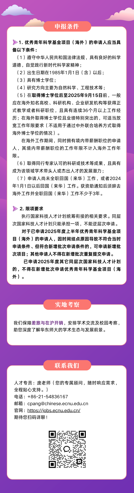
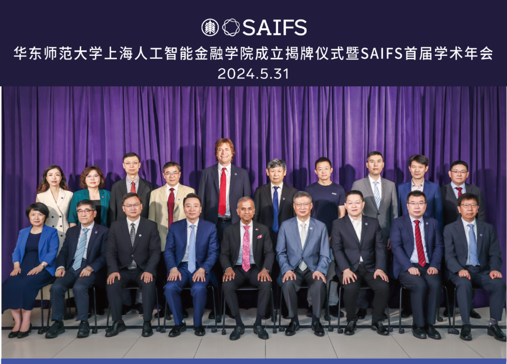
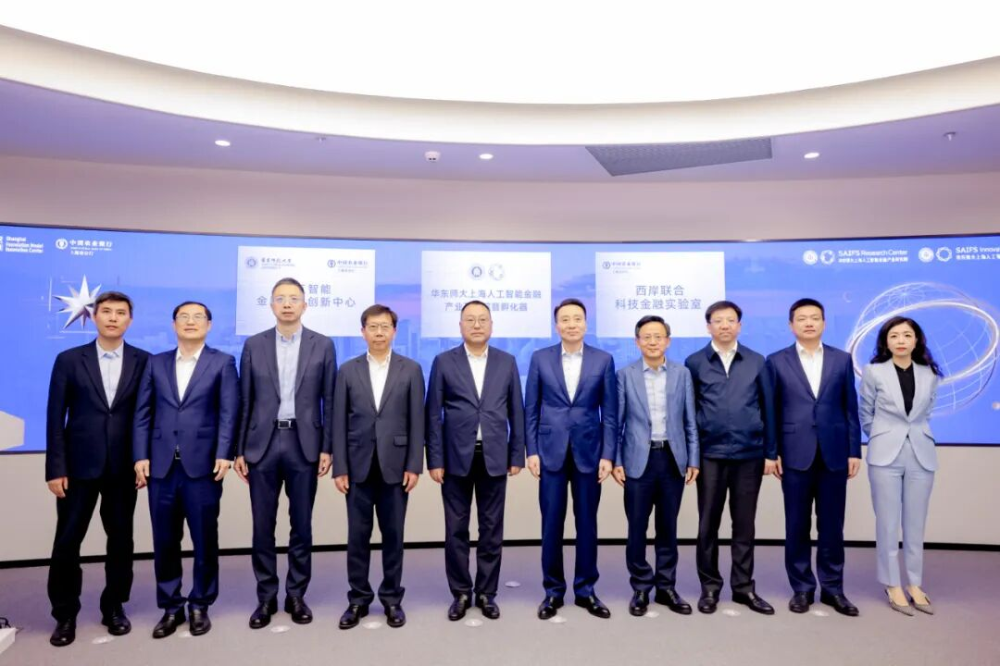
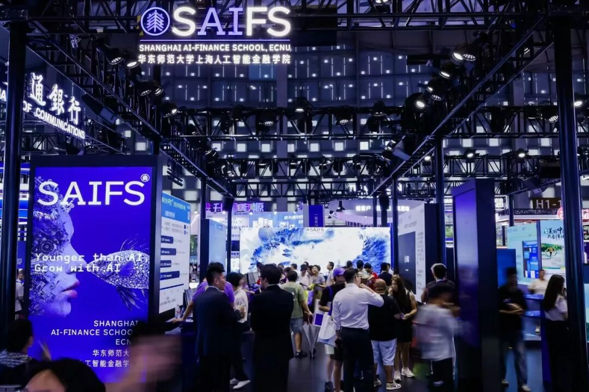
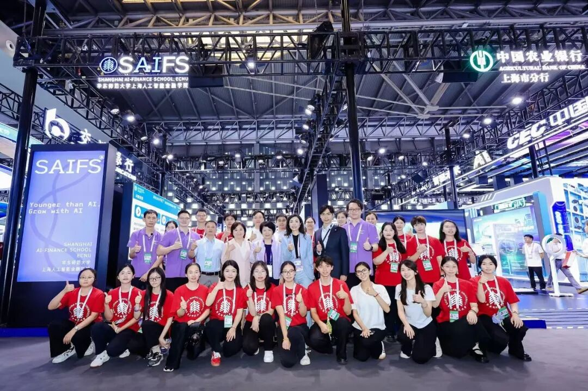

# 海外优青（新增批次）申报启动！诚邀全球青年才俊依托华东师范大学上海人工智能金融学院申报

> **作者**: 诚邀青年才俊的
> **发布日期**: 2025年8月4日 09:26
> **来源**: [原文链接](images/image6.jpg)

---

  

  

  

  

华东师范大学宣传片  

已关注

关注

重播 分享 赞

关闭

**观看更多**

更多

*退出全屏*

*切换到竖屏全屏**退出全屏*

上海人工智能金融学院SAIFS已关注

分享视频

，时长04:53

0/0

00:00/04:53

切换到横屏模式

继续播放

进度条，百分之0

[播放](javascript:;)

00:00

/

04:53

04:53

[倍速](javascript:;)

*全屏*

倍速播放中

[0.5倍](javascript:;) [0.75倍](javascript:;) [1.0倍](javascript:;) [1.5倍](javascript:;) [2.0倍](javascript:;)

[超清](javascript:;) [流畅](javascript:;)

您的浏览器不支持 video 标签

继续观看

海外优青（新增批次）申报启动！诚邀全球青年才俊依托华东师范大学上海人工智能金融学院申报

观看更多

转载

,

海外优青（新增批次）申报启动！诚邀全球青年才俊依托华东师范大学上海人工智能金融学院申报

上海人工智能金融学院SAIFS已关注

分享点赞在看

已同步到看一看[写下你的评论](javascript:;)

[视频详情](javascript:;)

  

**华东师范大学上海人工智能金融学院**

  

  

     科技的迅速发展，特别是人工智能（AI）的飞跃进步，作用于金融业对于更高效，更安全，更智能的解决方案的持续需求，便催生出了新生的人工智能金融（AI-Fin）。人工智能金融是一个高度复杂和多元化的领域，它需要多学科的合作和研究。AI-Fin不同与FinTech，也不同于TechFin，AI与金融的结合将以迅猛的速度前所未有的颠覆金融业的微观格局与世界政治经济格局。

上海人工智能金融学院（简称SAIFS）于2023年在华东师大成立，是全球首家围绕人工智能与金融跨界交叉打造的教育和研究机构。SAIFS强调在超越知识点的通识教育的基础上，培养集金融知识、人工智能技术和实践经验于一身的新一代人工智能金融（AI-Fin） 领军型卓越人才，并坚持扎根在学术研究的前沿，探索AI在金融中的新应用，驱动AI-Fin 的发展。 同时，SAIFS 致力于与全球的学术机构、金融机构、科技公司和政府部门建立广泛的合作网络，通过推广AI 与金融的交叉研究和应用，改善金融服务的效率和质量，为社会创造价值。

学院目前已成立人工智能金融（AI-Fin）研究中心，该中心将开发识别、量化、预测和减轻先进人工智能技术应用系统性风险的先进模型，未来将向政府部门和各大金融机构输出关于AI 的内控合规理论与研究成果。在AI-Fin以外，SAIFS还将打造人工智能伦理与治理（AI-PPE）研究中心，将致力于推进AI时代的全球哲学\-政治学\-经济学（PPE）思想前沿问题的研究，并打造一套全新的全新的AI4Social Science 教学体系重新激活哲学\-政治学\-经济学服务现代社会的动能。

  

  

  

  

**华东师范大学上海人工智能金融**

**产业研究院暨孵化器**

  

  

    2024年10月，学院在徐汇区和华东师大的支持下，在位于徐汇区的上海“模速空间”大模型创新生态社区落地华东师大上海人工智能金融产业研究院暨孵化器。该产业研究院作为徐汇大模型重大合作项目之一，其设立旨在畅通"科技-产业-金融"循环，打造人工智能与金融产业融合发展的创新高地。

     产业研究院将重点开展以下工作：构建自主可控的可信金融垂类大语言模型；打造三大人工智能金融创新示范场景；建立专业金融语料库，实现高质量数据供给；强化金融科技基础设施建设。同时，研究院下设孵化器，致力于推动技术成果转化，为金融科技创新提供持续动能。2024年12月10日，华东师大上海人工智能金融孵化器等8家单位荣获徐汇区第二批区级高质量孵化器荣誉称号。孵化器将打造"三位一体"的综合平台：聚焦前沿技术研发，深化产业协同创新，加强复合型人才培养。通过人工智能与金融科技的深度融合，孵化器将推动金融服务模式智能化升级，助力上海国际金融中心向智能化转型。

     2025年5月23日，**华东师范大学上海人工智能金融产业研究院暨孵化器**揭牌仪式在徐汇区“模速空间”举行。上海徐汇区委书记曹立强、中国农业银行上海市分行行长韩国强，以及华东师范大学校长钱旭红共同为华东师范大学上海人工智能金融产业研究院暨孵化器、“华东师范大学\-中国农业银行上海市分行”人工智能金融应用创新中心、西岸联合科技金融实验室三大平台揭牌，标志着华东师范大学与徐汇区、农行携手绘制“科技\-产业\-金融”良性循环的上海蓝图。

  

  

  

华东师范大学上海人工智能金融学院

首次参与2025WAIC世界人工智能大会

     2025年7月27日上午，聚焦“AI金融+硅基经济学”核心议题，中国首个面向行长级别的人工智能金融高端对话论坛——**“2025 WAIC人工智能金融领导者论坛”**在上海世博中心红厅举行。论坛以“激活金融新质力”为主题，汇聚国际领袖、四大行行长级领导者、“硅基经济学”首提者、新经济学家，以及人工智能产业界领袖，共同探讨硅基文明浪潮下，人工智能如何重塑金融基因，重构经济图景，吸引超千名观众线下参会，线上直播观众逾10万人。

     自2024年成立至今的一年里，华东师范大学上海人工智能金融学院邵怡蕾教授团队不仅搭建了FinAI原型系统，更是首次提出了“硅基经济学”新范式，将算力、算法、数据作为新的生产资料，从硅基的角度重新审视当下的经济与社会。

　   此外，由华东师范大学主办，上海人工智能金融学院携手联合国大学，联合中国农业银行上海市分行共同呈现的——**FinAI****展：硅基时代的智慧银行，****在上海世博展览馆****展出**。作为全球首个聚焦“人工智能+金融”融合落地的大型主题展，不仅汇聚了最新的AI大模型技术应用、场景级创新解决方案，**由上海人工智能金融学院自研的金融推理大模型代表作****“****镇馆之宝****SmithRM”**，还化身数字鱼群闪耀登场，致敬“现代经济学之父”亚当·斯密，让“看不见的手”被看见。

  

  

  

  

  

**智金院目前已建设或共建**

**以下科研与教学平台**

****

-   华东师范大学上海人工智能金融产业研究院暨孵化器（SAIFS Research Center & SAIFS Innovation Center）;
    
-   中国唯一与联合国大学共建的人工智能金融联合研究中心（UNU Hub in AI-Finacne at ECNU）;
    
-   中国首个金融大语言模型实验室（FinLLM Lab）；
    
-   “华东师范大学-中国农业银行上海市分行”人工智能金融应用创新中心 (“ECNU-ABC Shanghai Branch” Joint AI-Finance Innovation Center)。
    

  

华东师大智金院作为学校重点打造的人工智能金融创新高地，学院可为您提供真实金融场景、千卡级算力等关键资源，协助组建跨学科科研团队，并配套专项经费和项目申报支持，全方位保障科研探索与成果转化。

  

我们诚邀具有人工智能、统计学、计算机科学、数学、经济学或金融学等相关背景的优秀青年人才加盟。欢迎具备扎实学术基础、具备跨学科研究潜力、关注科技前沿并致力于推动“AI+金融”融合发展的青年学者，与我们共同探索智能时代的金融创新与理论突破。

  

**智金院目前研究方向**

🔷 **硅基经济学分析**（包括但不限于）：

1\. 人工智能对生产力结构的重塑与价值链再分配机制；  

2\. 数据、算法与算力作为新型生产要素的经济计量与建模；  

3\. 硅基智能体对市场行为、定价机制与组织结构的深层影响；

4\. 数字资本、智能劳动力与传统资本关系的演化分析。

1.    
    

🔷 **面向金融场景的交叉研究**（包括但不限于）：

1\. 图神经网络在金融关系建模和风险识别中的应用；

2\. 大语言模型在智能投研、合规审核与客户服务中的实践；

3\. 基于基本面数据的自动化分析与智能决策支持；

4\. 私募股权与对冲基金的量化策略建模与因子研究。

1.    
    

🔷 **数据驱动的智能场景应用**（包括但不限于）：

1\. 人工智能在信贷审批、风险控制、合规管理中的落地应用；

2\. 多源异构数据的融合治理与高质量数据资产构建；

3\. 数据驱动的ESG评估体系与可持续金融创新实践；

4\. 面向监管响应与宏观政策的智能预警与辅助决策平台。

  

🔷 **知识产权管理**（包括但不限于）：

1\. 新兴科技成果的转化机制与产业化路径；

2\. 高校产学研一体化平台的建设与运营模式；

3\. 人工智能时代下的知识产权战略布局与风险防控；

4\. 跨境技术输出与知识产权的合规治理机制。

  

**联系智金院**

****

**官方网站：https://saifs.ecnu.edu.cn/main.htm**

  

**联系方式：**

请有意向依托华东师范大学上海人工智能金融学院申报海外优青项目的海内外人才，将简历及相关证明材料以PDF格式打包发送至学院联系人**邮箱，并抄送至学院邮箱**（见文末），邮件主题请注明“2025新海外优青+姓名+现所在单位”。我们将及时与您联系，助您全面了解有关申报信息，为您提供咨询和申报服务。

  

**智金院邮箱：**

联系人：潘老师

联系邮箱：panchengnan@sem.ecnu.edu.cn 

学院邮箱：saifsadministration@sem.ecnu.edu.cn

  

  

