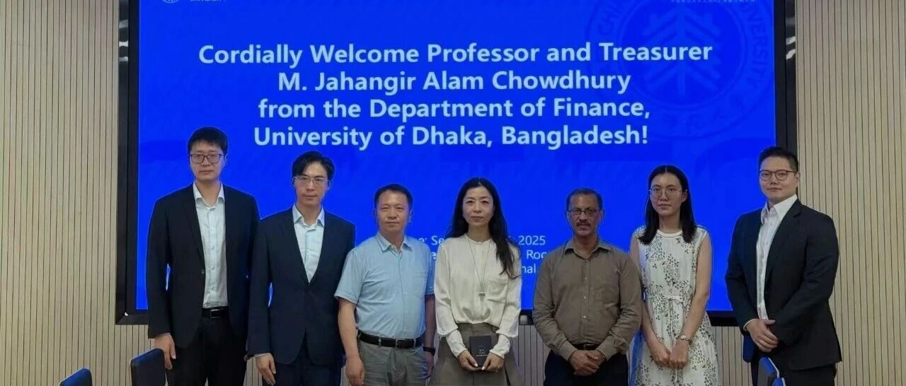
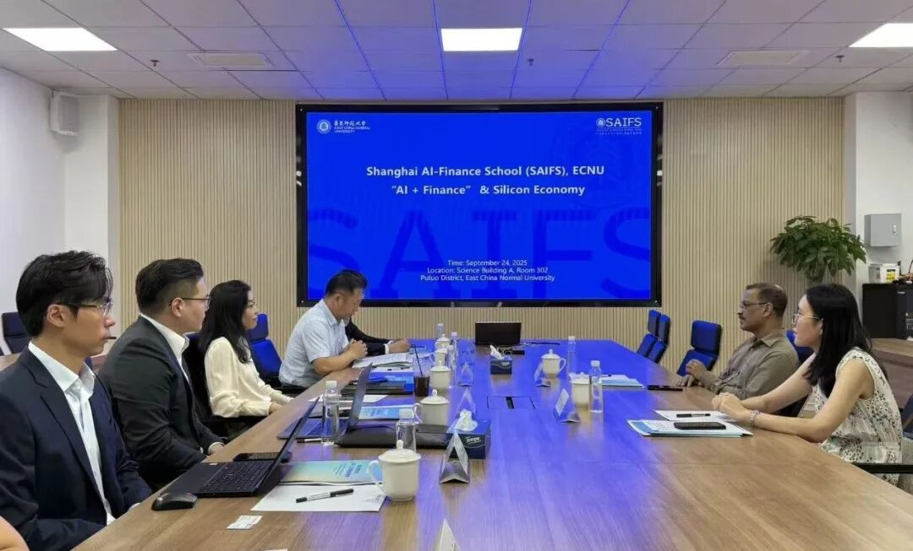
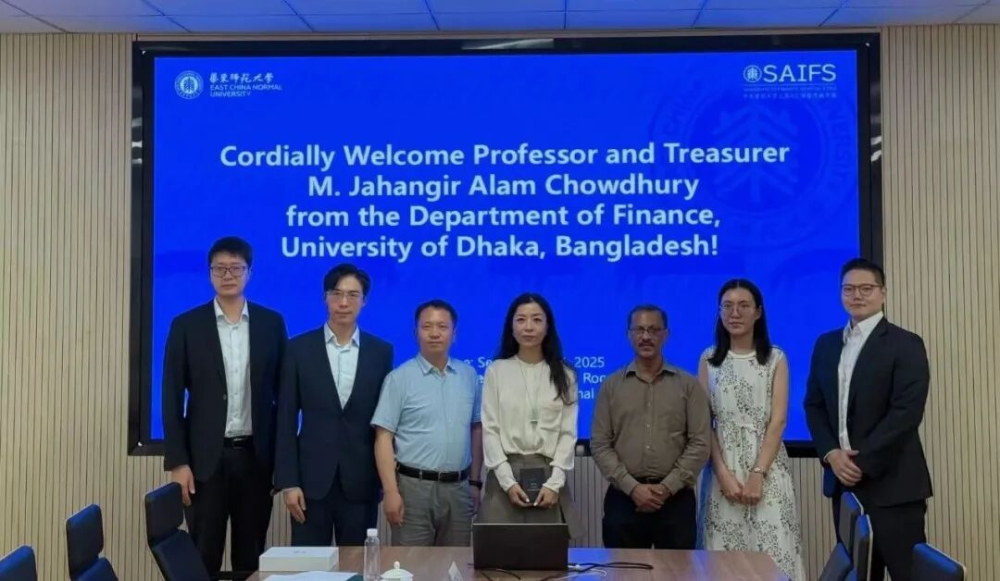

# 达卡大学司库穆罕默德·贾汉吉尔·阿拉姆·乔杜里一行来访华东师大上海人工智能金融学院

> **作者**: SAIFS
> **发布日期**: 2025年9月28日 16:35
> **来源**: [原文链接](https://mp.weixin.qq.com/s/GUwop_VzSwd9NzSy5zODfw)

---

  

智金院院长邵怡蕾一行会见达卡大学司库

穆罕默德·贾汉吉尔·阿拉姆·乔杜里教授一行

  

  

  

     9月24日，华东师大上海人工智能金融学院院长邵怡蕾会见了达卡大学司库、金融系教授穆罕默德·贾汉吉尔·阿拉姆·乔杜里（Mohammad Jahangir Alam Chowdhury）一行。上海国际问题研究院南亚研究中心助理研究员谈晨逸随行来访。上海人工智能金融学院院长邵怡蕾、院长助理汤傲成、金融大语言模型实验室副主任汪俊霖，以及国际合作交流处业务主管孟雨和项目主管严非易陪同会见。会谈由华东师大经济与管理学院党委副书记、上海人工智能金融学院副院长吴文钰主持。

      会谈中，穆罕默德·贾汉吉尔·阿拉姆·乔杜里教授系统介绍了达卡大学百年的办学历史、在南亚地区的重要学术地位，以及在经济学、金融学等学科领域的发展情况。他重点回顾了学校在金融市场研究和社会可持续发展等方面的代表性成果，并分享了达卡大学在服务国家经济发展、推动区域合作以及培养高层次复合型人才方面的经验与做法。

      华东师大上海人工智能金融学院院长邵怡蕾教授向来访一行介绍了学院在“AI+金融”领域的最新科研进展，重点阐述了团队在硅基经济学理论创新、金融大模型研发及相关应用探索方面取得的成果。她还简要回顾了学院的发展历程与建设目标，并分享了学院在2025WAIC世界人工智能大会中的亮眼表现及重要贡献。邵院长表示，学院将继续发挥学科交叉与“政产学研用”结合的优势，推动人工智能金融领域的前沿研究与国际合作。

      双方表示，将以此次会谈为契机，建立长期学术交流关系，逐步推进合作细节，推动两校资源共享与协同发展。

      据悉，达卡大学（University of Dhaka，简称DU）是孟加拉国最古老且最具影响力的公立研究型大学，成立于1921年，根据《Dacca University Act 1920》设立，并于同年7月1日正式开始学术活动。校园位于孟加拉国首都达卡Ramna区，占地约600英亩，学生人数超过47,000人。大学设有13个院系及约84个系，同时拥有14个研究机构、20个学生宿舍以及多个研究中心。

  

双方合影

  

图文｜华东师大智金院