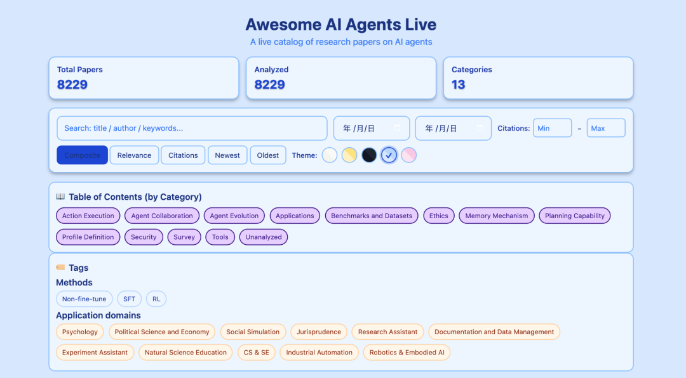
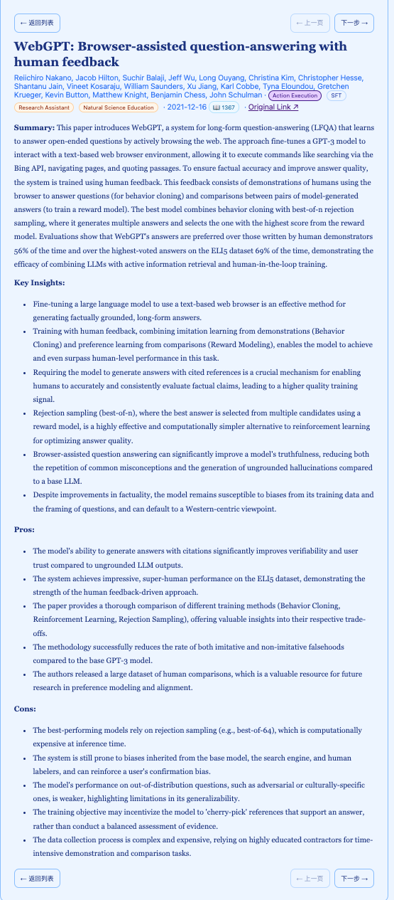
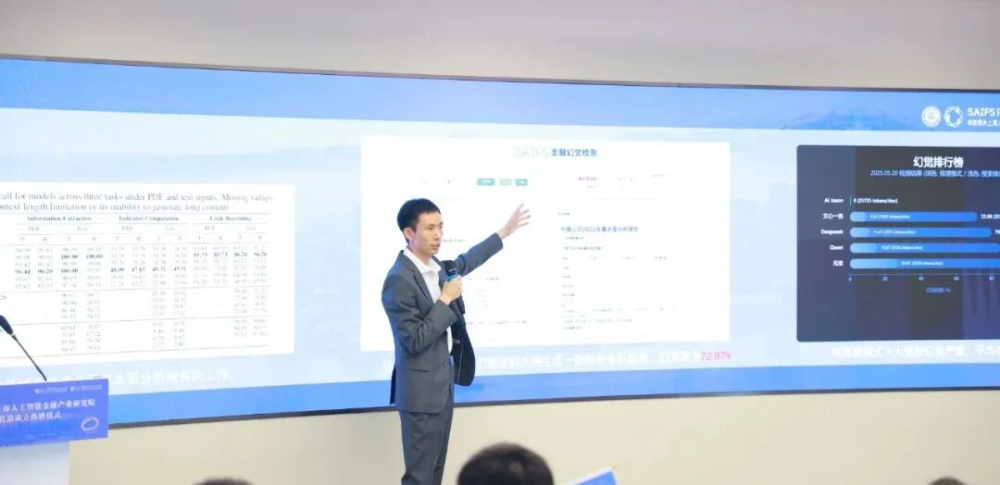

# 华东师大智金院本科生打造AI Agent领域论文平台，Awesome AI Agents Live看遍智能体最新论文

> **作者**: 椰椰
> **发布日期**: 2025年9月29日 16:00
> **来源**: [原文链接](https://mp.weixin.qq.com/s/5_4Y1Xh70e19DtR9Zdnw1w)

---

作者：椰椰 ｜ 编辑：李宝珠

原文：HyperAI超神经

  

近日，华东师大上海人工智能金融学院师生共同开发了一款名为「Awesome AI Agents Live」的 AI Agent 论文实时目录。该网站汇集了近期的研究成果，并通过搜索、筛选、分类导航和快速详情视图等功能，提供简洁的阅读体验。

  

在 AI Agent 成为学界与业界焦点的当下，研究人员每天都要面对不断涌现的新论文与实验成果。如何快速追踪、分类和浏览这些研究，正在成为一大难题。

  

基于这一困境，华东师范大学上海人工智能金融学院的大三学生邹丛远及其辅导教师吴宗翰，开发了一款名为「Awesome AI Agents Live」的轻量级平台，为研究人员、工程师和学生提供了一个实时更新的论文目录，帮助他们更高效地把握 AI Agent 领域的最新进展。

  

Awesome AI Agents Live 链接：  
https://saifs-aihub.github.io/Awesome-AI-Agents-Live/

## 精准锚定三类核心受众：解决 LLM-based Agent 领域的信息筛选焦虑

「Awesome AI Agents Live」的受众定位并非泛化的 「学术研究者」，而是精准锁定了三类在 LLM-based Agent 领域有明确信息需求的群体——研究人员、工程师和学生，其功能设计深度贴合每类用户的核心痛点。

  

当前，AI Agent 领域的研究方向高度细分，且每个子领域的突破都可能在数日内被新论文迭代，对于从事 AI Agent 基础研究的学者而言，避免重复创新与紧跟最新动态是两大核心需求；对于 AI Agent 技术落地的工程师们，他们则在意论文的方法是否可落地，以及存在哪些技术局限；而作为最主要的受众群体——AI Agent 领域的学生们，最大的挑战是面对海量论文无从下手，缺乏对领域框架的认知，容易陷入读了多篇论文却仍未形成体系的困境。

  

基于这些需求和痛点，该平台作为一个前置信息入口。研究人员可以在深入阅读之前，先通过该目录了解论文的核心价值定位研究方向，并且快速浏览当日发表的论文摘要、关键见解及优缺点，大幅降低信息筛选成本。

## 定位 「轻量实时导航工具」：填补学术数据库与高效需求间的空白

在 AI Agent 研究的信息生态中，「Awesome AI Agents Live」 并非要替代 arXiv、Google Scholar 等传统学术数据库，而是以 「轻量级实时导航工具」 的定位，填补现有工具在 「高效筛选」 与 「实时更新」 上的空白，形成「导航 - 筛选 - 精读」的学术信息获取闭环。

  

传统学术数据库的核心优势是 「全」—— 收录几乎所有公开的学术论文，但在论文分类、更新实效方面还略有不足。而「Awesome AI Agents Live」 则反其道而行之，以 「精」 为核心，让 「找论文」 的时间小于 「读论文」 的时间，重构 AI Agent 领域的学术信息获取效率。并且每篇论文提供导读分析，能够让学者将更多精力投入到论文的深度理解与创新思考中。这种 「效率导向」 的定位，恰好契合了 AI Agent 领域快速迭代、竞争激烈的研究现状，成为领域参与者的必备效率工具之一。

  

需要注意的是，论文的摘要与分类均由 AI 生成，存在潜在的不准确性，用户在引用时仍应参考原始论文。这也体现出该工具的定位：辅助研究，而非替代深入阅读。

## 三大核心优势：实时性、结构化、易读性、轻量化

「Awesome AI Agents Live」 的竞争力，源于其围绕 「高效获取 AI Agent 论文信息」构建的三大核心优势，且每个优势均有具体功能支撑。

### 实时性：每日实时更新，紧跟研究节奏

AI Agent 领域的研究速度极快，若行业动态信息更新滞后，研究者可能错过关键突破。在 HyperAI（hyper.ai）提供的计算支持下，「Awesome AI Agents Live」 通过开箱即用的计算能力将「每日更新」作为核心目标，及时获取最新发表的 AI Agent 论文。

  

在论文来源上，该平台目前已覆盖 arXiv、OpenReview 以及各大顶会（例如 NeurIPS,ICML,AAAI）等核心渠道，确保收录的论文兼具时效性与学术权威性；后续还将进一步扩大来源范围，纳入更多领域内主流的论文发布平台与顶级会议成果，全方位捕捉领域研究动态。

  

在 AI Agent 领域发展日新月异的当下，高频次的更新与多元的来源渠道结合，能确保用户第一时间接触到最新、最全面的研究成果，避免因信息滞后或来源单一而错过重要的学术动态，让用户始终站在领域研究的前沿。

### 结构化：权威分类 + 多维排序，实现 「精准定位」

「结构化」 是 「Awesome AI Agents Live」 解决信息过载的核心手段，具体体现在两个层面：

  

首先是分类体系权威化：工具的分类与标签直接源自 Junyu Luo、Lei Wang 等学者的权威综述，涵盖配置文件定义、记忆机制、规划能力、动作执行、代理协作、应用程序、基准和数据集、工具、安全、伦理、综述等 13 个核心分类。此外，为了给不同学科的学者提供便利，其收录的论文还被划分为 11 个应用领域以及 3 类研究方法，这种分类完全贴合 AI Agent 领域的研究逻辑，为读者提供了相对精确的论文匹配。  

**\* Luo et al., ****Large Language Model Agent: A Survey on Methodology, Applications and Challenges****, Applications and Challenges (arXiv:2503.21460)**    

\* Wang et al., A Survey on Large Language Model based Autonomous Agents(Frontiers of Computer Science, 2024)

  

其次是排序功能多维化：除了分类导航，工具还支持 「相关性、新近度、引用、综合分数」 四种排序方式。研究者可根据需求灵活选择：想找最新研究，选 「新近度」；想找领域内认可度高的论文，选 「引用」；想找与自身研究方向最匹配的，选 「相关性」。这种多维排序让信息筛选更精准，进一步降低用户的操作成本。

  

### 信息完整性：全维度论文解读，一站式掌握核心价值

「Awesome AI Agents Live」 在论文信息呈现上，为每篇分析的论文构建了 「全维度信息矩阵」—— 包含简短的摘要、关键见解、优点 / 缺点、标签和出版元数据，让用户无需跳转至原文，即可一站式掌握论文的核心价值。

  

\* 摘要与关键见解：摘要提炼论文核心研究内容，关键见解则聚焦 「该研究解决了什么行业痛点」「提出了哪些创新方法」  
  

\* 优点 / 缺点：客观标注论文的技术优势与局限性  
  

\* 标签与出版元数据：标签关联 「记忆机制」「多 Agent 协作」 等细分领域，便于用户快速归类同类研究；出版元数据则包含发表时间、作者信息，帮助用户判断论文的学术权威性与领域关联性。  
  

  

这种全维度信息呈现，让每篇论文的价值与局限一目了然，大幅减少用户 「为获取关键信息而通读全文」 的时间成本。

## 华东师范大学上海人工智能金融学院

该项目作者邹丛远及其辅导教师吴宗翰老师来自华东师范大学上海人工智能金融学院。

  

上海人工智能金融学院（简称「SAIFS」）于 2023 年在华东师范大学成立，是全球首家围绕人工智能与金融跨界交叉打造的教育和研究机构。SAIFS 强调在超越知识点的通识教育的基础上，培养集金融知识、人工智能技术和实践经验于一身的新一代人工智能金融（AI-Fin） 领军型卓越人才，并坚持扎根在学术研究的前沿，探索 AI 在金融中的新应用，驱动 AI-Fin 的发展。 同时，SAIFS 致力于与全球的学术机构、金融机构、科技公司和政府部门建立广泛的合作网络，通过推广 AI 与金融的交叉研究和应用，改善金融服务的效率和质量，为社会创造价值。

  

2024 年 10 月，在徐汇区和华东师大的支持下，华东师大上海人工智能金融产业研究院暨孵化器（简称「智金产研院暨孵化器」）落地徐汇「模速空间」大模型创新生态社区。作为徐汇区大模型重大合作项目之一，该研究院于 2025 年 5 月 23 日正式揭牌，旨在畅通「科技—产业—金融」循环，打造人工智能与金融深度融合的创新高地。

  

原文：HyperAI超神经

  

---

  

SAIFS导师介绍：

[智金院SAIFS教授介绍｜吴宗翰助理教授：国际人工智能领域“万引”青年学者！](https://mp.weixin.qq.com/s?__biz=MzkxMTY1ODk2Mw==&mid=2247486799&idx=1&sn=91101e39dbb156a5ea97c7c746484d53&scene=21#wechat_redirect)