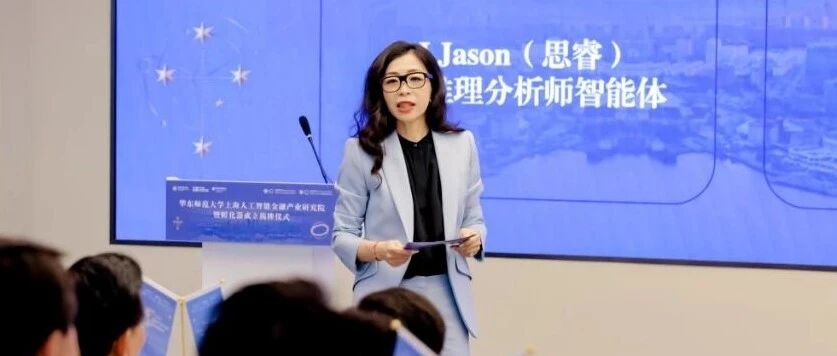
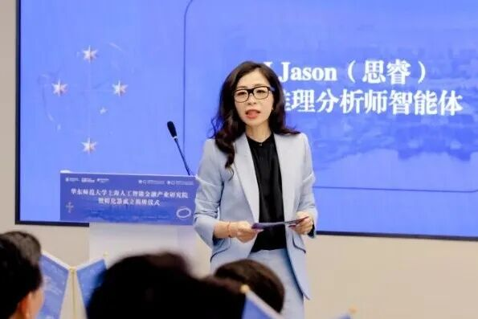

# 华东师大智金院院长邵怡蕾教授2026年博士生招生启事

> **作者**: 博士生招生中的
> **发布日期**: 2025年10月20日 14:13
> **来源**: [原文链接](https://mp.weixin.qq.com/s/u1wXMfPe0voW4wtQnSXXPg)

---

  

  

**智金院院长邵怡蕾教授**

**2026年博士生****招生启事**

  

  

**招生学院：**华东师范大学上海人工智能金融学院

**学科：**金融学

**招生人数：**2-3名

  

**研究方向：（全日制）硅基经济学**  

**招生偏好：** 优先考虑具有经济学、金融学、计算机科学或数学背景的学生，欢迎具备跨学科研究能力、熟悉人工智能技术与数字经济体系的申请者。有宏观经济建模、系统动力学或复杂系统分析经验者优先。

**研究方向：（全日制）人工智能金融大模型的基础理论研究**  

**招生偏好：**优先考虑具有计算机科学、人工智能、统计学、应用数学或金融工程背景的学生。希望申请者具备机器学习、深度学习或自然语言处理方面的基础，并对大模型架构及可解释性研究有兴趣。具备Python等编程经验者优先。

**研究方向：（全日制）人工智能智能体在金融中的应用**  

**招生偏好：**优先考虑具有人工智能、经济金融、行为科学或管理科学背景的学生，尤其欢迎具备跨学科研究与交叉学习能力者。希望申请者关注AI智能体在投研、风险管理及金融市场行为模拟等方向的创新应用。具备强化学习与多智能体系统建模经验者优先。

  

**导师简介**

  

  

**邵怡蕾教授**

华东师范大学上海人工智能金融学院院长

华东师范大学上海人工智能金融产业研究院与孵化器主任

联合国大学\-华东师范大学人工智能金融联合研究中心主任

邵怡蕾，华东师范大学上海人工智能金融学院院长、教授，华东师范大学上海人工智能金融产业研究院及孵化器主任，联合国大学\-华东师范大学人工智能金融联合研究中心主任，普林斯顿大学计算机科学博士。她曾于2021年至2023年担任国际人工智能联合会（IJCAI）中国办公室秘书长，并曾在高盛集团纽约总部任职。作为一位学科跨界的开拓者，她不仅关注人工智能技术在金融领域的应用，更积极探索其在教育和艺术领域的创新融合，并深入思考人工智能的伦理与治理等前沿问题。2025年，她亦首次提出了“硅基经济学”这一新兴理念，致力于从理论到量化地研究智能带来的生产力变革及全球政治经济格局的重塑。

  

**联系方式****：**yileishao@sem.ecnu.edu.cn

  

  

**智金院及产研院介绍**

  

  

     上海人工智能金融学院（简称“SAIFS”）于2023年在华东师范大学成立，是全球首家围绕人工智能与金融跨界交叉打造的教育和研究机构。SAIFS强调在超越知识点的通识教育的基础上，培养集金融知识、人工智能技术和实践经验于一身的新一代人工智能金融（AI-Fin） 领军型卓越人才，并坚持扎根在学术研究的前沿，探索AI 在金融中的新应用，驱动AI-Fin的发展。 同时，SAIFS 致力于与全球的学术机构、金融机构、科技公司和政府部门建立广泛的合作网络，通过推广AI与金融的交叉研究和应用，改善金融服务的效率和质量，为社会创造价值。  

     2024年5月，学院成立了人工智能金融（AI-Fin）研究中心，重点研发能够识别、量化、预测并减轻先进人工智能技术带来系统性风险的模型。在此基础上，SAIFS 还规划建设人工智能伦理与治理（AI-PPE）研究中心，聚焦AI 时代的全球哲学—政治学—经济学（PPE）前沿议题研究。

     在科研成果方面，自学院成立一年以来，**SAIFS****院长邵怡蕾教授首次提出****“****硅基经济学****”****新范式**，并带领科研团队完成了 FinAI 原型系统的搭建，将算力、算法、数据视为新的生产资料，从硅基的视角重新审视当代经济与社会格局。她将带领团队持续深入研究人类文明从“纯碳基”向“硅碳混合”演进的新阶段。

      2025年7月27日，由华东师范大学主办，上海人工智能金融学院携手联合国大学，并联合中国农业银行上海市分行共同呈现的中国首个面向行长级别、聚焦“AI金融+硅基经济学”核心议题的高端对话论坛——“2025 WAIC人工智能金融领导者论坛”，在上海世博中心红厅隆重举行。论坛以“激活金融新质力”为主题，汇聚国际领袖、四大行行长级领导者、“硅基经济学”首提者、新经济学家及人工智能产业界领袖，吸引超千名观众线下参会，线上直播观看人数逾10万。在会议中，SAIFS院长邵怡蕾教授带领科研团队研发的“Silicon Fin：SAIFS金融智能未来引擎”正式发布。

     在“政产学研用”融合方面，2024年10月，在徐汇区和华东师大的支持下，华东师大上海人工智能金融产业研究院暨孵化器（简称“智金产研院暨孵化器”）落地徐汇“模速空间”大模型创新生态社区。作为徐汇区大模型重大合作项目之一，该研究院于2025年5月23日正式揭牌，旨在畅通“科技—产业—金融”循环，打造人工智能与金融深度融合的创新高地。

  

**欢迎报考华东师大智金院2026年博士生！**

智金院SAIFS近期动态：

[智金院院长邵怡蕾在2025WAIC世界人工智能大会上](https://mp.weixin.qq.com/s?__biz=MzkxMTY1ODk2Mw==&mid=2247487020&idx=1&sn=acba445f97b64f8c80b9647eeddae4dd&scene=21#wechat_redirect)

[首提“硅基经济学”](https://mp.weixin.qq.com/s?__biz=MzkxMTY1ODk2Mw==&mid=2247487020&idx=1&sn=acba445f97b64f8c80b9647eeddae4dd&scene=21#wechat_redirect)

[WAIC华东师大聚力！首发金融智能未来引擎，](https://mp.weixin.qq.com/s?__biz=MzkxMTY1ODk2Mw==&mid=2247487007&idx=1&sn=a0a75e9fd4ef4a7d446457c592f22302&scene=21#wechat_redirect)

[三大应用场景落地](https://mp.weixin.qq.com/s?__biz=MzkxMTY1ODk2Mw==&mid=2247487007&idx=1&sn=a0a75e9fd4ef4a7d446457c592f22302&scene=21#wechat_redirect)  

科研工作环境