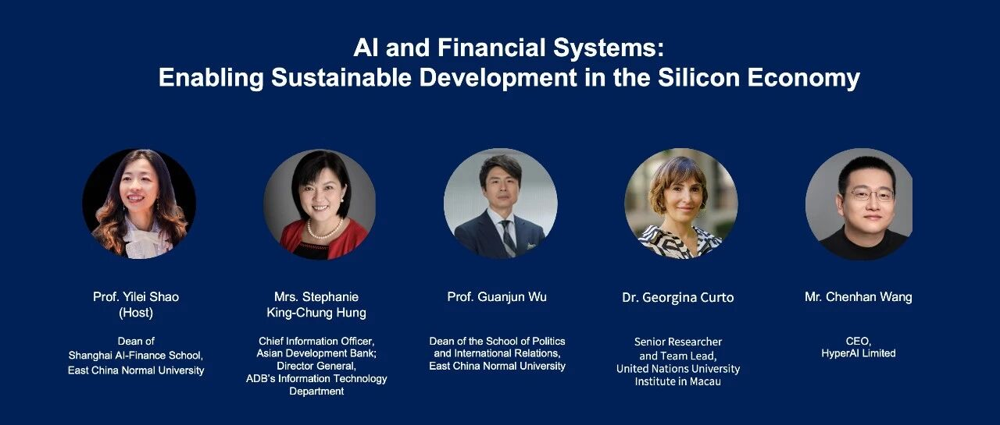
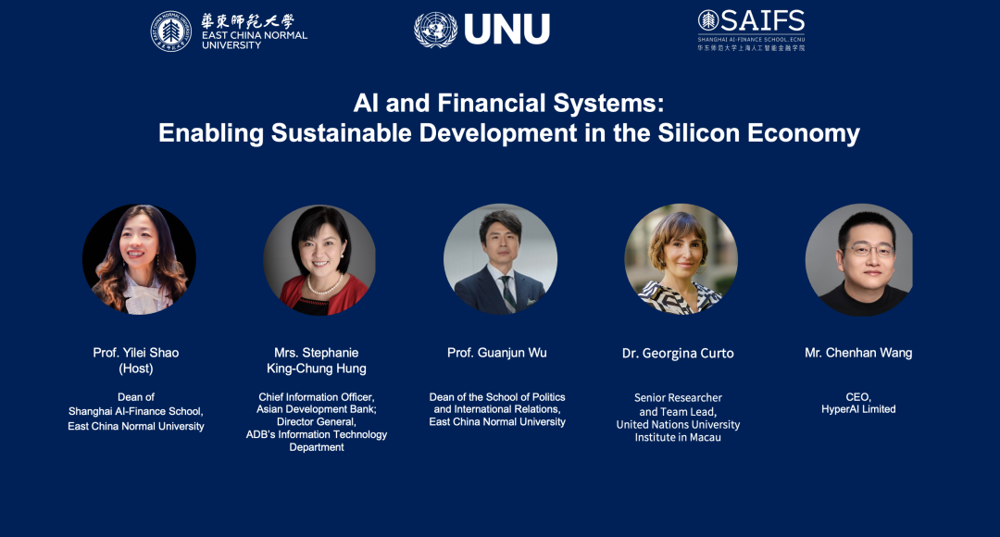
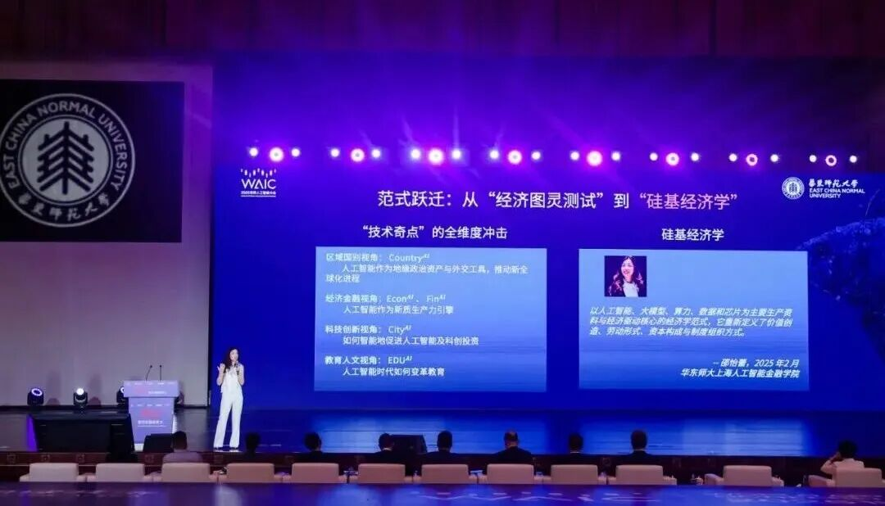
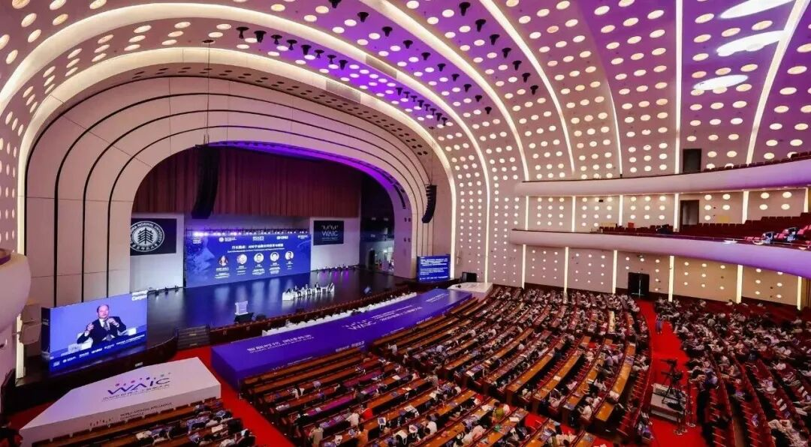

# UNU Macau AI Conference 2025 会议预告｜人工智能与金融系统：赋能硅基经济的可持续发展

> **作者**: 会议预告
> **发布日期**: 2025年10月23日 16:33
> **来源**: [原文链接](images/image2.jpg)

---

  

已关注

关注

重播 分享 赞

关闭

**观看更多**

更多

*退出全屏*

*切换到竖屏全屏**退出全屏*

上海人工智能金融学院SAIFS已关注

分享视频

，时长01:06

0/0

00:00/01:06

切换到横屏模式

继续播放

进度条，百分之0

[播放](javascript:;)

00:00

/

01:06

01:06

[倍速](javascript:;)

*全屏*

倍速播放中

[0.5倍](javascript:;) [0.75倍](javascript:;) [1.0倍](javascript:;) [1.5倍](javascript:;) [2.0倍](javascript:;)

[超清](javascript:;) [流畅](javascript:;)

您的浏览器不支持 video 标签

继续观看

UNU Macau AI Conference 2025 会议预告｜人工智能与金融系统：赋能硅基经济的可持续发展

观看更多

转载

,

UNU Macau AI Conference 2025 会议预告｜人工智能与金融系统：赋能硅基经济的可持续发展

上海人工智能金融学院SAIFS已关注

分享点赞在看

已同步到看一看[写下你的评论](javascript:;)

[视频详情](javascript:;)

  

联合国大学澳门人工智能2025

人工智能与金融系统：赋能硅基经济的可持续发展

**AI and Financial Systems: Enabling Sustainable Development in the Silicon Economy at** 

**UNU Macau AI Conference 2025**

      应联合国大学澳门人工智能会议2025邀请，华东师范大学上海人工智能金融学院院长邵怡蕾教授将于2025年10月24日主持一场专题讨论，题为**“****人工智能与金融系统：赋能硅基经济的可持续发展****”**。本场讨论将引导嘉宾探讨人工智能如何重塑金融体系、赋能可持续发展，并在新兴的硅基经济中重新定义价值创造。

  

At the invitation of the United Nations University Macau AI Conference 2025, Professor Yilei Shao, Dean of Shanghai AI-Finance School at East China Normal University, will chair a special session on October 24, 2025, titled "AI and Financial Systems: Enabling Sustainable Development in the Silicon." This session will lead participants to discuss how AI is reshaping financial systems, enabling sustainable development, and redefining value creation in the emerging Silicon Economy.  

****

**时间:** 2025年10月24日 17:00-18:00（澳门时间）

Time: October 24, 2025, 17:00-18:00 Asia/Macau  

**地点:** 银河国际会议中心4号会议室

Venue: Galaxy International Convention Center, Meeting Room 4

  

**会议链接****:** 

https://unu.edu/macau/event/ai-and-financial-systems-enabling-sustainable-development-silicon-economy

  

  

  

参会嘉宾

Speaker List

  

邵怡蕾教授

邵怡蕾教授，华东师范大学上海人工智能金融学院院长，华东师范大学上海人工智能金融产业研究院及孵化器主任，联合国大学-华东师范大学人工智能金融联合研究中心主任，普林斯顿大学计算机科学博士。她曾于2021年至2023年担任国际人工智能联合会（IJCAI）中国办公室秘书长，并曾在高盛集团纽约总部任职。2025年，她亦首次提出了“硅基经济学”这一新兴理念，致力于从理论到量化地研究智能带来的生产力变革及全球政治经济格局的重塑。

  

Professor Yilei Shao, Founding Dean of Shanghai AI-Finance School (SAIFS) and SAIFS Research Center at ECNU, Director of UNU-ECNU Hub in AI-Finance at ECNU, holds a Ph.D. degree in Computer Science from Princeton University. She was the former Secretary General of the International Joint Conference on Artificial Intelligence (IJCAI) China Office from 2021 to 2023. In 2025, she pioneered the concept of “Silicon Economy,” aiming to explore both theoretically and quantitatively how intelligence transforms productivity and reshapes the global political and economic system.

  

**洪劲松Stephanie King-Chung Hung女士**

洪劲松Stephanie是一位创新而富有活力的领导者，她担任亚洲开发银行 (ADB) 的首席信息官, 以及该银行信息技术部（ITD）的总干事。她负责 ADB 的数字战略和转型，以及其跨越42多个国家领域服务的IT基础设施、运营和人才，这些服务在数字化支持下服务于ADB在49个成员国内和19个成员国外的发展工作。

  

An innovative and dynamic leader, Stephanie, serves as the Chief Information Officer of the Asian Development Bank (ADB) and holds the position of Director General in the bank’s Information Technology Department (ITD). Her responsibilities encompass ADB’s digital strategies, transformation initiatives,

and management of its IT talents, infrastructure, and operations. These responsibilities extend across more than 42 offices, where field services engineers support digitally enabled ADB institutional and development operations.

  

吴冠军教授

吴冠军教授，华东师范大学二级教授，政治与国际关系学院院长、奇点研究院院长，华东师范大学学术委员会委员、教育部长江学者特聘教授、上海领军人才，兼任上海纽约大学双聘教授等，有中英文著作十余种，最新专著包括《再见智人：技术-政治与后人类境况》等。

  

Professor Wu Guanjun is a Level-2 Professor at East China Normal University, Dean of the School of Political Science and International Relations, and Director of the Institute for Singularity Studies. He also serves as a member of the Academic Committee of ECNU, a Distinguished Professor of the Changjiang Scholars Program under the Ministry of Education, and a Leading Talent of Shanghai. In addition, he holds a joint appointment at NYU Shanghai. Professor Wu has published more than ten books in both Chinese and English. His recent works include Farewell to Homo sapiens: Techno-Politics and the Posthuman Condition.

  

Georgina Curto博士

Georgina Curto是联合国大学驻澳门研究所的高级人工智能研究员及团队负责人。此前，她曾任圣母大学Lucy Family数据与社会研究所助理研究教授，并在ND-IBM技术伦理实验室从事博士后研究。她还担任国际人工智能联合大会（IJCAI）全球南方专题研讨会的共同主席。

  

Georgina Curto is a Senior AI Researcher and Team Lead at the United Nations University Institute in Macau. Previously, she was an Assistant Research Professor at the Lucy Family Institute for Data and Society and a Postdoc at the ND-IBM Technology Ethics Lab, University of Notre Dame. She has the honor of co-chairing the International Joint Conference on Artificial Intelligence (IJCAI) Symposia in the Global South.

  

王臣汉先生

王臣汉先生，HyperAI CEO，曾于华特迪士尼、AVOS等公司供职，主要从事自然语言处理工作，其负责的对话机器人系统曾被全球超过7亿人次使用。2019年参与创建了全球最具影响力的中文语言测评基准CLUE Benchmarks，任开源基金会秘书长。

  

Mr Chenhan Wang, CEO of HyperAI. Mr. Wang has worked at Walt Disney, AVOS, and other companies, focusing on natural language processing. A dialogue robot system he developed has been used by over 700 million people around the world. In 2019, he participated in the creation of CLUE Benchmarks, the world’s most influential benchmark for Chinese language measurement, and served as the Secretary General of the Open Source Foundation.

  

  

会议概述

Session Descriptions

  

      人工智能正加速引发全球经济体系的深刻重构，开启一个以数据、算力与算法为核心生产要素的“硅基经济”时代。人工智能在推动科技进步、开辟创新维度的同时，也可能加剧全球在资源获取、能力分布与经济机会方面的不平衡。如何有效应对这些结构性变革，将成为塑造更加可持续与公平未来的关键。

      当以人工智能为驱动力的创新重新定义生产与价值创造的基础时，金融体系也在经历并行且深远的转型。金融机制正从单纯的经济增长通道，转变为缓解不平等、增强韧性、引导资源投向可持续发展目标的战略性工具。人工智能技术融入金融体系后，正在重塑资本动员、风险评估以及普惠金融的方式，推动不同经济体的金融结构不断演化。

      在这一变革图景中，科技金融、绿色金融与普惠金融——三者皆在人工智能的加持下——成为重塑资源分配、纠正系统性失衡与促进可持续发展的关键路径。科技金融通过引导资本流向科技创新，助力未来经济韧性的构建；绿色金融借助人工智能提升对环境可持续项目的识别、验证与监测能力，从而强化气候行动的可信度与规模化；普惠金融则利用 AI 扩大欠发达地区的金融服务可及性，促进更广泛的经济参与，减少结构性不平等。

      然而，不同国家间在人工智能基础设施建设、技术人才储备、数据驱动型金融服务的可得性及金融生态系统的可持续性方面，仍存在显著差距。若这些不对称性得不到有效缓解，可能进一步固化既有不平等，限制技术红利的扩散，并削弱包容与可持续增长的总体目标。同时，算法偏见、数据垄断及 AI 驱动金融权力的集中等系统性风险，也对实现公平与可持续发展构成新的挑战。

      此外，尽管人工智能显著提升了金融运作效率，但其应用也可能导致机构间决策趋同，降低战略多样性，从而放大系统性脆弱性。若算法模型的训练数据存在偏差或过于同质化，亦可能在无意中边缘化少数文化与族群。

      因此，将人工智能与金融的融合上升至战略层面，是实现联合国可持续发展目标的关键路径。通过在科技金融、绿色金融与普惠金融领域的智能化部署，人工智能不仅能推动创新、缓解不平等，更能将经济活动与全球可持续发展的宏大愿景相契合。未来的研究与政策行动，应聚焦于强化金融治理结构与促进国际协作，确保人工智能真正成为推动人类共同进步与全球可持续发展的积极力量。

  

Artificial Intelligence (AI) is catalyzing a profound restructuring of global economic systems, inaugurating the Silicon Economy where data, computation, and algorithms emerge as principal production factors. While AI accelerates technological progress and opens new dimensions of innovation, it simultaneously risks deepening global disparities in resource access, capability distribution, and economic opportunity. Effectively addressing these structural shifts is critical to shaping a more sustainable and equitable future.

  

As AI-driven innovations redefine the foundations of production and value creation, financial systems are undergoing parallel and profound transformations. Financial mechanisms increasingly serve not only as conduits for economic expansion but also as strategic instruments for mitigating inequalities, enhancing resilience, and guiding resources toward sustainable development objectives. The integration of AI technologies into financial architectures is reshaping how capital is mobilized, risks are assessed, and financial inclusion is pursued across diverse economies.

  

Within this evolving landscape, technology finance, green finance, and inclusive finance-each empowered by AI-represent essential pathways to redistribute resources, correct systemic imbalances, and foster sustainable development. Technology finance channels investments into scientific and technological innovation, facilitating advancements that underpin future economic resilience. Green finance leverages AI to enhance the identification, verification, and monitoring of environmentally sustainable projects, thereby improving the credibility and scalability of climate action initiatives. Inclusive finance utilizes AI to expand access to financial services in underserved regions, promoting broader economic participation and reducing structural inequalities.

  

However, significant disparities persist among countries in AI infrastructure readiness, technical talent reserves, access to data-driven financial services, and the long-term sustainability of financial ecosystems. If left unaddressed, these asymmetries may reinforce existing inequalities, limit the diffusion of technological benefits, and undermine the broader objectives of inclusive and sustainable growth. Additionally, systemic risks such as algorithmic bias, data monopolization, and the concentration of AI-enabled financial power pose further challenges to achieving fair and sustainable outcomes.

  

Moreover, while AI introduces significant efficiencies in financial operations, its application can drive decision-making convergence across institutions-reducing strategic diversity and potentially amplifying systemic vulnerabilities. Furthermore, algorithmic models trained on biased or homogeneous data may inadvertently marginalize minority cultures and ethnic groups.

  

The strategic integration of AI and finance is essential for realizing the Sustainable Development Goals (SDGs). Through intelligent deployment within technology finance, green finance, and inclusive finance, AI can drive innovation, mitigate inequality, and align economic activity with global sustainability imperatives. Future research and policy initiatives should focus on reinforcing financial governance structures and fostering international collaboration to ensure that AI contributes effectively to collective progress and global sustainable development.

  

了解更多可查询：

https://unu.edu/macau/event/ai-and-financial-systems-enabling-sustainable-development-silicon-economy 

智金院SAIFS近期动态：

[智金院院长邵怡蕾在2025WAIC世界人工智能大会上](https://mp.weixin.qq.com/s?__biz=MzkxMTY1ODk2Mw==&mid=2247487020&idx=1&sn=acba445f97b64f8c80b9647eeddae4dd&scene=21#wechat_redirect)

[首提“硅基经济学”](https://mp.weixin.qq.com/s?__biz=MzkxMTY1ODk2Mw==&mid=2247487020&idx=1&sn=acba445f97b64f8c80b9647eeddae4dd&scene=21#wechat_redirect)

[WAIC华东师大聚力！首发金融智能未来引擎，](https://mp.weixin.qq.com/s?__biz=MzkxMTY1ODk2Mw==&mid=2247487007&idx=1&sn=a0a75e9fd4ef4a7d446457c592f22302&scene=21#wechat_redirect)

[三大应用场景落地](https://mp.weixin.qq.com/s?__biz=MzkxMTY1ODk2Mw==&mid=2247487007&idx=1&sn=a0a75e9fd4ef4a7d446457c592f22302&scene=21#wechat_redirect)