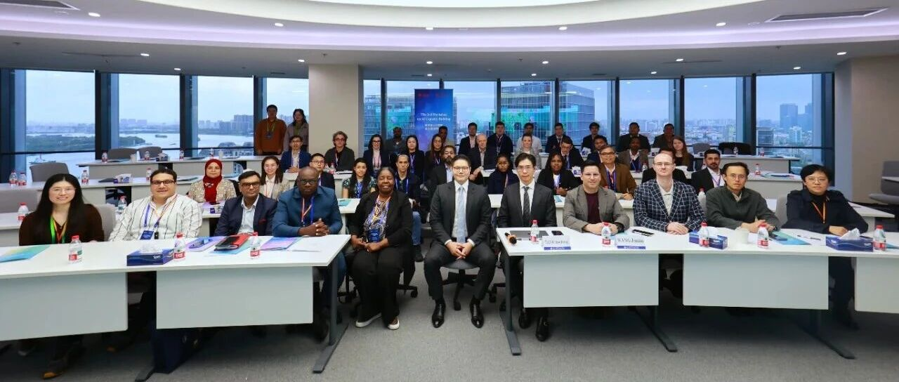
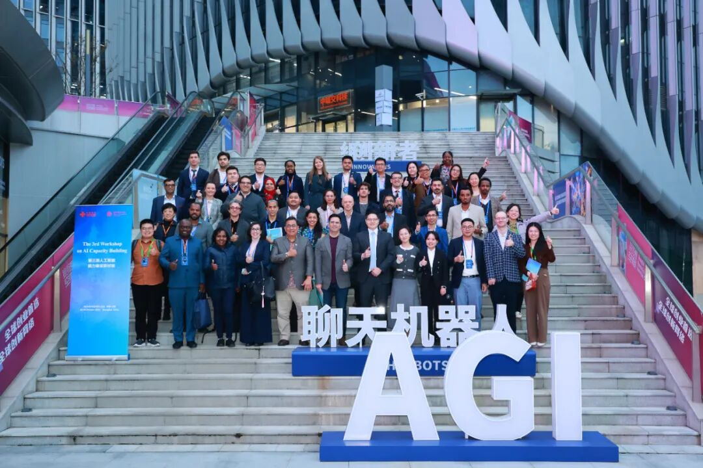
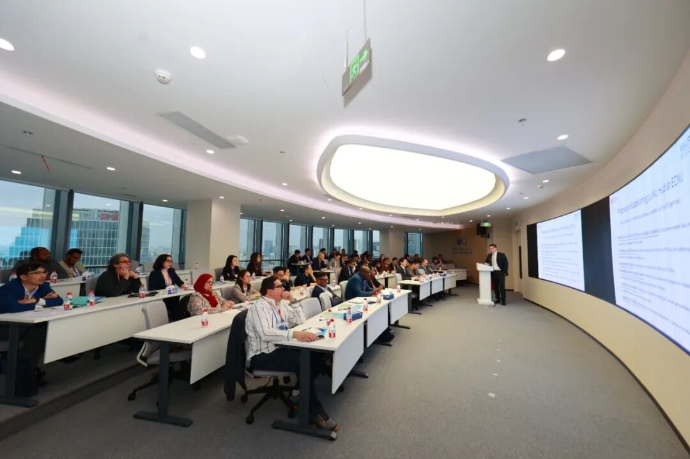
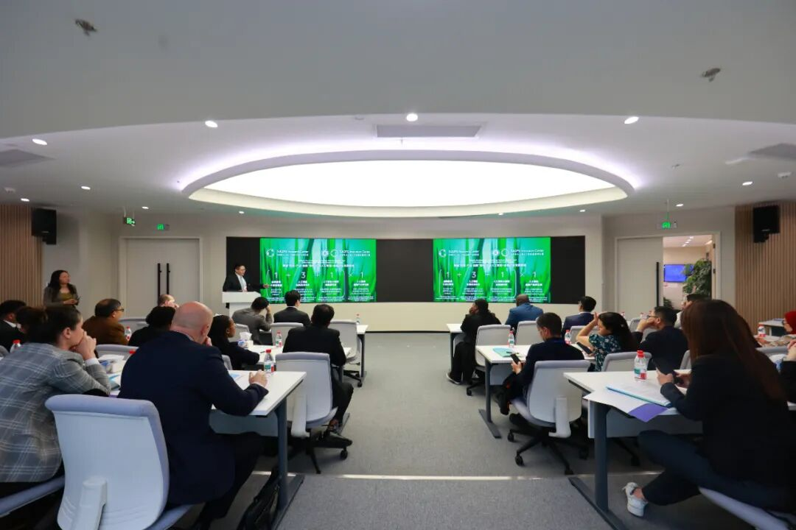
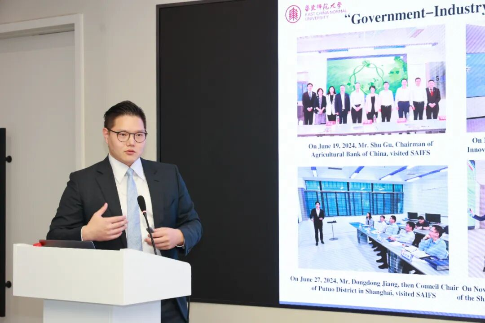
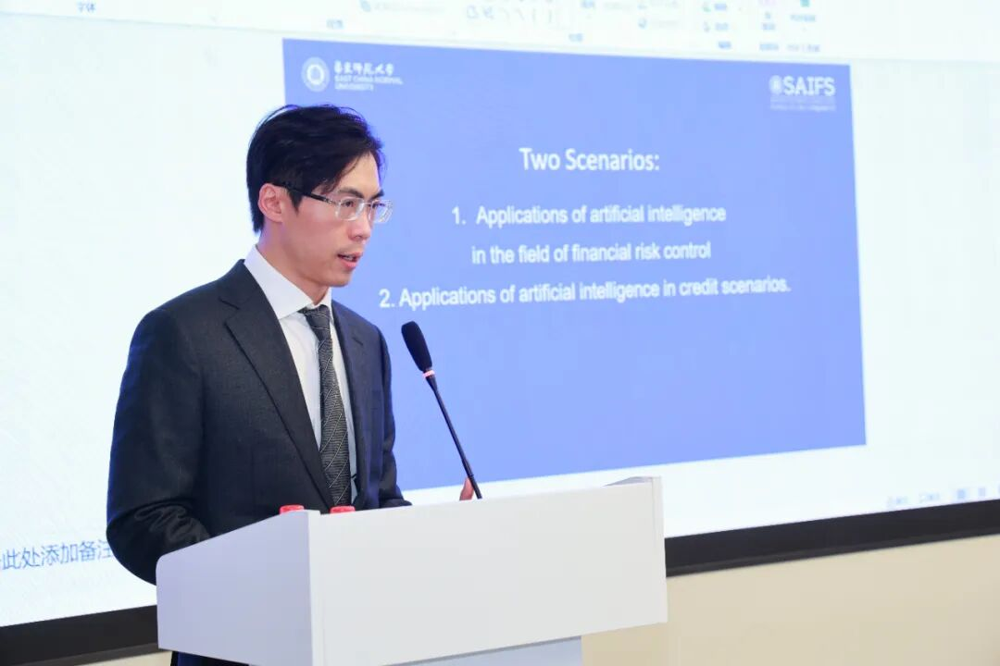
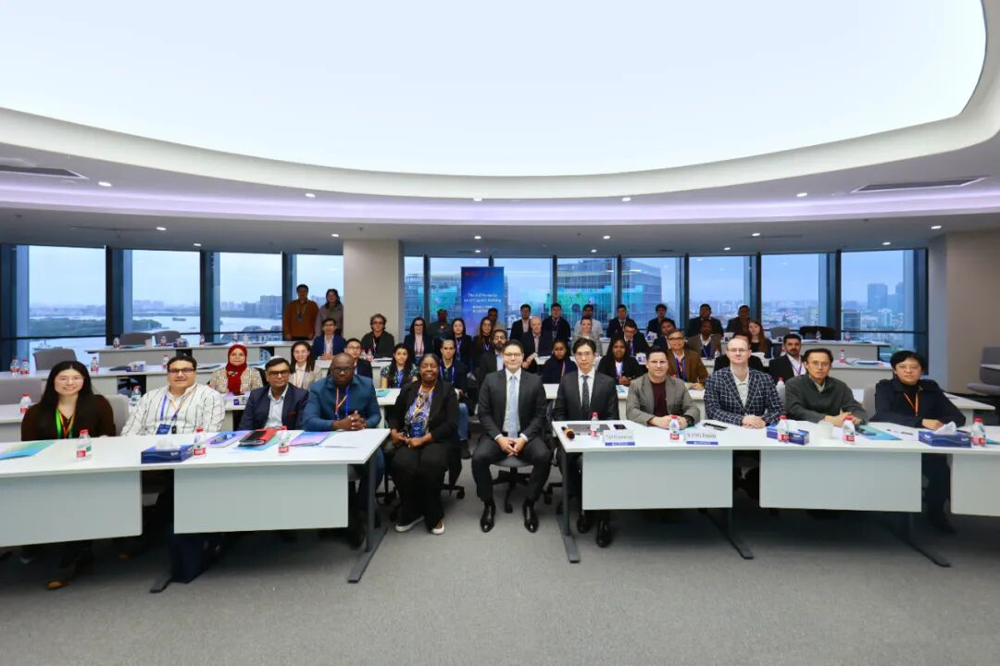

# 外交部“第三期人工智能能力建设研讨班”学员访问上海人工智能金融产业研究院

> **作者**: 国际交流
> **发布日期**: 2025年10月24日 16:31
> **来源**: [原文链接](https://mp.weixin.qq.com/s/ufHMLPbUfsR2Cnioy3wQ2w)

---

  

外交部“第三期人工智能能力建设研讨班”全体合影

  

  

  

       2025年10月21日下午，由中国外交部主办、上海市人民政府协办、华东师范大学承办的“第三期人工智能能力建设研讨班”组织学员参访，来自21个国家的38名学员莅临位于徐汇区的“模速空间”，并参观了上海人工智能金融产业研究院。华东师大上海人工智能金融学院院长助理、助理教授、上海人工智能金融产业研究院副院长汤傲成及学院金融大语言模型实验室副主任、助理研究员汪俊霖出席会议，并为研讨班学员作专题报告。

      在专题交流环节中，上海人工智能金融产业研究院副院长汤傲成代表学院致欢迎辞，并介绍了学院及产业研究院的发展历程、目前科研方向以及国际合作布局。他指出，智金院立足“人工智能+金融”的交叉前沿，正致力于构建全球领先的硅基金融创新体系，通过在智能金融大模型、金融智能体与可信人工智能等领域的探索，助力上海打造国际人工智能高地与全球金融科技创新中心。

  

     汤傲成作专题报告

  

     随后，**金融大语言模型实验室副主任汪俊霖**向研讨班学员展示了**AI智能体金融分析师**等代表性科研项目，充分展示了人工智能在金融研究与决策支持中的创新应用。   

  

汪俊霖介绍学院代表性科研项目

  

    据悉，本次研讨班是继华东师大“全球教育领导力学院”成立之后中国落实人工智能国际合作承诺的重要举措之一。此前中国已分别在上海、北京举办两期研讨班。

     值得关注的是，今年7月上海举办的2025世界人工智能大会上，中方已发布《人工智能全球治理行动计划》，支持搭建基于公共利益、各类主体共同参与的包容治理平台，鼓励搭建全球和区域性交流合作平台，确保各国人工智能研究者、开发者和治理部门保持技术和政策沟通。本次研讨班进一步推动该倡议落地的具体实践，为全球AI治理规则对接、技术标准协同、能力建设合作搭建对话平台，尤其关注发展中国家需求，助力其提升AI技术可及性与应用能力。

  

 研讨班合影留念