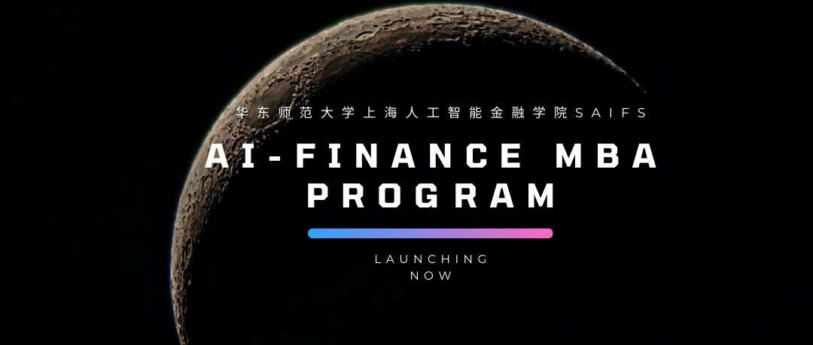
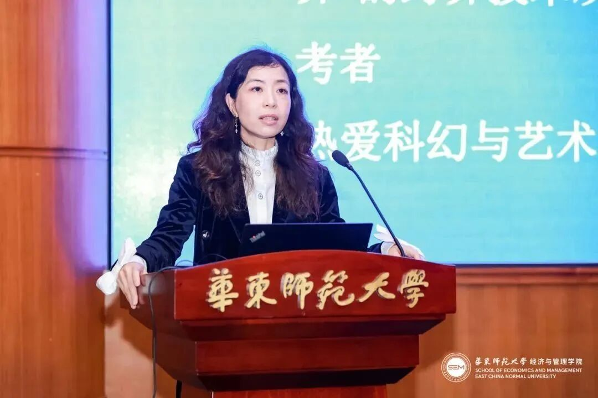
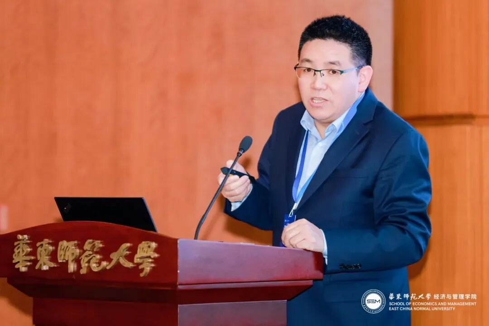
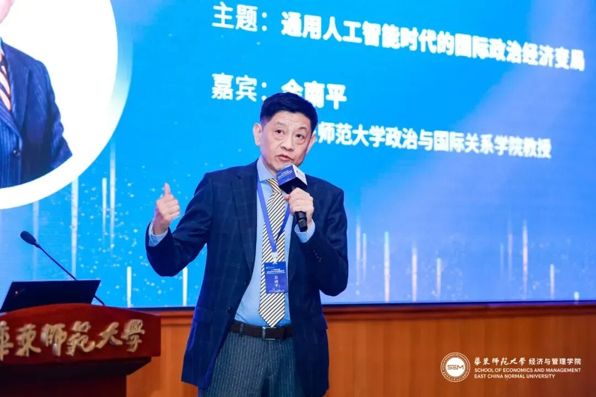
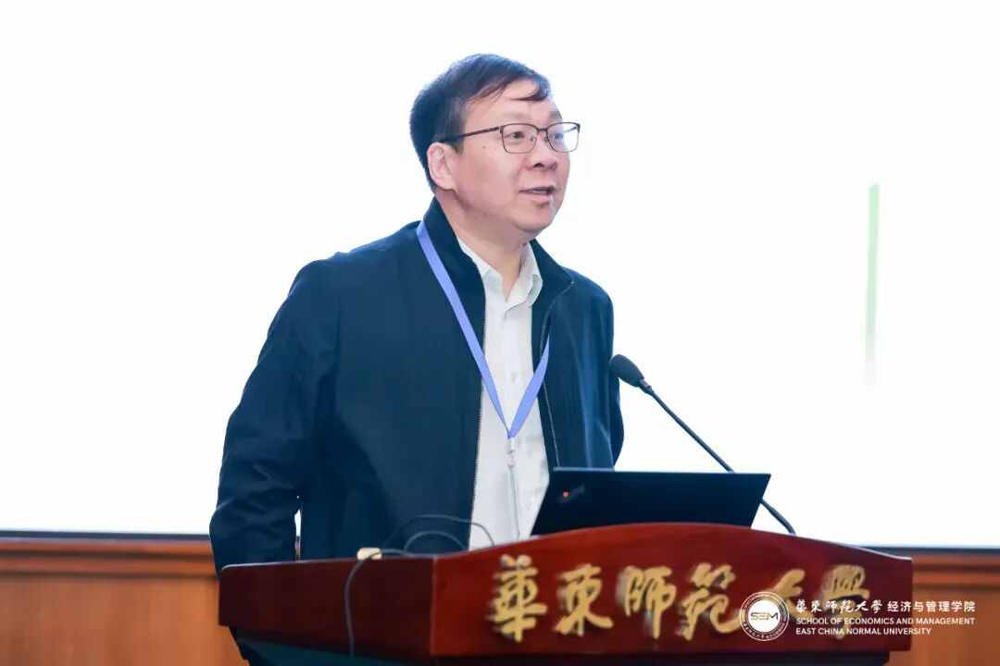
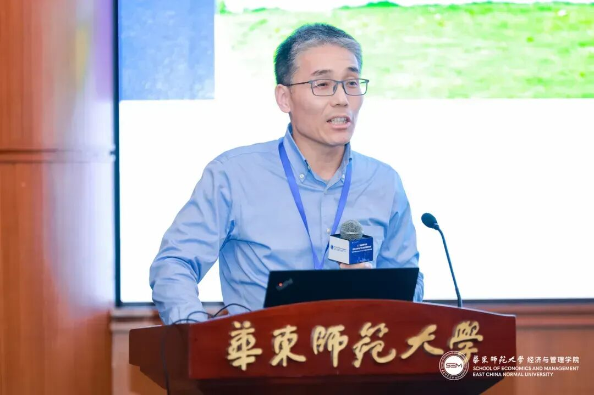
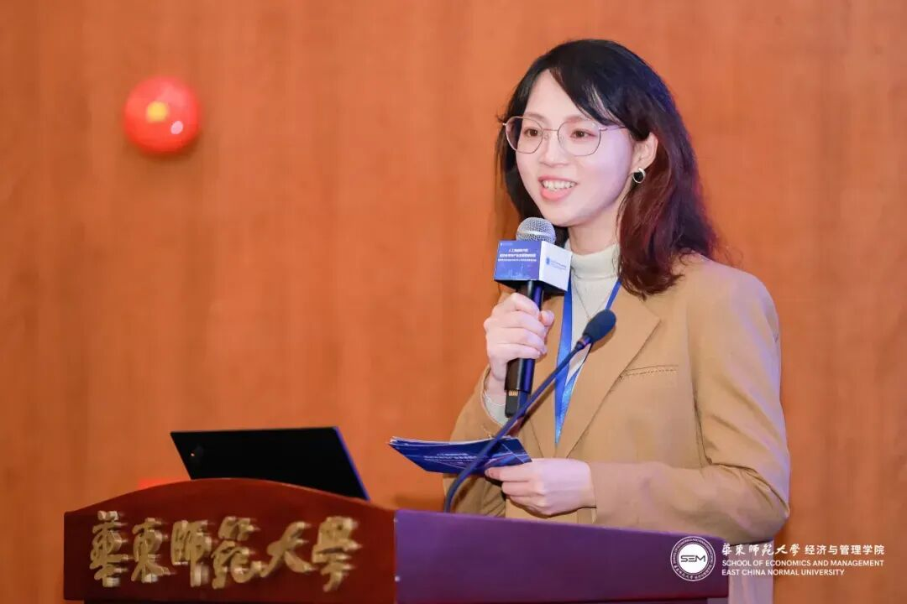
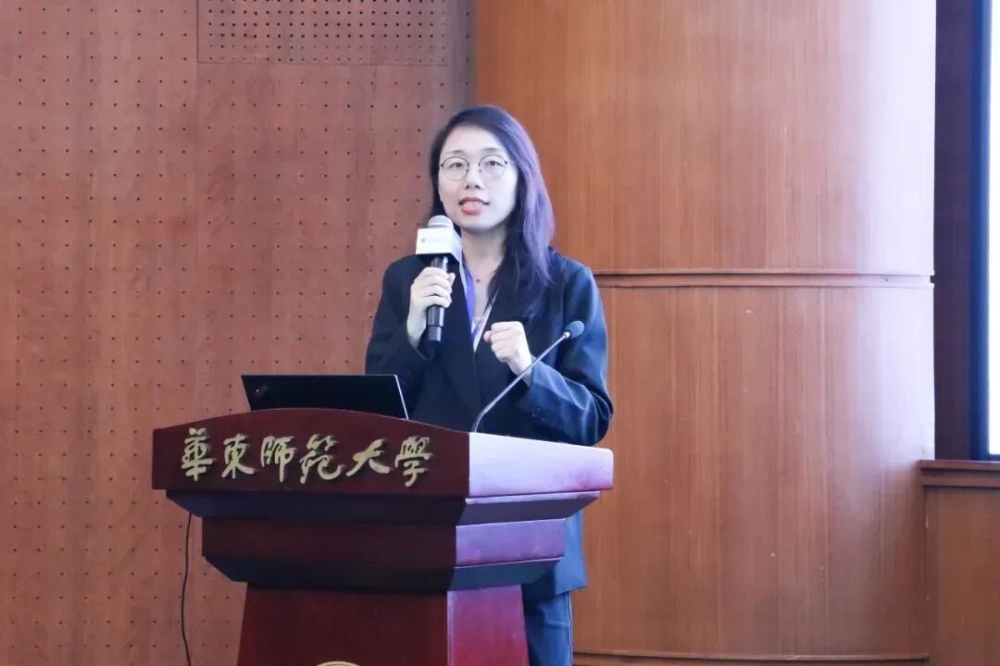

# 创新引领，打造世界前沿商业教育｜华东师大人工智能金融MBA项目，全新推出！

> **作者**: SAIFS
> **发布日期**: 2024年3月29日 19:15
> **来源**: [原文链接](https://mp.weixin.qq.com/s/CwfVa087-9JwPdIHLIu-3g)

---

  

  

  

  

3月24日周日下午，华东师范大学人工智能金融MBA项目发布会、人工智能时代的经济未来与产业变革圆桌对话暨华师大MBA2025年入学招生政策发布会在普陀校区逸夫楼一楼报告厅圆满举行。华东师范大学经济与管理学院院长殷德生教授，华东师范大学上海人工智能金融学院（SAIFS）创院院长邵怡蕾教授，华东师范大学政治与国际关系学院余南平教授，UCloud创始人兼董事长季昕华先生，华东师范大学经济与管理学院副院长杨勇教授，MBA教育中心执行主任、副研究员欧丽慧老师，MBA教育中心招生负责人潘雨老师应邀出席。发布会由欧丽慧老师主持，现场气氛热烈，高潮迭起。

  

  

  

**人工智能金融MBA项目**

AI-Fin MBA Program

  

  

在人工智能金融MBA项目发布会上，上海人工智能金融学院创院院长邵怡蕾教授详细阐述了学院未来的发展愿景和战略规划。她认为，人工智能技术正在改变金融服务、风险管理、投资决策和市场预测等领域，同时特别强调了人工智能与金融结合的跨学科重要性，并对如何推进这一领域的教学与科研进行了深入展望。上海人工智能金融学院作为全球首家专注于人工智能与金融交叉领域的教育和研究机构，旨在培养具备全球视野、创新能力和社会责任感的领域变革者、领导者和创新者。学院也将承担在人工智能伦理和治理研究领域的使命。

  
*邵院长说，“我们需要在学生心目中种下创新的种子，使他们能够在人工智能加速变革中引领世界前沿。我希望智金院能够培养未来行业的领袖，而这些领袖不仅要精通技术，还需具备深厚的道德责任感。”*

  

在发布会中，邵院长引用了包括OpenAI在内的创新开发实例，展示了人工智能技术在跨模态学习能力和复杂逻辑处理能力方面的潜力，以及其在不同领域的知识整合和创新促进上的巨大潜力。此外，她还强调了人工智能对经济社会的影响。邵院长认为，在AI时代，教育需重新塑造，当代教育者应倡导培养学生的跨学科理解能力、创新思维能力和问题解决能力。未来，学院将致力于建立开放且国际化的学习环境，开展一系列国际合作，引进大师课程和实操项目，加强学生的应用能力和全球视野。同时，在与企业合作方面，邵院长指出，“我们计划与企业建立紧密的合作关系，让学生能够在实际工作环境中学习和应用人工智能技术，从而更好地为未来的职业生涯发展做前期充分的准备。“ 学院将不断探索教育与研究的新路径，共同开启人工智能与金融相互融合发展的新篇章。

  

  

  

  

    **主题演讲分享**

Sharing on Key Speech

  

  

华师大经济与管理学院院长殷德生教授在主题为《人工智能、新质生产力与高质量发展》的分享中强调了新质生产力的重要性。他指出，要把握新一轮科技革命和产业变革的关键方向，探索新领域、开拓新市场、增强新动能、塑造新优势，并在未来产业竞争中占据制高点。这要求我们不断优化产业链和供应链，深化数字经济的创新和发展，加强“人工智能+”行动的实施。殷教授强调，中国数字经济发展的战略转变不仅涉及信息通信技术的发展，还包括经济社会各领域的深度融合。我们要培养以数据为核心的新型经济社会发展模式，重视数字经济的发展，规范平台经济，完善数据要素市场。

  

  

  

  

华师大政治与国际关系学院余南平教授在《通用人工智能时代的国际政治经济变局》主题分享中，深入剖析了信息技术的飞速发展带给全球的深刻影响。他指出，随着通用人工智能的兴起，我们正见证一个信息升级和工作岗位替换的时代。这一变革不仅仅是技术层面的，更是触及到了生产范式的根本，它要求我们重新定义生产和经营的方式。余教授结合了多个企业案例，生动地展示了如何在实践中应对这些挑战。他分析了企业如何通过采纳新技术来优化流程、提高效率，并在此过程中创造新的就业机会，尽管同时也可能导致某些传统职业的消失。面对未来，余教授认为国际政治经济正经历百年未见的大变局。随着国家间互依加深和全球治理体系进化，人工智能等新兴技术的突破预计将重新塑造国际力量对比，并在政治、经济和安全领域引发重大变革。

  

  

UCloud创始人、董事长、上海市人大代表季昕华先生以《人工智能赋能千行百业》为题，深入探讨了人类生产力的变革，并分析了国内主要AI创业公司的现状。他强调大模型技术在B端市场的快速渗透，并围绕基础模型、行业模型、智能体/机器人以及应用等方面，剖析了AIGC领域的潜在机会。季昕华指出，构建基础模型需要大量高质量数据、核心算法和强大计算资源；而行业模型则具备行业性、私密性、价值性和可持续性四个特点。他还讨论了Agent/机器人的能力、需求及应用场景，强调加速人工智能在各行业的应用转化是推动产业升级的关键。

  

  

  

 **MBA项目培养目标**

 Introduction on MBA Program's Goals

  

  

华师大经济与管理学院副院长杨勇教授详细介绍了学校和学院的历史发展及主要成就。华东师范大学是新中国成立后建立的第一所综合性师范大学，也是全国首批16所重点大学之一。经济与管理学院具有悠久的办学传统，其前身可追溯到1924年成立的大夏大学和1925年成立的光华大学的商科。学院以“培养具有创新能力、国际视野与社会责任感的英才，创造商学新知，推动中国社会经济发展”为使命，致力于“成为世界一流的经济和管理学科重镇”。杨教授强调，近年来学院在国际认证方面取得了显著进展，学院师资力量雄厚，教学体系完善，开设了人力资源与应用心理、投资与资本管理、商业数据分析与数字管理、人工智能金融和通用管理等五大特色方向。此外，业界高管也全面参与到课程中，为学生提供实战经验和行业洞察。最后，杨教授表示，MBA不仅仅是Master of Business Administration，还是beyond administration，欢迎考生们加入华东师大，开启终身学习之旅。

  

  

华师大经济与管理学院MBA教育中心执行主任、副研究员欧丽慧老师就华东师大MBA项目的培养内涵展开介绍。她从三位一体的案例教学体系，进阶式实践训练体系，全育人的学生活动平台及多元化的国际交流平台等方面对MBA项目的培养特色和内涵作了全面的解读，特别提到产教融合下校企实践育人体系的构建，闭环式的双创教育体系，以及分类导向的职业发展体系，为学生的创新实践能力培养创设了丰富且高质量的育人平台。在案例教学、实践训练、思政育人及产教融合机制等领域，华东师大MBA先后多次获得上海市教学成果一等奖和二等奖，MBA学生也在全国各类研究生赛事斩获多个特等奖和一等奖，取得了很好的育人效果和社会效应。

  

  

华师大经济与管理学院MBA教育中心招生负责人潘雨老师对2025年华东师大MBA最新招生政策进行了全方位介绍，包括报考流程、录取规则、奖学金等。潘老师详细介绍了申请预面试中考核标准、所需材料等，并建议考生尽早申请，早做规划，争取获得优异成绩。

  

   文字提供｜华师大MBA、智金院SAIFS  

      图片来源 | 华师大MBA

  

**上海人工智能金融学院简介**  

  

  

*上海人工智能金融学院（简称SAIFS）于2023年在华东师范大学成立，是全球首家围绕人工智能与金融跨界交叉打造的教育和研究机构。SAIFS强调在超越知识点的通识教育的基础上，培养集金融知识、人工智能技术和实践经验于一身的新一代人工智能金融（AI-Fin）领军型卓越人才，并坚持扎根在学术研究的前沿，探索AI在金融中的新应用，驱动AI-Fin的发展。同时，SAIFS致力于与全球的学术机构、金融机构、科技公司和政府部门建立广泛的合作网络，通过推广AI与金融的交叉研究和应用，改善金融服务的效率和质量，为社会创造价值。*

  

*SAIFS还将打造人工智能金融（AI-Fin）研究中心和人工智能伦理与治理（AI-PPE）研究中心。人工智能金融研究中心将开发识别、量化、预测和减轻先进人工智能技术应用系统性风险的先进模型，未来将向政府部门和各大金融机构输出关于AI的内控合规理论与研究成果。而AI-PPE研究中心将致力于推进AI时代的全球哲学-政治学-经济学(PPE)思想前沿问题的研究，并打造一套全新的AI4Social Science教学体系重新激活哲学-政治学-经济学服务现代社会的动能。*