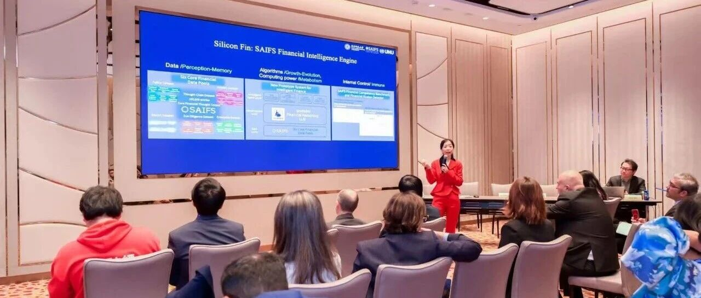

# 我院院长邵怡蕾出席并主持UNU Macau AI Conference2025分论坛“AI与金融系统：赋能硅基经济的可持续发展”

> **作者**: 国际交流
> **发布日期**: 2025年10月29日 11:42
> **来源**: [原文链接](https://mp.weixin.qq.com/s/v1lYaBhiOSEpmFKJP_s6Cg)

---

  

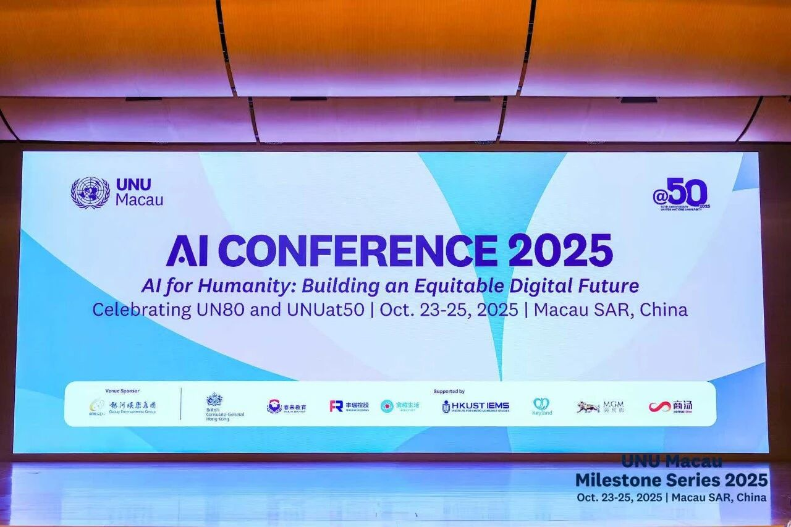

UNU Macau AI Conference 2025

  

  

  

       2025年10月24日下午，由联合国大学驻澳门研究所（UNU Macau）主办的2025人工智能大会（UNU Macau AI Conference 2025）之分论坛“人工智能与金融系统：赋能硅基经济的可持续发展“（“AI and Financial Systems: Enabling Sustainable Development in the Silicon Economy”）在中国澳门特别行政区银河国际会议中心4号会议室成功举行。 

  

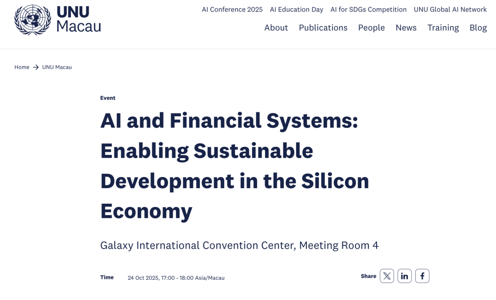

  

     会议聚焦人工智能在金融体系与可持续发展议程中的协同路径与度量框架，旨在探讨人工智能如何在全球“硅基经济”转型过程中推动系统性可持续发展。我院院长邵怡蕾教授，亚洲开发银行首席信息官、信息技术部总干事洪劲松（Stephanie King-Chung Hung），我校政治与国际关系学院院长、教授吴冠军，联合国大学驻澳门研究所高级研究员及团队负责人Georgina Curto博士，HyperAI有限公司首席执行官王臣汉先生出席会议。我院助理研究员温南夫主持本场会议。

      首先，我院院长邵怡蕾教授在分论坛开幕环节发表题为“人工智能与金融体系：推动硅基经济中的可持续发展”（“AI and Financial Systems: Enabling Sustainable Development in the Silicon Economy”）的主旨演讲，她从“硅基经济学”出发，系统阐释以智能国内生产总值（IDP）为核心的度量思路与“L1 硅基投入\-L2 硅基转化\-L3 硅基产出”三层观察框架，并就算力、数据、算法等要素在金融领域的工程化落地提出方法性建议。作为 “硅基经济学”的首提者，邵怡蕾教授展示的框架是近年来少有的系统性创新研究，与会代表普遍认为该框架在推动智能经济度量标准、数据互认机制及国际协作方法论对齐方面具有示范作用。

 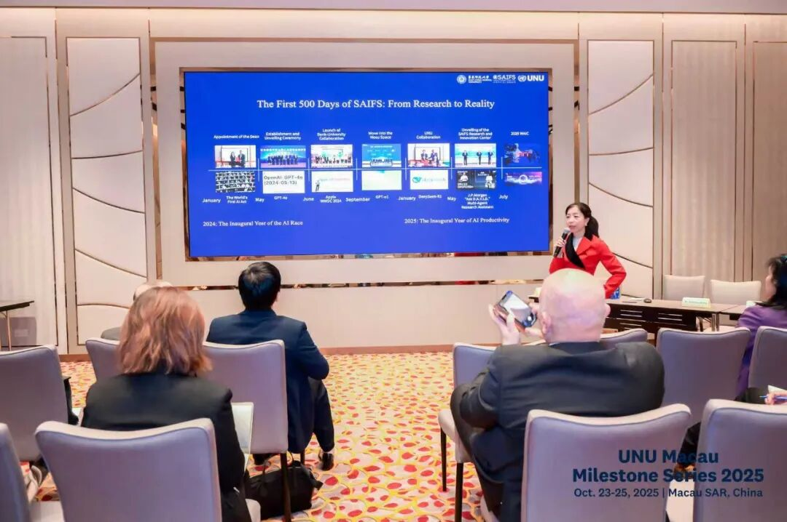

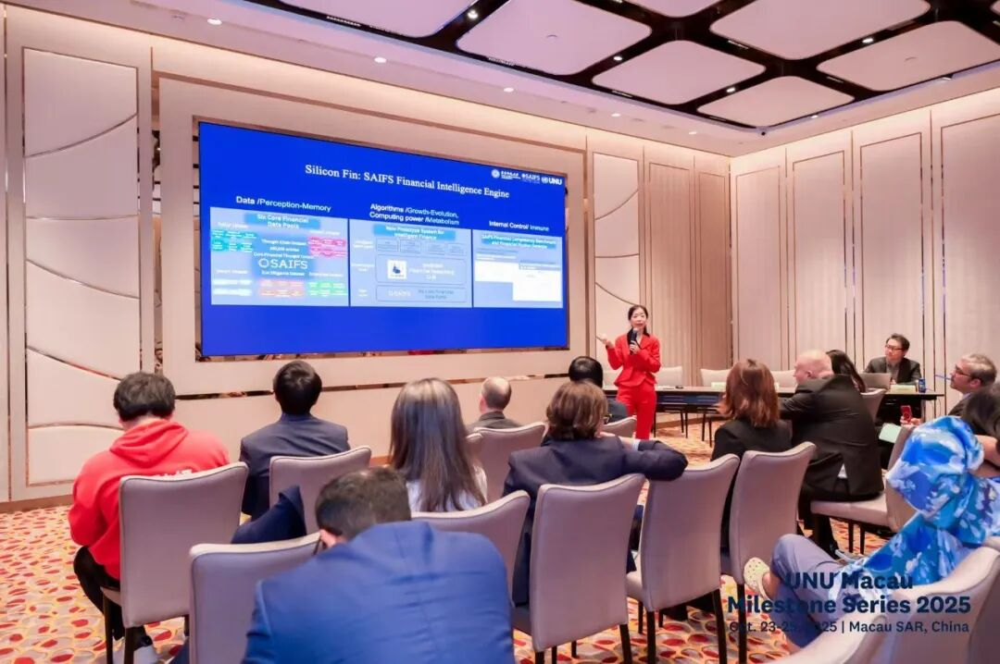

邵怡蕾院长作主旨演讲

  

      在随后的圆桌论坛中，邵怡蕾院长担任主持人，与出席贵宾围绕“度量与治理”“基础设施与包容性”以及“风险与韧性”三大主题进行深度探讨，话题关注全球南方在人工智能与金融体系发展中的包容性参与。

  

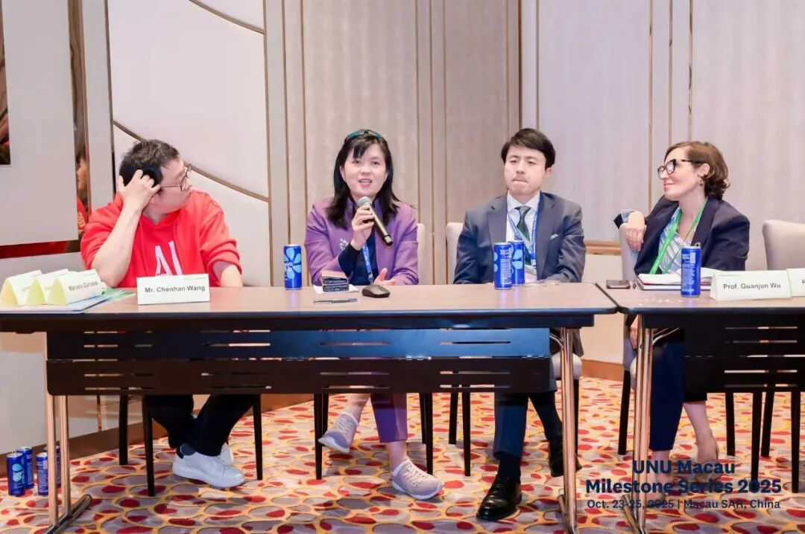

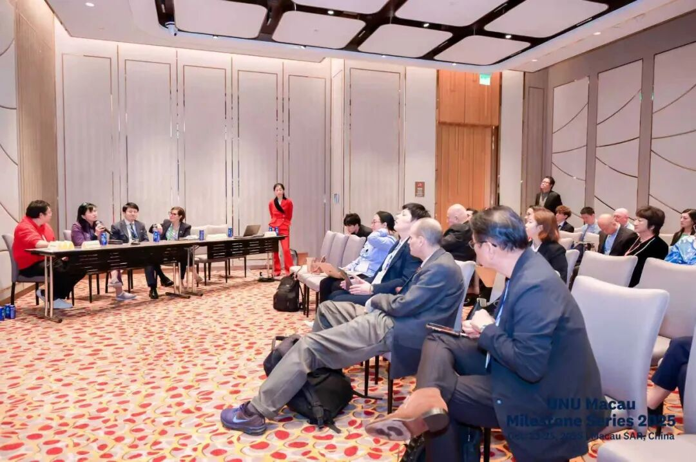

圆桌论坛

  

      会议之前，联合国大学联合研究中心里程碑闭门会议（UNU Hubs Milestone Session） 在银河国际会议中心5号会议室举行。会议由联合国大学驻澳门研究所高级研究员及团队负责人Georgina Curto博士主持，联合国大学联合研究中心（UNU Hubs）相关主任、联络点及核心团队成员参与会议，旨在回顾阶段性成果、分享经验，并制定未来协同路线图。联合国大学校长、联合国副秘书长Tshilidzi Marwala发表现场致辞。Marwala校长在讲话中强调，我们应以包容性治理框架推动人工智能的技术进步与人类尊严并行。闭门会议在该理念的指引下，系统梳理了联合国大学联合研究中心网络（UNU Hubs）的阶段性成果，并围绕“共同愿景与联合战略”“路线图与任务板”以及“开放协作与伙伴关系”三大方向展开深入讨论，致力于构建跨机构、跨区域的AI研究与政策协同机制。

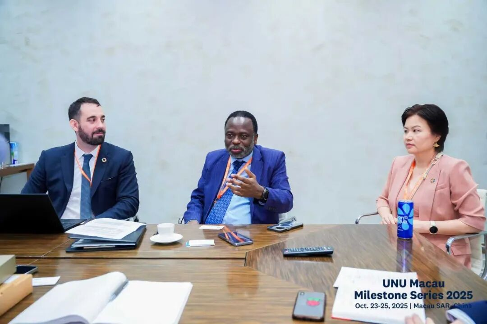

Tshilidzi Marwala校长发表现场致辞

在闭门会议中，我院院长邵怡蕾和清华大学人工智能国际治理研究院副院长梁正在闭门会上作核心分享，分别介绍了联合研究中心组建的组织方案、协同流程及国际合作路径。双方提出，应在治理体系、人才培养及“数据—算力—算法”关键要素上，构建跨区域、跨部门的协作网络，以推动可持续与可信任的人工智能在全球范围内落地实施。

  

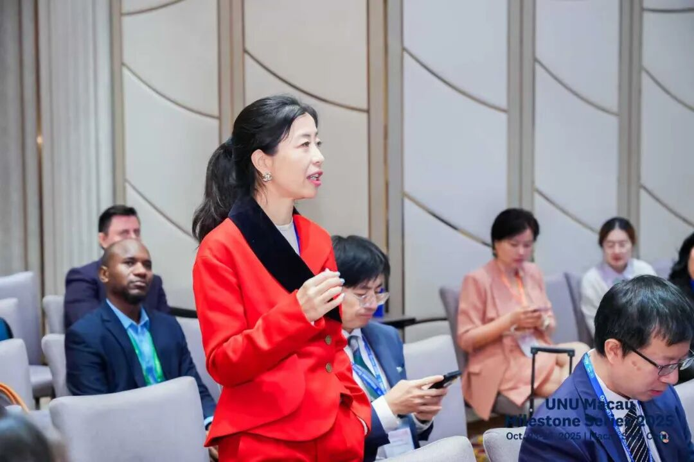

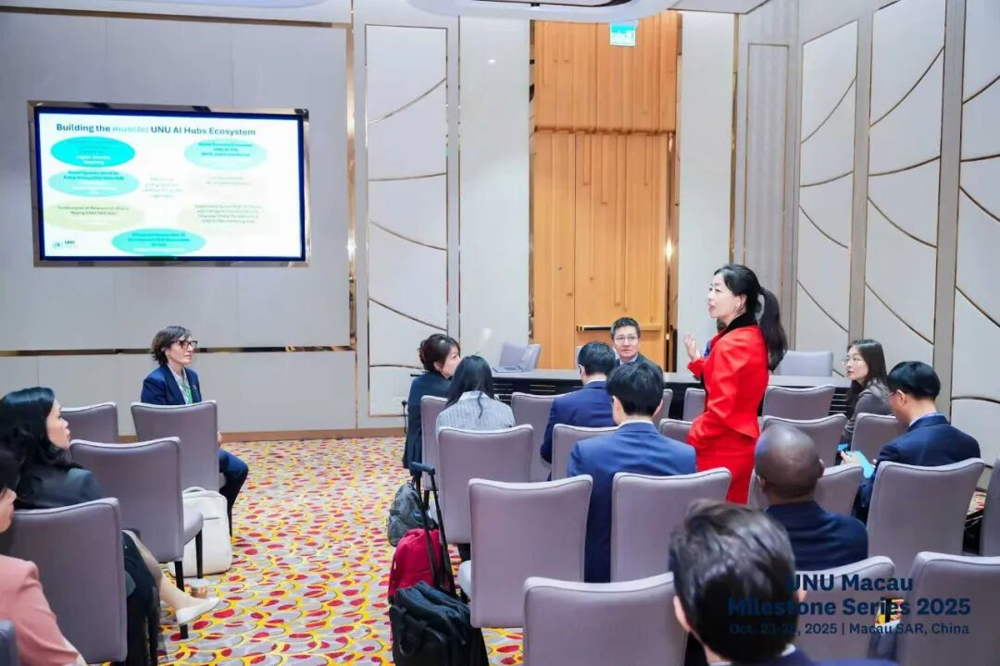

邵怡蕾院长介绍“联合国大学-华东师大上海人工智能金融

联合研究中心”合作框架

  

      据悉，联合国大学驻澳门研究所人工智能大会（UNU Macau AI Conference）是由联合国大学驻澳门研究所（UNU Macau）主办的年度国际盛会，聚焦人工智能与可持续发展、公平治理和能力建设等前沿议题。大会旨在搭建全球多方对话平台，汇聚来自联合国体系、各国政府、学界、产业界与公民社会的代表，共同探讨如何以负责任、包容与可持续的方式推动人工智能造福人类。

      今年恰逢联合国成立80周年、联合国大学成立50周年，本届大会以更加宏阔的国际视野与历史使命感，回顾人工智能发展的全球进程，展望人类与技术共生的未来。大会深度探讨“人工智能为人类社会提供福祉”（“AI for Humanities”）等多项议题，聚焦人工智能如何助力人类社会的可持续与公平发展，探讨科技创新与人文价值的融合路径。自2024年首届会议以来，联合国大学驻澳门研究所人工智能大会已成为联合国体系内重要的人工智能政策与实践交流平台之一。

  

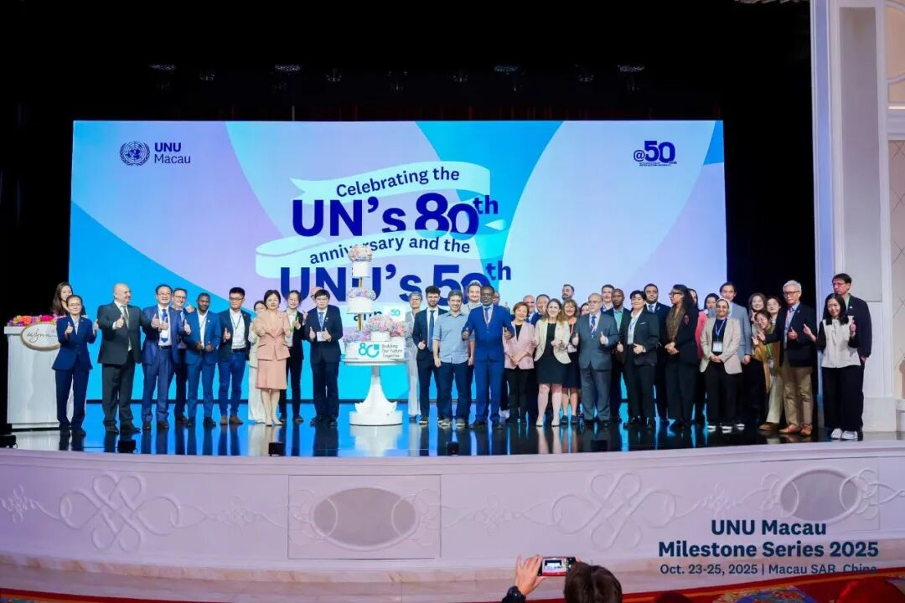

联合国大学校长、联合国副秘书长Tshilidzi Marwala、

联合国大学驻澳门研究所所长黄京波

出席联合国成立80周年、联合国大学成立50周年活动纪念晚宴

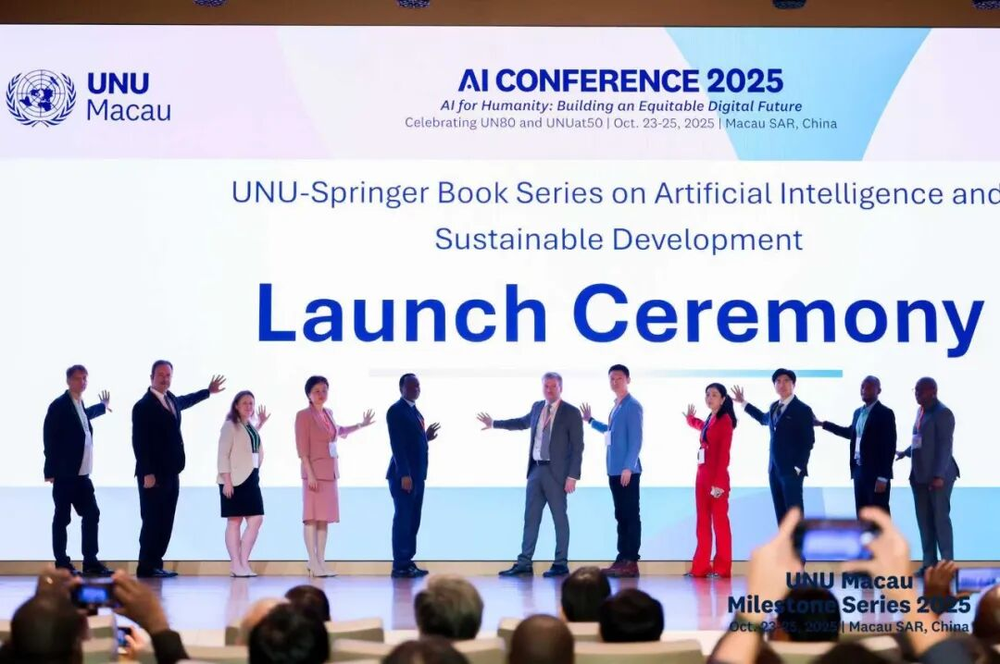

邵怡蕾院长出席大会开幕仪式，并与嘉宾共同启动

联合国大学\-施普林格人工智能与可持续发展丛书

（UNU-Springer Book Series on AI and Sustainable Development）

  

文字：华东师大上海人工智能金融学院