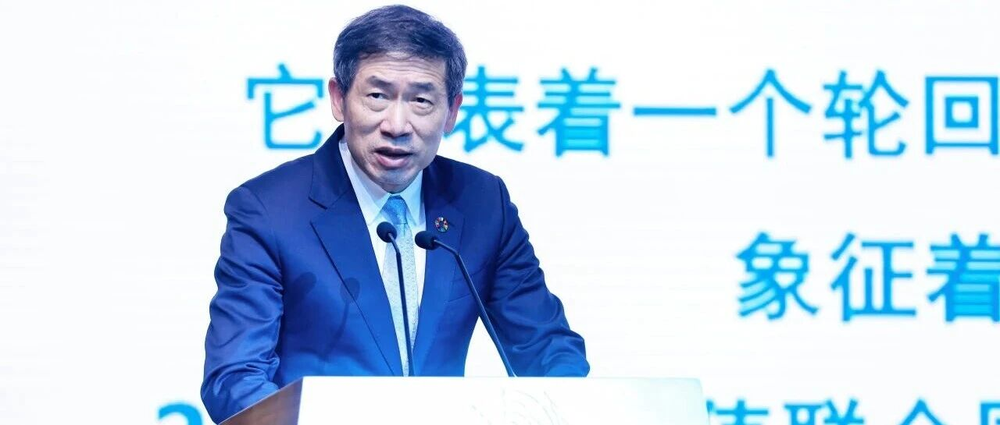

# 联合国副秘书长、联合国开发计划署代理署长徐浩良与我院院长邵怡蕾、及多家知名高校、科研机构及企业代表共同探讨未来合作发展的新建议。

> **作者**: 
> **发布日期**: 2025年11月19日 16:09
> **来源**: [原文链接](https://mp.weixin.qq.com/s/txAIAIfS3b7_nkrvuuBEdA)

---

\[图片\]联合国副秘书长、联合国开发计划署代理署长徐浩良昨日结束对华正式访问。此次访问重申了联合国开发计划署与中国长期以来的伙伴关系，并通过深化合作，加速推进可持续发展目标与全球气候议程的落实。 此次访问恰逢联合国成立80周年与联合国开发计划署成立60周年，同时也正值联合国开发计划...