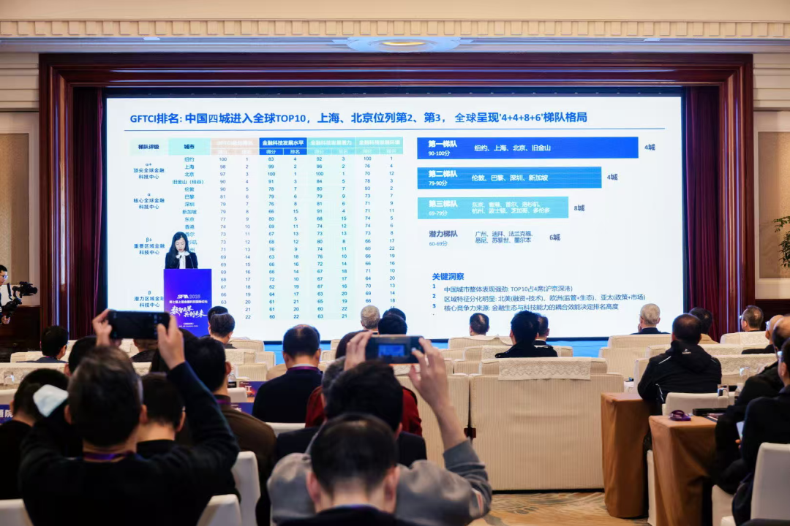

上海首次在全球金融科技中心综合排名中升至第二。

在11月29日举行的第七届上海金融科技国际论坛上，由上海金融科技产业联盟牵头、华东师范大学提供学术支持的《全球金融科技中心发展指数（2025）》正式发布。

从结果来看，纽约位居榜首，上海升至全球第二，北京和旧金山（硅谷）分列第三和第四位，达到“顶尖全球金融科技中心”水平，伦敦跌至第五。全球前十榜单中，亚洲城市占据六席，中国独占四席。

上海排名的跃升并非偶然。上述指数显示，近年来，上海依托国际金融中心的制度优势、完备的金融市场体系和超大规模的应用场景，在人工智能与金融深度融合的赛道上实现领跑。

从个人AI财富管理到小微企业数字信贷，从数字人民币跨境支付试点到“浦江数链”等基础设施建设，一系列具有全球影响力的创新实践在上海落地生根，推动传统金融向智能化、普惠化、国际化转型。

值得一提的是，本次评价体系首次引入全球AI金融中心子指数，弥补了现有金融中心指数在AI维度上的空白。在这一评价维度上，上海表现突出，在生态基础层位居第一，展现出强大的政策支持、算力储备和数据要素整合能力。

《全球金融科技中心发展指数（2025）》正式发布。

“通过引入全球AI金融中心子指数，让全球金融科技中心发展指数实现从‘互联网+金融’到‘AI×金融’的评价迭代，为全球金融科技评价提供了全新范式。”华东师范大学上海人工智能金融学院院长、教授邵怡蕾表示，金融科技中心的竞争将更加注重技术深度、场景广度与制度宽度的协同，谁能更快将AI能力转化为金融服务效能，谁就能掌握智能金融时代的话语权。

同日，论坛发布的《上海金融科技发展白皮书（2025）》进一步佐证了这一趋势。据测算，2024年，上海金融科技产业规模约为4405亿元人民币，整体研发投入位居全国前列。银行业金融科技投入保持平稳，证券业投入稳步增长，保险科技加速提质，产业集聚不断加速。

在此过程中，上海金融科技监管创新项目总数量同样位居全国前列，人民银行金融科技创新监管工具应用项目和资本市场金融科技创新试点在沪进展顺利；上海各市场、机构和企业也不断推出科技金融、绿色金融、普惠金融、养老金融和数字金融等案例，金融科技发展环境得到显著优化。

“通过对比国内外金融科技发展，我们发现，上海作为全球最为重要的金融中心之一，在金融科技发展的进程中始终傲立潮头，贡献了诸多上海方案。”上海交通大学上海高级金融学院副院长、中国金融研究院执行院长、会计学讲席教授李峰表示，未来，当技术创新、场景赋能、生态协同与创新监管实现深度融合，上海有望建成具有全球引领性的金融科技中心，为金融强国建设提供坚实支撑。

  

**【全文完】**

**感谢您的耐心阅读**

---

  

**【近期热门】**

**[全国首次！上海东方枢纽先行启动区今过验收，未来境外人员可免办签证入境30天](https://mp.weixin.qq.com/s?__biz=Mzg3MDU5Nzc3NA==&mid=2247493930&idx=1&sn=32536c5b0427b79632373721adcc5a37&scene=21#wechat_redirect)**

**[破千！上海国家级“小巨人”达1026家，专破“卡脖子”，75%是民企](https://mp.weixin.qq.com/s?__biz=Mzg3MDU5Nzc3NA==&mid=2247493922&idx=1&sn=9eb953315294b2b046de5631d3eb183b&scene=21#wechat_redirect)**

**视频更精彩↓↓**