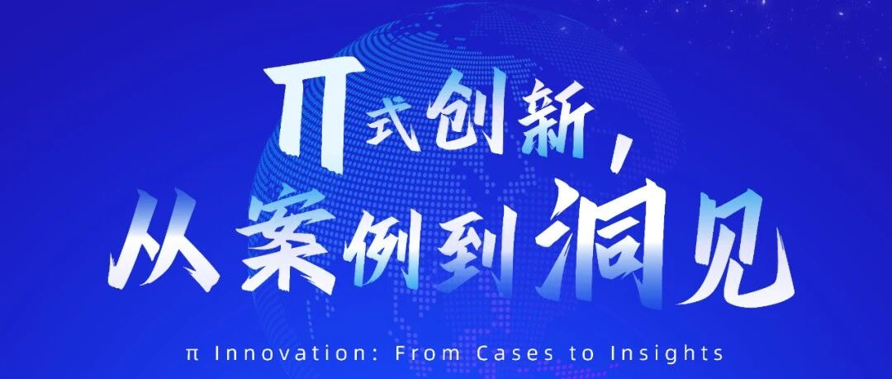

# 活动预告：邵怡蕾教授将出席 “π式创新，从案例到洞见” 交叉学科对话论坛

> **作者**: 上海智金院SAIFS
> **发布日期**: 2025年12月19日 15:53
> **来源**: [原文链接](https://mp.weixin.qq.com/s/mgo027nJcYAtq79agbcXKQ)

---

  

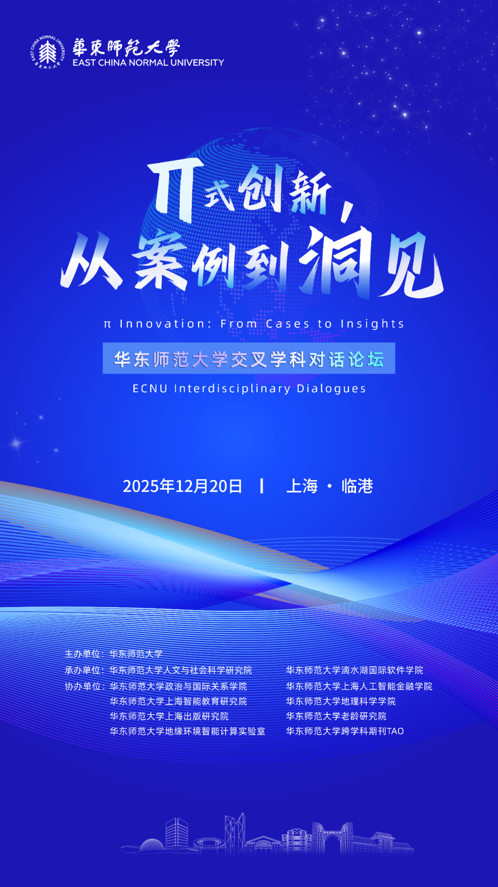

  

π是无限不循环无理数，

象征跨学科研究的无限可能；

π连接圆的直径与周长，

象征连接不同学科的桥梁；

π在数学、物理、工程中无处不在，

象征跨学科的普遍性。

  

本周六，“π式创新，从案例到洞见”交叉学科对话论坛将在华东师范大学滴水湖国际软件学院（上海市浦东新区楠木路111号）举办。

  

为何召开这场论坛？  

  

在全球化与科技革命不断深化的时代背景下，知识体系的边界正经历深刻重构。复杂的社会与科技问题迫切要求跨越学科壁垒、形成多维度的综合研究范式。这场对话论坛将通过思想碰撞与案例对话，推动不同学科间的深度交流与协同创新，围绕文理交叉学科“是什么”“研究什么”“如何研究”，探索理论建构、研究取向与方法创新，促进知识融合、科学研究与人才培养的良性互动。

  

这场论坛看什么？  

  

打破学科壁垒，促进知识融合！

  

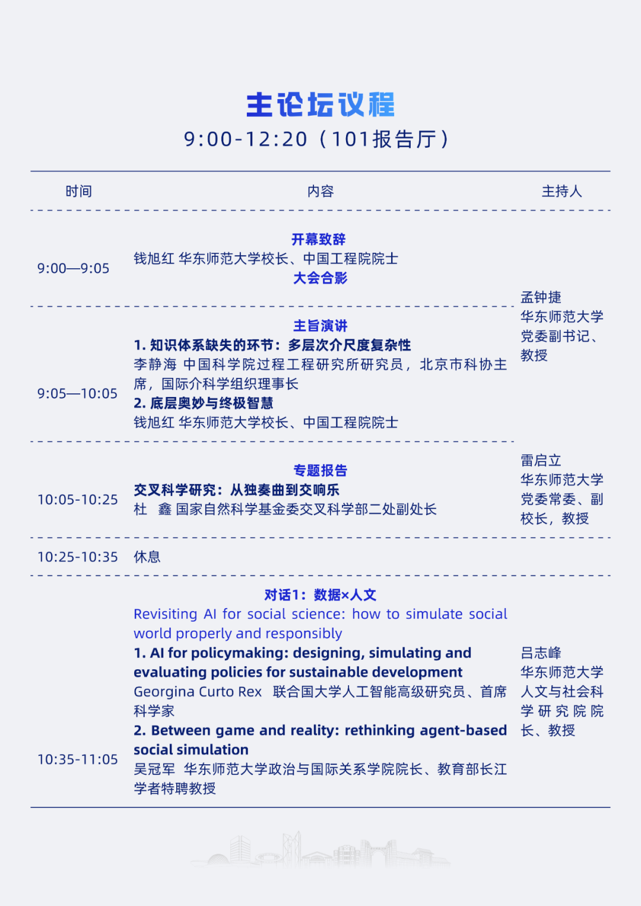

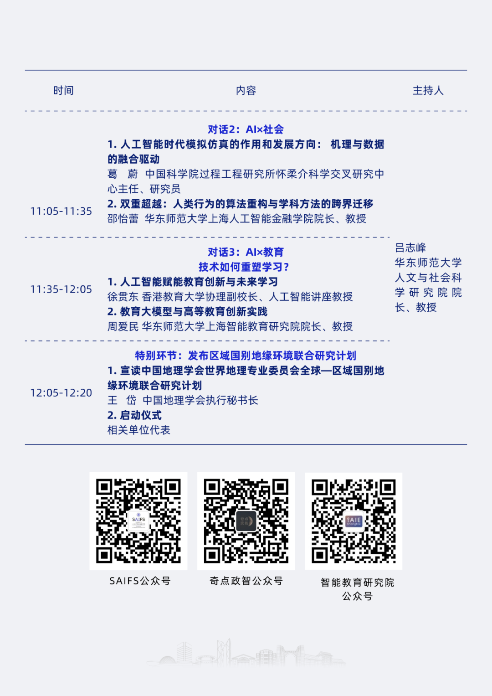

  

  

五场分论坛分别关注什么？

  

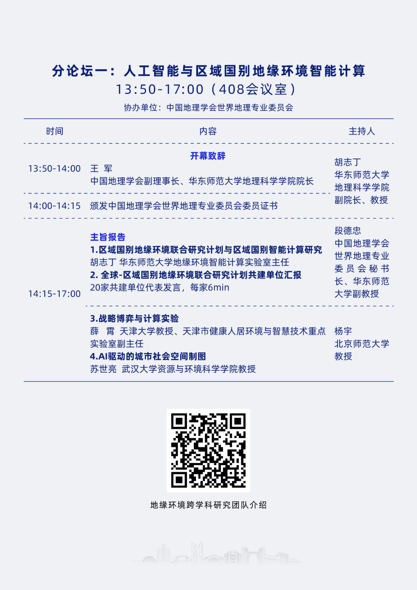

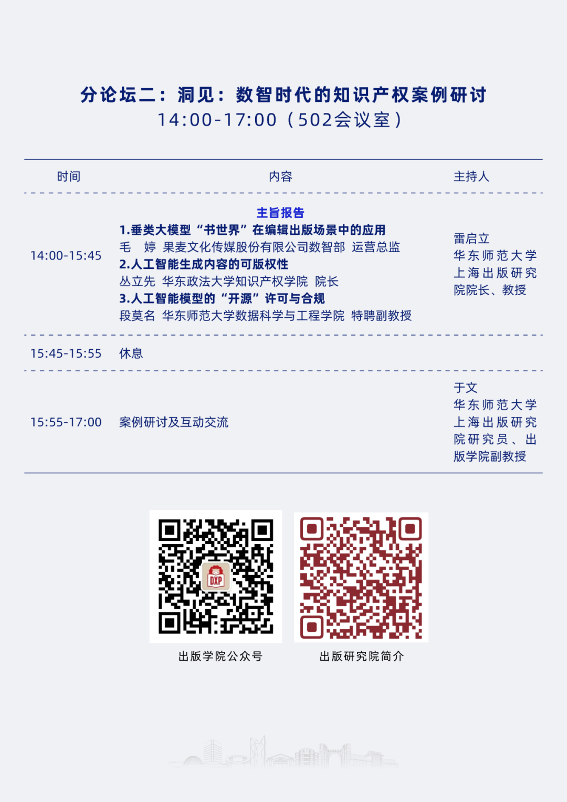

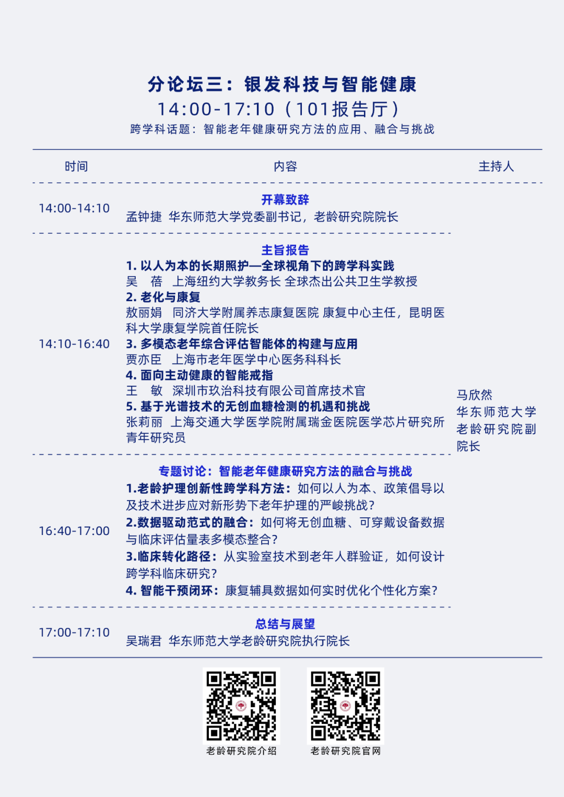

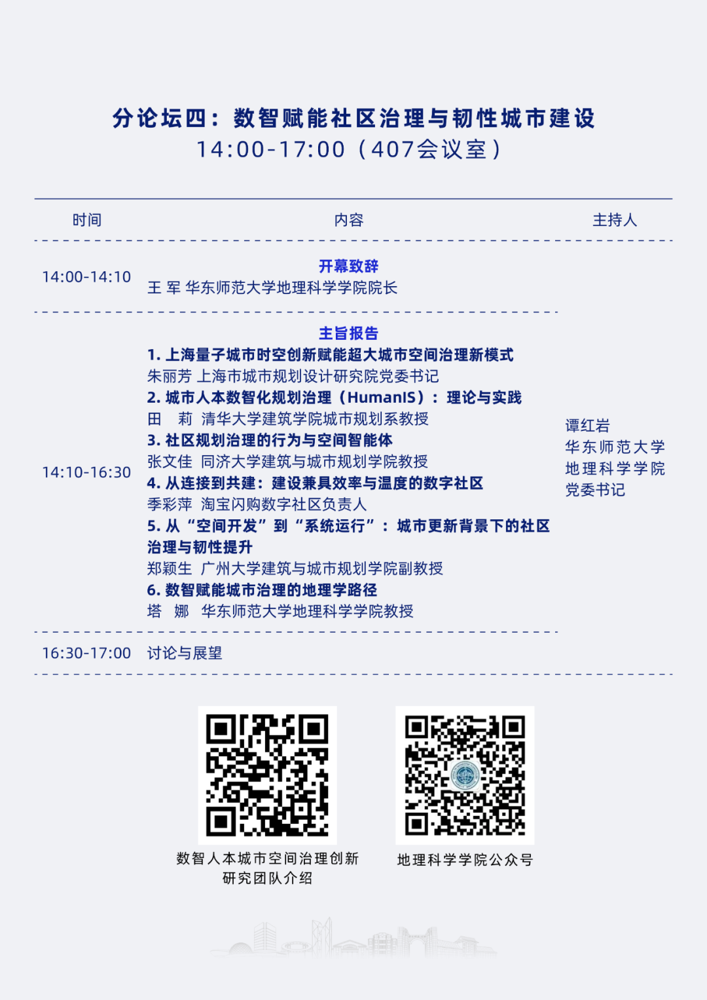

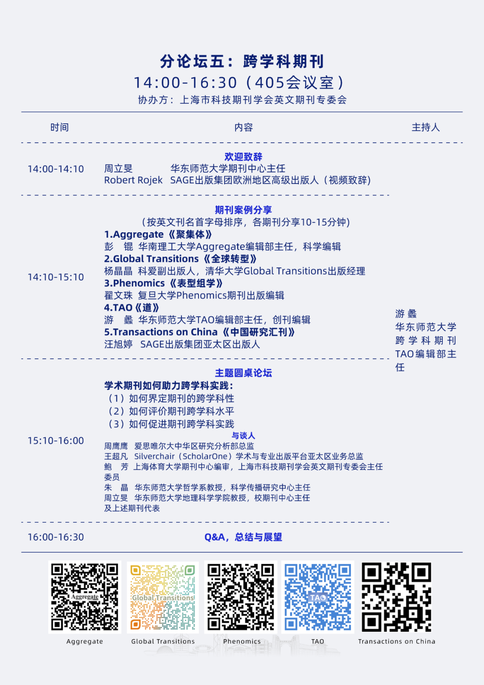

  

  

嘉宾阵容

  

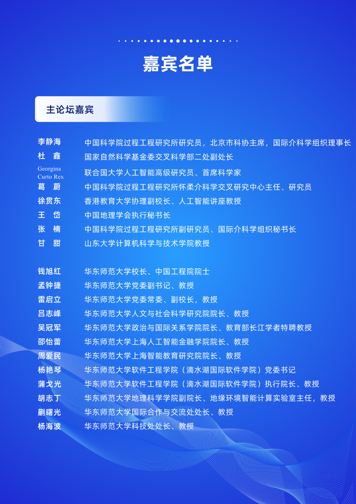

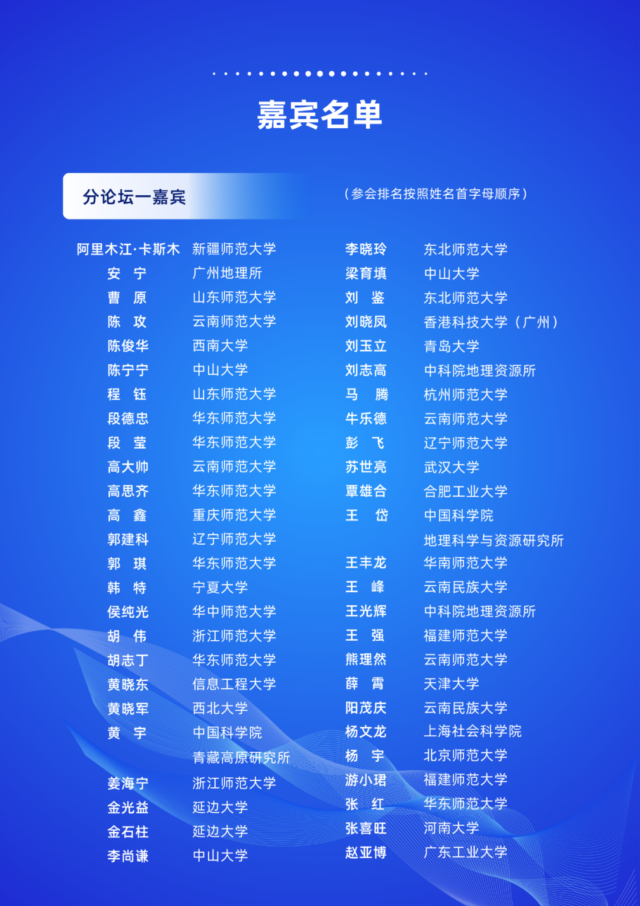

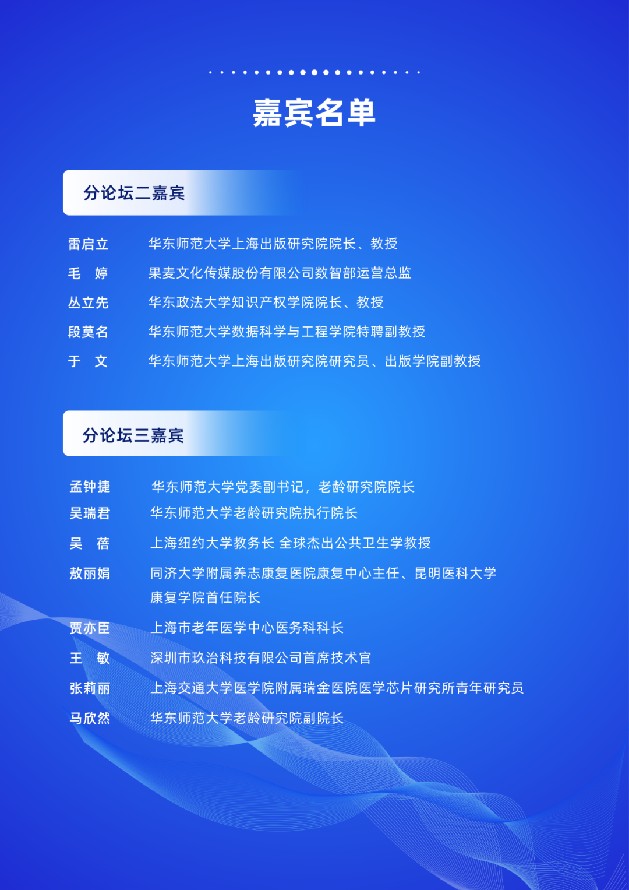

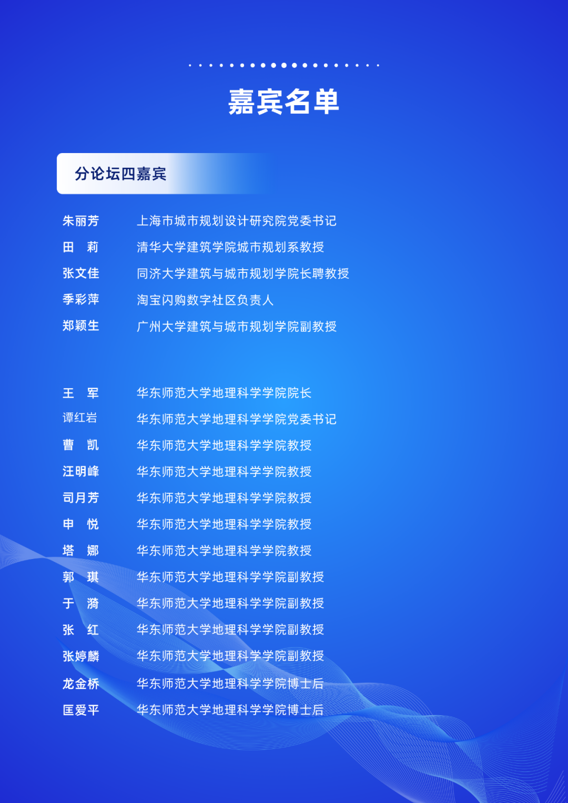

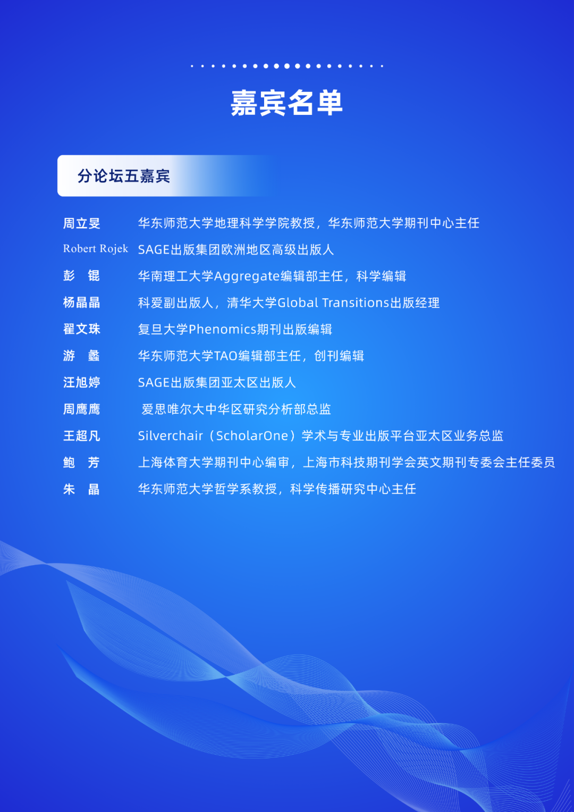

  

思想的碰撞是创新的起点，

对话的深度决定合作的高度！

  

同步直播等你看，记得预约收藏！

  

  

来源 | 人文与社会科学研究院  滴水湖国际软件学院

通联 | 王曼 丁沁南 宛宁静 夏茸昱

编辑｜吴冬妮