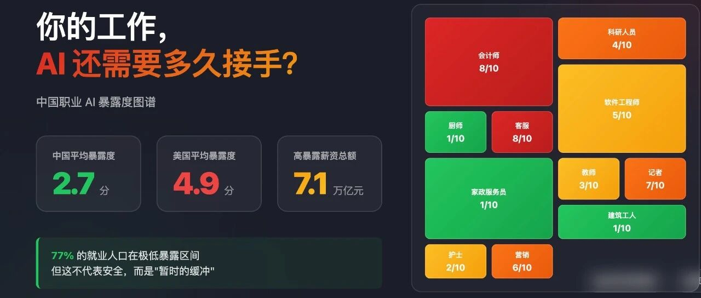
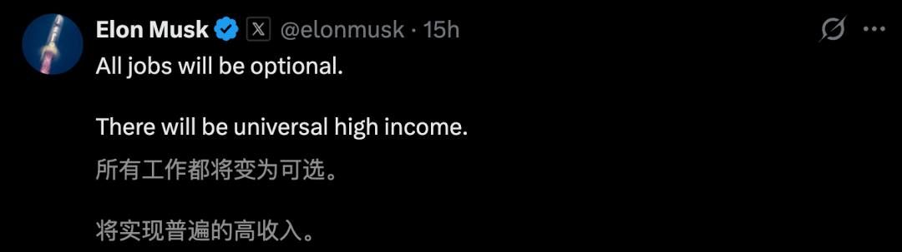
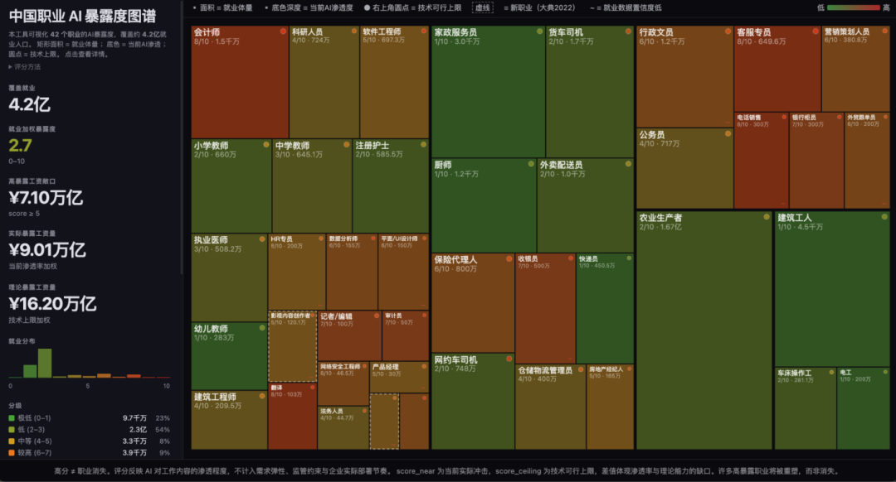
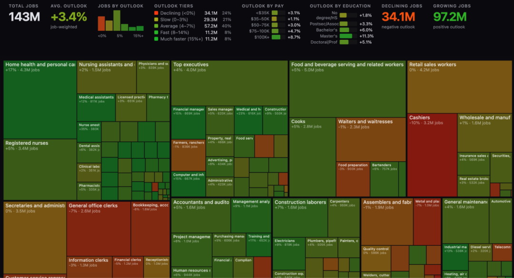
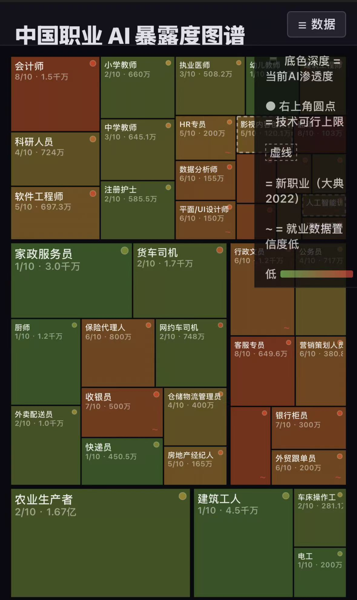
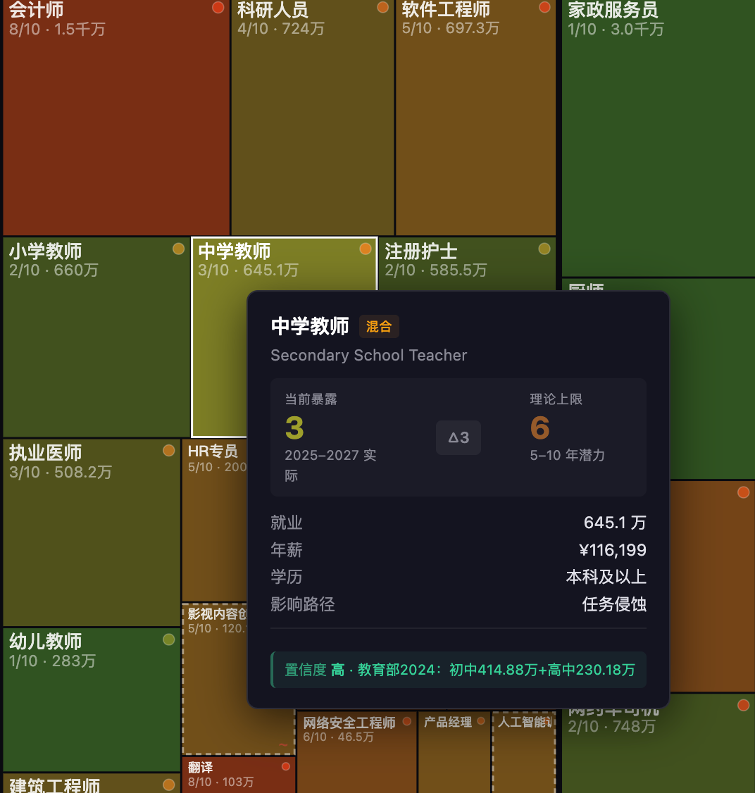

# 你的工作，AI还需要多久才能接手？

> **作者**: SAIFS研究
> **发布日期**: 2026年3月18日 21:43
> **来源**: [原文链接](https://mp.weixin.qq.com/s/3kG01B3sxdGqi7pR2O8lgg)

---

  

  

  

上周，Andrej Karpathy（特斯拉前 AI 总监）给 342 个美国职业打了 AI 替代风险分，高暴露岗位涉及工资总额高达 3.7 万亿美元。马斯克转发后，网站 6 小时后因流量过大删库，迅速在 AI 圈刷屏。

  

我们团队用了48 小时，做了一个**中国版**。

  

结果出乎意料：

**中国劳动力平均AI 暴露度只有 2.7 分（美国为 4.9 分）**。77% 的就业人口目前处于极低暴露区间，但是高暴露岗位涉及工资总额:7.1万亿元人民币。

  

这并不代表安全，而是意味着我们拥有一个“暂时的缓冲期”。

  

  

**我们做了什么？**

在过去的48 小时里，我们从国家统计局、卫健委、教育部、交通运输部等十余个官方来源，重新构建了一套中国劳动力数据，**覆盖42 个代表性职业、4.2 亿就业人口**。

随后，我们使用大语言模型对每个职业进行了**AI 暴露度双视角评分**：

-   ****近期实际暴露度**：基于中国目前的AI 实际渗透率，评估到 2027 年的真实就业冲击。**
    

-   ****理论上限暴露度**：假设技术完全成熟，评估5-10 年后的替代天花板。**
    

**关于数据可信度：**我们同时用两个模型进行了交叉验证。结果显示，在67% 的职业上模型存在分歧，在 4 个职业上甚至出现了 2 分以上的差异。这说明，对于“AI 对职业的影响”，即使是最先进的模型也没有绝对确定性的答案。因此，我们对每个数据标注了置信度（H/M/L），部分基于估算的就业量在图中用 ~ 进行了明确标注。

  

最终，我们产出了这张交互式图谱。**矩形的面积是就业体量，颜色深浅是AI 渗透程度，右上角的圆点是技术可行上限。** 你可以点击任何一个格子，查看该职业的详细评分和打分逻辑。

  

**如何体验：点击文末【阅读原文】，即可直达交互式数据地图。**

  

### **为什么这个项目与众不同？**

市面上关于“AI 会取代哪些工作”的文章一抓一大把，但大部分都有一个缺陷：**直接把美国的数据套在中国头上**。

中国劳动力市场的结构与美国有着根本性的差异：1.67 亿农业从业者、4550 万建筑工人、3000 万家政服务员……这些体力密集型的庞大群体，在中国就业版图里的权重远高于美国。

这就是为什么你会在这张图里看到一个反直觉的结论：**中国就业加权的平均AI 暴露度（2.7分），远低于美国同****口径****数据。** 这并非因为中国的AI 发展慢，而是中国的就业结构决定了——大部分人从事的工作，AI 短期内根本无从下手。

我们还做了另一件别人没做的事：**把“理论可能”和“当前现实”拆开来打分**。  
不管是Karpathy 的原版，还是 Anthropic 的报告，大多采用单一分数。Anthropic 自己也承认：Computer & Math 类职业的理论 AI 覆盖率高达 94%，但实测只有 33% 的工作任务实际使用了 AI。**这个差距，才是真正值得关注的地方。**

  

### **下一步与开源计划**

本项目的代码、数据、打分Prompt 已在 GitHub 全面开源。我们计划每季度更新就业和薪资数据，每年重新进行 AI 暴露度评估。

  

**在线体验图谱**点击文末\*\*【阅读原文】\*\*直接访问，或复制下方链接至浏览器：  
https://saifs-aihub.github.io/ChinaJob/ChinaAIExposure.html

  

**开源项目地址**https://github.com/SAIFS-AIHub/ChinaJob

如果你发现数据有误，欢迎通过GitHub Issues 提交；如果你对某个职业有一手信息，也欢迎直接在后台留言联系我们。

  

**#今日互动#**

**你觉得AI 对你所在行业的影响，是被高估了，还是被低估了？**点开图谱找到你的职业，在评论区和我们聊聊你的看法。

  

**团队信息****作者**：郝牧青  
**机构**：华东师范大学人工智能金融学院（SAIFS）  
**引用参考**：郝牧青, 胡忠博, 吴宗翰, 邵怡蕾 (2026). 中国职业AI暴露度分析. SAIFS.  
**数据版本**：V1

*灵感来源：Andrej Karpathy · AI Exposure of US Job Market；Anthropic 劳动力市场报告（2026）**转载请注明出处· 欢迎分享至朋友圈*